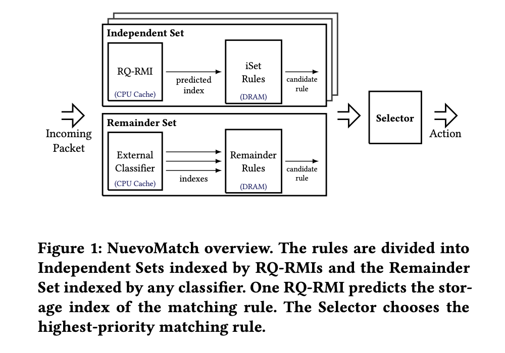
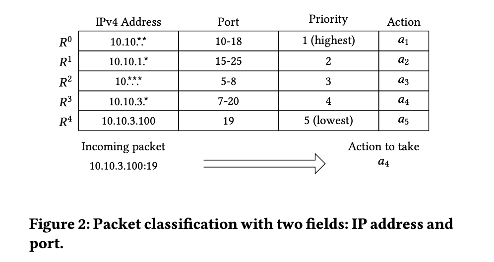
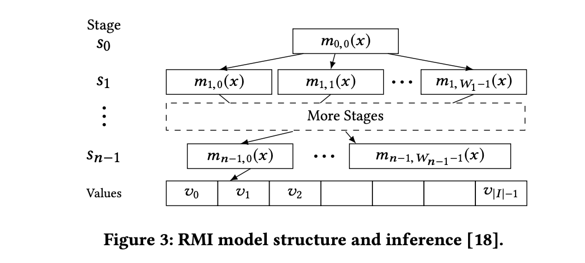
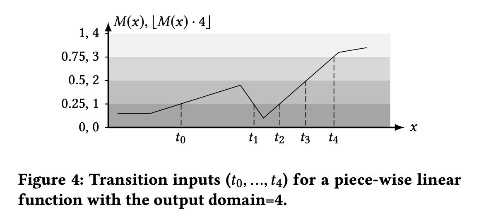
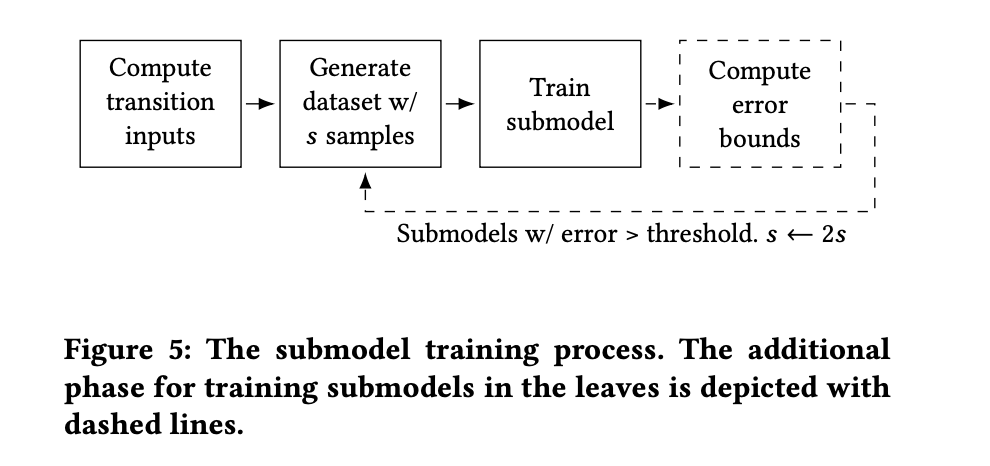

# 论文题目：A Computational Approach to Packet Classification

计算机网络课程的论文阅读，论文题目《一种数据包分类的计算方法》

这篇论文是我队友选的，不过看起来还不错，分类（Classification）是一个非常有意思的问题。而且论文的关键字还有 `Neural Networks`，这是我最近在学习的内容。

论文的难点在 3.5/3.6/3.7。

## 0 摘要（ABSTRACT）

多字段数据包分类（Multi-field packet classification）是现代网络的一个重要组成部分。

为了实现高吞吐量（high throughput）和低延迟（low latency），目前的算法采用的是将规则查找数据结构适应于 on-die caches 中。

>  state-of-the-art algorithms strive to fit the rule lookup data structures into on-die caches.
>
> PS：on-die caches 的意思是 CPU 芯片内集成缓存。

目前的算法的一个限制是无法随着规则数量的增加而扩展。

论文中提出了一种新的方法：*NuevoMatch*，它改进了现有方法的内存扩展。

- 使用了一种新的数据结构（Range Query Recursive Model Index），使得 *NuevoMatch* 能够用模型推理计算取代大部分对主内存的访问。
- RQ-RMI 的使用允许将规则压缩成适合硬件缓存的模型权重。

- 详细介绍了一种高效的训练算法，保证了基于 RQ-RMI 的分类的正确性。
- 利用了现代 CPU 对快速神经网络处理的日益支持，如宽向量指令（wide vector instructions），实现了十纳秒单次查询的速度。
- *NuevoMatch* 与 CutSplit、NeuroCuts 和 TupleMerge 算法相比，几何平均压缩系数分别为 4.9×、8× 和 82×，吞吐量的平均性能提高了 2.4×、2.6× 和 1.6× 。

## 1 介绍（INTRODUCTION）

*NuevoMatch* 源码：https://github.com/acsl-technion/nuevomatch

数据包分类是数据包交换网络的基石。数据包分类的意思是，网络函数（Network functions）如交换机，使用一套规则对接收到的每个数据包采取某些策略。

数据包分类算法目前的研究主要有两类：一类是依赖于三态内容寻址存储器（Ternary Content Addressable Memory, TCAM）硬件的算法；另一类是在软件中实现的算法。这篇论文所专注的是纯软件的算法。

主流软件算法可以分为两大类：基于决策树（decision-tree based）和基于哈希（hash-based）。其他的数据包分类方要么需要太多内存，要么速度太慢。

现代 CPU 的 on-die cache 能够提升分类的性能。但是随着规则数据的增加，缓存的维护变得更加困难。

CutSplit 和 NeuroCuts 等方法试图减少规则复制以实现更好的扩展，但是由于现代数据中心的规则集可能达到数十万条，拓展也存在着问题。

基于哈希的技术也存在扩展性差的问题。

在此背景之下，本篇论文：

- 提出了一种新型的数据包分类方法 *NuevoMatch*。它能极大地压缩规则集索引，即使对于 500K 的大规则集，也能将其完全放入 CPU 缓存的上层（L1/L2）。
- 引入了一种新型的 *Range Query Recursive Model Index*(RQ-RMI) 模型，并训练它来学习规则的匹配集，将规则匹配变成神经网络推理。
- 与现有的方法对比（CutSplit、NeuroCuts、TupleMerg）平均减少了 4.9×、8× 和 82× 的内存占用。

***NuevoMatch* 是第一个使用训练好的神经网络模型来进行数据包分类的。** 

RQ-RMI 比决策树或哈希表更节省空间，将扩展性提高了一个数量级。

*NuevoMatch* 将数据包分类任务从内存约束转变为计算约束（memory- to compute-bound. ）。随着神经网络推理硬件加速的快速发展，这种设计在未来可能会有很好的扩展。

*NuevoMatch* 建立在 ***learned indexes*** 之上（*Kraska et al., 2018. The Case for Learned Index Structures.*）。NuevoMatch 将递归模型索引（RMI）应用于键-值对（key-value pairs）的索引。值存储在数组中，RMI 被训练成学习数组中键和其值的索引之间的映射函数，模型用于预测给定的键的索引，通过得到的索引获取到 value。

RMI 不能直接适用于数据包分类，原因如下：

- 一个键（包字段）可能没有一个精确的匹配值，而是匹配一个规则范围，而RMI只能学习精确的键-索引对。
- 一个键可能匹配多个规则，优先级最高的一个作为输出，而 RMI 只检索每个键的单一索引。

NuevoMatch 成功解决了如下难题：

- RQ-RMI：将密钥与范围进行匹配，并采用高效的训练算法，不需要穷尽密钥枚举来学习范围。模型可以在 35 KB 内存储 500K ClassBench 规则的索引。
- Multi-field packet classification：分类流程如 Figure 1 所示。NuevoMatch 可以看作是现有数据包分类技术的补充。

---

这篇论文的贡献总结如下：

- 提出了一种新型的 RQ-RMI 模型和一种学习数据包分类规则的训练技术。

- 展示了 RQ-RMI 在 multi-field packet 分类的应用。
- NuevoMatch 在内存占用、延迟和吞吐量方面都优于现有技术，NuevoMatch 将多达 500K 的规则压缩到适合现代处理器的小型缓存中。

## 2 背景（BACKGROUND）

背景部分主要介绍对于数据包分类问题现有的解决方案。

### 数据包分类

数据包分类是在一组规则中找到一个输入数据包所满足的单一规则的过程，一个数据包可能会匹配多个规则，但只有优先级最高的那个规则才会被选中。

Figure 2 举例了一个具有两个字段和五个重叠匹配规则的分类器。一个传入的数据包匹配了两条规则（R3，R4），但 R3 被使用，因为它的优先级更高。

### 分类算法

#### 1. 决策树算法

为了匹配一个规则，树形遍历为给定数据包找到最小的子集。

规则复制问题影响了大规则集的性能。例如当一条规则跨越几个子空间时，树的内存占用量会急剧增加（HiCuts、HyperCuts 存在此问题）。

EffiCuts 和 CutSplit 将规则集分割成具有相似属性的规则组，并为每个规则组生成独立的决策树。

NeuroCuts 是该领域最新的工作，它使用强化学习来优化决策树参数，通过有效探索大树配置空间来减少其内存占用，或遍历过程中的内存访问次数。

#### 2. Hash 算法

Tuple Space Search 和 TupleMerge 根据每个字段的前缀位数将规则集划分为子集。由于一个子集的所有规则都具有相同的前缀位数，它们可以作为哈希表中的键。

分类时提取传入数据包的所有字段中的前缀位，然后进行 Hash 搜索。

#### 存在的缺点

决策树算法和 Hash 算法在大规模的规则集上的性能很弱（Poor performance with large rule-sets）。分类性能并不能很好地随着规则数量的增加而扩展。

NuevoMatch 提供更有效的规则索引空间表示，以扩展到大型规则集。

## 3 NUEVOMATCH 结构

### 3.1 Recursive Model Index（RMI）

Kraska等人提出使用机器学习模型来存储键值对，将值存储在值数组中，并使用递归模型索引（RMI）来检索给定键的值。

RMI 使用学习了底层键-索引映射函数的模型来预测值数组中相应值的索引。

$$y = h(x)$$

RMI 训练学习 $h(x)$ 。所得的学习索引模型 $h(x)$ 分两个阶段进行查找：

- 首先计算出预测索引 $y= h(key)$ 
- 然后在数组中，在预测索引的附近 $\epsilon$ 进行二次查找，其中 $\epsilon$ 为模型的最大索引预测误差，即 $\left\vert \check{h}(key)-h(key) \right\vert \leq \epsilon$。

RMI Model 结构如下图：

训练时一个阶段一个阶段的进行的（Training is performed stage by stage.）。

- First stage.
- Internal stage.
- Last stage.

评估时，给定一个 key，从 $m_{0,0}$ 开始，一个阶段一个阶段地迭代评估每个 submodel。最后阶段的 submodel 预测数组中的索引 $\check{i}$（The last selected submodel predicts the index in the value array. ）。二次搜索的范围为 $[\check{i} - \epsilon, \check{i} + \epsilon]$。

### 3.2 RMI 限制

- 不支持范围匹配：RMI 只允许精确的的匹配（1 对 1），而数据包分类则需要检索通配符定义的匹配范围的规则。
- 多维索引速度慢：有通配符的情况下会生成指数级数量的规则，需要的缓存空间太大。

### 3.3 RQ-RMI

RQ-RMI：解决 RMI No support for range matching 问题。

> *if a submodel is a piece-wise linear function（分段线性函数）, the worst-case error bound ε can be computed analytically.* thereby enabling efficient learning of ranges.

如下 Figure 4，输入 $t_i$ 称为 *transition inputs*，输出是大小为 4 的数组中的索引，范围：`[0, 4)`。给定模型的输入范围，要计算模型对该范围内任何键的最大预测误差，只需评估落在该范围内的 Transition inputs 预测误差即可。

piece-wise linear function. 分段线性函数。

### 3.4 使用神经网络作为 submodel

使用 3 层的全连接神经网络，激活函数为 ReLU。

*RQ-RMI submodel* 定义：

$$N_{i, j}(x) = A(x \cdot w_1 + b_1) \times w_2 + b$$

$x$ 为标量输入，$w_1, b_1$ 的第一个隐藏层权重和偏置，$w_2, b_2$ 为第二层的权重和偏置，$A$ 为 ReLU 函数。$N_{i, j}(x)$ 是一个标量。

模型的输出定义为: $M_{i, j}(x) = H(N_{i, j}(x))$。H 函数将输出的范围限在区间 $[0, 1)$。

$M_{i, j}(x)$ 是一个分段线性函数。

### 3.5 🔴 RQ-RMI 的训练

- *Overview.*

一个阶段的训练过程如 Figure 5 所示。

- *Computing transition inputs.*

回顾 Figure 6.

- *Computing the responsibilities of submodels in the following stage.* 
- *Training a submodel with ranges using sampling.* 
- *Submodel training.* 
- *Computing error bounds.*

### 3.6🔴 Handling multi-dimensional queries with
range overlaps

### 3.7🔴 Remainder set 和 external classifiers

### 3.8 整合 Putting it all together

### 3.9 规则更新 Rule Updates

## 4 实现细节 IMPLEMENTATION DETAILS

