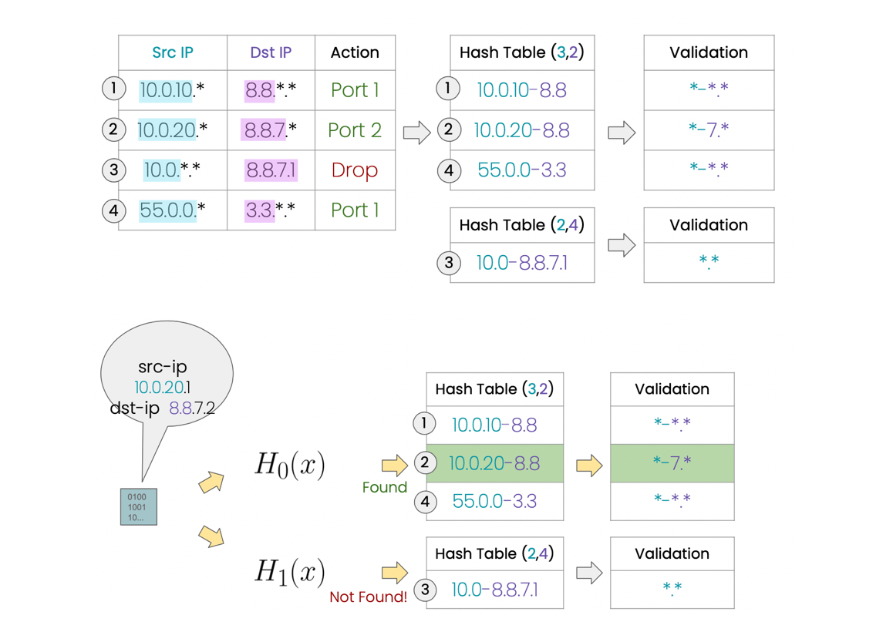
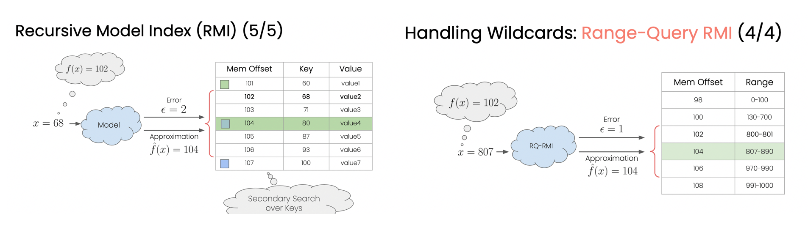

*“A Computational Approach to Packet Classification”* 论文于 2020 年 7 月发表。

## 作者介绍

三个作者都来自：Technion - Israel Institute of Technology（Technion -以色列理工学院）

### Alon Rashelbach

**一作作者。**

Technion 大学计算机系统专业博士生，2018-2020 年期间，担任 Technion 电子技术学院高级 C/C++ 课程助教。

主要经历：

- 2008-2013: 工作，管理着一个小团队
- 2013-2014: 旅行✈️ Traveller

- 2014-2018: Technion 大学-电子与电子工程理学学士
- 2018-至今：Technion - 以色列理工学院读博士

### Ori Rottenstreich 

Ori Rottenstreich（<http://www.cs.technion.ac.il/people/or/>）是 Technion-以色列理工学院计算机科学系和电气工程系的助理教授。他研究方向是网络算法和区块链。

### Mark Silberstein

Mark Silberstein（<https://marksilberstein.com/>）是一作 Alon Rashelbach 的博士导师。是 Technion 电子工程系的终身副教授、加速器计算机系统实验室（Accelerator Computing Systems Lab.）的负责人。

## 前人方法

### 决策树存在什么问题？

规则集增加，造成所需内存空间增多。还有重复复制问题（有方法可以缓解）。

### Hash 方法存在什么问题？

Hash 方法同样会导致所需空间膨胀。感觉就是简单的匹配。

### RMI 存在什么问题？

- RMI 中的 value 全都存在内存中吗？

答：value 是的。可以通过 key，输入到 model 中，得到一个预测的 index，再在这个预测的 index 附近 $[index - \epsilon, index+ \epsilon]$ 进行二次搜索，获得到 value。

- 它和 Hash 方法有什么不同？对于传入的 Key，Hash 函数得到的索引和 model 预测得到的索引有什么区别？

**答：** Hash 并没有使用 Hash 函数，而是简单的匹配。如上节[附图所示](#Hash 方法存在什么问题？)

*NuevoMatch* 建立在 **learned indexes** 之上（*Kraska et al., 2018. The Case for Learned Index Structures.*）。

- RMI 和 RQ-RMI 的区别？

