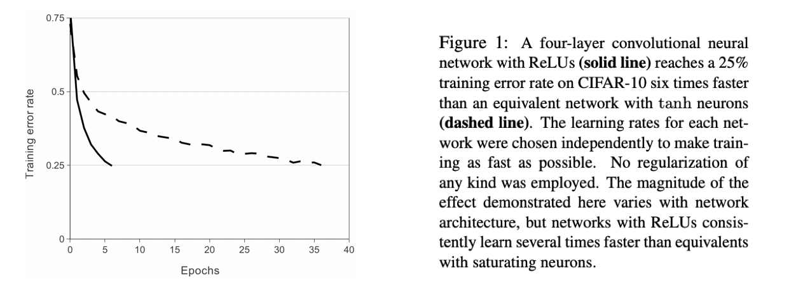
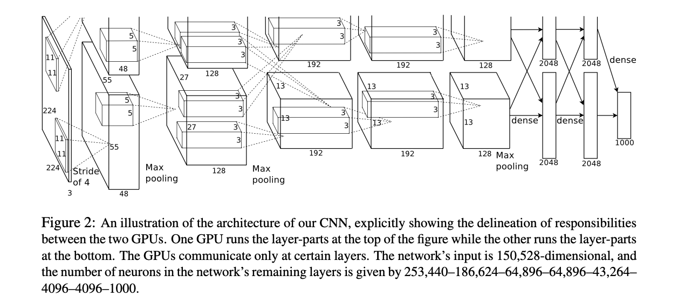

# 1 -论文

研一开学已经一个多月了，本周是第 7 周。

暑假在家自学的知识，加上本学期课堂的学习，现在基础的地基已经有了一个基本的轮廓，课题组通知正式开始论文的精读。

课题组第一阶段列出了大约 77 篇必读的经典文献，分为了几个大类：

- 基干网络：LeNet、AlexNet、VGG、ResNet、GoogLeNet...
- 轻量级网络：Shufflenet、Mobilenet、Mnasnet...
- 目标检测：Fast R-CNN、Faster R-CNN、Mask R-CNN、YOLO...
- 分割
- 视频分析（动作识别和定位）
- 影像组学
- 图像检索
- 图像配准
- 生成对抗网络
- 图卷积网络
- 注意力机制应用
- 综述类

阅读每一篇论文不仅要读懂论文的内容，还要尽可能的编程复现论文。

本次阅读的论文是《基于深度卷积神经网络的图像网络分类》（ImageNet Classification with Deep Convolutional Neural Networks [1]）。

这篇论文的第一作者名字叫做 Alex，所以论文中提出的模型也经常被称为 AlexNet。Alex Krizhevsky 发表这篇论文的时候，他正在多伦多大学计算机系攻读博士学位。

---

# 论文精读笔记

## 论文的结构

0. Abstract

1. Introduction
2. The Dataset
3. The Architecture
4. Reducing Overfitting
5. Details of learning
6. Results
7. Discussion

## 数据集

ImageNet 是一个包含超过 1500 万张已标记的高分辨率图像数据集，大约有 22000 个类别。

ImageNet 大规模视觉识别挑战赛（ILSVRC）使用的数据集是 ImageNet 的一个子集，共有 1000 个类别，每个类别中大约包含 1000 张图像。 总共大约有 120 万张训练图像，5 万张验证图像和 15 万张测试图像。

本论文的网络模型参加了 ILSVRC-2012 的比赛，论文的最后列出了模型在比赛的数据集上的表现情况。

这里有两个衡量指标：top-1 和 top-5。

其中 top-5 错误率指的是正确标签不在模型认为的最有可能的五个标签中的测试集比例。

>  the top-5 error rate is the fraction of test images for which the correct label is not among the five labels considered most probable by the model.

模型要求输入的维度是固定的，因此需要对 ImageNet 中的可变分辨率图像进行一个采样，使其分辨率固定为 $256\times256$。

## 网络结构

网络包含 5 个卷积层和 3 个全连接层。

### ReLU

激活函数：

$$tanh(x) = \frac{e^{x} - e^{-x}}{e^x + e^{-x}}$$

$$sigmoid(x) = (1 + e^{-x})^{-1}$$

$$ReLU(x) = max(0, x)$$

ReLU（ Rectified Linear Units）：修正线性单元。使用 ReLU 激活函数的深度卷积神经网络的训练速度比使用 tanh 要更快。

下图显示了网络在 CIFAR-10 数据集上达到 25% 的训练误差所需要的迭代次数。使用了 ReLU 的四层卷积神经网络（实线）在 CIFAR-10 上达到 25% 的训练错误率，比使用 tanh 的等效网络（虚线）快 6 倍。

### 在多块 GPU 上进行训练

通过实践发现，网络规模过大的情况，只用一块 GPU 可能装不下。这篇论文将网络分散在两个 GPU 上。目前的 GPU 能够直接从对方的内存中读取和写入，因此特别适合跨 GPU 并行化工作。另外，这两块 GPU 只在某些层中进行通信。

与在一个 GPU 上训练的每个卷积层有一半数量的内核的网络相比，两块 GPU 的 top-1 和 top-5 错误率分别降低了 1.7% 和 1.2%。

> This scheme reduces our top-1 and top-5 error rates by 1.7% and 1.2%, respectively, as compared with a net with half as many kernels in each convolutional layer trained on one GPU.

双 GPU 网络的训练时间比单 GPU 网络略少。

### 局部响应归一化（LRN）

网络使用了一种叫做 Local Response Normalization 的策略来提升模型的泛化能力。

响应归一化使得网络的 top-1 和 top-5 错误率分别降低了 1.4% 和 1.2%。在 CIFAR-10 数据集上：一个四层的 CNN 在不进行归一化的情况下，测试错误率为 13%，而在进行归一化后，测试错误率为 11% 。

### 池化

非重叠池化：对于卷积核 $z\times z$，则步幅 $s == z$；重叠池化：卷积核 $z\times z$，步幅 $s < z$。

本篇论文使用重叠池化，最后得出：采用重叠池的模型能一定程度上避免过拟合。

相比与非重叠池化，重叠池化能将 top-1 和 top-5 的错误率分别降低 0.4% 和 0.3%。

### 网络结构

如图所示，网络有 8 层，前 5 个卷积层，其余的是全连接层。一块 GPU 负责图像的上部分图层，另一块 GPU 负责下部分图层。网络的输入为 $150528=(224\times224\times3)$ 维的向量。 

最后一个全连接层的输出被输入到一个有 1000 类的 Softmax。

第 2、4 和 5 层卷积层的卷积核只与前一层中驻留在**同一个 GPU** 上的卷积核映射相连接。

> The kernels of the second, fourth, and fifth convolutional layers are connected only to those kernel maps in the previous layer which reside on the same GPU.

第 3 层卷积层两块 GPU 发生数据通信。

全连接层的神经元与前一层的所有神经元相连。

响应归一化层（LRN）在第 1 和第 2 卷积层之后。

最大池化层只在响应归一化层以及第 5 卷积层之后。

ReLU 非线性激活函数应用于每个卷积层和全连接层的输出。

第一层用 96 个大小为 $11\times11\times3$ 的卷积核对 $224\times224\times3$ 的输入图像进行卷积，步幅为 4 像素。

第二层用 256 个大小为 $5\times5\times48$ 的核进行卷积。

第三层用 384 个大小为 $3\times3\times256$ 的核进行卷积。

第四层用 384 个大小为 $3\times3\times192$ 的核进行卷积。

第五层用 256 个大小为 $3\times3\times192$ 的核进行卷积。

全连接层每层有 4096 个神经元。

## 减少过拟合

神经网络模型有 6000 万个参数，ImageNet 的 1000 个类别数据集学习这么多的参数仍会产生过拟合。

### 数据增强

减少图像数据过拟合的最简单也是最常见的方法是人为的放大数据集。通过原始图像产生转换图像，转换过程只涉及很少的计算量，转换后的图像是在 CPU 上用代码生成的，不需要存储在磁盘。

数据增强的第一种方式是：生成图像转换（image translations）和水平反射（horizontal reflections）。

通过从 $256\times256$ 的图像上随机的提取 $224\times224$ 的区域块，这使得训练集的大小增加了 2048 倍。

第二种数据增强的方式是：改变训练图像中 RGB 通道的强度。

通过对整个 ImageNet 训练集的 RGB 像素集进行 PCA 后，对于每张图片，添加一个均值为 0 ，标准差为 0.1 的高斯。这种方案近似地抓住了自然图像的一个重要特性，即物体标识对照明强度和颜色的变化是不变的。这种方案可以将 top-1 的错误率降低 1% 以上。

### Dropout

将每个隐藏神经元的输出乘以 0.5 的概率设置为 0（随机失活），丢弃一些神经元，这种方法丢弃的神经元不再参与前向传播和反向传播。

因此，对于每次输入，神经网络都会是不同的网络结构，但仍然共享参数。

这种策略减少了神经元之间复杂的共同适用性（complex co-adaptations ），一个神经元不能过度依赖于特定的其他神经元，因为每个神经元可能被丢弃。每个神经元会学到更加健壮的特征。

以 0.5 的概率随机失活是一个合理的近似值。

Dropout 在训练过程中只需要花费大约 2 倍的成本，会使收敛所需的迭代次数增加约一倍。

## 学习的细节

本篇论文使用随机梯度下降法训练模型，其中的一些超参数设置如下：Batch 的大小为 128，momentum 设置为 0.9，权重衰减为 0.0005。

权重衰减不仅仅是一个正则化：它降低了模型的训练误差。权重 w 的更新规则是：

$i$ 是迭代次数，$v$ 是动量变量，$\epsilon$ 是学习率，

$$\langle \frac{\partial L}{\partial w}|_{w_i}\rangle_{D_i}$$ 

是目标对于 $w$ 的导数在第 $i$ 个批次 $D_i$ 上的平均值，评价为 $w_i$ （is the average over the $i$ th batch $D_i$ of the derivative of the objective with respect to $w$, evaluated at $w_i$. ）

### 权重初始化

以标准差为 0.01、均值为 0 的高斯分布初始化每层的权重。第 2、4、5 层以及全连接层的偏置初始化为 1，其余的神经元偏置初始化为 0。这种初始化通过为 ReLU 提供正输入来加速学习的早期阶段。

### 学习率

所有层使用了相同的学习率，在整个训练过程中进行手动调整。遵循的启发式方法是：当验证误差率在当前学习率下停止改善时，将学习率除以 10。

学习率初始化为 0.01，并在终止前降低三次。通过 120 万张图像的训练集对网络进行了大约 90 个周期的训练，在两颗 NVIDIA GTX 580 3GB GPU 上花了 5 到 6 天时间。

## 结果

在 ILSVRC-2010 上的结果如表 1 所示。

ILSVRC-2012 比赛结果如表 2。

最后，在 2009 年秋季版 ImageNet 上的错误率，共有 10184 个类别和 890 万张图片。

使用一半的图像进行训练，一半的图像进行测试。由于没有既定的测试集，这种的拆分必然与前人使用的拆分不同，但这并不会明显影响结果。

在这一数据集上的 top-1 和 top-5 错误率分别为 67.4% 和 40.9%。

如果在最后一个池化层上增加第六个卷积层，则在这个数据集上的最佳结果是 78.1% 和 60.9%。

### 定性评估

Figure 3 显示了网络的两个数据连接层学习到的卷积核。这个网络已经学习了各种频率和方向选择的核。

这两块 GPU 表现出了不同分工。

Figure 4：（左）八张 ILSVRC-2010 测试图像和模型认为最有可能的五个标签。正确的标签写在每张图像下面，分配给正确标签的概率也用红条显示（如果它恰好在前5名）。

右）第一列是五张 ILSVRC-2010 测试图像。其余的几列显示了在最后一个隐藏层中产生特征向量的六张训练图像，这些图像与测试图像的特征向量的欧氏距离最小。

在图 4 的左图中，通过计算其在 8 张测试图像上的前 5 名预测结果，定性评估网络已经学到了什么。

右上角的螨虫（mite）虽然偏离图像的中心，但是仍可以被网络正确识别分类。

大多数前 5 名的标签都显得很合理。少数情况，例如：马达加斯加的猫被认为是猴子、在某些情况下（格栅、樱桃），照片的预期焦点确实会影响分类结果。

探究网络视觉知识的另一种方法是考虑图像在最后的一个 4096 维向量。如果两幅图像产生的特征激活向量具有较小的欧式距离，则可以认为它们是相似的。

Figure 4 (left) 显示了来自测试集的五幅图像和来自训练集的六幅图像，根据欧式距离的衡量标准，它们各自的相似度最高。

> Notice that at the pixel level, the retrieved training images are generally not close in L2 to the query images in the first column. For example, the retrieved dogs and elephants appear in a variety of poses. We present the results for many more test images in the supplementary material.

使用两个 4096 维实值向量来计算欧式距离是低效的。可以通过训练自动编码器将这些向量压缩成短二进制代码来提高效率。

## 总结

结果表明，一个大型的深度卷积神经网络能够在一个高度挑战的数据集上使用纯监督学习实现破纪录的结果。

如果去掉一个卷积层，此网络性能就会下降。例如，去掉任何一个中间层会导致网络的 top-1 性能损失约 2%。所以深度对于实现的结果确实很重要。

为了简化，本实验没有使用任何无监督的预训练。   
