# macOS 安装 Mininet 进行网络实验


Mininet：http://mininet.org/

An Instant Virtual Network on your Laptop (or other PC)

1. 下载 [Mininet image](https://github.com/mininet/mininet/releases/download/2.2.2/mininet-2.2.2-170321-ubuntu-14.04.4-server-amd64.zip)  镜像文件[≈588.9 MB]

GitHub 下的很慢，我使用的迅雷，速度可以达到 1MB/s。

```
https://github.com/mininet/mininet/releases/download/2.2.2/mininet-2.2.2-170321-ubuntu-14.04.4-server-amd64.zip
```


下载完成后，压缩包中有两个文件。

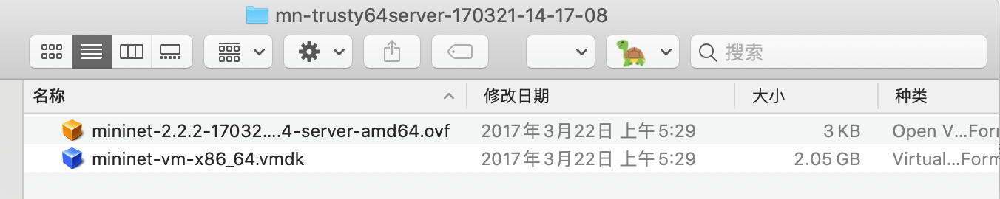


2. 安装 [VirtualBox](https://download.virtualbox.org/virtualbox/6.1.16/VirtualBox-6.1.16-140961-OSX.dmg) 虚拟机[ ≈124MB]

```
https://download.virtualbox.org/virtualbox/6.1.16/VirtualBox-6.1.16-140961-OSX.dmg
```

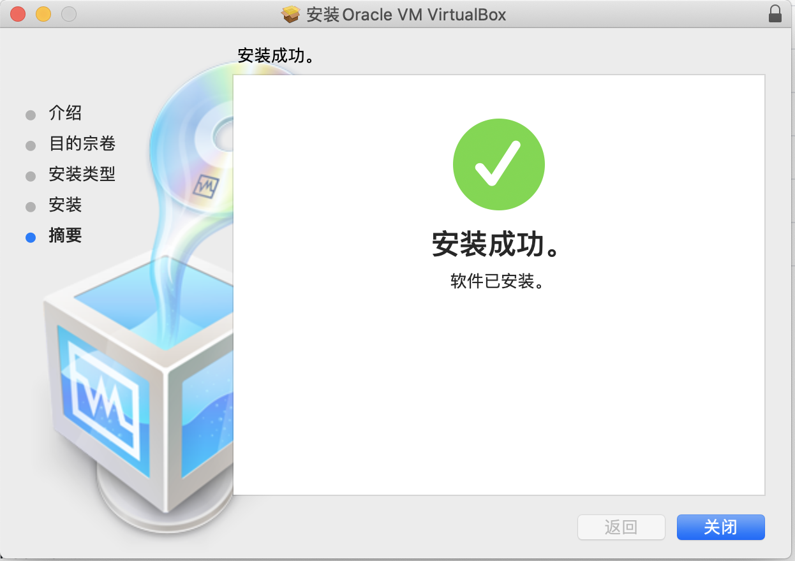


## 安装 Mininet

1. 导入 .ovf 文件

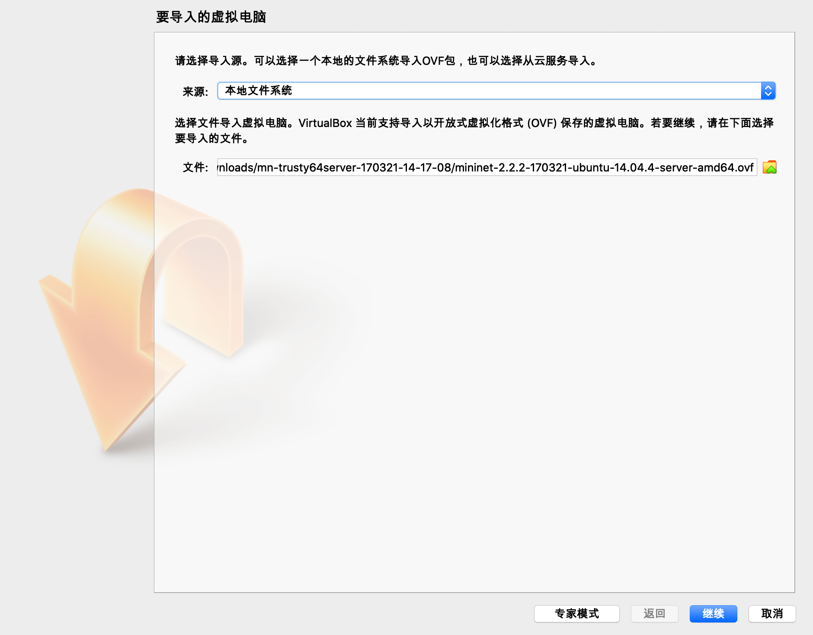


2. 导入设置

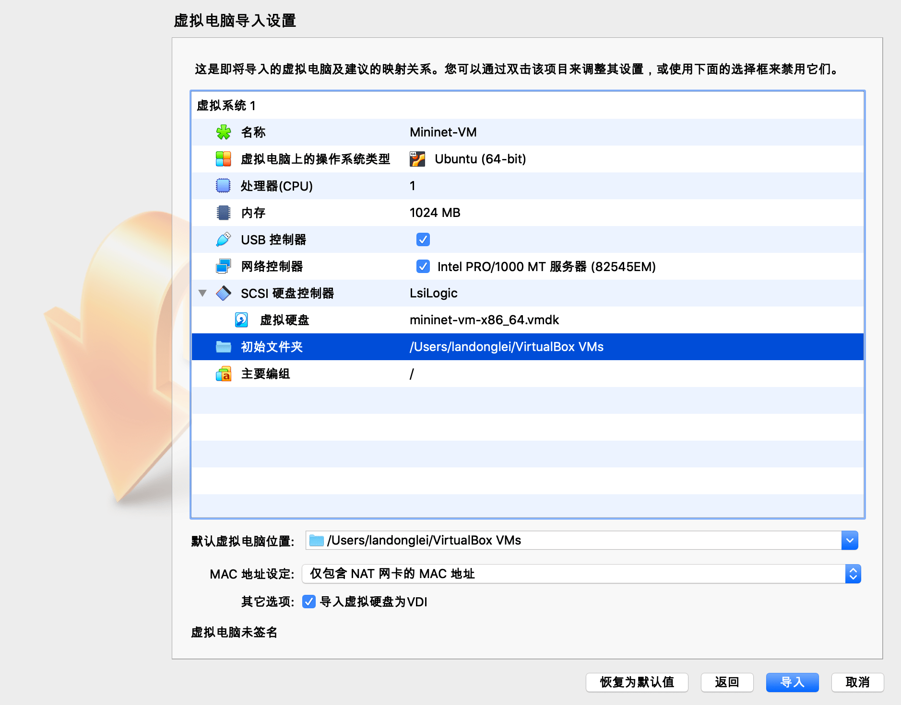


3. 导入完成


4. 启动


5. 启动完成

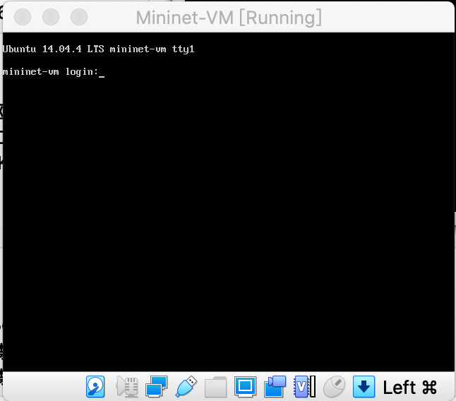


执行 `pingall` 命令，如果所有节点都互通，说明安装成功。

```
sudo mn
pingall
```

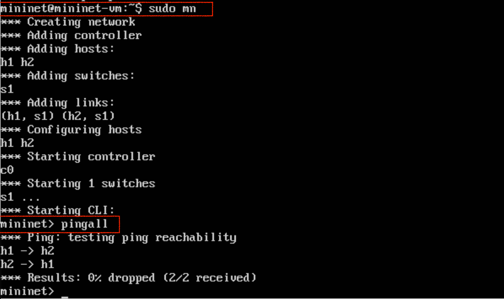

## Mininet 的使用

1. 登陆 Mininet

用户名和密码都是 mininet。

```
mininet-vm login: mininet
Password: mininet
```

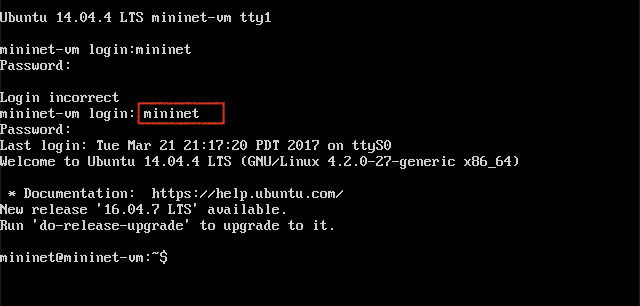

2. 查看 Mininet 系统的 IP 地址

```
ifconfig eth0
```

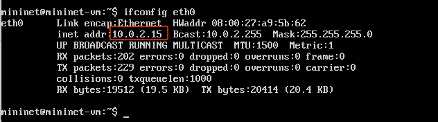


本机的 IP 地址和 Mininet 有很大的区别。


虚拟机里的 mininet 是已经连上互联网的。

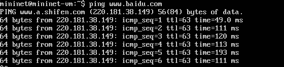


TODO：

---


## 使用 SSH 登录到虚拟机中的 Mininet

配置网络连接为桥接模式（Bridge）

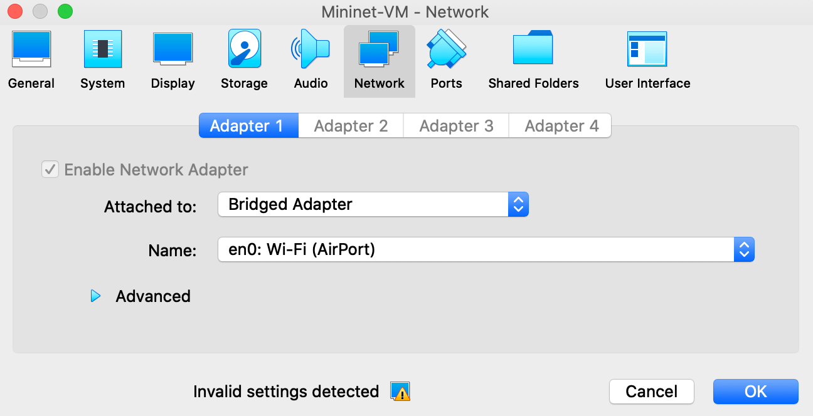

重启 mininet，此时 IP 地址与 mac 的 IP 地址在同一局域网下。

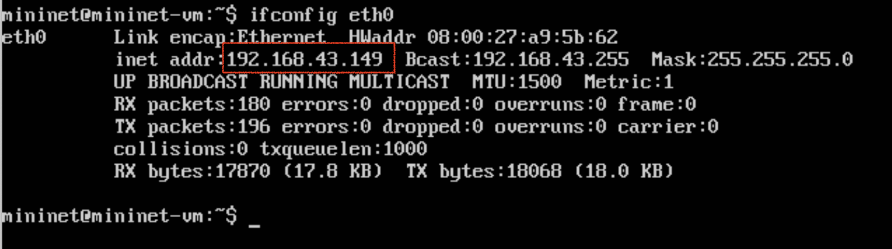


此时 mac 下可以 ping 通 Mininet。

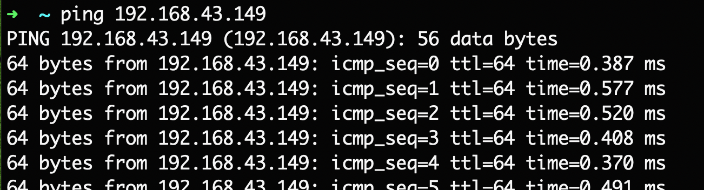

使用 SSH 登陆：


## SCP 互传文件

TODO:


---

我不太明白 C 语言编写的 HTTP 服务器和 Mininet 的关系。我大概知道怎么使用 C 语言实现一个服务器，本科阶段实现过 TCP 服务器。

那就先搞清楚 Mininet 是什么吧。

# Mininet

> Mininet 可以通过一个命令在一台机器（虚拟机/云主机/本地）上创建一个真实的虚拟网络、运行真实的内核、交换机和应用程序代码。

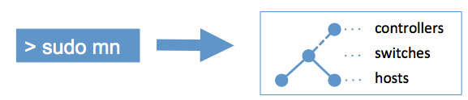

## Mininet 的特点

- 使用 Mininet 命令行界面和 API 可以轻松地与虚拟网络进行交互、自定义网络，或在真实的硬件上部署。
- Mininet 是开发、共享、使用 OpenFlow 进行实验和软件定义网络系统的好方法。
- 使用 BSD 开源许可证

在 Ubuntu 上可以使用 `sudo apt-get install mininet` 或者编译源码进行安装。而其他操作系统如 Windows/macOS 则需要通过虚拟机安装。

## Mininet 演练（Walkthrough）

实验大部分 Mininet 命令和它与 Wireshark 的典型用法。

启动 Mininet

```shell
# 启动
sudo mn
```

mininet 帮助

```
mininet> help
```

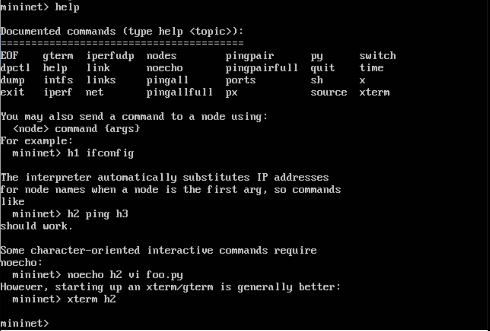

退出

```shell
# 退出
quit
```


### 启动 Wireshark

Mininet 虚拟机映像中默认安装了 Wireshark。

要使用 Wireshark 查看控制流量，首先在后台打开 Wireshark。

```
sudo wireshark
```


## 命令

显示节点

```
nodes
```

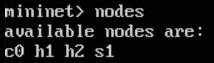


显示链接

```
net
```

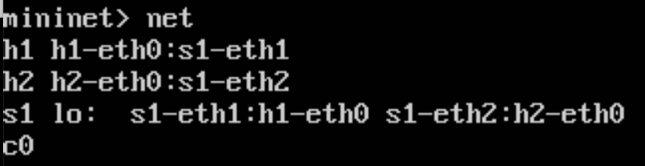


转储所有节点的信息，可以看到交换机和两个主机的列表。

```
dump
```

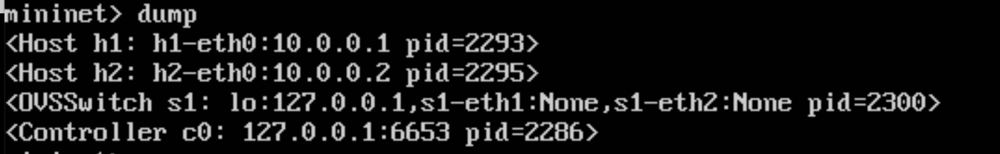


如果在 Mininet 命令行中键入的第一个字符串是主机、交换机或控制器名称，则会在该节点上执行该命令。

如下命令： 可以看到主机的 h1-eth0 和 loopback（lo）接口。

```
mininet> h1 ifconfig -a
```

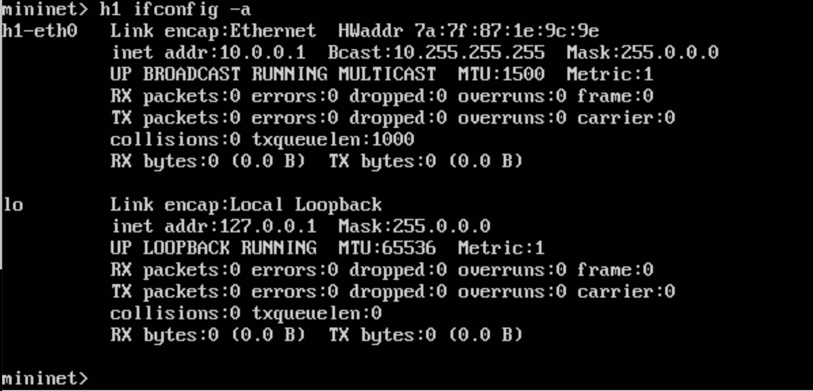


从主机进程中打印进程列表。

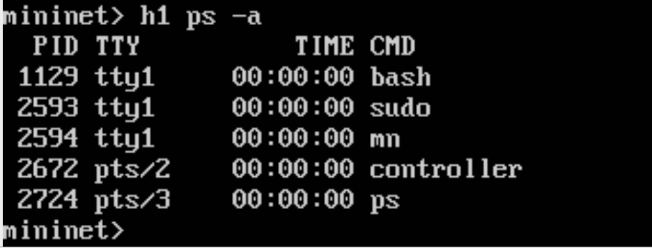


测试主机之间的连接性

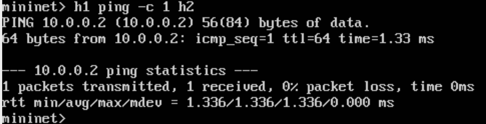


pingall

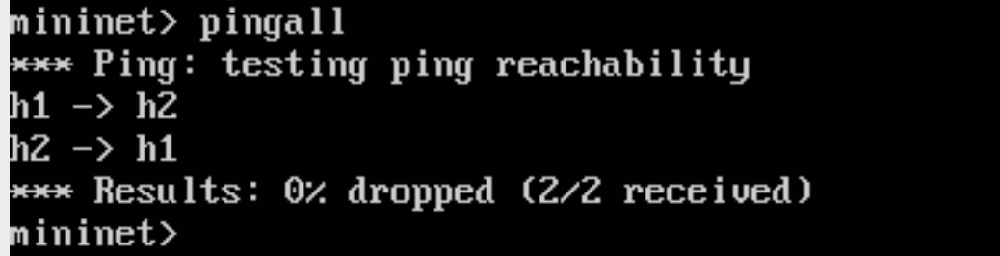


### 运行一个简单的 Web 服务器和客户端

在 h1 上启动一个简单的 HTTP 服务器，从 h2 发出一个请求，然后关闭 Web 服务器。

```shell
mininet> h1 python -m SimpleHTTPServer 80 &
mininet> h2 wget -O - h1
...
mininet> h1 kill %python
```

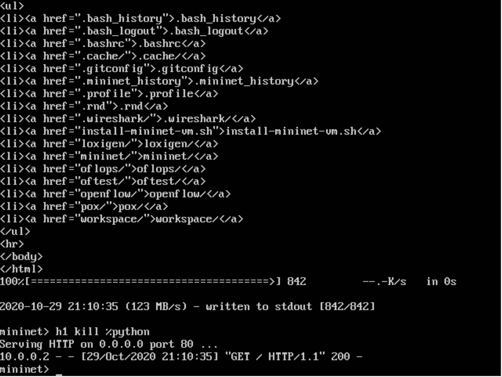


### Python 解释器

如果 Mininiet 命令行上的第一个短语是 py，那么该命令将用 Python 执行。


打印可访问的局部变量

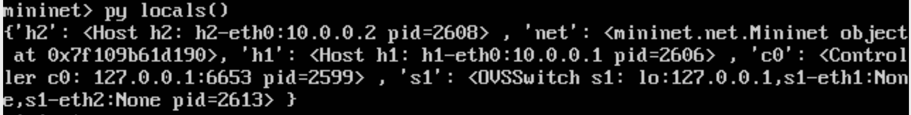


使用 `dir()` 函数，查看一个节点的可用方法和属性

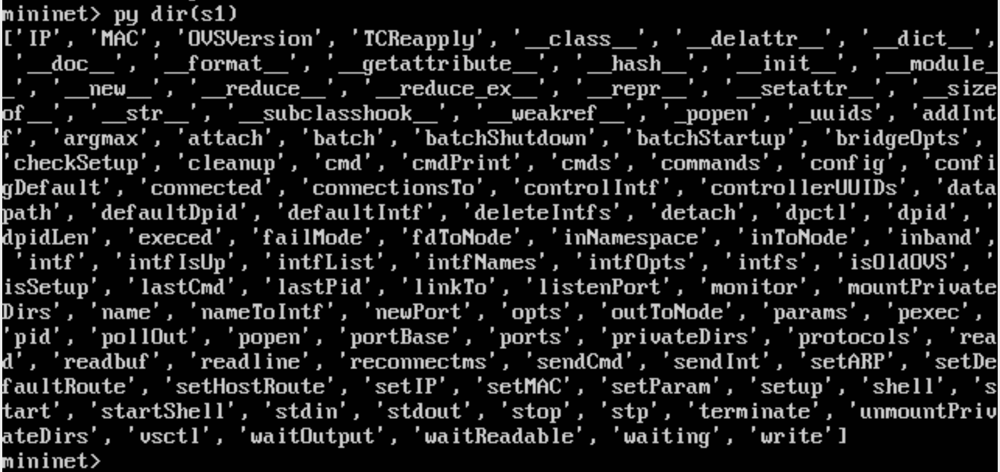


可以通过使用 `help()` 函数阅读节点上可用方法文档

```
py help(h1) (Press "q" to quit reading the documentation.)
```

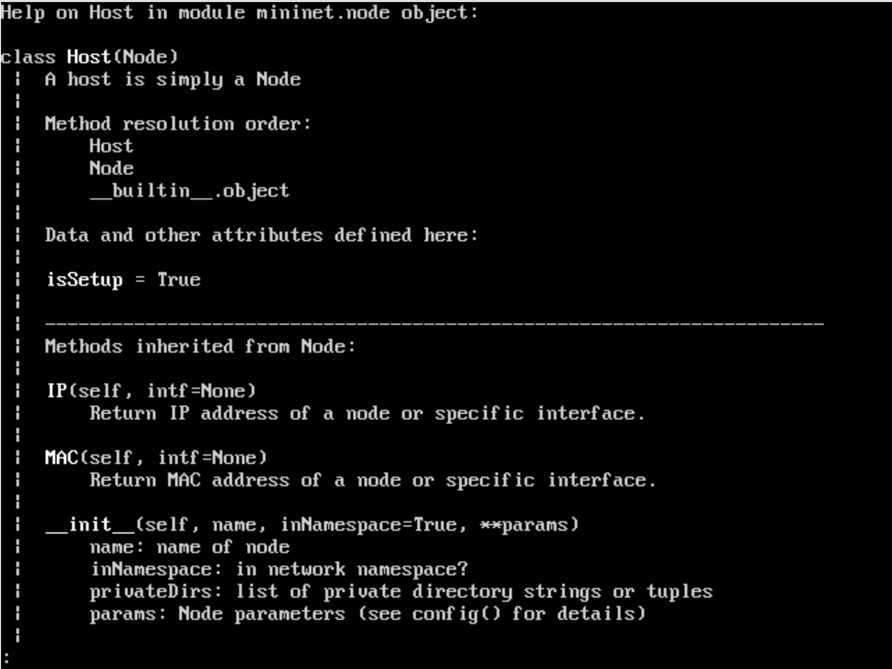


直接调用某节点方法


