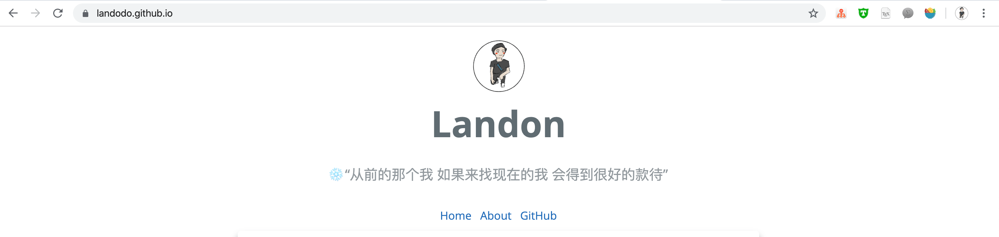
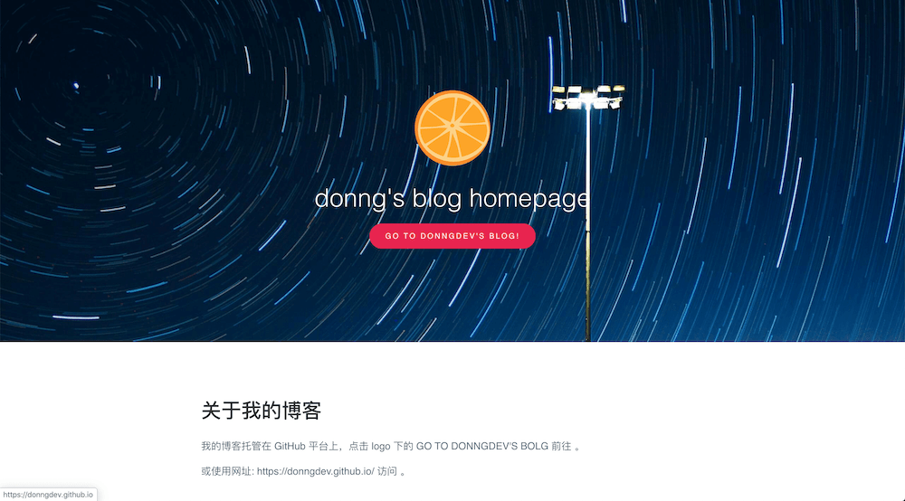
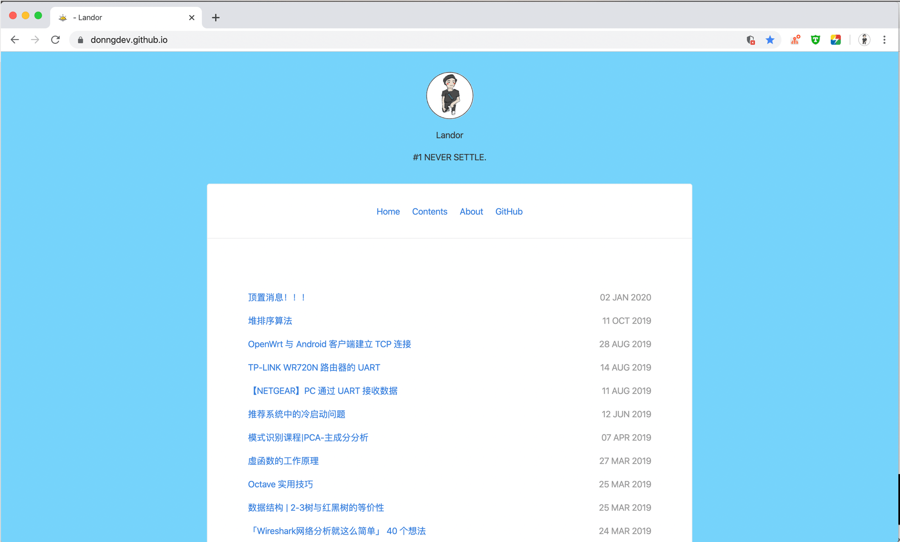
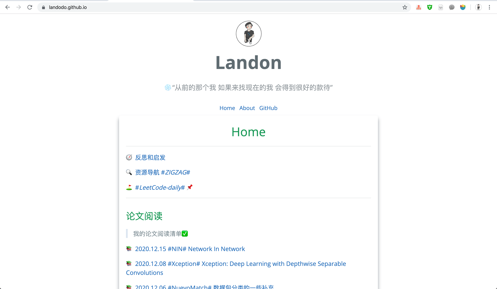

# 关于我的博客及其一些配置

这个博客的建立时间是 2020 年 11 月 02 日。

## 1. 博客主题

[https://github.com/pages-themes/cayman](https://github.com/pages-themes/cayman)

我进行了很多自定义配置，包括支持公式、访客统计、阴影框等等。我看到一些我喜欢的元素，就会添加到我的博客。

如果你也想使用和我一样的 Blog 主题，最简单的方法是直接阅读我的配置文件源码，很简单的。

## 2. 博客的内容

博客创建在研一上学期开学后的前几周，这个博客将会伴随我之后的三年研究生生活。

博客的主要内容是一些关于技术笔记。可以直接使用 Markdown，这非常的方便。我日常都是使用 MD 来编写我的笔记。

在这个网站上传一篇自己的笔记的步骤很简单。

1. 将 MD 文件拷贝进入 `posts/` 文件夹
   - 这里我会选择压缩一下图片大小
2. 在` index.md` 文件中添加 MD 文件的索引连接
   - 如：本篇 Hello World 的文件名是 `20201102-hello-word.md`，已经拷贝到 `posts/`文件夹下；
   - 在 `index.md` 文件中添加: `[2020.11.02: Hello Word](posts/20201102-hello-word)`
   - 就会得到如下图的效果。

3. 上传

```shell
git add .
git commit -m "Add new post: Hello World."
git push origin main
```

在这里我编写了一个小脚本：`update.sh`。每次只需要执行这个脚本，就可以完成博客的更新，非常方便。

## 3. 测试插入公式

能显示公式，是我的核心需求之一。

已知共有 $M$ 样本，各类别 $w_{i}, i = 1, 2, ..., M$ 的先验概率 $$P(w_{i})$$ 以及类条件概率密度函数

$$P(X|w_{i})$$

对于给定的待分类样本，贝叶斯公式可以计算出该样本分属各类别的概率。即将后验概率作为识别对象归属的依据。

$$P(w_{i}|X)=\frac{P(X|w_{i})P(w_{i})}{\sum^{M}_{j=1}P(X|w_{i})P(w_{i})}$$

类别的状态是一个随机变量，而某种状态出现的概率是可以估计的。贝叶斯公式体现了先验概率、类条件概率密度函数、后验概率三者的关系。

类条件密度可以采用多维变量的正态密度函数来模拟，此时正态分布的贝叶斯分类器判别函数为：

$$h_{i}(X) = P(X|w_{i})P(w_{i}) = \frac{1}{(2\pi)^{n/2}|S_{i}|^{1/2}}e^{[-\frac{1}{2}(X-\bar{X^{w_{i}}})S^{-1}_{i} (X-\bar{X^{w_{i}}})]}P(w_{i})$$

使用对数函数进行简化，得：

$$H_{i}(X) = -\frac{1}{2}(X - \bar{X^{w_i}})^TS^{-1}_{i}(X - \bar{X^{w_i}})-\frac{n}{2}ln2\pi-\frac{1}{2}|S_{i}|+lnP(w_i)$$

### 3.1 配置方法

1、将下面一行代码插入到配置文件`_config.yml`中

```shell
markdown: kramdown
```

2、在博客根目录下新增 `_layouts/default.html` 文件。

这个文件在 cayman 主题官方 GitHub 下载，[链接](https://github.com/pages-themes/cayman/blob/master/_layouts/default.html)。

将显示公式需要的 JS 脚本添加到 `<head>` 标签。每次加载一篇博客时，会自动加载响应的脚本，使得 LaTeX 公式正常显示。

```HTML
<head>
  <script type="text/x-mathjax-config">MathJax.Hub.Config({tex2jax: {inlineMath: [['$','$'], ['\\(','\\)']]}});</script>
  <script type="text/javascript" async src="//cdn.mathjax.org/mathjax/latest/MathJax.js?config=TeX-MML-AM_CHTML"></script>
</head>
```

本地的 Markdown 文件是怎么的，在博客中显示就是什么样的。 

## 4. 代码高亮

能高亮显示代码，是我的核心需求之一。

```c++
// hello.c
#include <stdio.h>

int main() {
  printf("hello, world\n");
  return 0;
}
```

## 5. 添加阅读数和访客量

使用的是不蒜子。两行代码，搞定计数。

2020.12.22 都是我自己访问的。

©Landon | PV: 623 views | UV: 245 views

[https://busuanzi.ibruce.info/](https://busuanzi.ibruce.info/)

## 6. 个性化配置值

### 6.1 给 main 标签新增的阴影框

参考的是 [https://cjting.me/](https://cjting.me/) 博客主题，我特别喜欢。只需要配置 `style="box-shadow: 0 8px 10px #959da5;"`。

2020.12.19

### 6.2 修改 cayman 主题的 header 标签样式

删除了 cayman 的 header 标签样式，显示首页一片白，非常整洁。



### 6.3 增加了 Scroll To Top Button

2020.12.21. 在阅读别人的 Blog 时，看到这个功能挺好的。添加到我的博客。一个透明的 TOP Button。

```html
<!-- Go to Top Button: https://stackoverflow.com/questions/15935318/smooth-scroll-to-top -->
<!-- https://www.w3schools.com/howto/howto_js_scroll_to_top.asp -->
<button id="to_top_btn" onclick='window.scrollTo({top: 0, behavior: "smooth"});'>Top</button>
<style>
  #to_top_btn {
  display: none; /* Hidden by default */
  position: fixed; /* Fixed/sticky position */
  bottom: 20px; /* Place the button at the bottom of the page */
  right: 15px; /* Place the button 30px from the right */
  z-index: 99; /* Make sure it does not overlap */
  border: none; /* Remove borders */
  outline: none; /* Remove outline */
  background: rgb(23, 153, 87, 0.6);
  color: white; /* Text color */
  cursor: pointer; /* Add a mouse pointer on hover */
  padding: 15px; /* Some padding */
  border-radius: 10px; /* Rounded corners */
  font-size: 18px; /* Increase font size */
}

#to_top_btn:hover {
  background: rgb(192, 192, 192, 0.5);
}
</style>

<script>
  //Get the button:
  mybutton = document.getElementById("to_top_btn");
  // When the user scrolls down 20px from the top of the document, show the button
  window.onscroll = function() {scrollFunction()};
  function scrollFunction() {
    if (document.body.scrollTop > 20 || document.documentElement.scrollTop > 20) {
      mybutton.style.display = "block";
    } else {
      mybutton.style.display = "none";
    }
  }
</script>
```


## 7. 我本科阶段的博客

博客首页部署在 coding.net 上，不过已经无法访问的。



值得的说一句的是，这个首页使用 CSS 样式是我最喜欢的，我现在也一直保留。平时写一些小 HTML 页面时，我都会使用这个样式。

我在 HTTPS 的实验中写的 HTML 页面，就是这个样式。

[HTTP 服务器的一些截图记录](https://landodo.github.io/posts/20201113-http) 

博客主页使用的 GitHub Pages。写了 66 篇博客。



现在的风格和以前一样。

不过现在的博客更能更强，也更加方便。



完。

