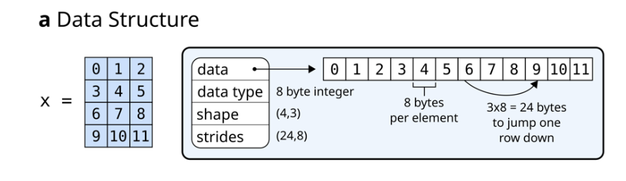
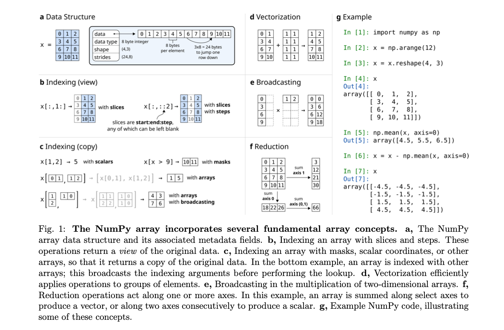
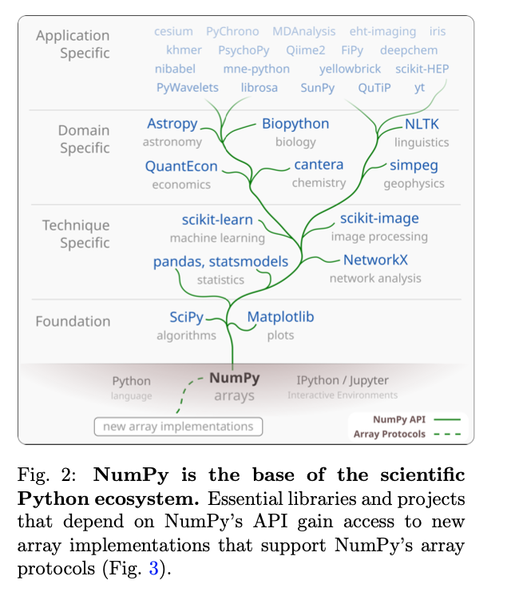
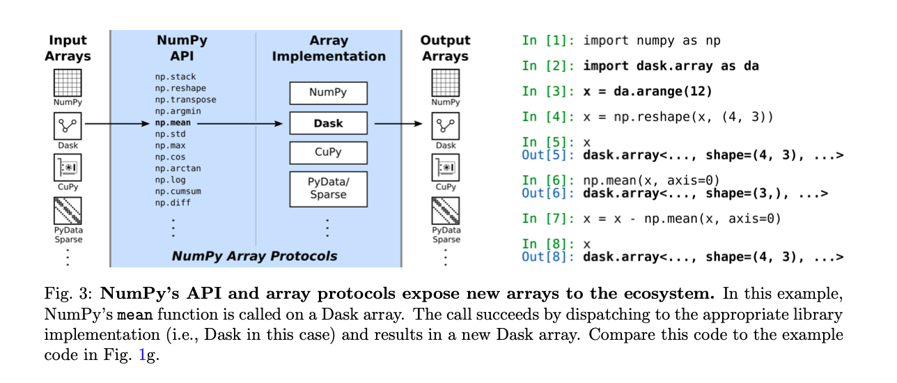

# #论文阅读-NumPy#

论文名称：Array Programming with NumPy

这是一篇关于 NumPy 的论文，最近也在学习 Python，NumPy 也是常用的一个包，可以花点时间读一读这篇论文。

## 摘要

NumPy 是 Python 的一个主要的数组编程库（array programming library）。

数组编程（Array Programming）为访问和操作向量、矩阵或高维数组中的数据提供了一种强大、紧凑的语法，在不同的领域的研究分析中发挥着重要的作用。

本篇论文会介绍几个基本的数组概念，从而探索如何形成一个简单而强大的编程范式来组织、探索和分析科学数据。

NumPy 是构建 Python 科学计算的基础。有一些特殊的项目，会针对性的开发出类似 NumPy 的接口和数组对象。

## 历史

NumPy 之前 Python 有两个数组包，分别是 Numeric 和 Numarray。

Numeric 始于 1995 年左右，它使用 C 语言结合线性代数的标准编写实现。最早是为了处理来自哈勃空间遥感仪的大型天文图像。

Numarray 是对 Mumeric 的重写，增加了对结构化数组的支持、灵活的索引、内存映射、字节顺序变体（byte-order variants）、更有效的内存使用、灵活的 IEEE 错误处理能力以及更好的类型定义规则。

这两个包相互兼容，但是在很多方面存在差异和分歧。

2005 年，NumPy 作为二者的完美统一体诞生，将 Numarray 的丰富功能与 Numeric 在数组上的高性能及其丰富的 C 应用编程接口结合起来。

15 年后的今天，NumPy 已经成为几乎所有科学计算的 Python 包的基础，包括 SciPy、Matplotlib、pandas、scikit-learn 和 scikit-image。

NumPy 是一个社区开发的开源库，它提供了一个多维的 Python 数组对象以及对其进行操作的函数（array-aware functions）。 

NumPy 使用了 CPU 对内存中的数组进行操作。目前计算机的存储和硬件不断的升级，NumPy 也在不断的更新。

## NumPy 数组

NumPy 数组是一个高效存储和访问多维数组的数据结构，这也被称为张量（Tensors），可以进行各种科学计算。

它由一个指向内存的指针，以及用于解释存储在那里的数据的元数据组成，特别是数据类型（data type）、形状（shape）和步长（strides）。




如下图，显示了 NumPy 数组包含的几个基本的数组概念。

- a：NumPy 数组数据结构及其相关的元数据字段（metadata fields）。
- b：用 `slices` 和 `steps` 对数组进行索引，这些操作返回原始数据的视图。
- c：用掩码（）、标量坐标或其他数组对数组进行索引，使其返回原始数据的副本。
- d：向量化高效地操作数组元素。 
- e：在二维数组的乘法中广播（broadcasts）。在这个例子中，一个数组沿选择 `axes` 求和产生一个向量，或者沿两个 `axes` 连续求和产生一个标量。 
- f：还原操作沿一个或多个 `axes` 进行。在这个例子中，一个数组沿着选定的 `axes` 求和产生一个向量，或者沿着两个 `axes` 连续求和产生一个标量。
- g：NumPy 代码示例。



数组的形状决定了每个轴上元素的数量，轴的数量就是数组的维数。例如，一个矢量数字可以存储为一个 `(N, 1)` 的向量，彩色视频存储为 `(T, M, N, 3)`。

`Strides`（步幅）是将线性存储元素的计算机内存解释为多维数组的必要条件。它描述了在内存中从一行跳到另一行，从一列跳到另一列等要向前移动的字节数。例如，考虑一个形状为 `(4, 3)` 的二维浮点数组，每个元素在内存中占据 8 个字节。要在相邻的列之间移动，则需要在内存中向前或向后移动 8 个字节，访问下一行需要移动 3×8=24 个字节（a）。


NumPy 可以按照 C 一样的内存顺序进行存储数组，先迭代行或先迭代列，这使得用 C 语言编写的外部库可以直接访问内存中的 NumPy 数组数据。

用户使用索引（indexing）访问子数组或单个元素、运算符（向量化）以及 array-aware functions 与 NumPy 数组进行交互。

对数组进行索引，可以返回单个元素、子数组或满足特定条件的元素（b）。

数组甚至可以使用其他数组进行索引（c）。

只要有可能，检索子数组的索引就会返回原始数组的视图，这样两个数组之间就可以共享数据。这提供了一种强大的方法来操作数组数据的子集，同时限制了内存的使用。

> "Wherever possible, indexing that retrieves a subarray returns a view on the original array, such that data is shared between the two arrays. This provides a powerful way to operate on subsets of array data while limiting memory usage."

NumPy 包含了对数组进行矢量化（对整个数组进行操作）计算的函数，包括算术、统计和三角函数（d）。

在 C 语言中需要几十行代码才能完成的操作，Python 只需要简洁清晰的一行代码。在内部的细节中，NumPy 以近乎最佳的方式处理数组元素的循环，考虑到例如步长（strides），以最好地利用计算机的快速缓存内存。

当两个形状相同的数组执行向量化操作时，其结果显而易懂。当形状不同时，广播（broadcasting）机制可以实现相同的效果。

举一个例子，将一个标量值加到一个数组上，广播机制可以将这个标量分别加到数组的每一个元素上。

其他的 array-aware 函数，如：`sum/mean/max` ，创建（creating）、重塑（reshaping）、连接（concatenating）和填充（padding）数组，搜索、排序和计数数据，读写文件，随机数、各种概率分布等。

> Altogether, the combination of a simple in-memory array representation, a syntax that closely mimics mathematics, and a variety of array-aware utility functions forms a productive and powerfully expressive array programming language. 

## Python 生态

Python 是一门开源的、通用的、解释型的编程语言，非常适合于标准的编程任务，如清理数据、与网络资源交互和解析文本。

NumPy 为 Python 增加了快速数组运算和线性代数，使得科学家们可以在 Python 中完成所有的工作，而且 Python 具有的易学易教的优势，许多大学都将其作为主要学习语言。

NumPy 不是 Python 标准库的一部分，因此 NumPy 能够决定自己的发布策略和开发模式。

SciPy、Matplotlib 与 NumPy 有紧密的联系。SciPy 提供了科学计算的基本算法，包括数学、科学和工程例程。Matplotlib 用于数据的可视化。

NumPy、SciPy 和 Matplotlib 的结合，再加上 IPython 或 Jupyter 这样的高级交互环境，为Python 的数组编程提供了坚实的基础。



- eht-imaging：用于射电干涉测量成像、分析和模拟。这个库依赖于 Python 生态系统的许多低级组件。如 NumPy 数组用于存储和处理每一步的数值数据：从原始数据到校准和图像重建。
- scikit-image：SciPy 的拓展图像处理库，提供了更高层次的功能，如边缘过滤器和Hough变换。
- NetworkX：一个用于复杂网络分析的软件包，用于验证图像对比的一致性。
- Astropy：处理标准的天文文件格式，并计算时间/坐标变换

交互式编程环境非常适合探索性数据分析，用户可以流畅地检查、操作和可视化他们的数据，并快速迭代以完善编程语句。

探索性之外的科学计算工作通常是在集成开发环境（IDE）中完成的。

这一段我不太理解：（Keywords：分布式、自动化测试）

> To complement this facility for exploratory work and rapid prototyping, NumPy has developed a culture of employing time-tested software engineering practices to improve collaboration and reduce error [31]. This culture is not only adopted by leaders in the project but also enthusiastically taught to new- comers. The NumPy team was early in adopting distributed revision control and code review to improve collaboration on code, and continuous testing that runs an extensive battery of automated tests for every proposed change to NumPy. The project also has comprehensive, high-quality documentation, integrated with the source code [32, 33, 34].

大概的意思就是这一种新的机制非常的好，非常 nice。已经被建立在 NumPy 生态基础上的库所采用。例如，在英国皇家天文学会对 Astropy 库就给出了如下夸奖。

> “The Astropy Project has provided hundreds of junior scientists with experience in professional-standard software development practices including use of version control, unit testing, code review and issue tracking procedures. This is a vital skill set for modern researchers that is often missing from formal university education in physics or astronomy.”

目前数据科学、机器学习和人工智能发展迅猛，Python 被大规模的推广使用。现在在自然科学和社会科学领域中，几乎每一个学科都有一些库，这些库已经成为许多领域的主要软件环境。

NumPy 及其生态是全球社区会议和研讨会的焦点，NumPy 和它的 API 已经变得真正的无处不在。

## Array proliferation and interoperability 

NumPy 既可以在嵌入式设备上运行，也可以在世界上最大的超级计算机上运行，其性能接近于编译语言。NumPy 从其诞生到现在，负责了绝大多数的数组科学计算。

目前大部分的科学数据集通常会超过单台计算机的内存容量，这些数据集存储在多台机器上或云端。

此外，最近深度学习和人工智能应用的需求导致了专门的加速器硬件的出现，例如，图形处理单元（GPU）、张量处理单元（TPU）和现场可编程门阵列（FPGA）。

NumPy 目前还不能直接利用这种专用的硬件。

> However, both distributed data and the parallel execution of GPUs, TPUs, and FPGAs map well to the paradigm of array programming: a gap, therefore, existed between available modern hardware architectures and the tools necessary to leverage their computational power.

为了解决这个问题，每个深度学习框架都有针对性的创建了自己的数组（array）：PyTorch Tensorflow、Apache MXNet、JAX 等，这些数组实现都有能力以分布式方式在 CPU 和 GPU 上运行。

此外，还有一些项目是建立在 NumPy 数组作为数据容器的基础上，并扩展其功能。这样的库通常会模仿 NumPy API，提供了稳定的数组编程接口，这能大大的吸引新人，或者降低学习的成本。

这防止了 NumPy 重蹈 Numeric 和 Numarray 的破坏性分裂的覆辙。

探索新的数组工作方式本质上是实验性的，目前几个比较有前途的库 Theano、Caffe 已经停止开发了。每次用户决定尝试一种新的库（框架）时，必须改变 import 语句，并确保新的库实现了他们目前使用的 NumPy API 的所有部分。

在理想情况下，用户使用  NumPy function 或 semantics 编写一次代码，然后根据实际情况在NumPy 数组、GPU 数组、分布式数组等之间进行切换。NumPy 提供了一个规范完善的 API。



为了促进这种互操作性，NumPy 提供了协议（protocols），允许将专门的数组传递给NumPy 函数（Fig. 3）。而 NumPy 则根据需要将操作分配给如 Dask、CuPy、xarray 和 PyData/Sparse。

例如，用户现在可以使用 Dask 将他们的计算从单机扩展到分布式系统。

关于大规模部署，我不太明白：

> The protocols also compose well, allowing users to redeploy NumPy code at scale on distributed, multi- GPU systems via, for instance, CuPy arrays embedded in Dask arrays. Using NumPy’s high-level API, users can leverage highly parallel code execution on multiple systems with millions of cores, all with minimal code changes [42].

这些数组协议现在是 NumPy 的一个关键功能，具有很高的重要性。与 NumPy 的其他部分一样，协议是在不断完善和增加的，以提高实用性和简化采用。

## 总结

NumPy 将 array programming 的表达能力、C 语言的性能、Python 的易读性、可用性和通用性等优点结合在一起，形成了一个成熟的、经过良好测试的、有良好文档的、由社区开发的库。

Python 生态中的库提供了大多数重要算法的快速实现。

在需要极端的要求高性能的情况下，可以使用如 Cython、Numba 和 Pythran 等编译型语言，这些语言扩展了 Python 并透明地加速了瓶颈。

由于 NumPy 的简单内存模型，可以使用低级编程语言如 C 来操作 NumPy 数组，然后将其传回给 Python。此外，使用数组协议，可以在对现有代码进行最小改动的情况下，利用全部的专用硬件加速代码运行。

NumPy 最初是由学生、教师和研究人员开发的，目的是为 Python 提供一个先进的、开源的数组编程库，它可以免费使用。

可以想象这样的场景：一群志同道合的人，为了共同的利益，一起建立了一些有意义的东西。

这些最初的开发者使用 C 等低级的编程语言，参考了其他强大的科学计算交互式编程语言如 MATLIB 来编写代码。

最初的版本是在 Python 中添加一个数组对象，到后来通过不断升级迭代，成为一个充满活力的工具生态的基础。现在，大量的科学工作都依赖于 NumPy。NumPy 已经成为了一个核心的科学基础设施。

现在的 NumPy 项目开发流程已经成熟，这个项目有正式的管理结构，并由 NumFOCUS 提供财政赞助，NumFOCUS 是一个非营利性组织，旨在促进研究、数据和科学计算方面的开放实践。

在赞助资金的支持下，该项目能够（也是）在多个月内持续专注于实现实质性的新功能和改进。尽管如此，它仍然在很大程度上依赖于研究生和研究人员在业余时间做出的贡献。

NumPy 不再只是科学 Python 生态的基础数组库，而且已经成为张量（tensor）计算的标准 API，也是 Python 中数组类型和技术之间的协调机制。目前仍然在继续努力扩展和改进相关互操作性功能。

在未来的十年，NumPy 将面临着不少的挑战。

- 设备仪器的升级，导致科学数据收集的规模继续扩大
- 专有硬件的提升不协调
- 新一代编程语言、解释器和编译器可能出现

NumPy 已经准备好迎接挑战，并继续在交互式科学计算中发挥领导作用。要做到这一点，需要政府、学术界和工业界的持续资助。但更重要的是，它还需要新一代的研究生和其他开发者的参与贡献，以建立一个满足下一个十年数据科学需求的 NumPy。

## 方法

使用 Git 进行版本控制，项目托管在 GitHub，利用 GitHub 的 pull request（PR）机制，在合并代码之前进行审核，还使用 GitHub 的 issue 来收集社区用户的改进建议。

## 库组织

NumPy 库由以下几个部分组成：

- 数据结构 `ndarray`
- 通用函数（universal functions）
- 一组用于操作数组和进行科学计算的库函数
- 单元测试和 Python 包构建的基础库
- 用于在 Python 中包装 Fortran 代码的程序 `f2py`

**核心（Core）**：`ndarray` 和通用函数一般被认为是 NumPy 的核心。

`ndarray` 是 NumPy 的核心数据结构。该数据结构在一个连续的块状内存中存储有规律的同质数据类型，允许有效地表示 n 维数据。

**通用函数（universal functions）**： `ufuncs` 是使用 C 语言编写的函数，它实现了对 NumPy 数组的高效循环。`ufuncs` 的一个重要特点是内置了广播的实现。例如，函数 `arctan2(x, y)` 是一个接受两个值并计算 $$tan^{-1}(y/x)$$ 的 `ufunc`。

**计算库（Computing libraries）**：

- 数组操作和科学计算的函数库。如：创建、重塑、连接和填充数组；搜索、排序和计算数组中的数据；计算基本的统计数据，如平均值、中位数、方差和标准差；文件 I/O 等。

- 计算快速傅立叶变换（FFT）及其逆。

- 求解线性代数问题，如：计算行列式、矩阵的逆、特征值、特征向量等。

- 可以生成服从特点概率分布（高斯分布、β、gamma 等）的随机数。

**基础设施库（Infrastructure libraries）**：

- 编写测试和构建 Python 包的工具（如 `assert_allclose(actual, desired)` 等函数）。

- distutils：配置、安装和打包依赖 NumPy 的库。例如，当发布到 PyPI 网站时，会使用到。

**F2PY**：`F2py` 是一个用于构建 NumPy-aware Python 封装 Fortran 函数的工具。

## 治理

NumPy 于 2015 年 10 月 5 日通过了一份正式的治理文件，用于监督和审查 NumPy 日常的发展。
NumPy 的官方行为准则于 2018 年 9 月 1 日获得批准。

这份行为准则主要体现：开放、富有同情心、欢迎、友好和耐心、具有协作精神、具有探究精神等。

## 资金
2017 年，NumPy 从 Gordon & Betty Moore 和 Alfred P. Sloan 基金会获得了130 万美元的资助。

2019 年，Chan Zuckerberg 资助了 19.5 万美元。

自 2019 年 5 月起，每年都会从 Tidelift 获得少量资金，用于文档和网站改进等工作。

## 开发者

NumPy 目前由 23 名拥有 NumPy 代码库提交权的贡献者维护。


在 NumPy 的历史上，已经有 823 个贡献者的 PR。但是它的发展主要还是依赖于少数活跃的维护者，这些人贡献了大部分的代码。

NumPy 大约每半年一次更新，历年的 PR 情况如 Fig.4 所示。


## 社区

有大量的 Python 包以 NumPy 作为基础，因此需要 NumPy 具备很高的稳定性。

NumPy 的新功能开发流程，会吸取社区的贡献和反馈。

每周一次的社区电话会议。

## 加强 NumPy 的建议

NumPy 代码库是非常复杂的，还有大量依赖于它的项目。因此，在进行修改时，需要吸取社区的反馈和意见。

NumPy 增强提案（NEP）是在 Python 增强提案（PEP）的基础上建模的，用于“提出重大新功能，收集社区对某个问题的意见以及记录已纳入 Python 的设计决策”。

## 核心角色

NumPy在构建和标准化科学Python社区的大部分基础设施方面发挥了核心作用。

Python 社区的大部分基础设施对于 NumPy 的构建和标准化起到了核心作用。

NumPy 的 docstring 标准现在被广泛采用。

科学 Python 生态的所有项目都采用一个共同的 "time window-based" 策略支持 Python 和 NumPy 版本。

## Wheels build system 

Python *wheel* 是一种标准的文件格式，用于分配 Python 库。

*wheel* 还可以包括编译后的 C 扩展和其他二进制数据。包括 NumPy 在内的许多库都需要 C 编译器和其他构建工具来从源代码进行安装，这使得许多用户很难自行安装软件。

在 Python 打包系统中引入了 wheel 后，使得用户安装预编译的库变得更加容易。

这个系统使得用户可以很容易地在这些平台上安装预编译版本的 NumPy。

Wheel（造轮子？）还在不断发展中。

## 近期的技术改进

测试基础架构的改变，以支持大规模计算中使用的硬件平台。

## 数组函数协议

目前 NumPy 已经无法满足某些方面的需求，因此，出现了众多的专业项目。

如：PyTorch 和 Tensorflow 提供了具有 NumPy 启发语义的张量 API。

Dask 是一个在 Python 中用于并行计算的库。Dask 采用了 NumPy API，因此为现有的 NumPy 用户提供了一个熟悉的界面，同时增加了强大的并行化和分配任务的能力。

使用 NumPy 类 API 的用户要针对一个项目编写特定的代码，这对于依赖某个特定框架的用户来说是一个负担，因为他们需要的工具可能不适合他们。

这也给那些需要从 NumPy 过渡到更专业的数组的用户带来了挑战。越来越多的具有 NumPy-like API 的专业项目（框架）有可能再次使科学 Python 社区出现分裂。

为了解决这些问题，NumPy 的目标是为各种 NumPy-like 的 API 之间的互操作性提供基本的 API。

较早的 `__array_ufunc__` 协议，它使大多数数学函数的互操作性得以实现。

2019 年，` __array_function__` 协议被纳入 NumPy 1.17 中。

下面是通过 NumPy 对 CuPy GPU 数组进行处理，所有的操作都被派发回 CuPy。

```python
import numpy as np 
import cupy as cp
x_gpu = cp.array([1, 2, 3])
y = np.sum(x_gpu) # Returns a GPU array
```

同样，使用 NumPy 组成的用户定义函数现在也可以应用于多节点分布式 Dask 数组。

```python
import numpy as np
import dask.array as da

def f(x):
    """ Function using NumPy API calls """
    y = np.tensordot(x, x.T) return np.mean(np.log(y + 1))

x_local = np.random.random([10000, 10000]) # random local array
x_distr = da.random.random([10000, 10000]) # random distributed 

array f(x_local) # returns a NumPy array
f(x_distr) # works, returns a Dask array
```

## 随机数生成

NumPy 的 `random` 模块提供了各种分布的伪随机数。在 NumPy 的遗留版本中，模拟随机值是由一个 `RandomState` 对象产生的。

`RandomState` 对象做出了兼容性保证，固定的种子和函数调用序列就会产生相同的数据集合。

NumPy 1.17 引入了一个新的生成随机数的 API，它使用了一个更灵活的结构，可以由库或用户扩展。新的 API 使用组件构建，这些组件将生成随机变量所需的步骤分开。伪随机位由位发生器（a bit generator）生成。然后，这些比特由一个生成器转化为来自复杂分布的变量。最后，种子由一个对象处理，该对象产生高质量的初始值序列。

比特生成器（Bit generator）是简单的类，管理底层伪随机数的状态。

NumPy 有四种比特生成器：

- 默认的生成器：Permuted Congruential Generator
- Philox generator
- Chris Doty-Humphrey 的 Small Fast Chaotic generator
- 32-bit Mersenne Twister

比特生成器在 Python 和 C 中提供了公开的函数，用于生成随机整数和浮点数。

生成器（Generator）消耗其中一个比特位生成器，生成复杂分布的数。

还有很多分布：正态、指数，以及用于有界随机整数生成的 Lemire 方法。Generator 与传统的 RandomState 较为相似，其API也基本相同。

最后，SeedSequence 用于初始化位发生器。种子序列可以在没有参数的情况下初始化，在这种情况下，它从一个依赖于系统的提供者那里读取熵，或者用用户提供的种子来初始化。

以上三个组件组合起来，构建了一个完整的随机数发生器。

```python
from numpy.random import (
    Generator,
    PCG64, # 默认生成器
    SeedSequence,
)
seq = SeedSequence (1030424547444117993331016959)
pcg = PCG64(seq)
gen = Generator(pcg)
```

这种方法保留了对种子序列的访问权，然后可以用来产生更多的生成器。

```python
children = seq.spawn(2)
gen_0 = Generator(PCG64(children[0])) 
gen_1 = Generator(PCG64(children[1]))
```

虽然这种方法保留了完整的灵活性，但当不需要重现性的时候，可以使用`np.random.default_rng` 方法来实例化一个 Generator。

新 API 的最终目标是提高可扩展性。

RandomState 掩盖了所有的底层状态和功能。

## 在多种架构上测试

Summit 和 Sierra 这两台超级计算机都采用了IBM POWER9 架构。

截至 2017 年，ARM 处理器的产量已经超过1000 亿个，成为世界上应用最广泛的指令集架构。

NumPy 这个科学计算软件库在 POWER 和 ARM 进行了测试。

- ppc64le（Travis CI上 的 POWER8）
- ARMv8（Shippable 服务）
- s390x 架构（Travis CI上的 IBM Z CPU）

PEP 599 提出了一个新的 Python 二进制 wheel 发行支持计划。

manylinux2014 增加了对 ARMv8、pc64le 以及 s390x 的支持。

NumPy 已经做好了准备，未来在这些架构上提供的二进制文件，并成为一个基础库。


