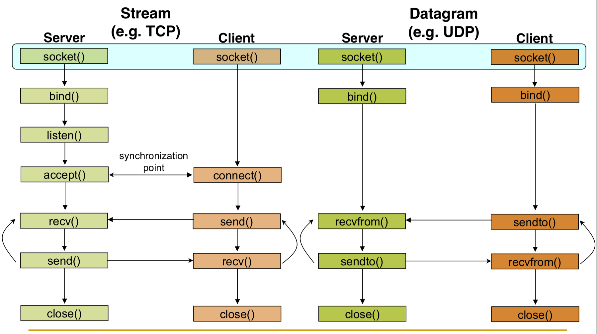
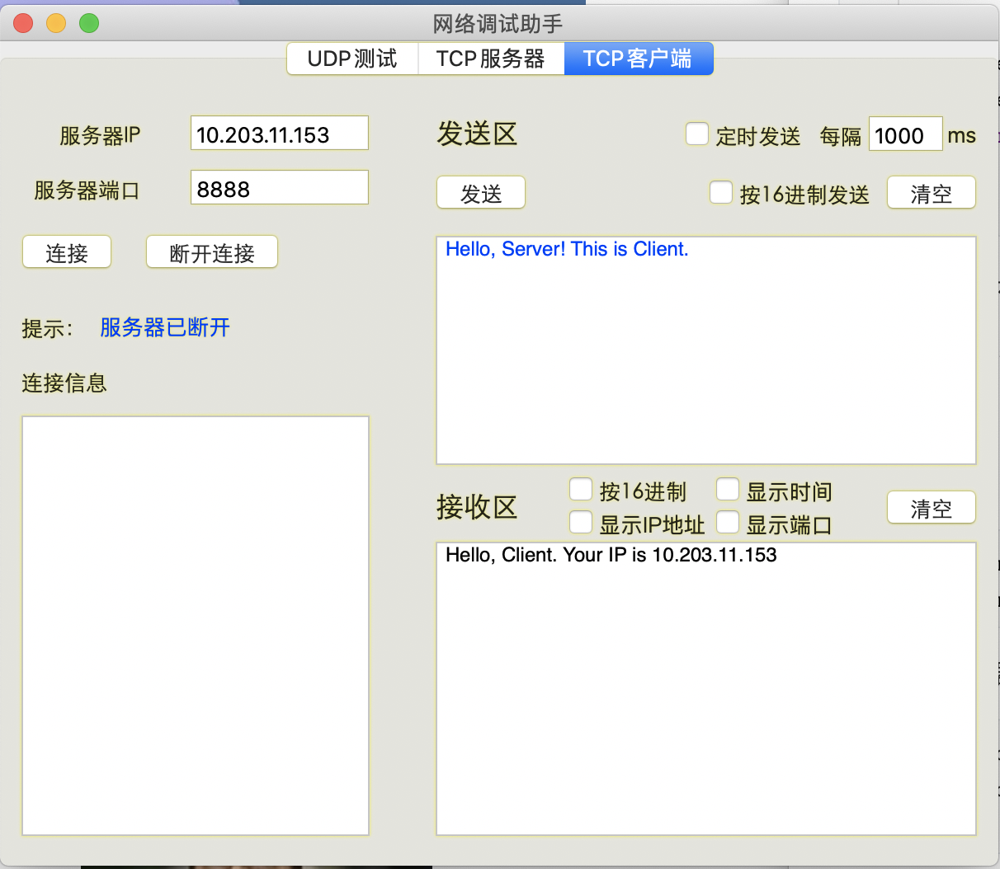
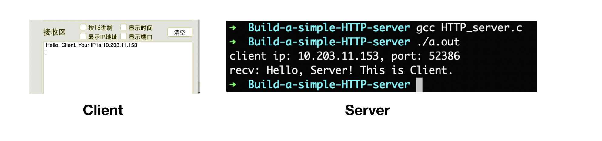
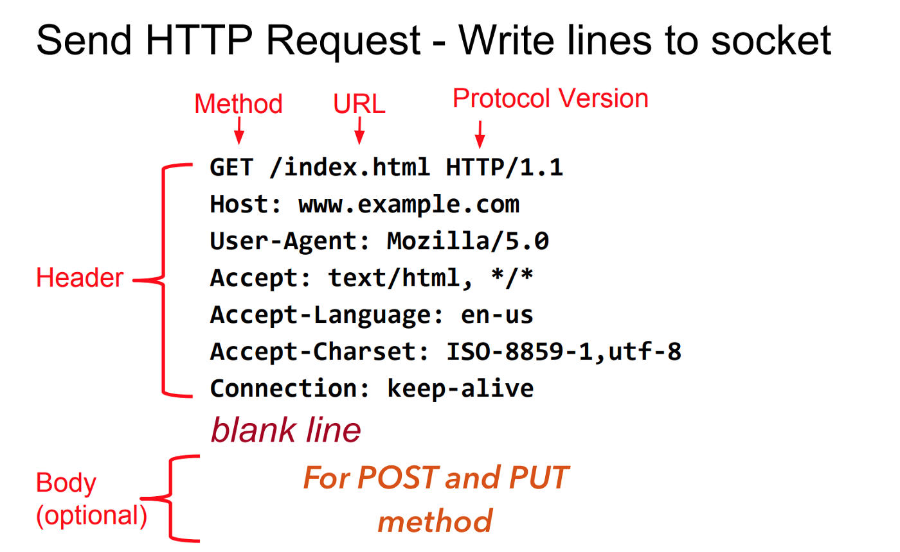
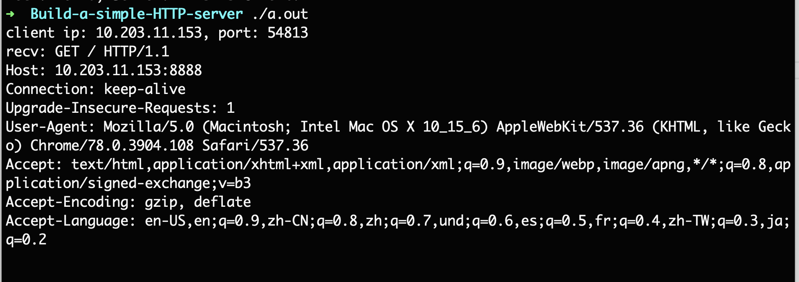
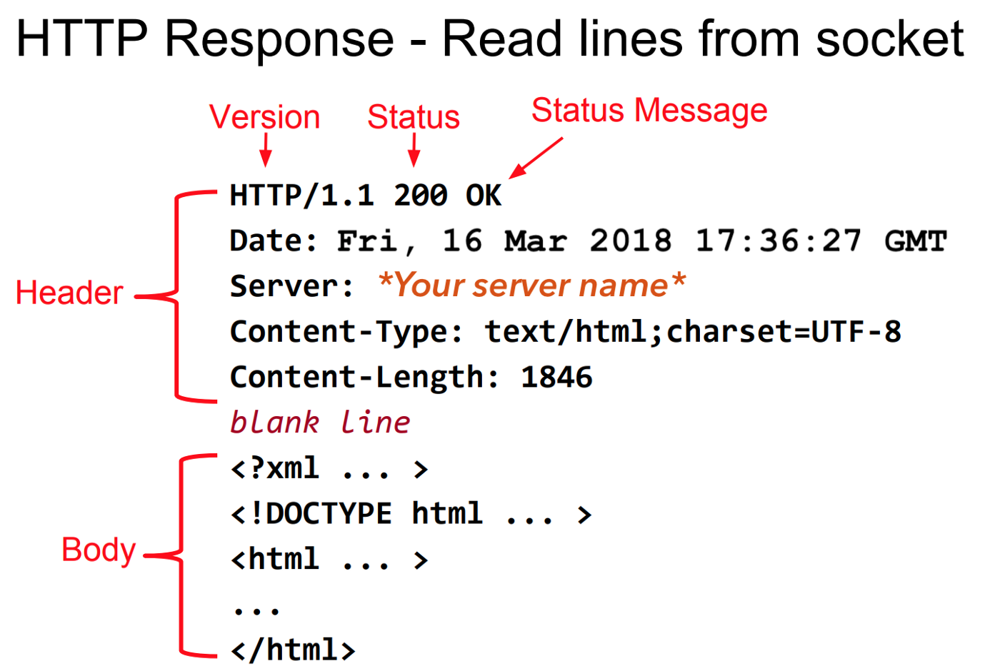
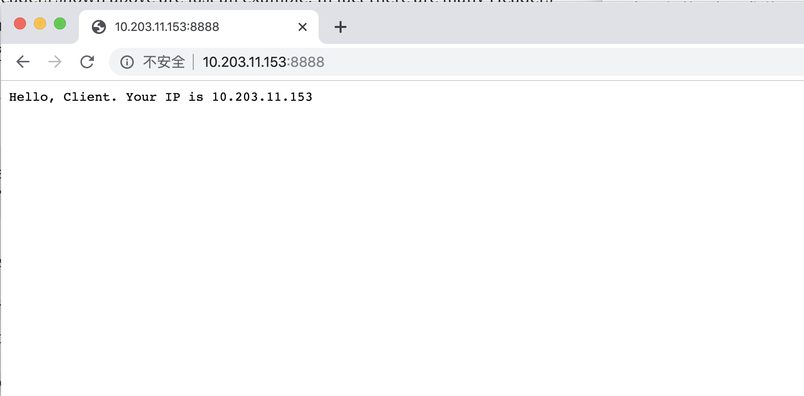

# HTTP Server⟹HTTPS Server: 

## 实验要求

这是网络课的一个小作业，具体要求如下：

**使用 C 语言实现一个 HTTP 服务器**

- 支持 HTTP Post/Get 方法，可以上传或下载文件
- 支持 HTTP 分块传输，支持 HTTP 持久连接和管道 

- 使用 openssl 库，支持 HTTPS
- 使用 libevent 支持多路并发
- 提交：代码和实验报告，实现越完整越好，测试越充分越好

## 前置知识

HTTP 无所不在，我们日常访问的网站都在 HTTP 服务器上运行。

现在更常见的是 HTTPS，从技术的角度上看，HTTPS 相比于 HTTP 来说具有更高的安全性。

如果构建 HTTP 服务器呢？这其实是非常简单的。在开始之前，需要先复习一下基本的网络知识。

### 1. OSI

首先，需要对 OSI 有一个基本的认识和了解。

OSI 全称为 Open Systems Interconnection。

> OSI 模型是一个概念模型，它对电信或计算系统的通信功能进行描述和标准化，而不考虑其基本的内部结构和技术。
>
> 它的目标是用标准协议实现不同通信系统的互操作性。该模型将通信系统划分为若干抽象层。该模型的最初版本定义了七个层。

[图片链接：OSI 七层模型](https://medium.com/@int0x33/day-51-understanding-the-osi-model-f22d5f3df756)


为了实现 HTTP 服务器，需要关心的是第四层——传输层（Transport Layer）。

### 2. 传输层（Transport Layer）

> 传输层主要负责确保数据可靠无误地从一个点传输到另一个点。例如，传输层确保数据以正确的顺序发送和接收。
>
> 传输层提供流控制和错误处理，并参与解决有关数据包的传输和接收问题。传输层协议的常见例子有传输控制协议（TCP）、用户数据报协议（UDP）和顺序包交换（SPX）。

在传输层，主要使用 TCP 来实现 HTTP 服务器。虽然也可以使用 UDP 实现，但是并没有很多人这么做。

> HTTP 通信通常通过 TCP/IP 连接进行。默认端口是 TCP 80，但也可以使用其他端口。这并不排除 HTTP 在 Internet 上或其他网络上的任何其他协议之上实现。
>
> HTTP 只预设了一个可靠的传输，任何提供这种保证的协议都可以使用，HTTP/1.1 请求和响应结构在有关协议的传输数据单元上的映射不在本规范的范围之内。
>
> ——RFC 2616

所有著名的 HTTP 服务器如 Apache Tomcat、NginX 等都是在 TCP 之上实现的。所以，使用基于 TCP 的 HTTP 服务器是一个正确的选择。

### 3. RFC

RFC 是什么？

RFC 全称为 Request for Comments。

Request for Comments 文件是 Steve Crocker 在 1969 年发明的，用于帮助记录 ARPANET 发展的非官方笔记。此后，RFCs 成为互联网规范、通信协议、程序和事件的正式文件。

> - 截至 2017 年 8 月，共有 8200 多个 RFC。
>
> - 万维网上 RFCs 的官方来源是 RFC Editor。
> - 一些标准化的RFC有。
>   - HTTP/1.1 → 最初是 RFC 2616，后来被 RFC 7230、RFC 7231、RFC 7232、RFC 7233、RFC 7234、RFC 7235 取代。所以，需要从 RFC 7230 到 RFC 7235 来实现 HTTP 的基本工作原理。
>   - HTTP/2 → RFC 7540 和 RFC 7541
>   - FTP → RFC959
> - 所以，如果要实现 HTTP 服务器，可以先阅读特定的 RFC，即 RFC 7230、RFC 7231、RFC 7232、RFC 7233、RFC 7234、RFC 7235。

### 4. TCP Socket

要实现 TCP，我们必须学习 TCP Socket 编程。

Socket 也叫做套接字。

> 套接字是大多数流行的操作系统提供的让程序访问网络的机制，它允许不同网络机器上的应用程序（无关的进程）之间收发消息。它允许在不同网络机器上的应用程序（不相关的进程）之间发送和接收消息。
>
> 套接字机制是为了独立于任何特定类型的网络而创建的。
>
> IP 是迄今为止最主要的网络，也是套接字最流行的用途。

Socket 编程的几个重要步骤

- 创建 Socket
- 绑定 Socket
- 服务器端等待连接
- 发送和接收消息
- 关闭 Socket



### Socket 编程

实现一个基于 TCP 通信的服务器。

#### 第 1 步：创建 Socket

`socket` 函数：`man socket`

```shell
NAME
     socket -- create an endpoint for communication

SYNOPSIS
     #include <sys/socket.h>

     int
     socket(int domain, int type, int protocol);
```

- `domain`：域名或地址族通信域，套接字应在其中创建。一些地址族有 AF_INET(IP)、AF_INET6(IPv6)、AF_UNIX（本地通道，类似管道）、AF_ISO（ISO 协议）和 AF_NS（Xerox 网络系统协议)。
- `type`：服务类型。这要根据应用所需的属性来选择。SOCK_STREAM（TCP 字节流）、SOCK_DGRAM（数据报服务）、SOCK_RAW（直接 IP 服务）。
- `protocol`：对于 TCP/IP 套接字，要指定 IP 地址族为 AF_INET 和虚拟电路服务（SOCK_STREAM）。由于虚拟电路服务只有一种形式，所以没有协议的变化，所以最后一个参数 protocol 为零。

示例：

```c
// 1. 创建 TCP Socket
int sfd = socket(AF_INET, SOCK_STREAM, 0);
```

#### 第 2 步：绑定 Socket

创建套接字后，需要给套接字绑定（`bind`）一个网络传输地址。

```c
int bind(int socket, const struct sockaddr *address, socklen_t address_len);
```

- 第一个参数 `socket` 是第 1 步所创建的 `sfd`。
- 第二个参数，`sockaddr ` 是一个结构体数据，对于 IP 网络，使用的是 `sockaddr_in`，它在头netinet/in.h 中定义
- 第三个参数一半传入`sizeof(svr_addr)`.

```c
// #include <netinet/in.h>  // sockaddr_in
/*
 * Socket address, internet style.
 */
struct sockaddr_in {
	__uint8_t       sin_len;
	sa_family_t     sin_family;
	in_port_t       sin_port;
	struct  in_addr sin_addr;
	char            sin_zero[8];
};


```

- `sin_family`：`socket` 使用的地址族。本次实现的 TCP ，它是 AF_INET。
- `sin_port`：端口号
- `sin_addr`：IP 地址，是一个 32 位的无符号整型

```c
struct in_addr {
	in_addr_t s_addr;
};

typedef __uint32_t      in_addr_t;      /* base type for internet address */
```

使用示例：（这里还涉及大端序和小端序的知识）

```c
// 2. bind() 绑定 IP 和端口号
struct sockaddr_in svr_addr;    //用于填写服务器的 IP 地址与端口号
svr_addr.sin_family = AF_INET;  //地址族
svr_addr.sin_port = htons(8888);  //端口号
svr_addr.sin_addr.s_addr = inet_addr("10.203.11.153"); // IP 地址
if (bind(sfd, (const struct sockaddr *)&svr_addr, sizeof(svr_addr)) < 0)
{
  perror("bind() error"); 
  exit(EXIT_FAILURE);
}

```

#### 第 3/4 步：服务器监听端口等待连接

建立监听队列，等待连接。

```c
#include <sys/socket.h> 
int listen(int socket, int backlog);
```

第二个参数 `backlog` 定义了在拒绝连接之前可以排队等待的最大连接数。

使用示例：

```c
// 3. 建立监听队列
if (listen(sfd, 10) < 0) {
  perror("listen()");  //输出出错原因
  exit(EXIT_FAILURE);  //退出应用程序
}

```

`accept` 系统调用会抓取待处理连接队列中的第一个连接请求，并为该连接创建一个新的套接字。

原来为监听而设置的套接字只用于接受连接，不用于交换数据。默认情况下，套接字操作是同步的，或者说是阻塞的，accept 会阻塞，直到队列上有连接存在。

```c
#include <sys/socket.h> 
int accept(int socket, struct sockaddr *restrict address, socklen_t *restrict address_len);
```

- 第一个参数 `socket` 是设置用于接受监听连接的 socket。
- 第二个参数 `address` 是与进行连接的客户端的地址一起归档的地址结构。这样我们就可以在需要的时候检查连接 socket 的地址和端口号。
- 第三个参数是填入地址结构的长度。

使用示例：

```c
// 4. 服务器接收客户端的连接请求
// 记录客户端的地址信息
struct sockaddr_in client_addr;
socklen_t len = sizeof(client_addr);
int cfd = accept(sfd, (struct sockaddr *)&client_addr, &len);
if (cfd == -1) {
  perror("accept() error!\n");
  exit(EXIT_FAILURE);
}

```

#### 第 5/6 步：接收/发送数据

现在终于把客户端（当从网页浏览器访问服务器的 IP 地址时）和服务器之间的套接字连接起来了。

```c
// 第4步连接成功，打印出客户端的 IP 和端口号
printf("client ip: %s, port: %d\n", inet_ntoa(client_addr.sin_addr), htons(client_addr.sin_port));

// 5. 接收客户端的数据 server <------ client
char recv_buffer[1024] = {'\0'};
ssize_t rbytes = recv(cfd, recv_buffer, sizeof(recv_buffer), 0);
if (rbytes == -1) {
  perror("recv() error!\n");
  exit(EXIT_FAILURE);
}
printf("recv: %s\n", recv_buffer);

// 6. 向客户端发送数据： server ------> client
char send_buffer[1024] = "Hello, Client. Your IP is ";
strcat(send_buffer, inet_ntoa(client_addr.sin_addr));
size_t sbytes = send(cfd, send_buffer, strlen(send_buffer)+1, 0);
if (sbytes == -1) {
  perror("send() error!\n");
  exit(EXIT_FAILURE);
}
```

#### 第 7 步：关闭 Socket

最后，别忘了关闭 Socket。

```c
// 关闭连接
close(cfd);
```

#### TCP Socket 服务器端完整代码

```c
// HTTP_server.c
#include <stdio.h>
#include <stdlib.h>       // exit
#include <arpa/inet.h>    // inet_ntoa
#include <netinet/in.h>   // sockaddr_in
#include <string.h>       // strlen
#include <unistd.h>       // close function

int main() {
  // 1. 创建 Socket 套接字
  int sfd = socket(AF_INET, SOCK_STREAM, 0);
  if (sfd == -1) {
    perror("socket() error!\n");
    exit(EXIT_FAILURE);
  }

  // 2. bind() 绑定 IP 和端口号
  struct sockaddr_in svr_addr;  //用于填写服务器的ip地址与端口号
  svr_addr.sin_family = AF_INET;  //地址族
  svr_addr.sin_port = htons(8888);  //端口号
  svr_addr.sin_addr.s_addr = inet_addr("10.203.11.153");  //ip地址
  if (bind(sfd, (const struct sockaddr *)&svr_addr, sizeof(svr_addr)) < 0) {
    perror("bind()");
    exit(EXIT_FAILURE);
  }
  
  // 3. 建立监听队列
  if (listen(sfd, 10) < 0) {
    perror("listen()");
    exit(EXIT_FAILURE);
  }

  // 4. 服务器接收客户端的连接请求
  // 记录客户端的地址信息
  struct sockaddr_in client_addr;
  socklen_t len = sizeof(client_addr);
  int cfd = accept(sfd, (struct sockaddr *)&client_addr, &len);
  if (cfd == -1) {
    perror("accept() error!\n");
    exit(EXIT_FAILURE);
  }

  // 连接成功，打印出客户端的 IP 和端口号
  printf("client ip: %s, port: %d\n", inet_ntoa(client_addr.sin_addr), htons(client_addr.sin_port));

  // 5. 接收客户端的数据 server <------ client
  char recv_buffer[1024] = {'\0'};
  ssize_t rbytes = recv(cfd, recv_buffer, sizeof(recv_buffer), 0);
  if (rbytes == -1) {
    perror("recv() error!\n");
    exit(EXIT_FAILURE);
  }
  printf("recv: %s\n", recv_buffer);

  // 6. 向客户端发送数据： server ------> client
  char send_buffer[1024] = "Hello, Client. Your IP is ";
  strcat(send_buffer, inet_ntoa(client_addr.sin_addr));
  size_t sbytes = send(cfd, send_buffer, strlen(send_buffer)+1, 0);
  if (sbytes == -1) {
    perror("send() error!\n");
    exit(EXIT_FAILURE);
  }

  // 7. 关闭连接
  close(cfd);
  close(sfd);
  return 0;
}

```

客户端的写法是：`socket() - connect() - send() - recv() - close()`。

这里我偷懒了，直接使用一个一个简单的「网络调试助手」来替代客户端。

#### 测试结果

0. 服务器 IP 和监听的端口号

```c
svr_addr.sin_port = htons(8888);  //端口号
svr_addr.sin_addr.s_addr = inet_addr("10.203.11.153");  //IP 地址
```

1. 启动服务器（配置 IP 地址为自己电脑的）

```shell
➜  Build-a-simple-HTTP-server gcc HTTP_server.c
➜  Build-a-simple-HTTP-server ./a.out

```

2. 客户端连接服务器，发送 “Hello, Server! This is Client.”




3. 观察结果：服务器端接收到了客户端发送的消息；客户端接收区接收到了服务器的消息。



#### 总结

程序运行能够在应用程序之间进行通信。这意味着以上实现的 TCP 实现工作正常。

至此已经完成了最基本的编码部分。

现在继续进行 HTTP 服务器的实现。

### HTTP 服务器

首先看看服务器和 Web 浏览器之间的交互。


再把 HTTP 部分放，进行更加细致的了解。


- HTTP Client（即 Web 浏览器）向 HTTP Server 发送 HTTP 请求。
- 服务器处理收到的请求，并向 HTTP Client 发送 HTTP 响应。

现在，细致的客户端-服务器，以及它们发送和接收的内容。

### HTTP Client

HTTP 客户端（Web浏览器）是请求的发起者。

向浏览器中输入一个连接：

```
http://www.example.com
```

为了显示页面，浏览器从 Web 服务器 80 端口获取文件 index.html（默认网页）。发出的请求如下：




现在，`HTTP_server.c ` 先不做任何修改，运行程序，启动服务器。直接在浏览器中输入 `l0.203.11.153:8888` ，看看会发生什么。


该网页无法正常运行。

在看看服务器端输出了什么：



非常有意思，这值得好好看一看。第一行：

```
client ip: 10.203.11.153, port: 54813
```

这是我们的服务器端自己 `printf` 的，第二行的 "recv:" 也是，不算。所有服务器端接收到的内容应该是：

```shell
GET / HTTP/1.1
Host: 10.203.11.153:8888
Connection: keep-alive
Upgrade-Insecure-Requests: 1
User-Agent: Mozilla/5.0 (Macintosh; Intel Mac OS X 10_15_6) AppleWebKit/537.36 (KHTML, like Gecko) Chrome/78.0.3904.108 Safari/537.36
Accept: text/html,application/xhtml+xml,application/xml;q=0.9,image/webp,image/apng,*/*;q=0.8,application/signed-exchange;v=b3
Accept-Encoding: gzip, deflate
Accept-Language: en-US,en;q=0.9,zh-CN;q=0.8,zh;q=0.7,und;q=0.6,es;q=0.5,fr;q=0.4,zh-TW;q=0.3,ja;q=0.2

```

按理说服务器接收到客户端的连接后，应该会向客户端发送 "Hello, Clinet, ...."，但是网页却无法正常运行。

```c
// 6. 向客户端发送数据： server ------> client
char send_buffer[1024] = "Hello, Client. Your IP is ";
strcat(send_buffer, inet_ntoa(client_addr.sin_addr));
size_t sbytes = send(cfd, send_buffer, strlen(send_buffer)+1, 0);
```

要解决这个问题，就要了解一下 HTTP 的知识了。

### HTTP Methods

GET 是 HTTP 默认使用的方法，如上面终端中，Server 接收到的信息，第一行就是一个 GET。

常用的 HTTP Methods：

- GET：获取一个 URL。
- HEAD：获取一个 URL 的信息。
- PUT：存储到一个 URL。
- POST：将表单数据发送至一个 URL 并获得响应。
- DELETE：删除一个 URL GET 和 POST（表单）是常用的。

### HTTP Server

客户端发送了一些头信息（GET ...），希望服务器做出响应的响应。

但我们自己实现的 HTTP_server 只发送了一个问候信息，这缺少一些必要的头信息，这就是问题的所在。

```c
// 6. 向客户端发送数据： server ------> client
char send_buffer[1024] = "Hello, Client. Your IP is ";
strcat(send_buffer, inet_ntoa(client_addr.sin_addr));
size_t sbytes = send(cfd, send_buffer, strlen(send_buffer)+1, 0);
```

浏览器希望得到的是一个与请求相同格式的数据。

HTTP 不过是遵循 RFC 文件中指定的一些规则，它的实现与语言无关。

如下是网络浏览器所期待的 HTTP 响应格式的例子。显示的头信息只是一个例子。HTTP 中还有很多头信息存在，具体可以看 HTTP RFCs → RFC 7230, RFC 7231, RFC 7232, RFC 7233, RFC 7234, RFC 7235。



如果想从服务器发送 Hello：

- 首先需要构造 Header，
- 然后插入一个空行
- 之后我们就可以发送消息/数据。


  现在，开始构造一个最小的 HTTP Header 来使 HTTP 服务器正常工作。

```c
char send_buffer[1024] = "HTTP/1.1 200 OK\nContent-Type: text/plain\nContent-Length: 39\n\nHello, Client. Your IP is ";
strcat(send_buffer, inet_ntoa(client_addr.sin_addr));
```

如上的 3 个头信息是最低要求。

- HTTP/1.1 200 OK ：使用的 HTTP 版本号、状态码和状态信息。
- Content-Type: text/plain ：服务器发送的是纯文本。Content-Type 还有其他的格式。
- Content-Length: 39 ：服务器向客户端发送 39 字节。网络浏览器只读取我们在这里提到的数量。
- 最后一部分是 Body。在这里发送自定义的数据。
  - 首先，需要在 Body 中计算出发送的字节数，与 Content-Length 相同。

`"Hello, Client. Your IP is 10.203.11.153" `的长度刚好等于 39 字节。

客户端将会接收到：

```
HTTP/1.1 200 OK
Content-Type: text/plain
Content-Length: 39

Hello, Client. Your IP is 10.203.11.153
```

浏览器访问 IP:8888，可以看到工作正常。




> 关于状态码和状态信息：
>
> - 状态码是服务器根据客户向服务器提出的请求而发出的。它包括 IETF Request for Comments (RFCs)、其他规范中的代码，以及超文本传输协议（HTTP）的一些常见应用中使用的附加代码。
>
> - 状态码的第一个数字指定了五种标准响应类别中的一种。所显示的消息短语是典型的，但可以提供任何人类可读的替代方案。除非另有说明，否则状态码是 HTTP/1.1 标准（RFC 7231）的一部分。
>
> - 所以，如果服务器找不到客户端要求的文件，那么就发送适当的状态码。
>
> - 如果客户端没有权限查看文件，那么就发送相应的状态码。
>
> - 常见的[状态码](https://httpstatuses.com/)：
>
>   - [200 OK](https://httpstatuses.com/200)
>
>   - [403 Forbidden](https://httpstatuses.com/403)
>   - [404 Not Found](https://httpstatuses.com/404)
>   - [502 Bad Gateway](https://httpstatuses.com/502)
>
> - Informational responses (`100`–`199`),
> - Successful responses (`200`–`299`),
> - Redirects (`300`–`399`),
> - Client errors (`400`–`499`),
> - and Server errors (`500`–`599`).

现在，HTTP 已经正常工作了。虽然它非常非常的简陋。

### 客户端请求网页（理论）

到现在为止，已经实现一个能向浏览器客户端发送一个字符串的 HTTP 服务器。

现在，来看看如何发送一个文件、图片等信息。假设在地址栏中输入：

```
IP:8888/info.html
```

在服务器终端，将会得到如下请求。

```shell
GET /info.html HTTP/1.1
Host: 10.203.11.153:8888
Connection: keep-alive
Upgrade-Insecure-Requests: 1
User-Agent: Mozilla/5.0 (Macintosh; Intel Mac OS X 10_15_6) AppleWebKit/537.36 (KHTML, like Gecko) Chrome/78.0.3904.108 Safari/537.36
Accept: text/html,application/xhtml+xml,application/xml;q=0.9,image/webp,image/apng,*/*;q=0.8,application/signed-exchange;v=b3
Accept-Encoding: gzip, deflate
Accept-Language: en-US,en;q=0.9,zh-CN;q=0.8,zh;q=0.7,und;q=0.6,es;q=0.5,fr;q=0.4,zh-TW;q=0.3,ja;q=0.2

```

看一看请求头中的第一行。

```
GET /info.html HTTP/1.1
```

所以，服务器只需要在当前目录下搜索 info.html 文件。

当然还有很多情况需要服务器考虑，例如：

- 文件（网页）是存在的
- 文件（网页）不存在
- 客户端没有访问文件（网页）的权限。
- .....


服务器端需要做的是：

- 选择合适的状态码；
- 如果文件是存在的，并且客户端有权限访问它，选择合适的 Content-Type；
- 然后打开文件，将数据读到一个变量中。统计从文件中读取的字节数；
- 设置 Content-Length；
- 构造 Response Header；
- 在 Response Header 的末尾添加一个新行，并将从文件中读取的数据追加到其中；
- 发送给客户端。

就是这样！一个从 0 开始的 HTTP 服务器已经编写完成了!

不过，发现了一个残酷的事实：作业要求实现的功能好像一个都没有实现。


进入下一部分 [➔]()。

## 参考链接

- [HTTP Server: Everything you need to know to Build a simple HTTP server from scratch](https://medium.com/from-the-scratch/http-server-what-do-you-need-to-know-to-build-a-simple-http-server-from-scratch-d1ef8945e4fa)
- [HTTP Status Codes](<https://httpstatuses.com/>)