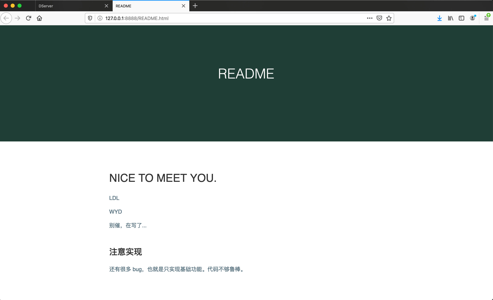

# HTTP 服务器的一些截图记录

## HTML 页面

服务器的 HTML 页面有两个分别是 `index.html` 和 `README.html`。这个 css 风格是我最喜欢的，因此也就应用在了这个小项目上。


`README.html` 是我们小组的成员介绍，以及服务器的一些使用说明。




 ## GET/POST 文件下载和上传功能

第一个功能：实现 `GET/POST` 方法，支持文件的上传和下载。

```c
// GET Method
if (!strcmp(method, "GET")) {
  handle_request(cfd, uri);
}

// POST Method
else if (!strcmp(method, "POST")) {
  handle_post(cfd, buffer);
}
```

GET 方法用于请求资源和文件下载等，如下是一个简单的 GET 请求。

```shell
GET /css/style.css HTTP/1.1
Host: 127.0.0.1:8888
User-Agent: Mozilla/5.0 (Macintosh; Intel Mac OS X 10.15; rv:71.0) Gecko/20100101 Firefox/71.0
Accept: text/css,*/*;q=0.1
Accept-Language: zh-CN,zh;q=0.8,zh-TW;q=0.7,zh-HK;q=0.5,en-US;q=0.3,en;q=0.2
Accept-Encoding: gzip, deflate
Connection: keep-alive
Referer: http://127.0.0.1:8888/
Cache-Control: max-age=0
```

图片传输失败。


当上传大文件时，服务器段因为代码写得不够好，导致数据接收不完整。上传顾城的一首诗：


上传完成：


服务器端查看数据（书籍还未进行处理，还保留包中的一些内容）：


上传一个较大的文件，《傲慢与偏见》，可能是服务器端缓存区过小等原因，发生数据缺失，文件上传不完整。

出现报错。服务器端代码还需要再完善。


查看一下服务器端所保存下来的数据，是不完整的。


## 实现分块传输、持久连接和管道

简单来说：

- 分块传输：`Chunked Transfer Coding`

- > “分块传输编码会将实体主体分成多个部分（块）。每一块都会用十六进制来标记块的大小，而实体主体的最后一块会使用“0(CR+LF)”来标记。
  >
  > 使用分块传输编码的实体主体会由接收的客户端负责解码，恢复到编码前的实体主体。
  >
  > HTTP/1.1 中存在一种称为传输编码（Transfer Coding）的机制，它可以在通信时按某种编码方式传输，但只定义作用于分块传输编码中。”
  >
  > 摘录来自
  > 图解 HTTP
  > 上野宣、于均良

- 持久连接：`keep-alive`，只要任意一端没有明确提出断开连接，则保持 TCP 连接状态。

- 管道：客户端不用等待服务器响应，就可以直接发送下一个请求，即并行发送多个请求。

- > “持久连接使得多数请求以管线化（pipelining）方式发送成为可能。从前发送请求后需等待并收到响应，才能发送下一个请求。管线化技术出现后，不用等待响应亦可直接发送下一个请求。
  >
  > 这样就能够做到同时并行发送多个请求，而不需要一个接一个地等待响应了。”
  >
  > 摘录来自
  > 图解 HTTP
  > 上野宣、于均良
  > 此材料受版权保护。


## HTTPS

“HTTP + 加密 + 认证 + 完整性保护 == HTTPS.”

需要安装 OpenSSL。

```shell
brew install openssl
```

```shell
➜  ~ which openssl
/usr/local/opt/openssl@1.1/bin/openssl
```

编译的命令，注意参数。

```shell
gcc -g server_ssl.c -o server_ssl -I//usr/local/opt/openssl@1.1/include -L//usr/local/opt/openssl@1.1/lib -lssl -lcrypto
```


## libevent

libevent 在我的电脑上位于：

```shell
/usr/local/Cellar/libevent/2.1.12
```


```shell
# 编译时加上参数
-levent -lpthread
```

```c
#include <event2/event.h>
#include <event.h>
#include <pthread.h>
```

## 代码

```c
// DServer
// GET/POST 文件上传和文件下载
#include <stdio.h>
#include <stdlib.h>       // exit
#include <arpa/inet.h>    // inet_ntoa
#include <netinet/in.h>   // sockaddr_in
#include <string.h>       // strlen
#include <unistd.h>       // close function
#include <sys/stat.h>
#include <sys/errno.h>
#include <sys/fcntl.h>
#include <netinet/tcp.h>

#include "config.h"

int start_server();
void handle_request(int cfd, char uri[]);
void construct_header(char *header, int status, char *type);
void get_filetype(char *filename, char *filetype);
const char *get_status_by_code(int status);
void handle_post(int cfd, char buffer[]);
void request_image(int cfd, char uri[]);

int main() {

  int sfd = start_server();

  while (1) {
    // 4. 服务器接收客户端的连接请求
    struct sockaddr_in client_addr;
    socklen_t len = sizeof(client_addr);
    int cfd = accept(sfd, (struct sockaddr *)&client_addr, &len);
    if (cfd == -1) {
      perror("accept() error!\n");
      exit(EXIT_FAILURE);
    }
    // DEBUG: 连接成功，打印出客户端的 IP 和端口号
    // printf("client ip: %s, port: %d\n", inet_ntoa(client_addr.sin_addr), htons(client_addr.sin_port));
    
    char buffer[MAX_SIZE] = {'\0'};
    ssize_t rbytes = recv(cfd, buffer, sizeof(buffer), 0);
    if (rbytes == -1) {
      perror("recv() error!\n");
      exit(EXIT_FAILURE);
    }
    printf("%s\n", buffer);  // 请求内容

    char method[MIN_SIZE] = {'\0'};
    char uri[MIDDLE_SIZE] = {'\0'};
    sscanf(buffer, "%s %s", method, uri);

    // GET Method
    if (!strcmp(method, "GET")) {
      handle_request(cfd, uri);
    }

    // POST Method
    else if (!strcmp(method, "POST")) {
      handle_post(cfd, buffer);
    }

    else {
      printf("Method Not implemented!\n");
    }
    close(cfd);
  }
  close(sfd);
  return 0;
}

```

放一张工程的截图。


