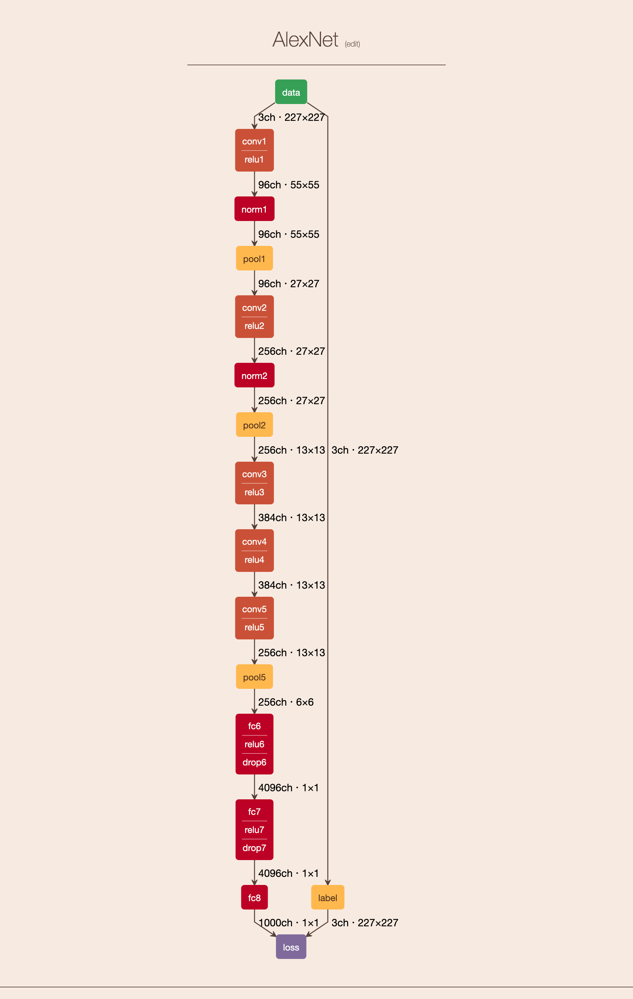
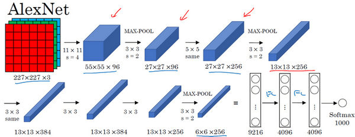
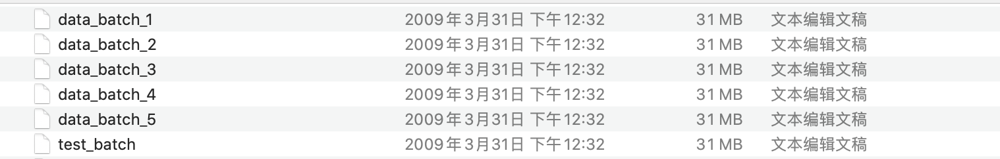

# 复现 AlexNet

> 2020 年 11 月 15 日（周日）

## AlexNet

图片来源：[https://dgschwend.github.io/netscope/#/preset/alexnet](https://dgschwend.github.io/netscope/#/preset/alexnet)

画出了 LRN 和 Dropout。



吴恩达《深度学习》课程，更加简洁的图。




## CIFAR-10 数据集

ImageNet 有点大，所以就先试了试 CIFAR-10 数据集。

CIFAR-10 dataset (Canadian Institute For Advanced Research) ：[https://www.cs.toronto.edu/~kriz/cifar.html](https://www.cs.toronto.edu/~kriz/cifar.html)


> CIFAR-10 和 CIFAR-100 是一个包含 8000 万张 $$32\times32\times3$$ 图片的数据集，由 Alex Krizhevsky、Vinod Nair 和 Geoffrey Hinton 收集。

**CIFAR-10** 数据集包含 10 个类别，总共 60000 张 $$32\times32$$ 彩色图片。

每个类别 6000 张图片。

- 50000 张训练图片（train set）
- 10000 张测试图片（test set）。

数据集分为 5 个 Train Batch 和 1 个Test Batch。

这里的 Batch 不是随机梯度下降里面中的 `batch_size`。

> 在代码实现中，batch_size 取 100。

在我的电脑上有 186MB



测试集有 10000 张图片（10 个类别，每类**随机**取 1000 张）。

训练集只能保证每个 Batch=10000，不保证每类都严格的取 1000 张。所以，对于某些 Batch 来说，来自一个类的图片可能比另一个类更多。

## 实现

**AlexNet 论文**：数据集图片尺寸是 $$256\times256\times3$$，采用数据增强以缓解过拟合，最后输入 AlexNet 的尺寸为 $$224\times224\times3$$。

**Page with Code/Andrew Ng：**普遍的复现代码采用的是 $$227\times227\times3$$。

而 CIFAR-10 数据集的尺寸是 $$32\times32\times3$$。

所以有两种实现：

- 将 $$32\times32\times3$$  扩大为 $$227\times227\times3$$
- 更改网络结构（那就不是 AlexNet 了），但是和 AlexNet 有相同的层（5 个 CONV 和 3 个 FC）

### 1. 更改网络结构（已经不是 AlexNet 了）


```python
class AlexNet(nn.Module):
    def __init__(self, num_classes=NUM_CLASSES):
        super(AlexNet, self).__init__()
        self.features = nn.Sequential(
            nn.Conv2d(3, 64, kernel_size=3, stride=2, padding=1),
            nn.ReLU(inplace=True),
            nn.MaxPool2d(kernel_size=2),
            nn.Conv2d(64, 192, kernel_size=3, padding=1),
            nn.ReLU(inplace=True),
            nn.MaxPool2d(kernel_size=2),
            nn.Conv2d(192, 384, kernel_size=3, padding=1),
            nn.ReLU(inplace=True),
            nn.Conv2d(384, 256, kernel_size=3, padding=1),
            nn.ReLU(inplace=True),
            nn.Conv2d(256, 256, kernel_size=3, padding=1),
            nn.ReLU(inplace=True),
            nn.MaxPool2d(kernel_size=2),
        )
        self.classifier = nn.Sequential(
            nn.Dropout(),
            nn.Linear(256 * 2 * 2, 4096),
            nn.ReLU(inplace=True),
            nn.Dropout(),
            nn.Linear(4096, 4096),
            nn.ReLU(inplace=True),
            nn.Linear(4096, num_classes),
        )

    def forward(self, x):
        x = self.features(x)
        x = x.view(x.size(0), 256 * 2 * 2)
        x = self.classifier(x)
        return x
```


### 2. RESIZE $32\times32\times3$ ➜ $227\times227\times3$


