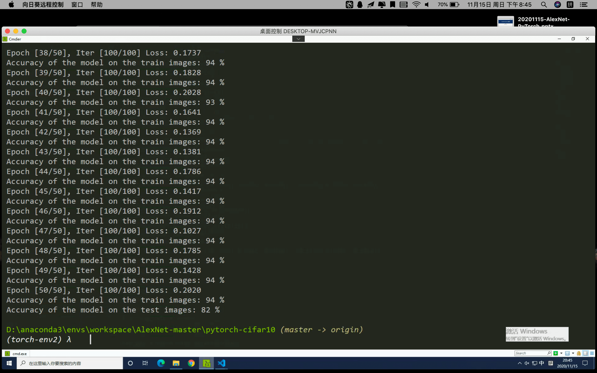
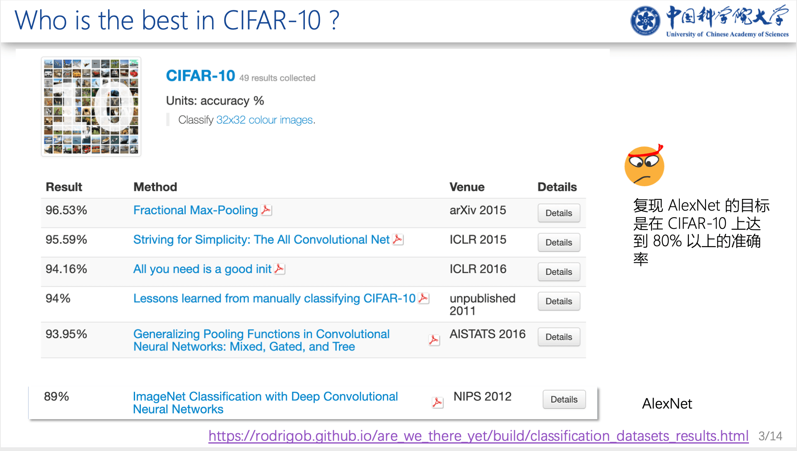

# AlexNet

> 实现 82% 的精确率.

我复现的第一个网络。



```python
import torch
import torch.nn as nn
from torch.autograd import Variable
import torch.nn.functional as F
import torchvision
import torchvision.transforms as transforms
from torch.utils.data import DataLoader

# 数据集最小的 shape 是 63*63。
# 从上最后一个池化层输出最小 1*1 往上推导
class AlexNet(nn.Module):

    def __init__(self,in_channel, num_classes: int = 1000) -> None:
        super(AlexNet, self).__init__()
        self.features = nn.Sequential(
            nn.Conv2d(3, 64, kernel_size=11, stride=4, padding=2),
            nn.ReLU(inplace=True),
            nn.LocalResponseNorm(size=5, alpha=0.0001, beta=0.75, k=2),
            nn.MaxPool2d(kernel_size=3, stride=2),
            nn.Conv2d(64, 192, kernel_size=5, padding=2),
            nn.ReLU(inplace=True),
            nn.LocalResponseNorm(size=5, alpha=0.0001, beta=0.75, k=2),
            nn.MaxPool2d(kernel_size=3, stride=2),
            nn.Conv2d(192, 384, kernel_size=3, padding=1),
            nn.ReLU(inplace=True),
            nn.Conv2d(384, 256, kernel_size=3, padding=1),
            nn.ReLU(inplace=True),
            nn.Conv2d(256, 256, kernel_size=3, padding=1),
            nn.ReLU(inplace=True),
            nn.MaxPool2d(kernel_size=3, stride=2),
        )
        # 自适应池化，对于任意的特征图 x*x 输入，输出都是 6*6
        # 所以对于不同shape的数据集，第一层的全连接层都不用再修改了
        self.avgpool = nn.AdaptiveAvgPool2d((6, 6))
        self.classifier = nn.Sequential(
            nn.Dropout(),
            nn.Linear(256 * 6 * 6, 4096),
            nn.ReLU(inplace=True),
            nn.Dropout(),
            nn.Linear(4096, 4096),
            nn.ReLU(inplace=True),
            nn.Linear(4096, num_classes),
        )

    def forward(self, x: torch.Tensor) -> torch.Tensor:
        x = self.features(x)
        x = self.avgpool(x)
        x = torch.flatten(x, 1)
        x = self.classifier(x)
        return x

alex = AlexNet(3, 10) # in_channel, class_num
print(alex)

# 图像预处理，因为 AlexNet 是使用 227 * 227 大小的图片，但是 CIFAR10 只有 32 * 32
# 所以这里， 图像放大到 96*96
# 227*227 能缓解过拟合
transform = transforms.Compose([
    transforms.Resize(227),
    transforms.ToTensor(),
  	# Normalize 这8个值是针对 CIFAR-10 这个数据集算出来的，对于其他数据集不适用
    transforms.Normalize((0.4914, 0.4822, 0.4465), (0.2470, 0.2435, 0.2616))
])

# 师兄提问：为什么 Normalize() 要跟在 ToTensor() 之后？放到前面可以吗？
train_transform = transforms.Compose([
    #transforms.RandomCrop(96),
    transforms.RandomHorizontalFlip(),
    transforms.Resize(227), # 32*32 -> 227*227 缓解过拟合
    transforms.ToTensor(),
    transforms.Normalize((0.4914, 0.4822, 0.4465), (0.2470, 0.2435, 0.2616))
])


# 超参数
DOWNLOAD = True
BATCH_SIZE = 256
EPOCH = 50
learning_rate = 0.001

# 是否使用GPU
use_gpu = torch.cuda.is_available()

# CIFAR10 dataset
train_dataset = torchvision.datasets.CIFAR10(root='./data/', train=True, transform=train_transform, download=DOWNLOAD)

test_dataset = torchvision.datasets.CIFAR10(root='./data/', train=False, transform=transform)

# Data Loader
train_loader = DataLoader(dataset=train_dataset,
                            batch_size=BATCH_SIZE,
                            shuffle=True)

test_loader = DataLoader(dataset=test_dataset,
                            batch_size=BATCH_SIZE,
                            shuffle=False)

# 定义模型
alex = AlexNet(3, 10)
if use_gpu:
    alex = alex.cuda()

# loss and optimizer
loss_fn = nn.CrossEntropyLoss()
optimizer = torch.optim.Adam(alex.parameters(), lr=learning_rate)

# Training
alex.train()

for epoch in range(EPOCH):
    total = 0
    correct = 0
    for i, (images, labels) in enumerate(train_loader):
        images = Variable(images)
        labels = Variable(labels)

        if use_gpu:
            images = images.cuda()
            labels = labels.cuda()
        # forward + backward + optimize
        optimizer.zero_grad()
        y_pred = alex(images)

        loss = loss_fn(y_pred, labels)

        loss.backward()

        optimizer.step()

        if (i + 1) % 100 == 0:
            print("Epoch [%d/%d], Iter [%d/%d] Loss: %.4f" % (epoch + 1, EPOCH, i + 1, 100, loss.data))

        # 计算训练精确度
        _, predicted = torch.max(y_pred.data, 1)
        total += labels.size(0)
        correct += (predicted == labels.data).sum()
    print('Accuracy of the model on the train images: %d %%' % (100 * correct / total))

    # Decaying Learning Rate
    if (epoch+1) % 5 == 0:
        learning_rate /= 2
        optimizer = torch.optim.Adam(alex.parameters(), lr=learning_rate)


# Test
alex.eval()

correct = 0
total = 0

for images, labels in test_loader:
    images = Variable(images)
    labels = Variable(labels)
    if use_gpu:
        images = images.cuda()
        labels = labels.cuda()

    y_pred = alex(images)
    _, predicted = torch.max(y_pred.data, 1)
    total += labels.size(0)
    temp = (predicted == labels.data).sum()
    correct += temp

print('Accuracy of the model on the test images: %d %%' % (100 * correct / total))
```

## 我准备的 PPT

放一页比较喜欢的。




