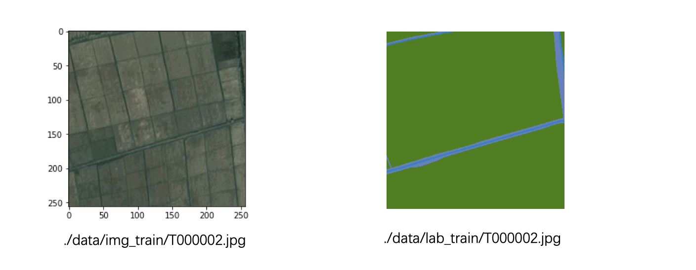
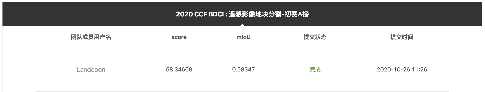
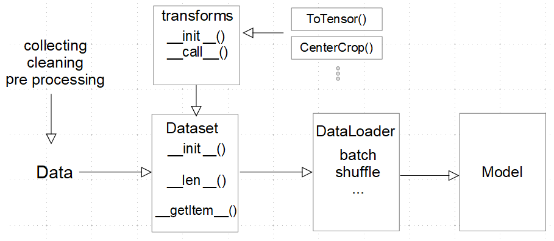
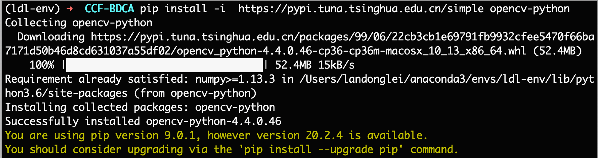

# CCF 遥感题笔记

## 数据集 Dataset

### 文件夹结构

```shell
​```
dada/
    img_testA/
        A145981.jpg
        A145982.jpg
        A145983.jpg
        A145984.jpg
        A145985.jpg
        ...

    img_train/
        T000000.jpg
        T000001.jpg
        T000002.jpg
        T000003.jpg
        T000004.jpg
        T000005.jpg
        T000006.jpg
        T000007.jpg
        ...
        
    lab_train/
        T000000.jpg
        T000001.jpg
        T000002.jpg
        T000003.jpg
        T000004.jpg
        T000005.jpg
        T000006.jpg
        T000007.jpg
        ...
​```
```

### 生成 txt

```shell
find img_testA -type f | sort > testA_list.txt
echo "Create text_list.txt"
 

find img_train -type f | sort > train.ccf.tmp
find lab_train -type f | sort > train.lab.ccf.tmp
paste -d " " train.ccf.tmp train.lab.ccf.tmp > all.ccf.tmp

awk '{if (NR % 50 != 0) print $0}' all.ccf.tmp > train_list.txt
awk '{if (NR % 50 == 0) print $0}' all.ccf.tmp > val_list.txt

rm *.ccf.tmp
echo "Create train_list.txt and val_list.txt."
```

此时 `data/` 文件夹下的内容为：
```shell
➜  data ls
img_testA      img_train      lab_train      testA_list.txt train_list.txt val_list.txt
```

`train_list.txt` `val_list.txt` 中的内容示例为：

```
img_train/T145972.jpg lab_train/T145972.png
img_train/T145973.jpg lab_train/T145973.png
img_train/T145974.jpg lab_train/T145974.png
```

图片 标签

便签共有 8 个类别：
```
1	耕地
2	林地
3	水体
4	道路
5	草地
6	其他
255	未标注区域
```

```python
palette = {
    # bgr
    "[64, 128, 0]": 2, # forest
    "[192, 128, 96]": 3, # water
    "[0, 128, 64]": 1, # filed
    "[64, 64, 96]": 6, # else
    "[192, 128, 32]": 4, # road
    "[0, 128, 96]": 0, # building
    "[64, 128, 64]": 5, # grass
    "[255, 255, 255]": 255,
}
```



## baseline

跑完官方的 baseline，结果保存在PaddleSeg/visual 下，下载此文件夹，安装官方要求进行命名，提交后即可获取 baseline 的成绩。



## Dataset/Dataloader/transform

图片来源：[https://subscription.packtpub.com/book/big_data_and_business_intelligence/9781789534092/1/ch01lvl1sec13/loading-data](https://subscription.packtpub.com/book/big_data_and_business_intelligence/9781789534092/1/ch01lvl1sec13/loading-data)



### import cv2

安装 OpenCV

```
pip install -i  https://pypi.tuna.tsinghua.edu.cn/simple opencv-python
```




## Dataset

如何编写自己的 `Dataset`，然后使用 `Dataloader` ？

