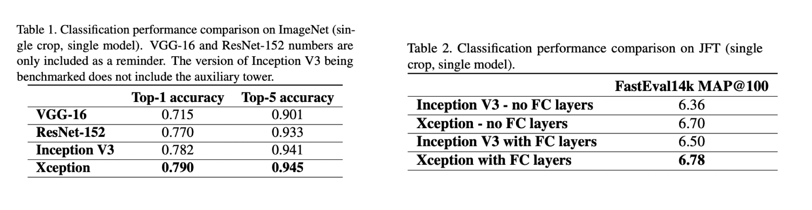

# 论文题目：Xception: Deep Learning with Depthwise Separable Convolutions

✅ 论文地址：[https://arxiv.org/pdf/1610.02357.pdf](https://arxiv.org/pdf/1610.02357.pdf)

✅ 发表时间：2017 年

对 Inception 模块进行了解释，它是常规卷积和可深度分离卷积（depthwise separable
convolution）之间的一个步骤。

Xception 受到已被已被深度可分离卷积取代的 Inception 模块的启发。

Xception 的参数量与 Inception V3 相同，但是在 ImageNet 数据集上的表现要优于后者。

## 1. Introduction

卷积神经网络的历史起源于 LeNet，它使用卷积堆叠和用于空间子采样的最大池化操作来进行特征的提取。AlexNet 继续进行优化，网络深度加深，网络可以在每个空间尺度上学习更丰富的特征。然后是 2014 年的 VGG 结构。

Szegedy 等人在 2014 年提出 Inception 架构，也被称为 GoogLeNet（Inception V1）。 经过完善，出现了 Inception V2、Inception V3，以及 Inception-ResNet。

Inception 结构的灵感来自于 Network-In-Network 架构。

Inception 模块有几个不同的版本，与 VGG 简单的卷积-池化层堆叠不同，Inception 能够用较少的参数学习更丰富的表示。

### 1.1. The Inception hypothesis

卷积层有 2 个维度：

- spatial dimensions 空间维度
- channel dimension 通道维度

传统网络的卷积核是在通道和空间同时操作的。

Inception 的基本假设是：跨通道的关联性和空间相关性充分解耦。先通过一组 1x1 卷积，获取出通道的相关性，再通过常规的 3x3 或 5x5 卷积，获取空间的相关性。（Figure 1）

Figure 1 是一个简化版本：

在此基础上，Figure 3：1x1 卷积（通道维度 ）后，在输出通道的非重叠段上卷积（空间维度）。

观察 Figure 3，自然而然地提出了一个问题：分区中的段数的影响是什么？假设跨通道相关性和空间相关性可以完全分开映射（即分成的段数等于 1x1 输出通道数），这是否合理？

### 1.2. 卷积和可分离卷积

基于上面的假设，首先使用 1x1 卷积来映射跨通道的相关性，然后分别映射每个输出通道的空间相关性。如图 4 所示。这就是 Inception 的一个极端的结构（Extreme Inception）。这与 *depthwise separable convolution* 几乎相同，深度可分离卷积早在 2014 年就已经在神经网络设计中使用了。

深度可分离卷积（depthwise separable convolution），在 TensorFlow 和 Keras 等深度学习框架中通常被称为 "可分离卷积（*depthwise convolution*）"。即在输入的每个通道上独立进行空间卷积，然后进行 1x1 卷积。

extreme Inception module 与深度可分离卷积之间的两个小区别：

- 顺序：深度可分离卷积的顺序是空间--->通道，而 extreme Inception 是通道--->空间（即先执行 1x1 卷积）。
- ReLU：在 Inception 中，这两个操作后都有 ReLU，而后者通常没有。

作者们认为顺序区别并不重要。将 Inception 模块替换为深度可分离卷积来改进 Inception 系列架构，即通过建立深度可分离卷积的堆栈模型。基于这一思想的卷积神经网络架构（Xception）的参数数量与 Inception V3 相似。

## 2. Prior work

本篇论文依赖于前人的很多努力：

- VGG-16 架构
- Inception 系列架构
- 深度可分离卷积 Depthwise separable convolution：2013 年，Laurent Sifre 在 Google Brain 实习期间开发了深度可分离卷积，并将其用于 AlexNet 中，获得了精度的小幅提升和收敛速度的大幅提升，以及模型尺寸的大幅缩小。详细的实验结果在 Sifre 的论文 “Rigid-motion scattering for image classification”。Andrew Howard 介绍了使用深度可分离卷积的 MobileNets。
- 残差连接 Residual connections

## 3. The Xception architecture

论文基于“卷积神经网络的特征图中的跨通道相关性和空间相关性的映射平可以完全解耦”这一假设，提出了一种完全基于深度可分离卷积层的卷积神经网络架构。

命名为 Xception，代表的意思是 "Extreme Inception"。

Xception 架构有 36 个卷积层，36 个卷积层的结构分为 14 个模块，除了第一个和最后一个模块外，所有模块周围都有线性残差连接。

简而言之，Xception 架构是一个具有残余连接的可深度分离卷积层的线性堆叠。

> In short, the Xception architecture is a linear stack of depthwise separable convolution layers with residual connections. 

## 4. Experimental evaluation

Xception 和 Inception V3 的参数数量几乎相同，将 Xception 与 Inception V3 在两个图像分类任务上进行比较：

- ImageNet 数据集上的 1000 类单标签分类任务
- JFT 数据集上的 17000 类多标签分类任务

### 4.1. The JFT dataset

JFT 是 Google 内部的大规模图像分类数据集，包括超过 3.5 亿张高分辨率图像，有 17000 个类别。

论文作者先使用的是一个辅助数据集 FastEval14k，FastEval14k 是一个由 14,000 张图像组成的数据集，其中有约 6,000 个类别。

使用前 100 个预测的平均平均精度（MAP@100）来评估性能。

### 4.2. Optimization configuration

ImageNet 和 JFT 使用不同的优化配置。

- ImageNet
  - 优化器：SGD
  - Momentum: 0.9
  - 初始学习率：0.045
  - 学习率衰减：decay of rate 0.94 every 2 epochs.

- JFT
  - 优化器：RMSprop
  - Momentum: 0.9 
  - 初始学习率：0.001
  - 学习率衰减：decay of rate 0.9 every 3,000,000 samples.

对于两个数据集，Xception 和 Inception V3 都使用了完全相同的优化配置。

### 4.3. Regularization configuration

- 权重衰减 Weight decay：L2 正则化，Inception V3 为 $4e-5$，Xception 为 $1e-5$
- Dropout：ImageNet 在逻辑回归层之前使用了 0.5 的 dropout 层。JFT 上没有使用 Dropout
- Auxiliary loss tower：不使用。它可以反向传播网络中早期的分类损失，作为一个额外的正则化机制。

### 4.4. Training infrastructure

网络使用 TensorFlow 框架实现。在 60 个 NVIDIA K80 GPU 上分别进行训练，ImageNet 实验每次大约需要 3 天时间，而 JFT 实验每次需要一个多月时间（完全收敛需要 3 个多月）。

### 4.5. Comparison with Inception V3

#### 4.5.1 Classification performance

在 ImageNet 上，Xception 的结果略优于 Inception V3。

在 JFT 上，Xception 在 FastEval14k MAP@100 指标上有 4.3% 的提升。

在 ImageNet 上，Xception 比 ResNet-50、ResNet-101 和 ResNet-50 的表现更好。

#### 4.5.2 Size and speed

表 3 比较了 Inception V3 和 Xception 的参数数量和迭代速度。

## 4.6. Effect of the residual connections

残差连接显然是帮助收敛的。

对于深度可分离卷积堆栈的模型，残差连接不是必须的。作者们还用非残差的 VGG 模型也获得了很好的结果。

## 4.7.  point-wise 卷积后的中间激活效果
在 ImageNet，表明没有任何非线性会导致更快的收敛和更好的最终性能。

对于深层的特征空间（如 Inception 模块中的特征空间)，非线性是有帮助的，但对于浅层的特征空间（如深度可分离卷积的 1 通道深层特征空间），非线性可能会导致信息的损失。

## 5. Future directions

常规卷积和深度可分离卷积之间存在着一个离散的频谱（discrete spectrum），Inception 只是其中之一。

经验评估中表明，Inception 模块的极端（即 Inception）比常规的 Inception 模块有优势。

但是，作者们还没有证明 Xception 是最优的。可以最优的位于常规 Inception 模块和深度可分离卷积之间，这个问题留待将来研究。

## 6. Conclusions

卷积和可深度分离卷积处于两个极端，Inception 模块是介于两者之间的一个中间点。

Xception 用可深度分离的卷积代替 Inception 模块。

Xception 的参数与 Inception V3 相似。

与 Inception V3 相比，Xception 在 ImageNet 数据集上的分类性能提升较小，而在 JFT 数据集上的分类性能提升较大。

预计深度可分离卷积将成为未来卷积神经网络架构设计的基石，因为它们提供了与 Inception 模块类似的特性，但又像普通卷积层一样易于使用。