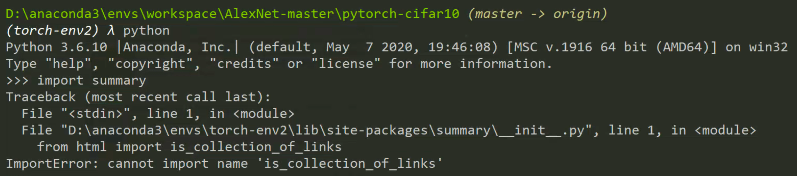
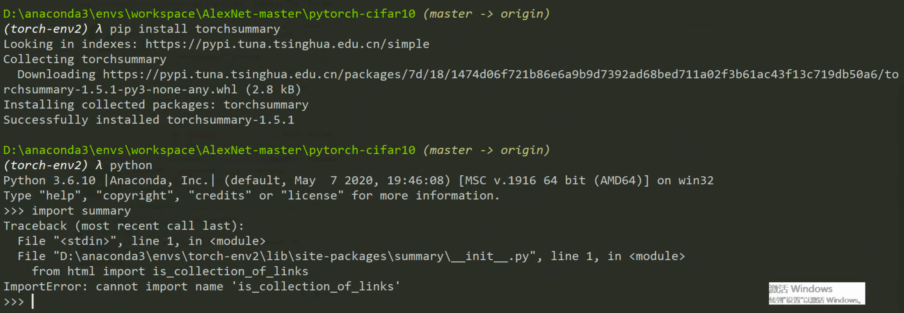
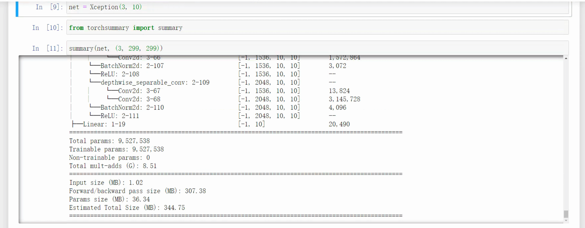
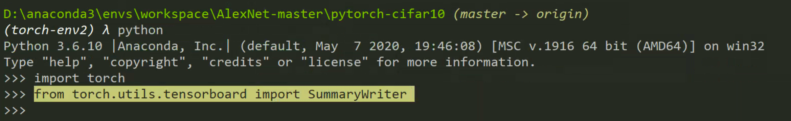
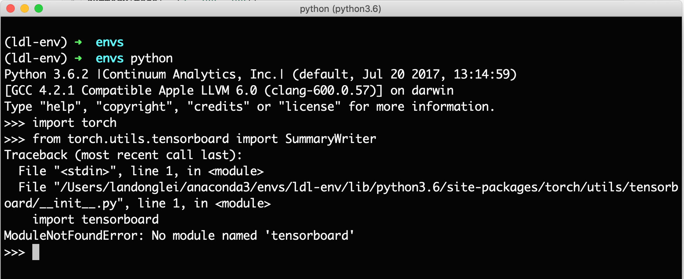

# macOS intall summary and tensorboard

问题 1：ImportError: cannot import name 'is_collection_of_links'

问题 2：    raise ReadTimeoutError(self._pool, None, 'Read timed out.')
pip._vendor.requests.packages.urllib3.exceptions.ReadTimeoutError: HTTPSConnectionPool(host='files.pythonhosted.org', port=443): Read timed out.

## intall torch-summary

```shell
pip install summary
```



```shell
pip install torchsummary
```



包导入 错误问题

ImportError: cannot import name 'is_collection_of_links'

安装错了。。。

✅ 正确的安装命令：

```shell
pip install torch-summary
```

✅ 使用：

```python
from torchsummary import summary

model = Xception(3, 10)
summary(model, (3, 299, 299))
```



使用了 Summary，就可有验证手绘的特征图是否是正确的了。如「[复现 Xception 时的一些疑惑和解答](https://landodo.github.io/posts/20201208-Some-doubts-about-Xception)」中的推导，是正确的。

## install TensorBoard

Windows 下的 torch 自带 TensorBoard ✅。



macOS 不行❌。



自从搞深度学习以来，macOS 上安装遇到问题非常多。


使用清华的源。

```shell
pip install -i https://pypi.tuna.tsinghua.edu.cn/simple tensorboard
```


