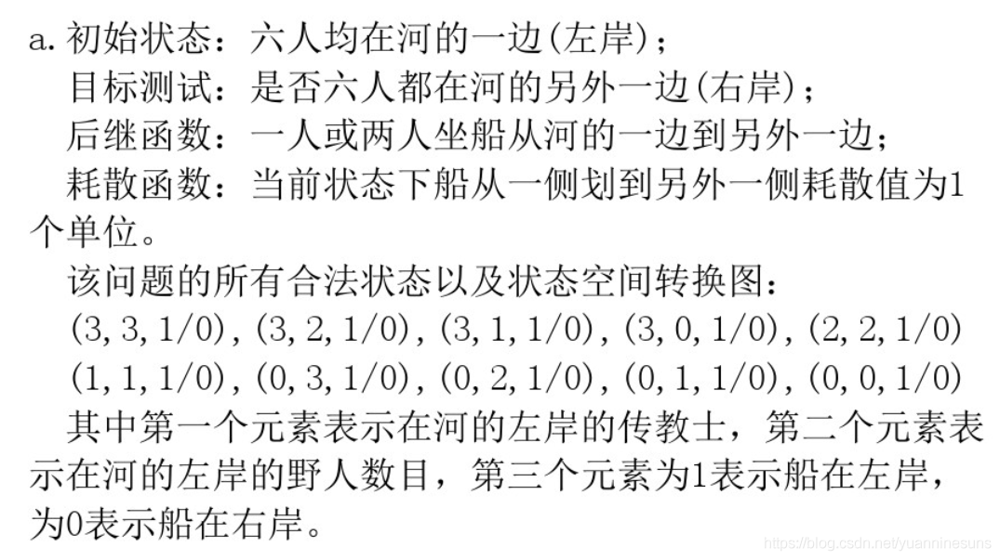
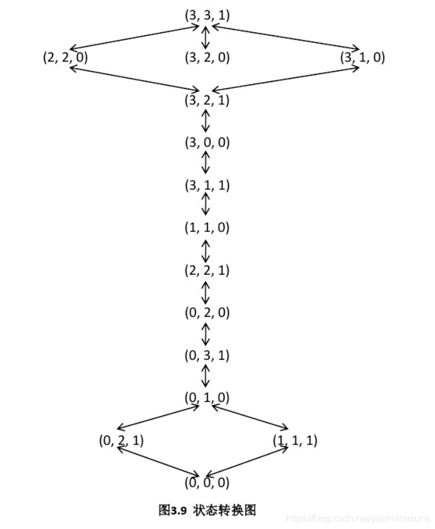
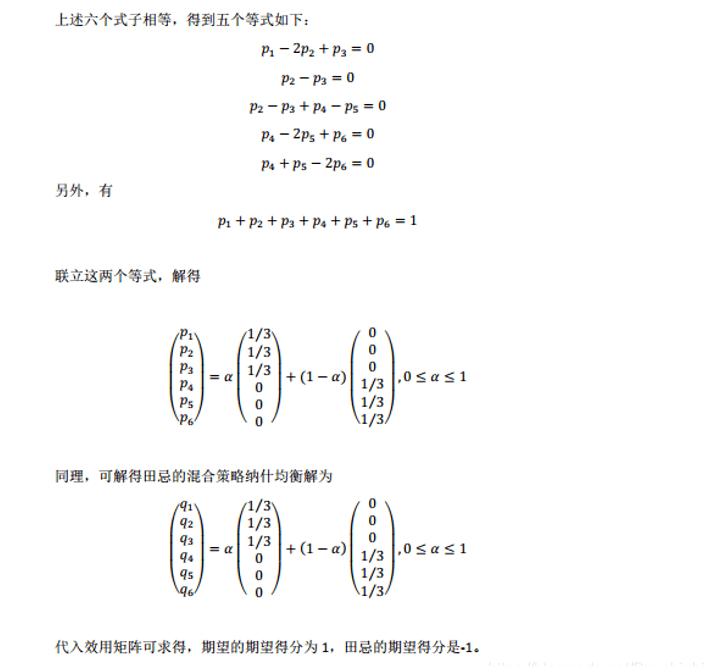
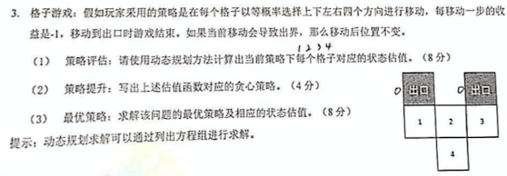

#  国科大高级人工智能（2020 秋季学期）（2）

## 🥇1. 传教士与野人问题

> 传教士和野人问题通常描述如下：三个传教士和三个野人在河的一边，还有一条能载一个人或者两个人的船。找到一个办法让所有的人能渡到河的另一岸，要求在任何地方野人数都不能多于传教士的人数。
>
> a. 精确地形式化该问题，只描述确保该问题有解所必需的特性。画出该问题的完全状态空间。
>
> b. 用一个合适的搜索算法实现和最优地求解该问题，检查重复状态是个好主意吗?
>
> c. 这个问题的状态空间如此简单，你认为为什么求解它却很困难?

## 2. 田忌赛马问题

> 田忌赛马：田忌和齐王赛马，每人有上、中、下三个等级的马各一匹，上等马优于中等马，中等马优于下等马，同一等级的马中齐王的马优于田忌的马。比赛共进行三局，每匹马只能参加一局比赛，每局的胜者得 1 分，负者得 -1 分，比赛结果为三局得分之和。
>
> （1）写出这场博弈中的**局中人**、**策略集合**和**效用矩阵**
>
> （2）请给出田忌赛马的**任意一种混合策略纳什均衡解**，并计算此时双方的期望得分

**博弈的要素**

- 局中人（Player）：田忌和齐王（局中人是自私的理性人）
  - 在博弈中有权决定自己行动方案的博弈参加者
- 策略集合（Strategy Set）
  - 策略：博弈中可供局中人选择的行动方案
  - 田忌赛马中田忌的策略集合：{上中下、上下中、中上下、中下上、下上中、下中上}

- 效用函数（Payoff）
  - 对每个参与博弈的局中人，都有一个相应的效用函数
  - 效用函数在静态博弈中一般是局势的函数
  - 在动态博弈中效用函数可能是局势的函数，也可能还有 其它因素，比如时间
  - **每个局中人的目的都是最大化自己的效用函数**
- 纳什均衡
  - 定义：如果一个局势下，每个局中人的策略都是相对其他局中人**当前策略**的最佳应对，则称该局势是一个纳什均衡。
  - 纳什均衡是博弈的均衡解
  - 是一个僵局：谁动谁吃亏。
    - 囚徒困境的纳什均衡：双方都坦白。
    - 性别之战：夫妻双方都同意看韩剧、双方都同意看体育。
    - 剪刀石头布：不存在
- 混合策略的纳什均衡：
  - 每个局中人以某个概率分布在其策略集合中选择策略（参考田忌赛马、剪刀石头布）
- 纳什定理：
  - 任何有限博弈都至少存在一个纳什均衡（不一定是纯策略纳什均衡，例如剪刀-石头-布）
  - 寻找博弈的纳什均衡是困难的（至少从算法角度来讲是这样）

---

解答：

## 🥇3. 格子游戏

>- 强化学习考格子题。GridWorld 会考一个 4 个参数的题，先写出估值函数，问当前的最优策略是什么，然后策略提升。题目只要两步就收敛了，而且正好是个整数
>- [强化学习之动态规划（策略迭代和价值迭代）](https://blog.csdn.net/weixin_42863507/article/details/107684293)

（1）**策略估值**：使用**动态规划方法**计算当前策略下每一格子对应的状态估值。

每个动作会导致状态转移，但当动作会导致智能体移出网格时，状态保持不变。假定我们需要评估的策略为均等的随机策略，即：

$$\pi(up\mid s) = \pi(down \mid s) = \pi(left \mid s) = \pi(right \mid s) = 1/4 = 0.25, \forall s \in S$$

策略评估的目的就是给定一个策略 $\pi$，计算出每个状态在该策略下的价值函数，即评估每个状态的好坏。

动态规划方法**给定策略下状态估值函数的更新规则**：

$$v_{k=1}(s) = \sum_{a \in A} \pi(a \mid s)(\sum_{s', r}(p(s', r \mid s, a)[r + \gamma v_k(s')]))$$

