# 国科大高级人工智能（2020 秋季学期）（1）

> Update：2020 年 12 月29 日晚考完，我现在有印象的知识点如下：
>
> - 选择题，基本去年原题，一分钟写完。
> - 简答题：
>   - 描述蚁群或粒子群
>   - 简述 BP
>   - 残差网络
>   - 如何使用 RNN 搭建一个机器翻译系统，给出你的方案
> - 大题
>   - 证明 A* 树搜索的最优性
>   - 成绩好 $\rightarrow$ 刻苦，一阶谓词逻辑，类似胜者为王败者为寇。
>   - 证明 $KB \vDash \alpha$。
>   - 化为合取范式，类似[（3）](https://landodo.github.io/posts/20201227-20201226-UCAS-Advanced-artificial-intelligence-III) 中的 $\forall x [\forall y \ Animal(y) \Rightarrow Loves(x, y)] \Rightarrow [\exists y \ Loves(y, x)]$ 原题
>   - 归结
>   - 格子问题
>
> - 注意：简答题的 ResNet 和 RNN 应该是今年新出的，其他的题目都中规中矩。
>
> 我的三篇复习笔记：
>
> - [2020.12.27 #高级人工智能# 国科大高级人工智能复习（2020 秋季学期）（3）](https://landodo.github.io/posts/20201227-20201226-UCAS-Advanced-artificial-intelligence-III)
> - [2020.12.26 #高级人工智能# 国科大高级人工智能复习（2020 秋季学期）（2）](https://landodo.github.io/posts/20201226-20201226-UCAS-Advanced-artificial-intelligence-II)
> - [2020.12.26 #高级人工智能# 国科大高级人工智能复习（2020 秋季学期）（1）](https://landodo.github.io/posts/20201226-UCAS-Advanced-artificial-intelligence)

面向题目复习法

2018 年卷

> 参考链接：
>
> - [国科大 高级人工智能 期末复习总结](https://juejin.cn/post/6844904047082733582)
> - [国科大2017-2019高级人工智能试题以及答案总结](https://blog.csdn.net/qq_27500493/article/details/86563826)

---

# 1. 选择题（20'）

## 1.1 图灵测试

A. M. Turing, Computing Machinery and Intelligence, Mind, 59:433-460, 1950.

- 图灵问题：Can Machine Think?
- 图灵测试（Turing Test）：一个人（C）在完全不接触对方（A 和 B）的情况下，和对方进行一系列的问答，如果在相当长时间内，C 无法根据这些问题判断对方是人（B）还是计算机（A）， 那么，就认为该计算机具有同人相当的智能，(即计算机是能思维的)
- 质疑
  - 图灵测试是不可构造的：“完全不接触“的环境难以构造
  - 图灵测试不是可重现的：答案正确性的判断是主观的
  - 图灵测试无法进行数学分析：缺少形式化描述

## 1.2 人工智能的 3 大分支

- 符号主义学派：
  - 逻辑学派
  - ”人的认知基元是符号，认知过程即符号操作过程“
  - 人工智能对的核心是知识表示、知识推理和知识运用
  - 西蒙（1975 年获图灵奖，1978 年获诺贝尔经济学奖）、妞厄尔
  - 衍生出：**逻辑、专家系统、知识库**
- 联结主义学派
  - 仿生学派或生理学派
  - 人的思维基元是神经元
  - 神经网络及神经网络间的连接机制和学习算法
  - 麦卡洛可（McCulloch）、皮茨（Pitts）
  - 衍生出：**人工神经网络、认知科学、脑类计算**
- 行为主义学派
  - 进化主义或控制论学派
  - 智能取决于感知和行动
  - 主张利用机器对环境作用后的响应或反馈为原型来实现智能化
  - 人工智能可以像人类智能一样通过进化、学习来逐渐提高和增强
  - 衍生出：**控制论、多智能体、强化学习等**

## 1.3 搜索算法

> Search—第二讲 2020-09-22
>
> 自动化所的吴老师

**1、无信息搜索（Uninformed Search）**

- 深度优先搜索（Depth-First Search）：LIFO stack
- 广度优先搜索（Breadth-First Search）：FIFO queue
- 迭代深入搜索（Iterative Deepening）：结合 DFS 的空间优势与 BFS 的时间优势
- 代价敏感搜索（Cost-Sensitive Search）：find the least-cost path.
  - 代价一致搜索（Uniform Cost Search）：priority queue

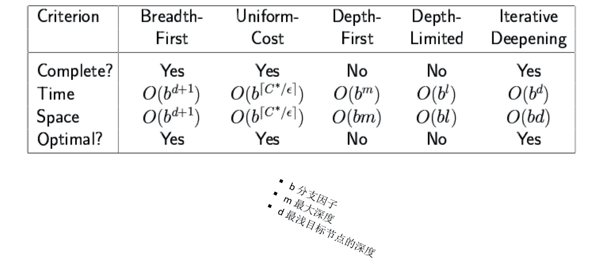

**2、启发式搜索（Informed Search）**

启发策略：

- 估计一个状态到目标距离的函数
- 问题给予算法的额外信息，为特定搜索问题而设计

**（1）贪婪搜索（Greedy Search）**

- 启发函数：$f(n) = h(n)$
- 最坏情况：类似 DFS

**（2）A* 搜索**

- UCS 和 Greedy 的结合
- $f(n)=g(n)+h(n)$
- 启发函数 h 是可采纳的：$0 \leqslant h(n) \leqslant h^*(n)$
  - $h^*(n)$ ：到最近目标的真实耗散
- UCS vs A*
  - 代价一致搜索在所有“方向”上等可能的扩展
  - A* 搜索主要朝着目标扩展，而且能够保证最优性

对于解决难的搜索问题，大部分工作就是想出可采纳的启发函数。

**（3）图搜索**

- A* 图搜索

**A* 算法的总结：**

- A* 使用后向耗散和前向耗散（估计）
- A* 是完备的、最优的，也是效率最优的（可采纳的/一致的启发函数）
- 启发式函数设计是关键：常使用松弛问题
- A* 往往在计算完之前就耗尽了空间

**3、局部搜索**

- 爬山法搜索
- 模拟退火搜索：避免局部极大（允许向山下移动）
- 遗传算法：基于适应度函数、配对杂交、产生可选的变异

### 1.4 A* 图搜索的最优性条件

A* **树**搜索的最优性条件是：启发函数是一致的。

**一致性：**

- 沿路径的节点估计耗散 f 值单调递增 $h(A) ≤ cost(A\  to\  C) + h(C)$
- A* 图搜索具备最优性

✅ A* 图搜索的最优性条件是：启发函数是一致的。

✅ A* 树搜索的最优性条件是：启发函数是可采纳的。

### 1.5 Deep Belief Networks 网络结构

> DNN 神经网络基础 Deep Neural Network 2020 年 10 月 06 日
>
> 吴老师 

Deep Learning 的常用模型：

- Deep Belief Networks(DBN)
- Deep Boltzmann Machine(DBM)

发展历程

- Hopfield network：单层全互连、对称权值的反馈网络。
- Boltzman machine：结构类似于 Hopfield 网络，但它是具有隐单元的反馈互联网络。
- Restricted Boltzman machine ：通过输入数据集学习概率分布的随机生成神经网络。一个可见层、一个隐层、层内无连接。
- Deep Belief Networks(DBN) ：概率生成模型、深层结构-多层、非监督的预学习提供了网络好的初始化、监督微调（fine-tuning）
  - DBNs 由多个限制玻尔兹曼机（Restricted Boltzmann Machines）层组成。
  - 这些网络被“限制”为一个可视层（Visible Layer）和一个隐层（Hidden Layers），层间存在连接，但层内的单元间不存在连接。
  - 隐层单元被训练去捕捉在可视层表现出来的高阶数据的相关性。

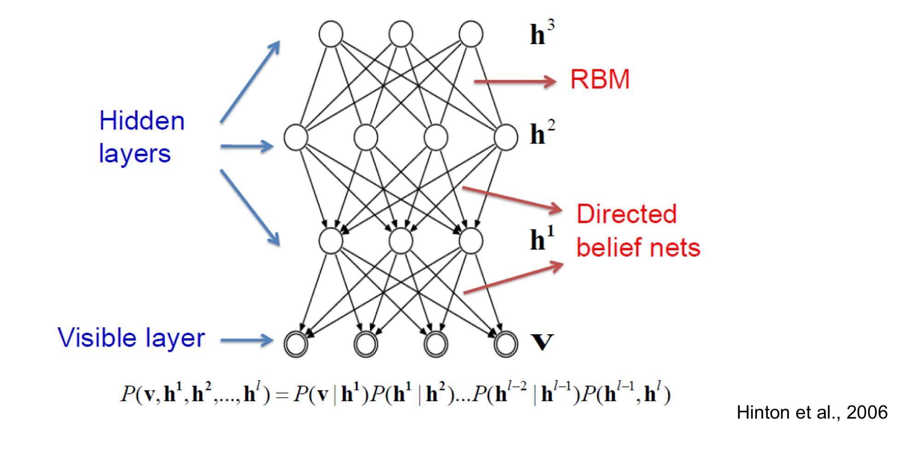

### ⚠️1.5 Deep Boltzmann Machine(DBM)

> 简述 Deep Boltzmann Machine 的网络结构及其学习算法？
>
> - 网络结构：
>
>   - 由多层受限玻尔兹曼机叠加而成，
>   - 中间层与相邻层是双向连接的。
>
>   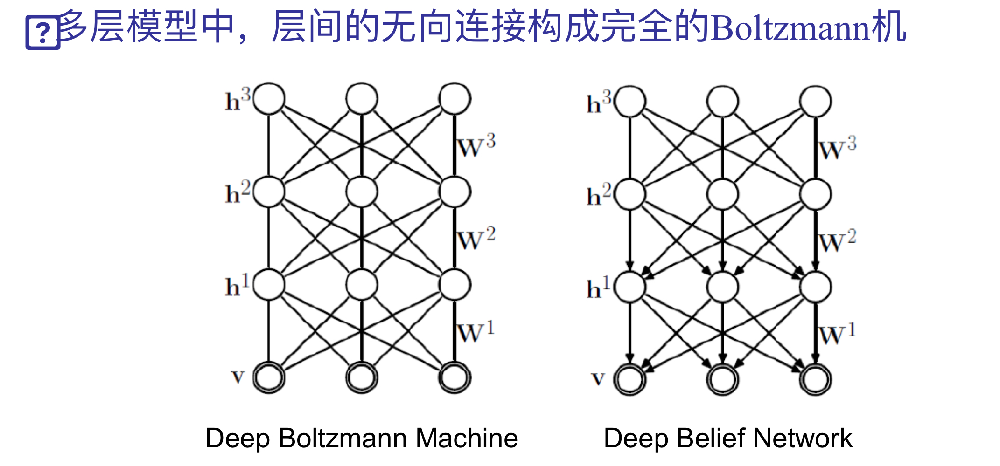
>
> - 特点
>
>   - 所有层间无连接（同层神经元间无连接）
>   - 高层表示由无标注数据建立
>   - 标注数据仅用来微调网络
>
> - 学习算法（训练）
>
>   - 训练时采用双方向（上下两层）
>   - 在训练单层时需同时考虑两个或者多个隐含层
>   - 能量模型与 RBM 不一样

### 1.5 图神经网络

> 往年的卷子一题都没考，有点反常。

- 前馈神经网络和记忆网络的输入都可以表示为向量或向量序列，但是实际应用中的很多数据都是图结构的数据，比如知识图谱、社交网络、分子网络等。前馈神经网络和记忆网络很难处理图结构的数据。
- 图神经网络（Graph Neural Network，GNN）是将消息传递的思想拓展到图结构数据上的神经网络。
- 图网络是定义在图数据结构上的神经网络，每个节点都由一个或一组神经元组成。
- 图网络是前馈网络和记忆网络的泛化。
- 在图上进行卷积：
  - 借助谱图理论（Spectral Graph Theory）来实现在拓扑图上的卷积操作。
  - 大致步骤：将空域中的拓扑图结构通过傅里叶变换映射到**频域**中进行卷积，然后利用逆变换返回空域，从而完成了图卷积操作。
- 输入和输出都是图结构，隐藏层直接在图结构中进行激活。


### 1.6 卷积神经网络（CNN）的特点

> DL for image
>
> 图像数据的深度学习模型 2020-10-13
>
> 自动化所吴老师

卷积神经网络是一种特殊的深层神经网络模型。

- 它的神经元间的连接是非全连接的
- 同一层中某些神经元之间的连接的权重是共享的（即相同的）。

局部连接

- 局部感受野
- 参数共享：平移不变性

卷积（Convolution）

- 稀疏连接
- 参数共享

填充（Padding）

步长（Stride）

输入与输出的尺寸关系：

- $n \times n \ images, \ f \times f \ filter, padding \ p, stride \ s $
- $\left\lfloor \frac{n+2p-f}{s} + 1 \right\rfloor \times \left\lfloor \frac{n+2p-f}{s} + 1 \right\rfloor $

池化 Pooling

- 子采样。没有需要学习参数，所有不把它看做是一层。
- Average pool
- Max pool
- L2 pool

**卷积神经网络：**（总结得非常好）

- 卷积网络的核心思想:
  - 将局部感受野、权值共享以及时间或空间亚采样这三种结构思想结合起来获得了某种程度的位移、尺度、形变不变性。
- 层间联系和空域信息的紧密关系，使其适于图像处理和理解。
  - 图像和网络的拓扑结构能很好的吻合
- **避免了显式的特征抽取，而隐式地从训练数据中进行学习**。
    - 特征提取和模式分类同时进行，并同时在训练中产生;
    - 权重共享可以减少网络的训练参数，使神经网络结构变得更简单， 适应性更强。

### ⚠️ 1.7 感知器（Perceptron）模型

> PRML 的一个重点内容。
>
> 人工神经网络 2020-09-29
>
> 自动化所吴老师

**（1）感知器（Perceptron）简述：**

- 感知器是对生物神经元的计算数学模拟，有着与神经元相对于的部件，如权重（突触）、偏置（阈值）及激活函数（细胞体）。
- 感知器是一种简单的两类线性分类模型：$\check{y} = sgn(w^T x)$。
- 感知器的学习算法是一种错误驱动的在线学习算法，每分错一个样本，就会使用这个样本来更新权重。
- 感知器算法的损失函数为
  - $$L(w;x,y)=max(0,-yw^Tx)$$
- 采用随机梯度下降算法，每次更新的梯度为：
  - $$\frac{\partial L(w;x,y)}{\partial w}=\begin{cases} 0, &if &yw^Tx > 0 \\ -yx & if & yw^Tx < 0\end{cases} $$
- 权重更新：$w \leftarrow w + yx$

**（2）感知器特性：**

- 可分性：true if some parameters get the training set perfectly correct Can represent AND, OR, NOT, etc., but not XOR.
- 感知器收敛定理：若训练数据集是线性可分的，则感知机模型收敛。

**（3）缺点：**

- 噪声（不可分情况）
- 泛化性

### 1.7 反向传播 BackPropagation

[图源：nndl, P94]

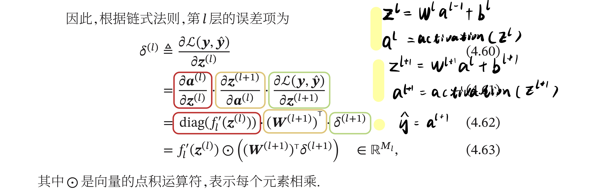

> $$dW^{(l)} = \delta^{(l)} \cdot a^{(l-1)}$$
>
> $$db^{(l)} = \delta^{(l)} \cdot 1$$ 
>
> 参数更新：
>
> - $$W^{(l)} = W^{(l)} - \alpha dW^{(l)}$$
> - $$b^{(l)} = b^{(l)} - \alpha db^{}$$

第 $l$ 层的误差项可以通过第 $l+1$ 层的误差项计算得到，这就是误差的**反向传播（BackPropagation, BP）**。

**反向传播算法的含义：**

- 第 $l$ 层的一个神经元的误差项是所有与该神经元相连的第 $l+1$ 层的神经元的误差项的权重和，然后再乘以该神经元激活函数的梯度。

### 1.8 LSTM

> 序列数据的深度学习模型 2020-10-20
>
> 自动化所的吴老师

RNN：

- BPTT, Back Propagation Through Time

长序列循环神经网络：BP 困难，梯度得膨胀和消散。

- RNN 单元（Gated Recurrent Unit(GRU)）

  - $$a^{<t>} = tanh(W_{ax}x^{t} + W_{aa}a^{t-1} + b_a)$$
  - $$\check{y}^{<t>} = softmax(W_{ya}a^{< t> } + b_y)$$
- GRU
  - 有 2 个门
- Long Short Term Memory, LSTM
  - 解决了 RNN 长期（like hundreds of time steps）记忆的问题
  - LSTM 是一个存储单元，使用 logistic 和 linear 单元执行乘法运算
  - 3 个门和一个 cell

### 1.9-1.13 数理逻辑

比较难！❌

### 1.14 多臂赌博机

> 2020.12.06
>
> 计算所的沈老师

问题形式化：$q_{*}(a) \dot{=} E[R_t \mid A_t = a]$

玩家在第 $t$ 轮时只能依赖于当时对 $q_*(a)$ 的估值 $Q_t(a)$ 进行选择，此时，贪心策略在第 $t$ 轮选择 $Q_t(a)$ 最大的 $a$ 。

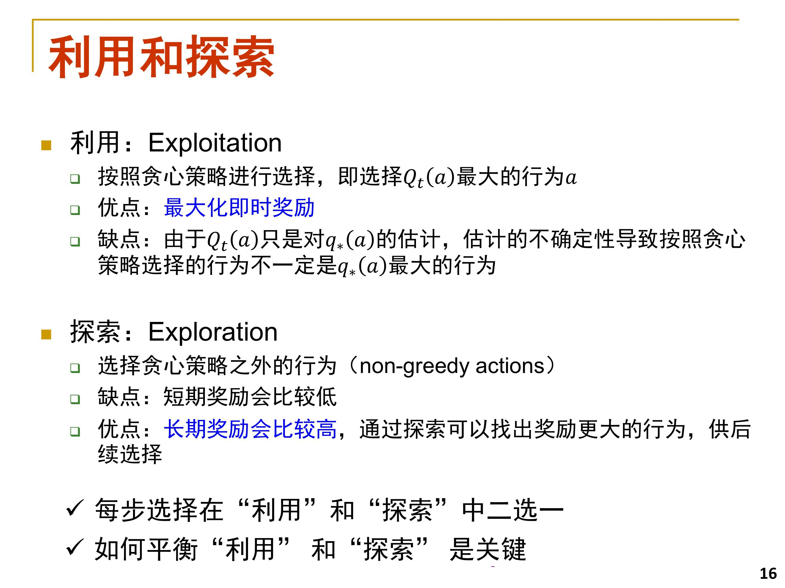

贪心策略的形式化表示：$A_t \dot{=} arg \max_{a} Q_t(a)$

$\epsilon $ 贪心策略：

- 以概率 $1-\epsilon$ 按照贪心策略进行行为选择——Exploitation
- 以概率 $\epsilon$ 在所有行为中随机选择一个——Exploration
- $\epsilon$ 的取值取决于 $q_*(a)$ 的方差，方差越大 $\epsilon$ 取值应越大。

行为估值方法：根据历史观测样本的均值对 $q_*(a)$ 进行估计。

- 一般性的行为估值：$NewEstimate \leftarrow OldEstimate + StepSize[Target - OldEstimate] $
- 非平稳问题下的行为估计：$Q_{n+1} \dot{=} Q_n + \alpha[R_n-Q_n]$
- UCB（Upper-Confidence-Bound）置信上界 

UCB vs  𝜺 

- UCB 策略一般会优于 𝜺 贪心策略，不过最初几轮相对较差。

- UCB 策略实现起来比 𝜺 贪心策略要复杂，在多臂赌博机之外 的强化学习场景中使用较少。

梯度赌博机算法：是一种随机策略。

三种方法的比较（UCB 较好）：

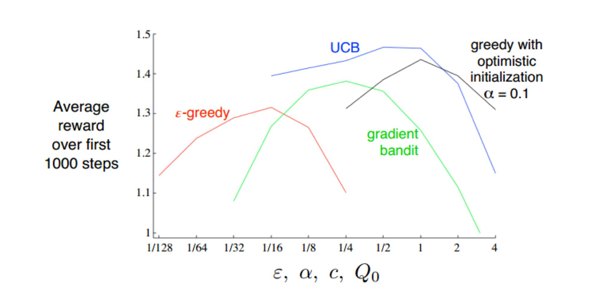


多臂赌博机总结：

- 多臂赌博机是强化学习的一个简化场景：行为和状态之间没有关联关系
- 扩展情形：有上下文的多臂赌博机（Contextual bandit）
- 更一般的情形：马尔科夫决策过程

## 1.15 强化学习

> 计算所的沈老师授课

强化学习（Reinforcement learning）：目标：学习**从环境状态到行为的映射(即策略)**，智能体选择能够获得环境**最大奖赏**的行为，使得外部环境对学习系统在某种意义下的评价为最佳。

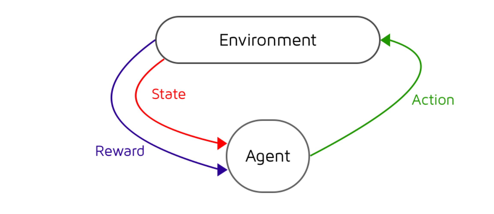

- 监督学习是从**标注**中学习（labeled examples）
- 强化学习是从**交互**中学习（interaction）：Learning from interactions with environment

**两种反馈：**

- 评价性反馈：Evaluative feedback
  - 当智能体采取某个行为时，对该行为给出一个评价，但并不知道哪个行为是最好的
  - 强化学习经常面临的是评价性反馈

- 指导性反馈：Instructive feedback
  - 直接给出某个状态下的正确或最好行为
  - 独立于智能体当前采取的行为
  - 监督学习使用的是指导性反馈

强化学习的两大特性：

- 试错搜索：Trial-and-error search
- 延迟奖励：Delayed reward

蒙特卡洛方法：

- 从经验中学习，不需要知道完整的环境模型
- 适用于环境模型未知或者环境模型复杂的情形
- 收敛性由大数定理保证
- On-policy 和 off-policy 两种实现

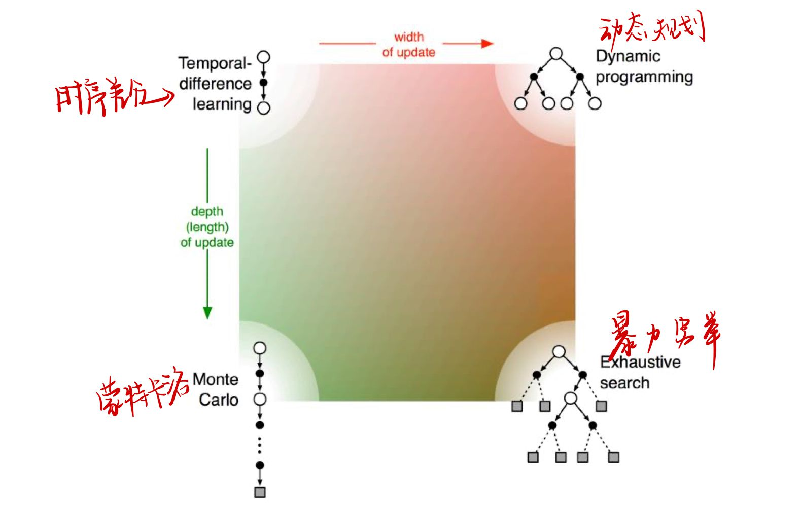

### 1.16 博弈-囚徒困境

> 博弈 2020.12.15
>
> 计算所的沈老师上课

> 什么是帕累托最优？
>
> - 对于一组策略选择(局势)，若不存在其他策略选择使所有参与者得到至少和目前一样高的回报，且至少一个参与者会得到严格较高的回报，则这组策略选择为帕累托最优。
>
> 社会最优？
>
> - 使参与者的回报之和最大的策略选择 (局势) 
> - 社会最优的结果一定也是帕累托最优的结果
> - 帕累托最优不一定是社会最优

帕累托最优的决策组合一共有 3 个，分别是（坦白，抗拒）、（抗拒，坦白）和（抗拒，抗拒）。纳什均衡策略组合（坦白，坦白）不是帕累托最优。社会最优策略组合是（抗拒，抗拒）。

- 帕累托最优：`(-1, -1), (-10, 0), (0, -10)`
- 社会最优策略：`(-3, -3)`

### 1.17 minmax 和 maxmin

$$\max_{x} \min_{y} f(x, y) \leqslant \min_{x} \max_{y}f(x, y)$$

“宁做凤尾，不做鸡头。”

- maxmin 策略是最大化自己最坏情况下的收益
- minmax 策略 是最小化对手最好情况下的收益
- 在零和博弈中，maxmin 策略和 minmax 策略是等价的

### 1.18 买卖双方议价

讨价：买家与买家之间的博弈。

讨价的对象是**双方对商品估价之差**。

进价 100 元，标价 200 元。卖家对商品的估价是 120 元，买家对商品的估价是 200 元。

讨价的对象是双方的估价之差，即 160-120=40。

买卖双方议价时能够达成交易的议价范围为 120~160。

### 1.19 最优匹配问题

a、b、c 三人对三个房间 x、y、z 的偏好程度为` (12, 4, 2), (8, 7, 6), (7, 5, 2)`  ，则最优的分配？

- a --> x
- b --> z
- c --> y

### 1.20 网络交换博弈（Network Exchange Game）

网络交换博弈（Network Exchange Game）中，节点在网络中所处的位置决定了他们的议价权，并最终导致不同的节点在博弈中所获得的效用大小不同。均衡结局（Balance Outcome）为 1/3--2/3、2/3--1/3。

# 2. 简答题

### ⚠️2.1 蚁群优化算法和粒子群优化算法

阐述基本原理、算法过程及其使用范围。

群体智能的代表性方法：蚁群优化算法、粒子群优化算法。

**蚁群优化算法 ACO：Ant Colony Optimization**

- 一种解空间搜索方法
- 适用于在图上寻找最优路径

**形式化：**

- 每个蚂蚁对应一个计算智能体
- 蚂蚁依概率选择候选位置进行移动
- 在经过的路径上留下“信息素”（Pheromone）
- “信息素”随时间挥发
- “信息素”浓度大的路径在后续的选择中会以更高的概率被选取

**旅行商问题（TSP: Traveling Salesman Problem）**

- n 个城市的有向图 $G=(V, E)$，$V=\{1, 2, ..., n\}$，$E=\{ (i, j) \mid i, j \in V \}$
- $d_{i, j}$：城市 $i$ 和 $j$ 之间的距离
- 目标函数：$$f(w) = \sum^{n}_{l=1}d_{i_li_{l+1}}$$
- $w=(i_1, i_2, ..., i_n)$ 为 TSP 问题的任意可行解，其中 $i_{n+1} = i_1$

首先将 $m$ 只蚂蚁随机放置在 $n$ 个城市（一般情况下 $m < n$），位于城市 $i$ 的第 $k$ 只蚂蚁选择下一个城市 $j$ 的概率为:

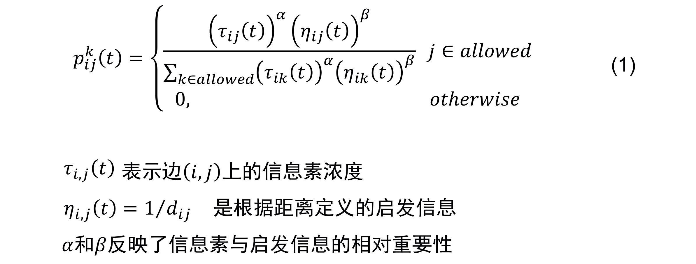

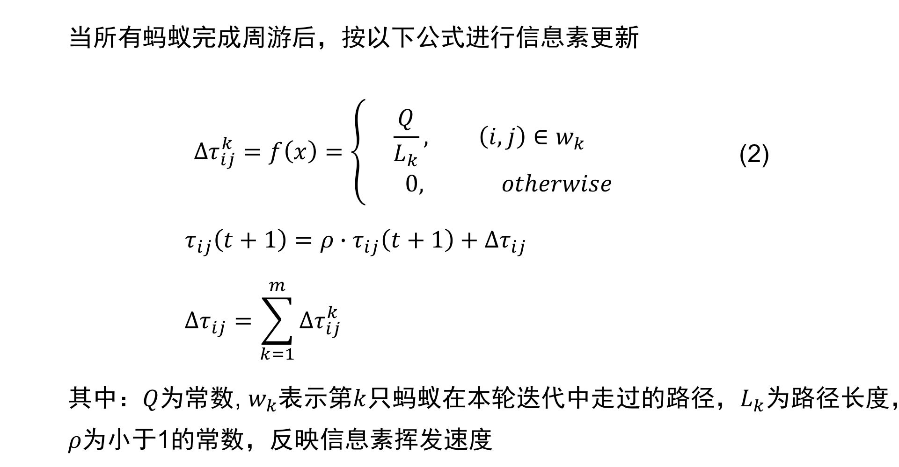

旅行商问题的蚁群优化求解：

```
(1)初始化 随机放置蚂蚁，
(2)迭代过程
k=1
while k <= ItCount do (执行迭代)
  for i = 1 to m do (对m只蚂蚁循环)
    for j = 1 to n - 1 do (对n个城市循环)
      根据式(1)，采用轮盘赌方法在窗口外选择下一个城市 j;
      将 j 置入禁忌表,蚂蚁转移到 j;
    end for
  end for
计算每只蚂蚁的路径长度;
根据式(2)更新所有蚂蚁路径上的信息量;
k = k + 1;
end while
(3)输出结果,结束算法.
```

**蚁群优化算法总结：**

- 思想：局部随机搜索+自增强
- “世界本无路，走的人多了也就有了路”
- 缺点 🌚
  - **收敛速度慢**
  - **易陷入局部最优**
  - **对于解空间为连续的优化问题不适用**
- 使用范围：适用于离散问题最优解！✅

---

**粒子群优化算法 PSO: Particle Swarm Optimization**

> - 基本原理：
>   - **粒子群优化算法是一种基于种群寻优的启发式搜索算法。**
>   - 借鉴了鸟群表现出来的**同步性**，每只鸟的**独立性**，每只鸟在飞行过程中都遵循了一定的**行为规则**，并能够掌握**邻域**内其它鸟的飞行信息这样的思想。
>   - 每个粒子（一只鸟）都可以获得其邻域内其它个体的信息，对所经过的位置进行评价，并根据这些信息和位置速度更 新规则，改变自身的两个状态量，在“飞行”过程中 传递信息和互相学习，去更好地适应环境。
> - 算法过程：PPT 算法过程描述。

- 一种随机优化方法
- 通过粒子群在解空间中进行搜索，寻找最优解(适应度 最大的解)

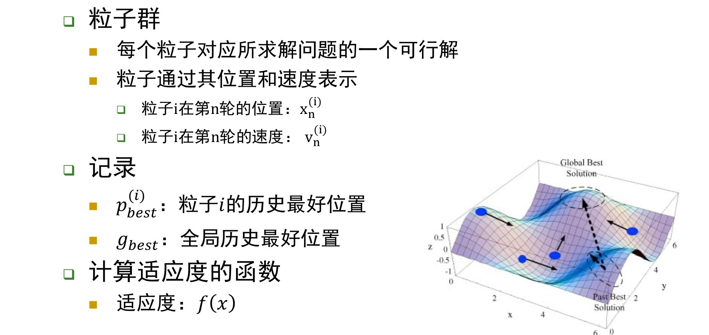

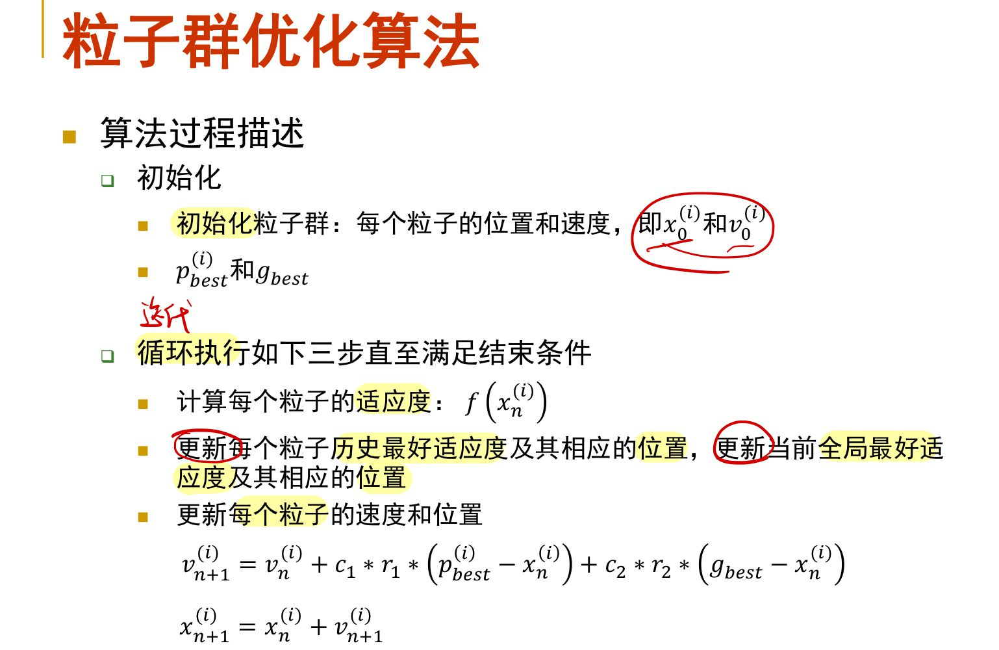

更新每个粒子的速度公式解读：

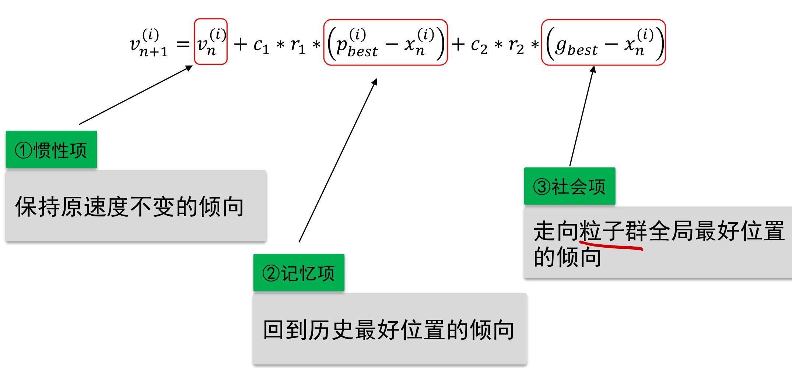

- 加速度参数：控制粒子 $i$ 当前最优位置 $p^{(i)}_{best}$ 和粒子群当前最优位置 $g_{best}$ 对粒子飞行速度的影响。


**粒子群算法 vs 遗传算法：**

- 遗传算法强调 “适者生存”，不好的个体在竞争中被淘汰；PSO 强调 “协同合作”，不好的个体通过学习向好的方向转变。
- 遗传算法中最好的个体通过产生更多的后代来传播基因；PSO 中的最好个体通过吸引其它个体向它靠近来施加影响。
- 遗传算法的选择概率只与上一代群体相关，而与历史无关，群体的信息变化过程是一个 Markov 链过程;而  PSO 中的个体除了有位置和速度外，还有着过去的历史信息 (pBest、gBest)。

**粒子群优化算法总结：**

- 优点
  - 易于实现;
  - 可调参数较少;
  - 所需种群或微粒群规模较小;
  - 计算效率高，收敛速度快。

- 缺点🌚
  - 不能保证收敛到全局最优
- 使用范围：适用于求解连续解空间的优化问题！✅

## 2.2 BP 算法、梯度消失、GAN 的基本原理及其学习算法

**（1）BP 算法遇到的困难？**

- 需要带标签训练数据
- 局部极小
- 梯度消失

**（2）为什么会出现 “梯度消失” 问题？**

假设正在训练一个极深的神经网络，

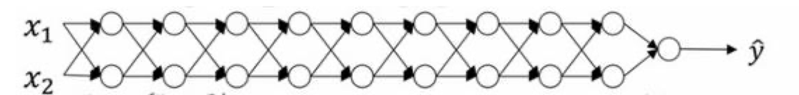

这个神经网络有参数 $W^{[1]}, W^{[2]}, ..., W^{[l]}$，为了简化使用一个线性的激活函数 $g(z) = z$，忽略 $b$，则：

$$y=W^{[l]}W^{[l-1]}W^{[l-2]}...W^{[3]}W^{[2]}W^{[1]}x$$

假设每个权重矩阵 $W^{[l]}=[1.5, 0;0, 1.5]$，$y = W^{[1]}[1.5, 0; 0, 1.5]^{L-1}x$，对于一个深度神经网络来说 L 值较大，$\check{y}$ 的增长比例是 $1.5^L$ ，最后的值呈爆炸式增长。

同理，假设权重为 0.5，那么在深度神经网络中，将呈指数递减。

在一个深度神经网络中，如果激活函数或梯度函数以与 𝐿 相关的指数增长或递 减，它们的值将会变得极大或极小，从而导致训练难度上升，尤其是梯度指数小于 𝐿 时，梯度下降算法的步长会非常非常小，梯度下降算法将花费很长时间来学习。

优秀的权重初始化方法可以缓解梯度消失和梯度爆炸问题。

### ⚠️（3）GAN 的基本原理

生成式对抗网络 GAN（Generative adversarial networks）

- GAN 的核心思想来源于博弈论的纳什均衡
- 一个生成器 (Generator) 和一个判别器 (Discriminator)
  - 生成器的目的是尽量去学习真实的数据分布，即把噪声数据 z（也就是我们说的假数据）通过⽣成模型 G，伪装成了真实数据 x。
  - 判别器的目的是尽量正确判别输入数据是来自真实数据还是来自生成模型。
  - 各⾃提⾼⾃⼰的⽣成能⼒和判别能⼒, 这个学习优化过程就是寻找⼆者之间的⼀个纳什均衡。

Algorithm

- Step 1: Fix generator G, and update discriminator D
- Step 2: Fix discriminator D, and update generator G. Generator learns to “fool” the discriminator
  D

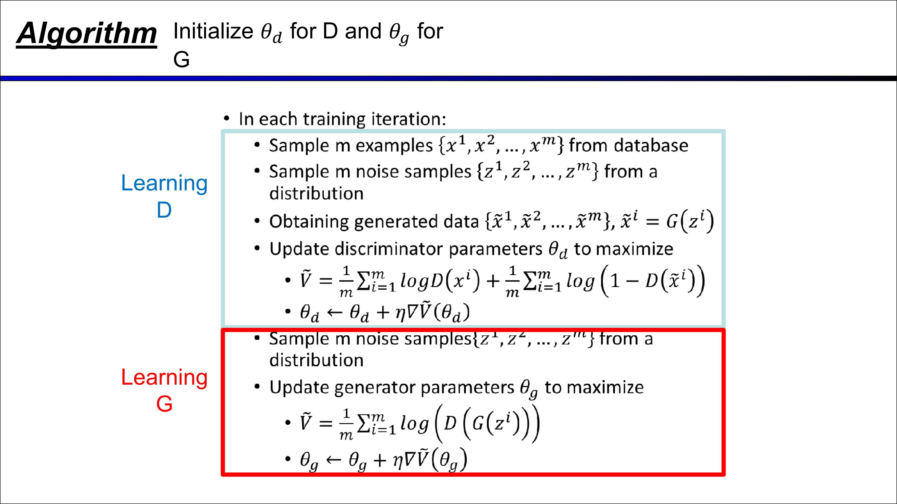

另一种写法：

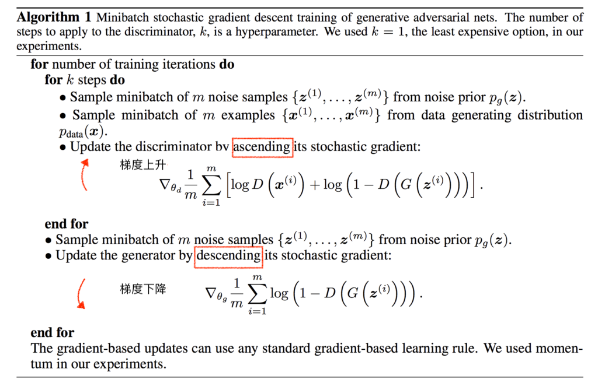

- $D(G(z^{(i)}))$：对于生成器 $G$ 生成的数据 $G(z^{(i)})$，训练出来的判别器 $G$ 判别其与真实数据的差距越大越好。因此使用的 ascending。
- 而对于生成器来说，生成的数据与真实数据的差距越小越好，因此是 decending。


