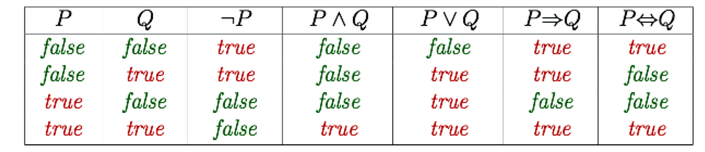
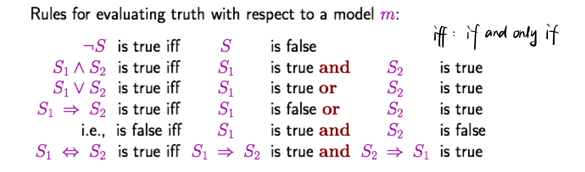
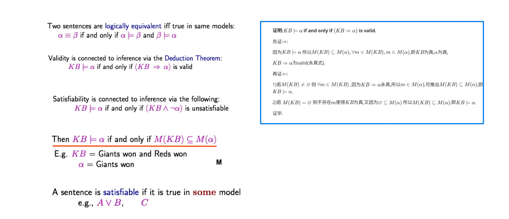
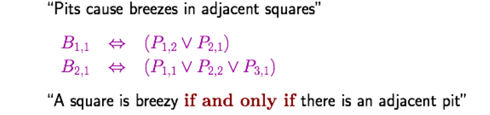
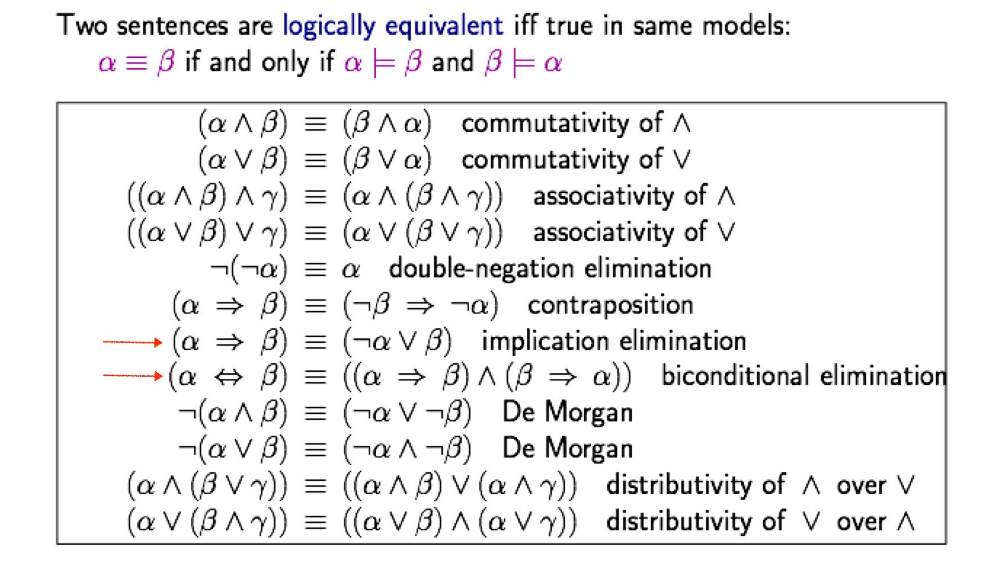
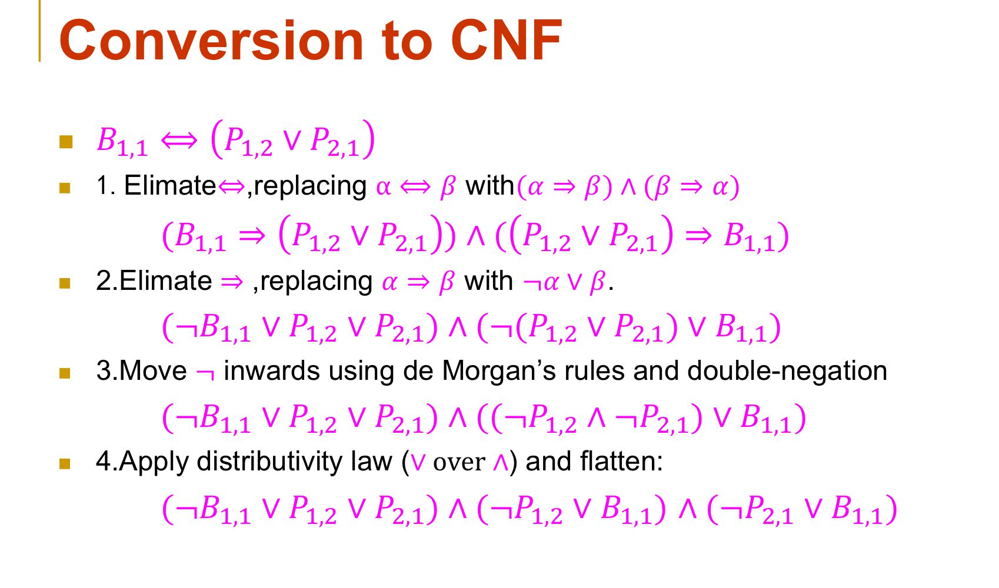
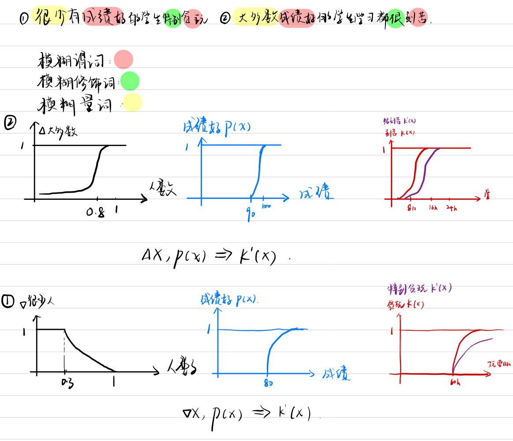
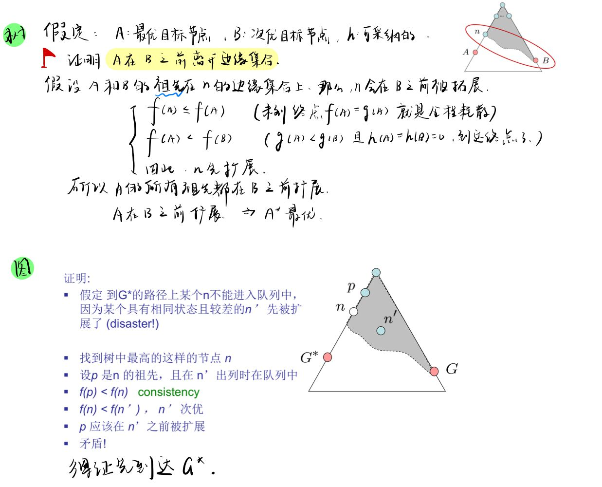

# 高级人工智能-命题逻辑与一阶谓词逻辑（3）

## 1. 基础知识

### 1. 1 符号

- $\Rightarrow, \rightarrow $：表示 “蕴涵”（Implication）.

  - $P \rightarrow Q$：读作 “P 推出 Q” 或 “P 蕴涵 Q”

  - “仅当 P 真 Q 假时，P 蕴涵 Q 为假”
- $\Leftrightarrow, \leftrightarrow$ ：表示“当且仅当”

  - $P \leftrightarrow Q$：读作 “P 等价 Q” 或者 “P 当且仅当 Q”
- $\vDash $：$KB \vDash \alpha$，Entailment 是指一件事从另一件事中产生。知识库 $KB$ 包含句子 $\alpha$，如果且仅当 $\alpha$ 在 $KB$ 为真的所有世界中为真。

### 1.2 真值表（Truth tables for connectives）

### 1.3 用于判断永真式（valid）

### 1.4 一些定理（选择题）

### 1.5 下标有 2 个

### 1.6 一些公式

### 1.7 转换为合取范式（4 步法）（大题）

### 1.8 基本等值式有 3 个最为常用和重要

- 分配率：
  - $$P \vee (Q \wedge R) <==> (P \vee Q) \wedge (P \vee R)$$
  - $$P \wedge (Q \vee R) <==> (P \wedge Q) \vee (P \wedge R)$$
- 摩根率：  
  - $$\neg (P \vee Q) <==> \neg P \wedge \neg Q$$
  - $$\neg (P \wedge Q) <==> \neg P \vee \neg Q$$
- 蕴涵等值式：
  - $$P \Rightarrow Q <==> \neg P \vee Q$$
  - $$P \Leftrightarrow Q <==> (P \Rightarrow Q) \wedge (Q \Rightarrow P)$$

### ß1.9 带有**存在量词**的一阶谓词逻辑的句子转换为合取范式**（5 步法）**

- $$\forall x [\forall y \ Animal(y) \Rightarrow Loves(x, y)] \Rightarrow [\exists y \ Loves(y, x)]$$
  - Step 1：处理 $\Rightarrow$
    - $$\neg \forall x [ \forall y \ \neg Animal(y) \vee Loves(x, y)] \vee [\exists y \ Loves(y, x)]$$
  - Step 2：处理 $\neg$
    - $$\forall x [\forall y \neg \neg Animal(y) \wedge  \neg Loves(x, y)] \vee [\exists y \ Loves(y, x)]$$
  - Step 3：处理存在量词 $\exists \ \forall$，Standardize variables
    - $$\forall x [Animal(F(x)) \wedge \neg Loves(x, F(x))] \vee [Loves(G(x), x)]$$
  - Step 4：Drop universal quantifiers:
    - $$[Animal(F(x)) \wedge \neg Loves(x, F(x))] \vee Loves(G(x),x)$$
  - Step 5：分配率
    - $$[Animal(F(x)) \vee Loves(G(x),y)] \wedge [\neg Loves(x, F(x)) \vee Loves(G(x),x)]$$

### 1.10 构造一阶谓词逻辑的知识库 KB 和句子 $\alpha$

> 构造一阶谓词逻辑的知识库 KB 和句子 $\alpha$，使得 $KB \models \alpha$ 的归结过程永远不会停止。

$$KB: \{\forall x \ P(x) \Rightarrow P(x+1), \alpha: \exists y \ \neg P(y\}$$

$\neg \alpha : \exists y \ P(y)$（目标取反），将 KB 与 $\alpha$ 转化为 CNF 得：

- $$\neg P(x) \vee P(x+1)$$
- $$P(x)$$

归结不会停止。

## 2. “永真”（valid） ？

- $(Smoke \Rightarrow Fire) \Rightarrow ((Smoke \wedge Heat) \Rightarrow Fire)$
  - 转换为合取范式：
  - Step 1：$$\neg (\neg Smoke \vee Fire) \vee (\neg (Smoke \wedge Heat) \vee Fire)$$
  - Step 2：$$(Smoke \wedge \neg Fire) \vee ((\neg Smoke \vee \neg Heat) \vee Fire)$$
  - Step 3：$$(Smoke \vee \neg Smoke \vee \neg Heat \vee Fire) \wedge (\neg Fire \vee \neg Smoke \vee \neg Heat \vee Fire)$$
  - $$(True) \wedge (True) $$

## 3. “不可满足”（un-satisfiable）？

不可满足：谓词公式在任一解释下都为假。例如：

- $$\forall x (P(x) \wedge \neg P(x))$$
- $$\forall x P(X) \wedge \exists x (\neg P(x))$$

如下是一些题目：

- $\beta \vDash \alpha$ 为真，当且仅当 $(\beta \wedge \neg \alpha)$ 是不可满足的。
- 既不是 “永真” 的，又不是 “不可满足的”：$(Smoke \vee Heat) \Rightarrow (Smoke \wedge Heat)$
  - 即：它有真有假。

## 4. 一阶谓词逻辑

使用一阶谓词逻辑表达 “胜者为王，败者为寇”？

$$\forall x (Person(x) \wedge Winner(x)) \Rightarrow king(x)$$

$$\forall x (Person(x) \wedge Loser(x)) \Rightarrow kou(x)$$

## 5. 模糊逻辑

## 6. 证明 A* 树搜索最优

> A* **树**搜索最优的条件是：启发函数是可采纳的。

证明：

- 如果启发函数 $h(n)$ 是可采纳的，那么树搜索的 A* 算法是最优的。
- 如何启发函数是一致性的，那么图搜索的 A* 算法是最优的。

