# 算法设计与分析复习（2020 年秋季学期）（2）

> 人工智能花了很多时间，算法的复习只剩一天了。看一遍作业，把基础的东西都搞懂吧，难得东西就先不管了。

## 0. NPC 问题

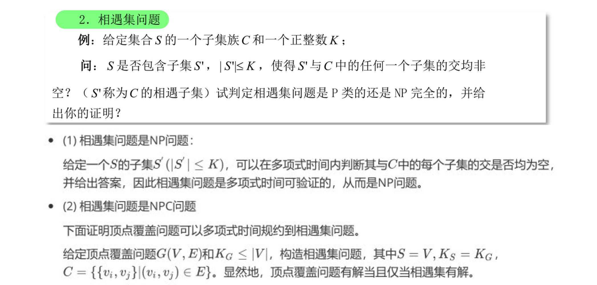

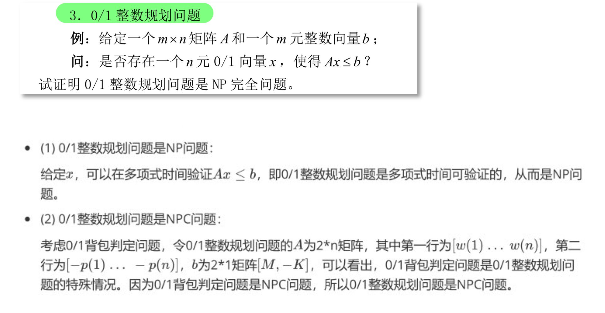

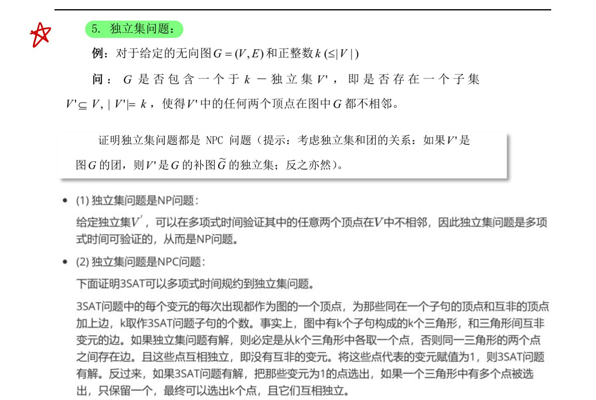

## 1. 分枝限界算法

✅ **25、LC 分枝限界法求解 0/1 背包问题**

> 课后练习 22
>
> （1）用 LC 分枝限界算法求解下面的 0-1 背包问题，并画出所生成的状态空间树。
>
> - N=5，M=12，(p1,p2, ..., p5)=(10, 15, 6, 8, 4), (w1, w2, ..., w5)=(4, 6, 3, 4, 2).
>
> （2）用 FIFO 分枝限界算法求解下面的 0-1 背包问题，并画出所生成的状态空间树。
>
> - N=5, M=15, (w1, w2, ..., w5) = (p1, p2, ..., p5) = (4, 4, 5, 8, 9).

- $\check{c}$：下界

- $U$：上界

---

上界估值 Pvu 和下界估值 Pvl。

## 2. 作业

**1、XYZ 公司的运算速度是 ABC 公司的 100 倍。？**

解题思路：关键是表示出  100 倍这个概念。

ABC 公司 1h 内能解决 n 个问题，单位时间操作：$\frac{n}{1h}=t_1$

则，XYZ 公司 1h 内能解决设为 n1 个问题，但是时间操作：$\frac{n1}{1h}=t_2=\frac{1}{100}t_1$（100 倍）

如果 ABC 公司在 1h 能解决 $n^2$ 个问题，则：

$$n^2 \cdot t_1 = (n1)^2 \cdot t_2 = (n1)^2 \cdot \frac{1}{100}t_1$$

这 XYZ 公司 1h 内能解决的问题：$n_1 = 10n$。

**2、BFS、DFS、D_Search 的检测顺序和访问顺序？**

什么是检测顺序？

- 出栈顺序

什么是访问顺序？

- 入栈顺序

D_Search 就是改造的 BFS，使用 stack 来替代原本的 queue。

**3、二叉树的镜像算法 SWAPTREE？**

> 一道 easy 级别的 LeetCode 算法题。

（1）使用递归是最简单的实现。

```c++
TreeNode* swap_tree(TreeNode* root) {
  // 递归终止条件
  if (root == nullptr)
    return nullptr;

  swap_tree(root->left);
  swap_tree(root->right);
  swap(root->left, root->right); // 交换左右子树
  return root;
}
```

（2）如果不适用递归的话，需要使用 queue 来进行辅助。先根节点入队：

- Step1：如果队列非空，取出队头节点，curr
- Step2：swap(curr->left, curr->right)
- Step3：如果 curr->left 非空，则左孩子入队；如果 curr->right 非空，则右孩子入队。
- 重复 Step1。

**4、三分检索算法？**

```c++
m = (r - l) / 3;
m1 = l + m;
m2 = l + 2*m;
```

关于比较次数问题，我认为不同的人按照自己的理解所编写的代码，最后所统计出来的比较次数会有略微差异。主要是在最后的小区间处理上，以及为了代码的简洁或许会多出一些多余的比较，但这都是常数级的，不会随着输入
n 的的增大而增大。当输入的有序数组中，目标值有重复时，我所实现的三分查找不能保证找到的是第一个出现的值。如：`int A[] = {0, 1, 2, 3, 5, 5, 5, 5, 8, 9, 10};`

在第一查询中，target = 5，但是索引 m2= 6 直接命中。

**5、$\sqrt{n}$ 段合并排序？**

- √n 段划分是要记得处理最后剩余的一段
- 只有当 √n = 0 时，才停止划分，开始归并。

归并的时候比较有意思。对于将√n 段进行归并时，仍然调用的是两段归并。这个图不好画，值得注意的一点是，它每次归并都是把一小段归入一个大段。

我还是乱画了一下（没有体现时间线），但是核心在于最后几次归并，把一个小的有序段归入到一个很大的有序段中，我想要表达的是这个：
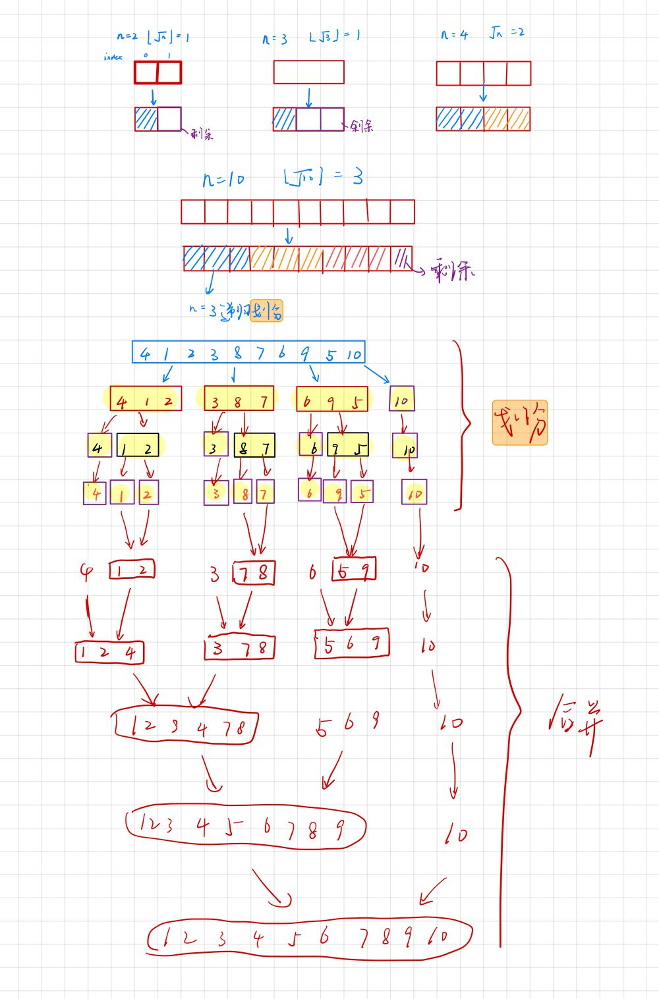

**6、快速排序？**

partition 操作：

```C++
int partition(int A[], int l, int r) {
  int v = A[l];  // 为了方便分析取第一个数作为基准值
                  // 实践中可以随机，避免快排退化： 
                  // int r = l + rand() % (r - l + 1);
                  // swap(A[r], A[l]);
                  // int v = A[l];
  int i = l + 1;
  int j = r;
  while (true) {
    while (i <= r && A[i] <= v)
      i++;
    while (j > l && A[j] > v)
      j--;
    if (i > j) // 结束循环
      break;
    swap(A[i++], A[j--]);
  }
  swap(A[l], A[j]);
  return j;
}

```

**7、Partition 什么时候退出循环？**

```c++
i = l+1;
p = r;
```

我觉得之后处理好两路的 while 循环，就不会存在 `i == p` 的情形。

还要多琢磨。

**8、棋盘的覆盖问题？**

将 $2k \times 2k$ 的棋盘，先分成相等的四块子棋盘，（左上、左下、右上、右下）。其中特殊方格位于四个中的一个，构造剩下没特殊方格三个子棋盘：将一块骨牌放在这三个小棋盘的交界处，使得交界处像一个“田”字。

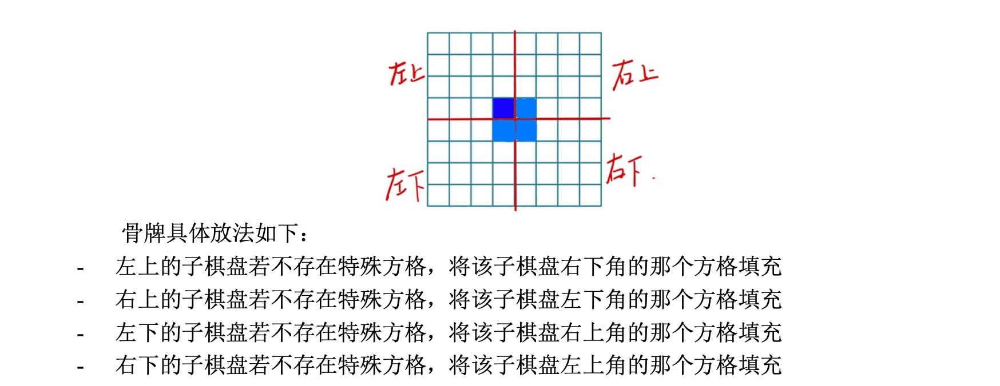

**9、0/1 背包问题的最优解 $FO(I)$ 和贪心解 $FG(I)$？**

$$n = 7, M = 15, (p1, p2, p3, p4, p5, p6, p7)=\{10, 5, 15, 7, 6, 18, 3\}, (w1, w2, w3, w4, w5, w6, w7)=\{2, 3, 5, 7, 1, 4, 1\}$$

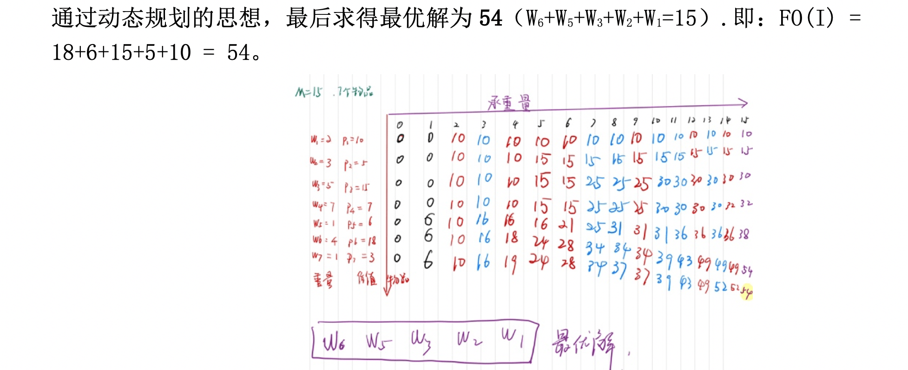

GREEDY-KNAPSACK 解：

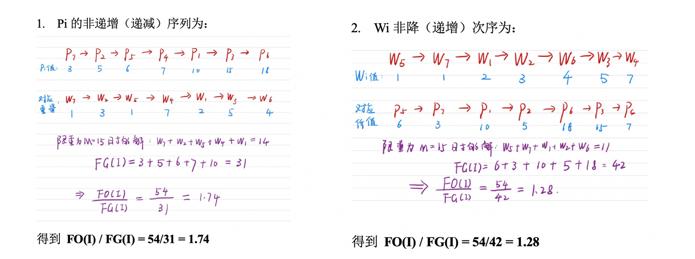

**9、作业排序问题证明**

> 课后练习 9.

向来对证明问题不来电。

**10、Huffman 树和斐波那契数列的结合**

（1）字符 a~h 出现的频率恰好是前 8 个斐波那契数。

```
0 1 2 3 5 8 13
```

使用 Heap 数据结构。

（2）推广到 n 个字符的情况。

**11、逆序数**

> 又是一道经典的 LeetCode 算法题。

逆序数可以利⽤归并排序的思想，在归并两个有序段时，进⾏逆序数统计。

下⾯是⼀个例⼦。将⻩⾊和绿⾊两段归并，`i` 是左边段的开始索引，`j` 是右边段的开始索引。

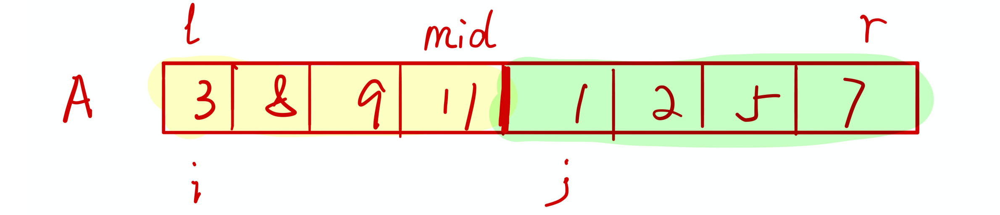

归并过程中，如果 `A[i] > A[j]` ，说明出现 `A[i]` 到 `A[mid]` 的所有树都⼤于 `A[j]` ，所以此时
`A[j]` 的逆序数为 $(mid - i + 1)$ 。以这个规则进⾏统计，直到归并结束。

```c++
else { // aux[i - l] > aux[j - l] 逆序数存在在这里
  A[k] = aux[j - l];
  reverse_size += (mid - i + 1); // 进行计数
  j++;
}
```

**11、最小生成树算法：Prim 和 Kruskal**

Prim算法：

- 从 A 点出发，将A标记为已访问，然后将所有的邻边（AB, AC, AD）加入到最小堆中；
- 从最小堆中取出一条最小边，如果这条边的另一个节点没有被访问，则将此边加入最小生成树中，再从这个未访问的节点出发，标记为已访问，继续将所有邻边加入最小堆中；
- 不断循环，直到把所有的边都找到。

Kruskal算法：

- 将所有的边加入到最小堆中；
- 取出堆顶最小的边，如果这条边和已经找到的MST边不构成环（UnionFind），这加入 MST；
- 不断循环，知道堆中元素为空。

**12、最短路径算法 SHORTEST-PATH**

> 以某个节点为源点，计算它到其他节点的最短路径。

📝 [2020.12.14 #作业# Dijkstra 最短路径算法](https://landodo.github.io/posts/20201214-Shortest-path)

松弛操作。

**13、删数问题**

> 输入一个正整数 n（有效位数 $\leq 240$），去掉任意的 s 个数字后，剩下的数字按原左右次序组成一个新的正整数。对于给定的 n 和 s，使得剩下的数字组成的新数最小。

解题：

- 将 n 转为字符串

- Step 1：

  - 如果遇到递减的，即 `n[j] < n[j-1] `，则删除 `n[j-1]`

  - 如果没有递减的，则删除最后一位

- Step 2：重复 Step 1 s 次

```c++
// num: 输入的数字
// s: 删除的位数
string delete_num(string num, int s) {
  if (num.size() <= s)
  return "0";

  for (int i = 0; i < s; ++i) {
    bool sorted = true;
    for (int j = 1; j < num.size(); ++j) {
      if (num[j] < num[j-1]) {
        sorted = false;
        num.erase(num.begin() + j-1);
        break; // break for j
      }
    }
    if (sorted)
      num.erase(num.end() - 1);
  }
  return num;
}
```

**14、前向递推求解多段图**

> s 到 t 的最小成本。
>
> 也可以后向处理。

- 向前递推

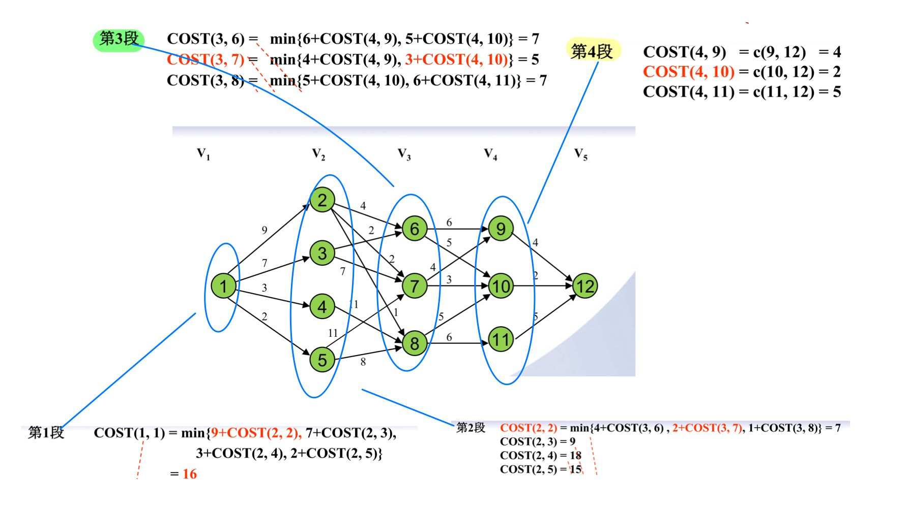

- 向后递推

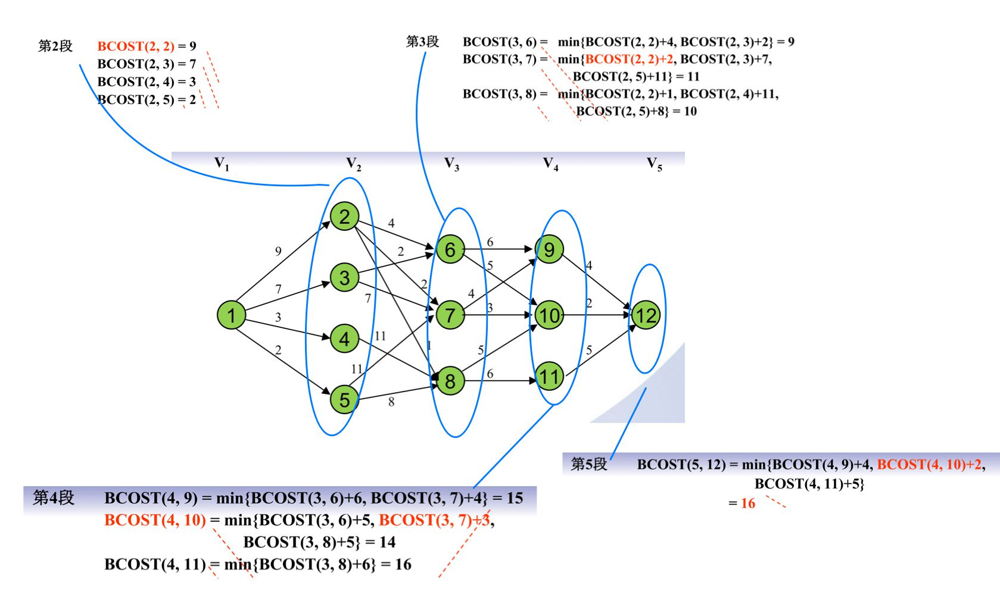

**15、树塔问题**

> 课后练习 14

求解路径值：自底向上

- 第一步初始化 dp 数组：将最底层数据写入 dp；
- 然后自底向上更新：`dp[i][j] = max(dp[i+1][j], dp[i+1][j+1]) + data[i][j]`，最后的结果保存在 `dp[0][0]`。

求解路径：自上而下

- 使用 dp 数组进行辅助。如果 `dp[i-1][j] - data[i-1][j] == dp[i][j]`，则 `data[i][j]` 是路径上的节点。

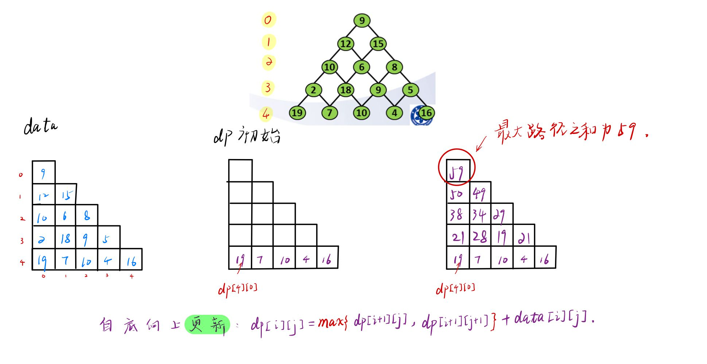

**16、求每对节点的最短路径**

使用 Floyd 算法求解。算法复杂度 $O(n^3)$，有三层循环：

```c++
算法 Floyd(W[1...n, 1...n])
// 输入：不包含长度为负的回路的图的邻接矩阵W
// 输出：包含最短路径长度的距离矩阵
D <- W
for k <- 1 to n do
  for i <- 1 to n do
    for j <- 1 to n do
      D[i][j] <- min{D[i][j], D[i, k] + D[k, j]}
return D

```

通过不断加入中间节点，求得最后的最短路径。

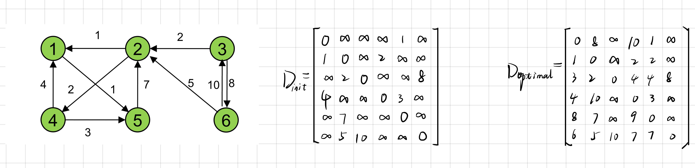

**17、最优二分检索树**

> 课后练习 16.
>
> 题目会要求计算 $W(i, j), R(i, j), C(i, j)$。

公式：

$$W(i, j)=P(j)+Q(j)+W(i, j-1)$$

$$C(i, j)=min_{i < k \leq j} \{ C(i, k-1)+C(k, j) \} + W(i, j)$$

$$R(i, j)=k$$（树根）

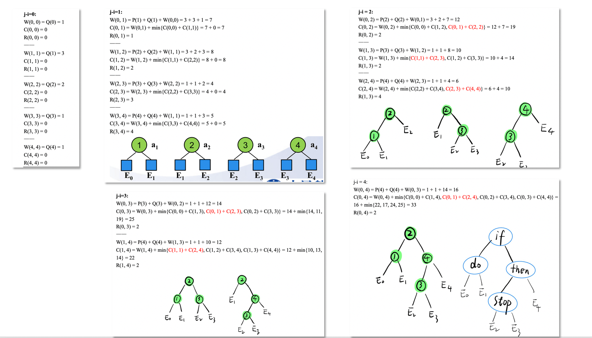

**18、序偶法求解背包问题**

> n = 4
>
> (w1, w2, w3, w4)=(5, 3, 4, 7)
>
> (p1, p2, p3, p4)=(3, 2, 5, 9)
>
> M=15

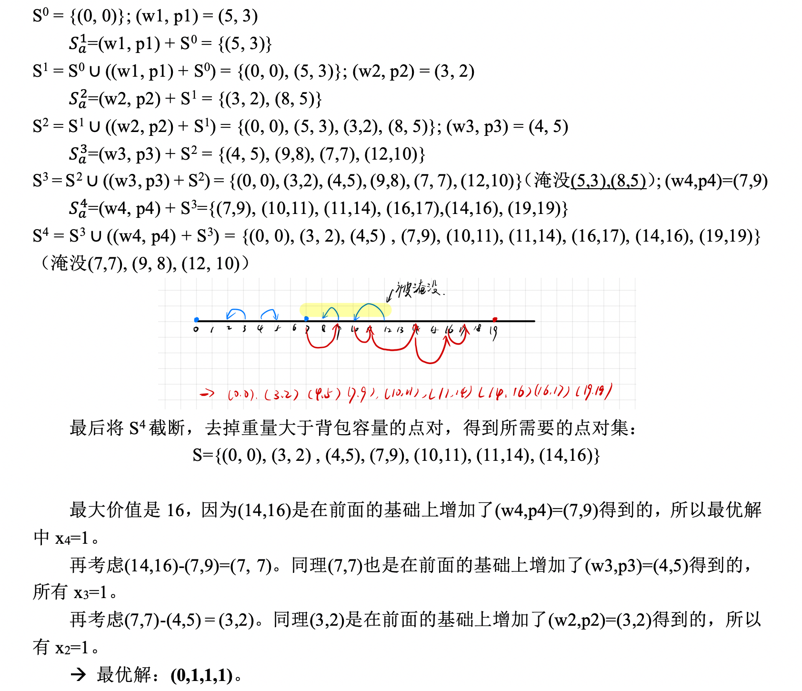

**19、分配机器**

> 课后练习 18.
>
> 有 5 台机器，分别分配给 A、B、C 三个厂子，工厂在获得不同数量的机器后，产生的盈利如下表。找出 5 台机器的最佳分配方式。

思路：

- 假设只有 A、B 两厂

  - $xA+yB$：分给 A 厂 $x$ 台，分给 B 厂 $y$ 台。
  - 遍历从 0~5 台机器的情况。

  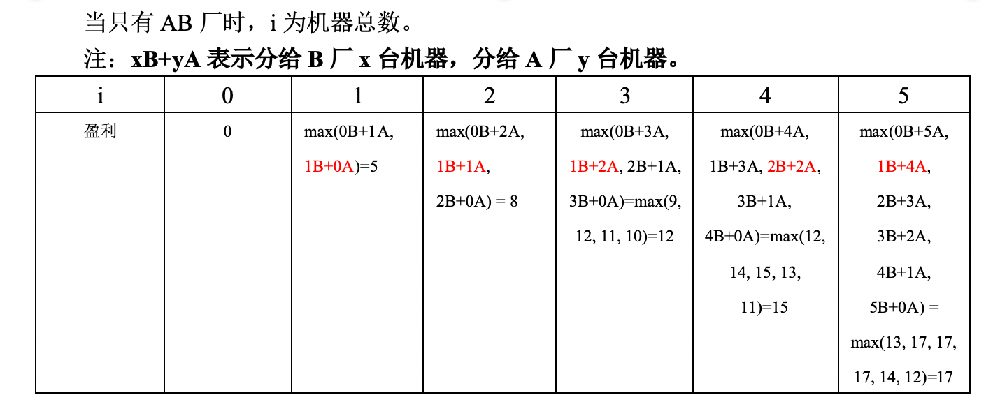

- 假设有 AB、C 三个厂

  - $xC + yAB$：分给 C 厂 $x$ 台，分给 AB 两厂共 $y$ 台

  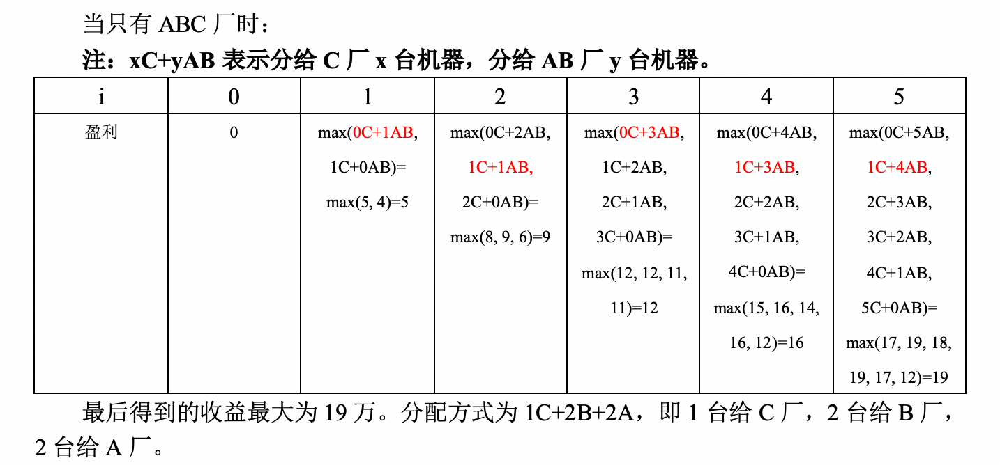

**20、最大子段和**

蛮力法比较基础，复杂度较高。

可以采用一次遍历的方法 $O(n)$，`curr_sum` 只要不小于 0，就一直累加过去。每次都取 `sum = max(sum, curr_sum);`。

- 首先对数组进行遍历，当前最大连续子序列和为 `curr_sum`，最大和为 `max_sum`

- 如果 `curr_sum > 0`，则说明 `curr_sum` 对结果有增益效果，则 `curr_sum` 保留并加上当前遍历数字;

- 如果 `curr_sum <= 0`，则说明 `curr_sum` 对结果无增益效果，需要舍弃，则 curr_sum 直接更新为当前遍历数字

- 每次取 `curr_sum` 和 `max_sum` 最大值，遍历结束返回结果

```C++
vector<int> max_subarray(int A[], int n) {
  int curr_sum = 0, max_sum = 0;
  int i = 0, j = 0; // 记录最大子段的索引
  for (int k = 0; k < n; ++k) {
    if (curr_sum > 0) {
      curr_sum += A[k];
      j++;
    }
    else {
      curr_sum = A[k];
      i = k;
      j = k;
    }
    max_sum = max(max_sum, curr_sum);
  }

  // 返回最大的子段
  vector<int> sub;
  for (int k = i; k < j; ++k) {
    sub.push_back(A[k]);
  }
  return sub;
}

```

**21、SUMOFSUB**

> 设 W=(5, 7, 10, 12, 15, 18, 20)，M=35.
>
> 使用 SUMOFSUB 找出 W 中使得和数等于 M 的全部子集并画出所生成的部分状态空间树。

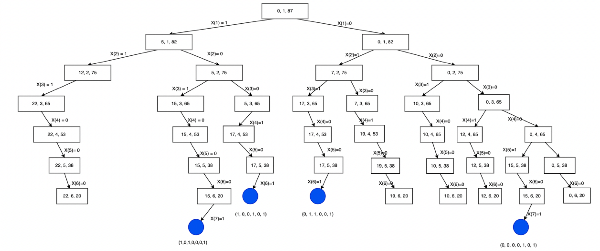

⚠️**22、回溯法：0/1 背包问题**

> 课后练习 20. 真看不懂！！！

**23、24 点问题**

> 算法实现 7

暴力求解

**⚠️24、作业排序问题：FIFOBB、LCBB**

> 课后练习 21

**26、最短路径算法 Dijstral**

📝 [2020.12.14 #作业# Dijkstra 最短路径算法](https://landodo.github.io/posts/20201214-Shortest-path)

**27、NPC 问题的证明**

- 相遇集
- 0-1 整数规划问题
- 独立集问题

