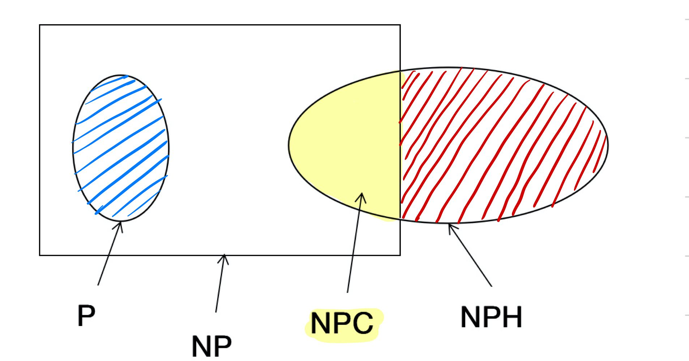

# 算法复习（3）——一些概念

**1、贪心算法设计的关键？应该注意哪些问题？**

- 关键是**贪心策略的选择**。选择的贪心策略必须具备无后效性，即某个状态以前的过程不会影响以后的状态，只与当前状态有关。
- 应该注意：**贪心策略一定要仔细分析其是否满足无后效性。**
  -  可行的（feasible）：即它必须满足问题的约束。
  - 局部最优（locally optimal）：它是当前步骤中所有可行选择中最佳的局部选择。
  - 不可取消（irrevocable）：即选择一旦做出，在算法的后面步骤就不可改变了。

**2、动态规划依据什么原理？设计算法主要有哪几步？需要注意什么？**

原理：通过把原问题分解为相对简单的子问题的方式求解复杂问题的方法。

- 适用情况
  - **最优化原理（Principle of Optimality）：最优化问题任一实例的最优解，都是由其子例的最优解构成的。**
  - 无后效性 ⚠️
  - 有重叠子问题（但是如果没有这条性质，动态规划算法同其他算法相比就不具备优势）
- 步骤
  - 状态的定义
  - 状态转移方程

**3、回溯法和分枝限界法有何不同？**

分枝限界法同回溯法类似，它也是在解空间中搜索问题的可行解或最优解，但搜索的方式不同。

- 回溯法采用**深度优先**的方式，朝纵深方向搜索，直至达到问题的一个可行解，或经判断沿此路径不会达到问题的可行解或最优解时，停止向前搜索，并沿原路返回到该路径上最后一个还可扩展的节点。然后，从该节点出 发朝新的方向纵深搜索。
- 分枝限界法则采用**宽度优先**的方式搜索状态空间树，它将活节点存放在一个特殊的表中。其策略是：
  - 在扩展节点处，首先生成其所有的儿子节点，将那些导致不可行解或导致非最优解的儿子节点舍弃，其余儿子节点加入活节点表中。
  - 然后，从活节点表中取出一个节点作为当前扩展节点，重复上述节点扩展过程。

**4、证明一个 NPC 问题的步骤？**

- （1）证明原问题 $\prod$ 是一个 NP 问题；
- （2）选择一个已知的 NPC 问题 $\prod'$；
- （3）构造一个从 $\prod'$ 到 $\prod$ 的变换 $f$；
- （4）证明 $f$ 为一个多项式变换。

**5、什么是多项式时间？**

- $n^{100}$ 是多项式
- $n^{1000000}$ 是多项式
- $n^{100^{100^{100}}}$ 也是多项式

只要 $n$ 的指数是常数，它就是一个多项式。

**6、P、NP、NPC、NPH？**

- P 问题：如果一个问题找到多项式时间内**解决**它的算法，那么该问题是 P 问题。
- NP 问题：如果可以在多项式时间内**验证**一个问题的解的正确性，那么该问题是 NP 问题。
- NPC 问题：
  - (I) 该问题是 NP 问题
  - (II) NP 里所有问题可以在多项式时间内**归约**到该问题
- NPH 问题：满足条件 (II) 的问题，就是 NPH 问题。




**7、约束传播**

- （1）弧一致性的概念？
  - 弧一致性（Arc-consistency）：给定约束网格 $R=(X, D, C)$，其中 $R_{ij} \in C$，变量 $x_i$ 相对于 $x_j$ 是弧一致的**当且仅当对于每一个 $a_i \in D_i$ 都与存在一个 $a_j \in D_j$，使得 $(a_i, a_j) \in R_{ij}$。*
  - $\{ x_i, x_j \}$ 对应的弧是一致的，当且仅当 $x_i$ 相对于 $x_j$ 是弧一致的，且 $x_j$ 相对于 $x_i$ 是弧一致的。
  - 如果约束网络中所有的弧都是一致的，则该约束网络是弧一致的。
- （2）AC4 算法？
  - AC-1 是一个基于强力搜索的算法，具有分布式特点，时间复杂度 $O(enk^3)$
  - AC-3 是基于序列的算法，时间复杂度 $O(ek^3)$。记录弧两端的变量的值域是否发生变化，来决定它是否需要重新修正。
  - AC-4 是基于上下文的优化算法，时间复杂度 $O(ek^2)$。通过存储大量信息，避免在删除后的约束传播中重复同样的约束检查，从而进一步改进了 AC-3 的时间复杂度。
    - $e$ ：弧（约束）的数目
    - $n$：顶点数量
    - $k$：值域大小

- （3）值域怎么消减？

  - 对于约束网络中的两个顶点 $x_i$ 和 $x_j$，消除 $x_i$ 值域的方法，使得 $x_i$ 相对于 $x_j$ 是弧一致的。
  - $$D_i \leftarrow D_i \cap \pi(R_{ij} \bigotimes D_j)$$

  ```c++
  REVISE((xi), xj)
  	// input: a subnetwork defined by two variables X={xi, xj} , domains: Di constraint Rij
  	// output: Di , such that xi arc-consistent relative to xj 
  	
  	for each ai ∈ Di
      if there is no aj ∈ Dj such that (ai, aj) ∈ Ri,j
      then delete ai from Di
    endif
  endfor
  ```


8、常见的 NPC 问题？

  - 0/1 背包的判定问题是 NPC 问题
    - 注：0/1 背包的判定问题是 NPC 问题；0/1 背包问题是 NPH 问题。
- Steiner-树问题是 NPC 问题
- 三元可满足性问题是 NPC 问题（3SAT）
- 图中的三个问题：顶点覆盖问题、团问题、独立集问题
- Hamilton 回路问题
- 划分问题
- 三元精确覆盖问题

旅行商问题是 NPH 问题。

