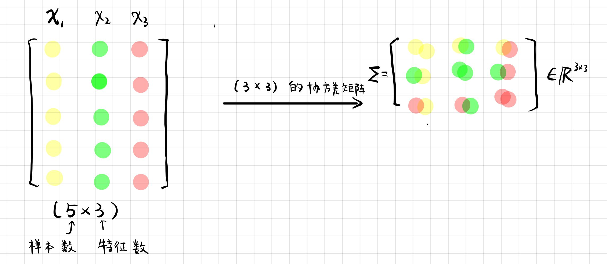
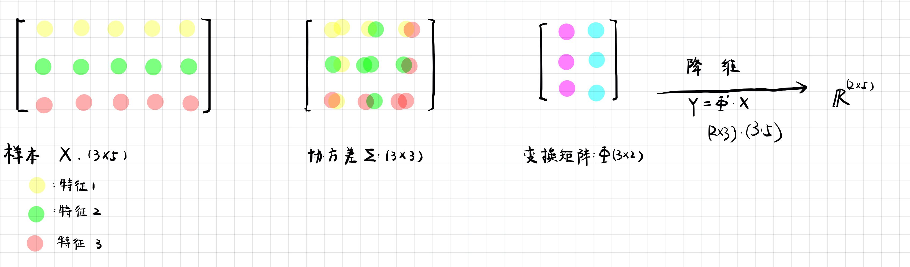
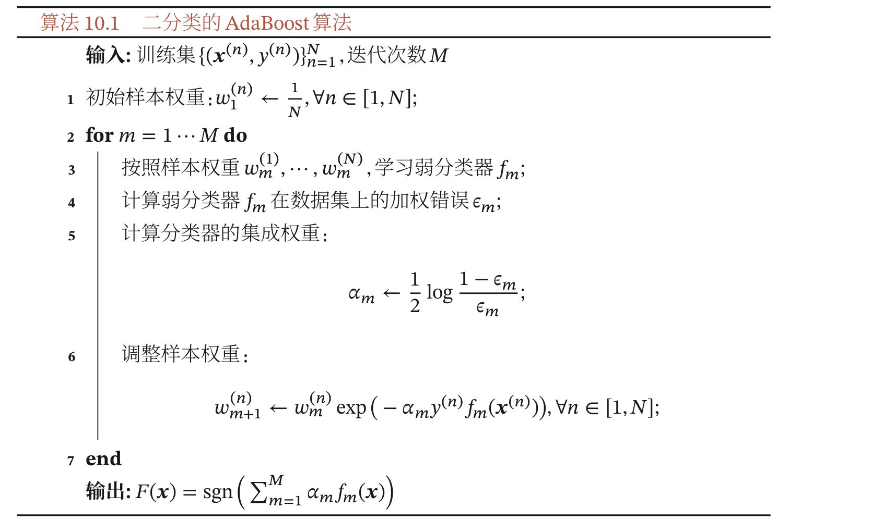

# PRML 2019-2020 试卷

## 1. 选择题考点

**1、H-K 算法相比于感知器算法有什么优点？❓**

最小平方误差算法（Least Mean Square Error）：数据线性不可分时，感知器不会收敛。最小平方误差（LMSE）算法，除了对可分模式是收敛的以外，对于类别不可分的情况也能指出来。

高维情况下，求逆比较困难。对两类情况，提供了线性可分的测试特征。

- Ho-Kashyap(H-K) 算法：求解 $Xw = b$，式中 $b=(b_1, b_2, ..., b_N)$，$b$ 的所有分量都是正值（约束条件）。
  - （1）写出增广矩阵 $X_{n,m}$：$n$ 为样本数，$m$ 为特征数
  - （2）计算伪逆矩阵：$ X^{\sharp} = (X^T X)^{-1} X^T$
  - （3）取 $b(1)$ 为 $n\times1$ 的单位向量，$C = 1$。H-K 的迭代式：$w(1) = X^{\sharp}b(1)$
  - （4）计算 $e(1) = Xw(1)-b(1)$   
    - $e(1) \geq 0$：$w(1)$ 为解
    - $e(1) < 0$：线性不可分，无解。

**2、逻辑回归中的 L1 正则，会产生什么效果❓**

> 可以做特征选择，一定程度上防止过拟合。

## 2. 半监督学习

> 半监督学习对数据样本的三种基本假设❓

- （1）平滑假设（Smoothness assumption）：如果高密度空间中两个点 $x_1, x_2$ 距离较近，那么对应的输出 $y_1, y_2$ 也应接近。
- （2）聚类假设（Cluster assumption）：如果两个点在同一个簇，那么它们可能属于同一类。
- （3）流形假设（Manifold Assumption）：输入空间由多个低维流形组成，所有数据点均位于其上。位于同一流形上的数据点具有相同标签。

## 3. 聚类算法

> 针对不同的数据分布，选择最合适的聚类算法（K 均值、GMM、DBSCAN）❓

（1）K 均值（K-means）

- 假设了各个 cluster 的数据是呈高维球型分布的。
- K-means 是代价函数是非凸的（non-convex），可能不能保证全局最优（可多次 K-means 取最优）。
- 易受离群点的影响。换用中位点（median）作为中心。
- 当簇具有不同的尺寸、密度、非球体，K-means 可能得不到理想的聚类结果。
- 经典的聚类算法，简单、快速（会收敛）。簇接近高斯分布时，效果较好。

（2）GMM（Gaussian Mixture Models and Expectation-Maximization Algorithm）

- 高斯混合模型（GMM）可以看做是 k-means 模型的一个优化。
- 点到簇的从属关系为软分配（E 步是一个软划分版本的 K-means）。
- 可以被用于非球形簇，且各个簇概率不同。

（3）DBSCAN（density-based spatial clustering of application with noise）

- 基于密度：夹着聚类结构能通过样本分布的紧密程度确定。
- 不需要明确簇的数量
- 任意形状的簇
- 对离群点（outliers）较为鲁棒

## 4. K-L 变换和 Fisher 线性判别

> ❓对于具有类别标签的数据，采用 K-L 变换和 Fisher 线性判别分析两种方法对数据降维。
>
> （1）简述两种数据降维方法的剧本过程。（8'）
>
> （2）哪种方式对分类更有效？原因？

### 4.1 K-L 变换

K-L（Karhunen-Loeve） 变换即 PCA。

- （1）协方差矩阵：计算不同维度之间的协方差。

  - 如果样本有三个特征，则计算出来的协方差矩阵为 $3 \times 3$
  - `cov(X')`：传入的样本矩阵`X` 的**行**表示的是样本数量，转置之后 $X'$ 列为特征，计算协方差矩阵。
    - **协方差矩阵计算的是不同维度之间的协方差，而不是不同样本之间的。**因此，⚠️要注意样本矩阵的行和列表示什么，思考在计算的时候要不要进行转置。
  - [协方差、方差、协方差矩阵的计算公式](https://zhuanlan.zhihu.com/p/37609917)
  - 

  

- （2）计算协方差矩阵 $A$ 的特征值 $\lambda$ 及其对应的特征向量 $\eta$。
  - (i) $\left\vert \lambda E - A \right\vert = 0 $ 解出特征值 
  - (II) $(\lambda E - A) x = 0$ 解出特征向量
- （3）如果要降到 2 维，则需要选择出最大的前两个特征值对应的特征向量，得到变换矩阵：
  - $$\Phi = \left[ \begin{matrix} \eta_{1} &\eta_{2} \end{matrix} \right]  $$

- （4）由 $Y = \Phi X'$ 得到降维后的数据。
  - 

### 4.2 Fisher

> [2020.12.31 #PRML# 国科大模式识别（2020 秋季学期）（2）](https://landodo.github.io/posts/20201231-UCAS-PRML-review-II)

（1）Fisher 准则函数中的基本参量（$d$ 维 $X$ 空间）

- $m_i$：各类样本的均值向量
- $S_i$：样本类内离散度矩阵
  - $$S_i = \sum(x-m_i)(x-m_i)^T,i=1,2$$
- $S_w$：总样本类内离散度矩阵
  - $$S_w = S_1 + S_2$$
- $S_b$：样本类间离散度矩阵（半正定）
  - $$S_b = (m_1 - m_2) (m_1 - m_2)^T$$

（2）准则函数

$$J_F(w) = \frac{w^T S_b w}{w^T S_w w}$$

### 4.3 两种变换对于分类

- K-L 变换仅单纯考虑尽可能代表原来模式的主成分，有时并不一定有利于分类的鉴别。

## 5. 逻辑回归的原理

### 5.1 逻辑回归算法的原理

[2021.01.01 #PRML# 国科大模式识别（2020 秋季学期）（3）](https://landodo.github.io/posts/20210101-UCAS-PRML-review-III)

### 5.2 偏差、方差

> （a）训练集：85%，验证集：80%，测试集：75%
>
> （b）训练集：99%，验证集：80%，测试集：78%
>
> 假设不存在**数据不匹配问题**。

- 高偏差（High bias）称为欠拟合（underfitting）。

- 高方差（High variable）称为过拟合（overfitting）。

#### **为什么要需要验证集？**

- 训练集用于学习模型，验证集用于更新超参数。
- 通常要求验证集足够大。如果验证集很小，那么模型的超参数可能就记住了一个小验证集里的样本，模型将对验证集严重过拟合。
- 验证集通常会低估泛化误差。因此当超参数优化完成后，需要通过再在一份独立的测试集上来估计泛化误差。

**（1）高偏差（欠拟合）：**

- 选择一个合适的模型，设计更加优秀的模型
- 增加更多的新特征
- 有正则化项的话，考虑减少正则化参数

**（2）高方差（过拟合）：**

- 正则化（Regularization）：L1、L2
- 数据增强（data augmentation）
- Dropout
- 集成学习策略（ensemble）
- 早停（early stopping）
- 特征选择、减少特征数或使用较少的特征组合

## 6. AdaBoost

### 6.1 AdaBoost 算法的基本思想和工作原理

Boosting 类集成模型的目标是学习一个加性模型（Additive Model）

$$F(x)= \sum_{m=1}^{M} \alpha_m f_m(x)$$

- $f_m(x)$：弱分类器（Week Classifier, Base Classifier）
- $\alpha_m$ ：权重
- $F(x)$：强分类器（Strong Classifier）

**AdaBoost （Adaptive Boosting）**使用一种迭代的方式学习每个弱分类器。假设已经训练了 m 个弱分类器，在训练第 m+1 个分类器时，增加已有弱分类器分错样本的权重，使得 m+1 个分类器更加关注于已有弱分类器分错的样本。

这样增加每个弱分类器的差异，最终提升集成分类器的准确率。

工作原理：AdaBoost 算法是一种迭代式的训练算法，通过改变数据分布来提高弱分类器的差异。在每一轮训练中，增加分错样本的权重，减少分对样本的权重，从而得 到一个新的数据分布。

### 6.2 AdaBoost 算法的伪代码

## 7. 特征提取

> ❓ 从特征提取的角度，分析深度卷积神经网络与传统特征提取方法（如 Gabor 小波滤波器）的异同，并给出深度学习优于传统方法的原因？

### 7.1 CNN V.S. 传统

[图像处理之特征提取](https://zhuanlan.zhihu.com/p/93469302)

