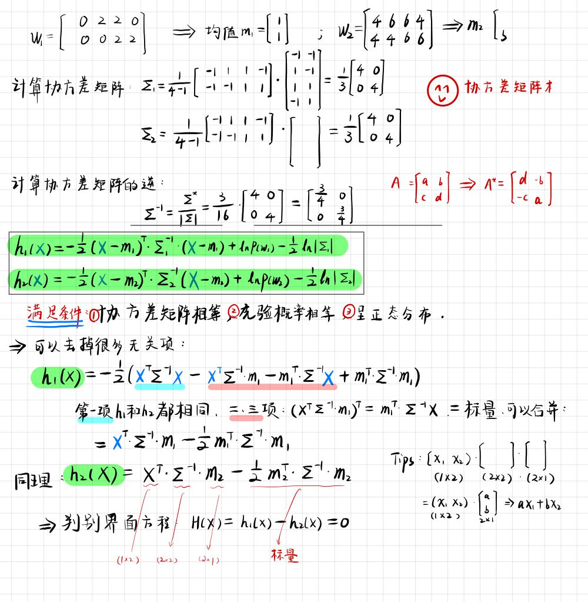
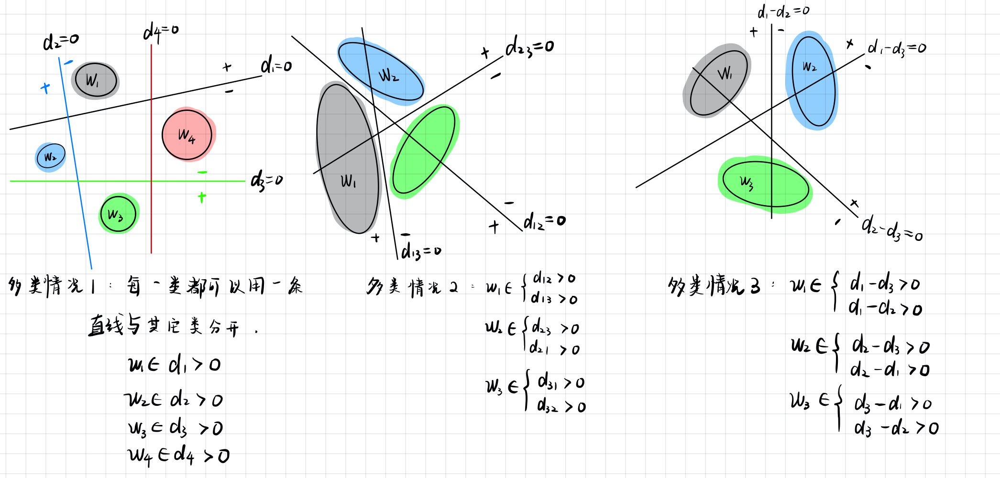
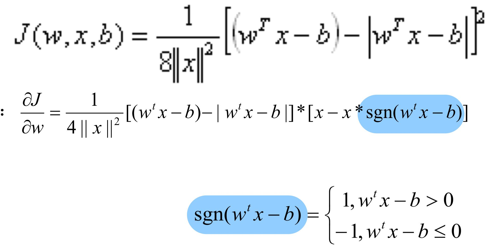
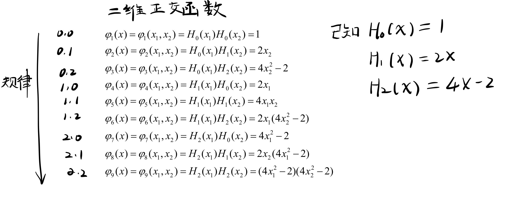

# PRML 的作业题（6）

## 1. 贝叶斯判别函数

> 设以下模式类别具有正态概率密度函数：
>
> $$w_1 : \{(0,0)^T, (2,0)^T, (2,2)^T, (0,2)^T \}$$
>
> $$w_2 : \{ (4,4)^T, (6,4)^T, (6,6)^T, (4,6)^T \}$$
>
> （1）设 $P(w_1) = P(w_2) = \frac{1}{2}$，求这两类模式之间的贝叶斯判别界面的方程式。
>
> （2）绘制判别界面。

如果满足三个条件，则判别函数 $h_i(X)$ 可以化为非常简洁的形式：

$$h_i(X) = X^T \cdot \sum^{-1} \cdot m_i - \frac{1}{2} \cdot m_i^T \cdot \sum^{-1} \cdot m_i$$

## 2. 多类情况 1、2、3

- 多类情况 1：M 类共需要 M 个判别函数。
- 多类情况 2：分开 $M$ 类需要 $\frac{M(M-1)}{2}$ 个判别函数。
  - 如 4 类需要：$d_{12},d_{1,3},d_{1,4},d_{2,3},d_{2,4},d_{3,4}$，共 6 个判别函数。

> 在一个 10 类的模式识别问题中，有 3 类单独满足多类情况 1，其余的类别满足多类情况 2。问该模式识别问题所需判别函数的最少数目是多少?
>
> 答：4 + (7(7 -  1)/2) = 4 + 21 = 25 个。
>
> -  可以先看出是 4 类多类情况 1 的问题，然后其中一个子类中又有 7 个类别，属于多类情况 2 问题。

## 3. 系数分量问题

> 两类模式，每类包括 5 个 3 维不同的模式向量，且良好分布。如果它们是线性可分的，问权向量至少需要几个系数分量? 假如要建立二次的多项式判别函数，又至少需要几 个系数分量?(设模式的良好分布不因模式变化而改变。)

（1）线性可分的：$$w_1 x_1 + w_2 x_2 + w_3 + b = 0$$. 权向量：$W = [w_1, w_2, w_3, b]^T$

（2）对于 $n$ 维的模式向量，若使用 $r$ 次多项式，则 $d(x)$ 的权系数的总项数为：

$$\frac{(n+r)!}{r!n!}$$

此题维度 $n = 3$，二次多项式 $r = 2$，$\Rightarrow \frac{(3 + 2)!}{2!3!} = 10$

## 4. 感知器迭代

- 两类问题 ✅
- 多类问题 ✅

## 5. 梯度法求解

> $J(w,x,b)$ 是一个带有绝对值的函数，复杂的情况下求解 $\frac{\partial J}{\partial w}$。

## 6. 势函数算法

### 6.1 二次埃尔米特多项式

> 分类样本：
>
> $$w_1 : \{ (0,1)^T, (0, -1)^T \}$$
>
> $$w_2 : \{ (1,0)^T, (-1, 0) \}$$
>
> 很明显，这是一个线性不可分数据集。

更新规则，以输入 $X_2$ 为例：

- $$X_2 \in w_1$$，且 $K_1(X_2) > 0 $：不更新
  - 否则，更新势函数：$K_2(X) = K_1(X) + K(X, X_2)$
- $X_2 \in w_2$，且 $K_1(X_2) < 0$：不更新
  - 否则，更新势函数：$K_2(X) = K_1(X) - K(X, X_2)$

### 2. 给定势函数 $K(x, x_k) $ 的情形

$$K(X, X_k) = e^{-[(x_1 - x_{k1})^2 + (x_2 - x_{k_2})^2]}$$

⚠️ 由势函数的迭代公式可知，它具有很强的分类能力，但是当修正次数增多的话，势函 数的项数增多，使计算机的计算量大增。

> 再多看几遍作业。

## 7. 计算散度矩阵和 K-L 降维

### 7.1 散度矩阵

$S_w$：总体类内散度

$S_b$：类间散度

[2020.01.01 #PRML# 散度矩阵（Sw,SbSw,Sb）和 Fisher 降维分类（5）](https://landodo.github.io/posts/20210101-UCAS-PRML-V)

### 7.2 K-L 降维

根据样本计算协方差矩阵。

> 关于计算协方差矩阵 $\frac{1}{N}$ 和 $\frac{1}{N-1}$ 的问题。
>
> $\frac{1}{N-1}$ 是使得**样本**方差是**总体**方差的无偏估计。
>
> [为什么样本方差（sample variance）的分母是 n-1？](https://www.zhihu.com/question/20099757)
>
> 平时手算的时候，考虑的就是总体的样本，不需要做无偏估计。使用 $\frac{1}{N}$ 就好。
>
> - K-L 变换需要计算协方差。
>   - `cov(X', 1)`

无偏估计的公式：

$$S^2 = \frac{1}{N-1} \sum_{i=1}^{N} (X_i - \bar{X})$$

用来模拟 $\delta ^2$。

平时计算的时候：

$$S^2 = \frac{1}{N} \sum_{i=1}^{N} (X_i - \bar{X})$$

