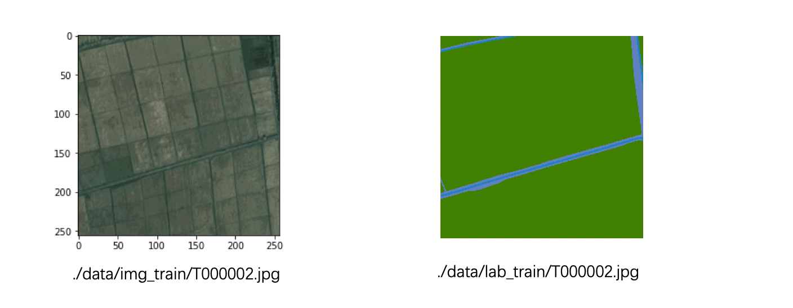
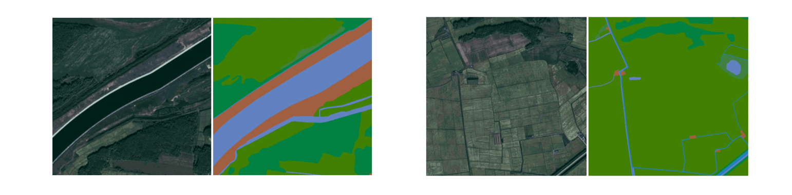
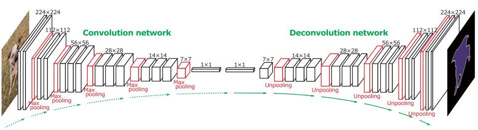
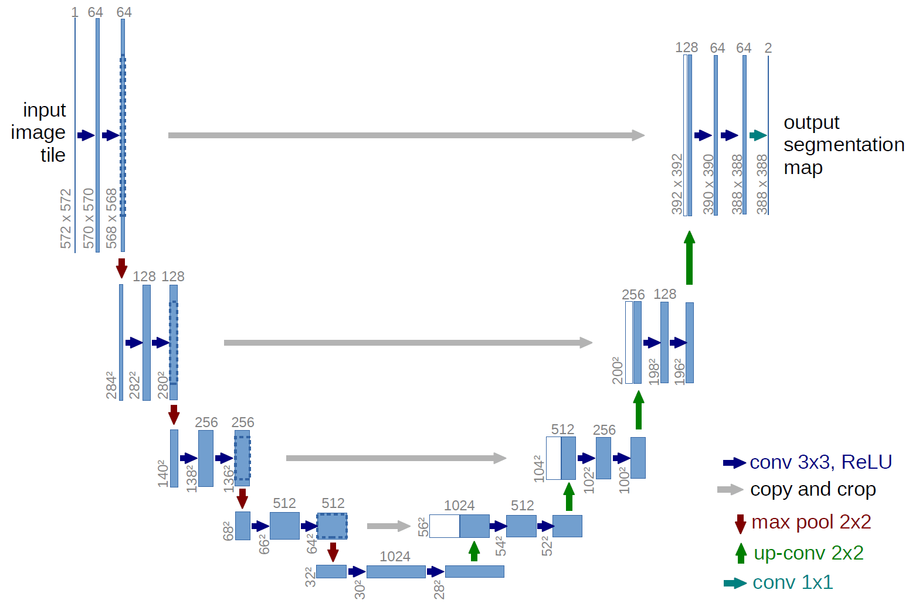
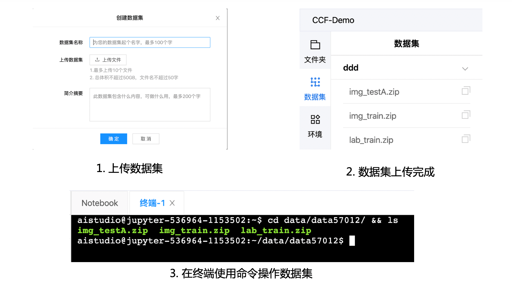
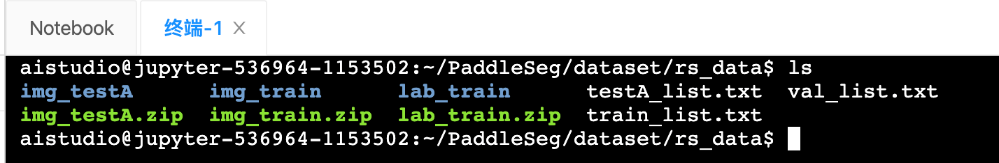
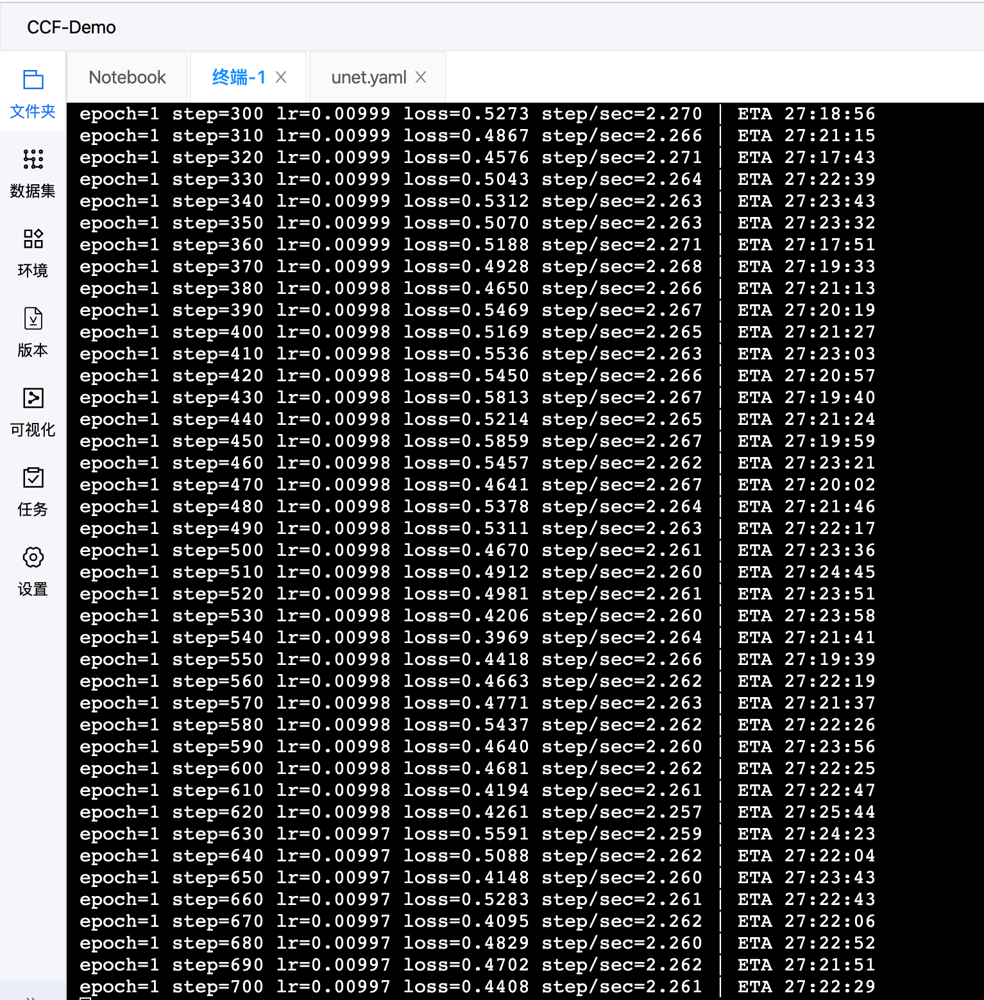
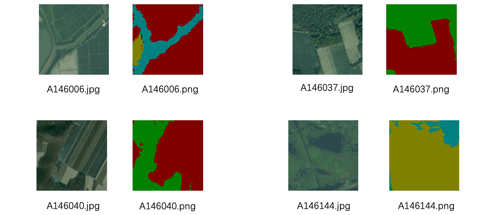
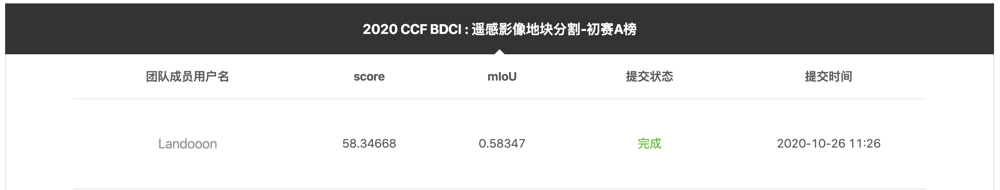

# 高级人工智能大作业报告

[TOC]

## 1. 小组成员

兰冬雷 + 2020E8015382008

## 2. 选题内容

本次比赛我选择的题目是「2020 CCF BDCI: 遥感影像地块分割」。


### 2.1 任务介绍

使用百度飞桨（PaddlePaddle）搭建深度学习模型，对遥感影像数据进行地块分割。遥感图像具体包括建筑、耕地、林地、水体、道路、草地和其他等 7 个类别。

如下是一个训练样本和它对应的标签。训练图片的大小为 $256 \times 256$，对应的标签为 $256\times 256$ PNG 格式的单通道伪彩色标注图片。



像素值与类别对应关系如下表所示：

| 类别   | 建筑 | 耕地 | 林地 | 水体 | 道路 | 草地 | 其他 | 未标注数据 |
| ------ | :--: | :--: | :--: | :--: | :--: | :--: | :--: | :--------: |
| 像素值 |  0   |  1   |  2   |  3   |  4   |  5   |  6   |    255     |

```python
palette = {
    # bgr
    "[64, 128, 0]": 2,   # forest
    "[192, 128, 96]": 3, # water
    "[0, 128, 64]": 1,   # filed
    "[64, 64, 96]": 6,   # else
    "[192, 128, 32]": 4, # road
    "[0, 128, 96]": 0,   # building
    "[64, 128, 64]": 5,  # grass
    "[255, 255, 255]": 255,
}
```

提交的预测结果为 zip 压缩包（ccf_baidu_remote_sense.zip），压缩包中包含与测试集（img_testA）中的文件名相同的单通道 PNG 图片。

### 2.2 数据集

数据集分为训练集（img_train）和测试集（img_testA）。训练集的标签为 lab_train。

```shell
➜  data ls
img_train/      lab_train/      img_testA/
```

文件夹结构：

```shell
dada/
    img_train/
        T000000.jpg  # 每个结果文件以 [图像名称.png] 命名 
        T000001.jpg
        T000002.jpg
        T000003.jpg
        T000004.jpg
        T000005.jpg
        T000006.jpg
        T000007.jpg
        ...
        
    lab_train/
        T000000.jpg
        T000001.jpg
        T000002.jpg
        T000003.jpg
        T000004.jpg
        T000005.jpg
        T000006.jpg
        T000007.jpg
        ...
       
   img_testA/
        A145981.jpg
        A145982.jpg
        A145983.jpg
        A145984.jpg
        A145985.jpg
        ...
```

- 训练集样本数：145,981
- 测试集样本数：10,000


## 3. 小组分工

分组的时候，我自己落单了，因此就一个人摸索着完成这次作业任务。

## 4. 解题思路

### 4.1 图像分割

图像分割中常见的术语是：superpixels（超像素）、Semantic Segmentation（语义分割）、Instance Segmentation（实例分割）、Panoptic Segmentation（全景分割）。

语义分割（Semantic Segmentation）：

- 关注如何将图像分割成属于不同语义类别的区域，这些语义区域的标注和预测都是像素级的。
- 与目标检测相比，语义分割标注的像素级的边框显然更加精细。
- 语义分割只能判断类别，无法区分个体。

实例分割（Instance Segmentation）：

- 研究如何识别图像中各个目标实例的像素级区域。
- 与语义分割有所不同，实例分割不仅需要区分语义，还要区分不同的目标实例。如果图像中有两只狗，实例分割需要区分像素属于这两只狗中的哪一只。

全景分割（Panoptic Segmentation）是语义分割和实例分割的结合。

**2020 CCF BDCI: 遥感影像地块分割**就是一道语义分割题，图像中的每个像素都被分类到其各自的类。



### 4.2 分割网络 U-Net

#### 4.2.1 全卷机网络（FCN）

> Fully Convolutional Networks for Semantic Segmentation

FCN 从抽象的特征中恢复出每个像素所属的类别，即从图像级别的分进一步延伸到像素级别分类。



采用反卷积层对最后一个卷积层的 Feature map 进行上采样，使它恢复到输入图像相同的尺寸，从而可以对每个像素都产生了一个预测，同时保留了原始输入图像中的空间信息，最后在上采样的特征图上进行逐像素分类。

缺点：

- 分割结果不够精细，细节不敏感。
- 没有充分考虑像素与像素之间的关系。

#### 4.2.2 U-Net

> U-Net: Convolutional Networks for Biomedical Image Segmentation

U-Net 最大的特点是 ”U“ 型对称结构和 skip connection。

U-Net 是 FCN 的一个改进。



U-Net的 encoder 下采样 4 次，一共下采样 16 倍。对称地，其 decoder 也相应上采样 4 次，将 encoder 得到的高级语义特征图恢复到原图片的分辨率。

U-Net 在医学图像分割上表现的特别好，成为大多做医疗影像语义分割任务的 baseline。

一些常见的图像分割网络包括：SegNet、RefineNet、PSPNet、DeepLab、Mask-R-CNN、DenseNet 等。

在遥感图像分割比赛中，提供一些预训练好的分割网络，包括：deeplabv3、unet、pspnet、hrnet、fast_scnn、ocrnet。

```python
model_urls = {
  # COCO pretrained
    "deeplabv3p_mobilenetv2-1-0_bn_coco":
    "https://paddleseg.bj.bcebos.com/deeplab_mobilenet_x1_0_coco.tgz",
    "deeplabv3p_xception65_bn_coco":
    "https://paddleseg.bj.bcebos.com/models/xception65_coco.tgz",
    "unet_bn_coco":
    "https://paddleseg.bj.bcebos.com/models/unet_coco_v3.tgz",
    "pspnet50_bn_coco":
    "https://paddleseg.bj.bcebos.com/models/pspnet50_coco.tgz",
    "pspnet101_bn_coco":
    "https://paddleseg.bj.bcebos.com/models/pspnet101_coco.tgz",

    # Cityscapes pretrained
    "deeplabv3p_mobilenetv3_large_cityscapes":
    "https://paddleseg.bj.bcebos.com/models/deeplabv3p_mobilenetv3_large_cityscapes.tar.gz"
    "deeplabv3p_mobilenetv2-1-0_bn_cityscapes":
    "https://paddleseg.bj.bcebos.com/models/mobilenet_cityscapes.tgz",
    "deeplabv3p_xception65_gn_cityscapes":
    "https://paddleseg.bj.bcebos.com/models/deeplabv3p_xception65_cityscapes.tgz",
    "deeplabv3p_xception65_bn_cityscapes":
    "https://paddleseg.bj.bcebos.com/models/xception65_bn_cityscapes.tgz",
    "deeplabv3p_resnet50_vd_cityscapes":
    "https://paddleseg.bj.bcebos.com/models/deeplabv3p_resnet50_vd_cityscapes.tgz",
    "unet_bn_coco":
    "https://paddleseg.bj.bcebos.com/models/unet_coco_v3.tgz",
    "icnet_bn_cityscapes":
    "https://paddleseg.bj.bcebos.com/models/icnet_cityscapes.tar.gz",
    "pspnet50_bn_cityscapes":
    "https://paddleseg.bj.bcebos.com/models/pspnet50_cityscapes.tgz",
    "pspnet101_bn_cityscapes":
    "https://paddleseg.bj.bcebos.com/models/pspnet101_cityscapes.tgz",
    "hrnet_w18_bn_cityscapes":
    "https://paddleseg.bj.bcebos.com/models/hrnet_w18_bn_cityscapes.tgz",
    "fast_scnn_cityscapes":
    "https://paddleseg.bj.bcebos.com/models/fast_scnn_cityscape.tar",
    "ocrnet_w18_bn_cityscapes":
    "https://paddleseg.bj.bcebos.com/models/ocrnet_w18_bn_cityscapes.tar.gz",
}
```


### 4.3 图像分割常用的数据集

- Pascal VOC

- MS COCO

- City Scapes

## 5. 实现过程

### 5.1 深度学习框架：PaddlePaddle

百度 AI Studio 提供了免费的计算资源，以及一些基本的训练方法和比赛的评测脚本可以加快进展。


飞桨（[PaddlePaddle](https://github.com/PaddlePaddle/Paddle)）是百度自主研发、功能完备、 开源开放的产业级深度学习平台，集深度学习核心训练和推理框架、基础模型库、端到端开发套件和丰富的工具组件于一体。与 PyTorch、TensorFlow 一样，是一个深度学习框架，基于这些深度学习框架，开发者可以快速的搭建深度学习模型。

###  5.2 环境及其一些准备 

#### 5.2.1 创建工程

这里我将工程名称命名为 「CCF-Demo」。

百度 AI Studio 提供了免费的计算资源（CPU=2/RAM=8GB/磁盘=100GB），还有大量算力卡，可以使用 Tesla V100 GPU、16GB Video Mem、4 Core CPU 及 32GB RAM 加快模型的训练。

创建完成后，启动环境。

#### 5.2.2 clone PaddleSeg 代码库

新建一个终端，clone 大赛官方提供的一个基础代码库，里面提供的一些脚本（train.py、eval.py 等）能提供帮助。因此，可以让我们更加专注于模型的调优上。

```shell
git clone https://github.com/PaddlePaddle/PaddleSeg
```


#### 5.2.3 创建数据集

创建数据集后，在 AI Studio 中创建的所有项目，都可以共享这个数据集。

步骤如下：

- 从大赛官网下载数据集后，进入「个人中心」，「创建数据集」。
- 将下载好的数据集上传到 AI Studio，就可以在项目工程中使用 `cp` 命令拷贝数据集到任意指定路径下。



#### 5.2.4 生成数据集 txt 文件

- 使用 `cp` 命令拷贝数据集到指定的文件夹（`./dataset/rs_data`）。

```powershell
# 进入 /dataset/rs_data 文件夹
cd /home/aistudio/PaddleSeg/dataset/rs_data
# 拷贝训练集、测试集到 rs_data 文件夹下
cp /home/aistudio/data/data57012/img_testA.zip .
cp /home/aistudio/data/data57012/img_train.zip .
cp /home/aistudio/data/data57012/lab_train.zip .
```

- 将数据集压缩包进行解压

```powershell
# 解压文件夹
unzip img_testA.zip
upzip img_train.zip
upzip lab_train.zip
```

- `find` 、管道 `|` 和重定向命令 `>` 创建 txt

**划分测试集、验证集、测试集**

将训练集中 $\frac{1}{50}$ 数据划分为验证集，用于超参数的调优。

因为总训练（img_train.zip）的样本数是 145,981，因此划分后的训练集和验证集大小分别为：

训练集样本数：$train \ set = \frac{49}{50} \times 145981 = 143062$

验证集样本数：$val \ set = \frac{1}{50} \times 145981 = 2919$

```powershell
#!/bin/bash
find img_testA -type f | sort > testA_list.txt
echo "Create text_list.txt"
 

find img_train -type f | sort > train.ccf.tmp
find lab_train -type f | sort > train.lab.ccf.tmp
paste -d " " train.ccf.tmp train.lab.ccf.tmp > all.ccf.tmp

awk '{if (NR % 50 != 0) print $0}' all.ccf.tmp > train_list.txt
awk '{if (NR % 50 == 0) print $0}' all.ccf.tmp > val_list.txt

rm *.ccf.tmp
echo "Create train_list.txt and val_list.txt."
```

- 创建完成后 txt，rs_data 文件夹的文件信息如下



其中，`train_list.txt`、`val_list.txt` 和 `testA_list.txt` 的文件前 3 行内容为：

训练集 `train_list.txt`：

```powershell
img_train/T000000.jpg lab_train/T000000.png
img_train/T000001.jpg lab_train/T000001.png
img_train/T000002.jpg lab_train/T000002.png
...
```

验证集 `val_list.txt`：

```powershell
img_train/T000049.jpg lab_train/T000049.png
img_train/T000099.jpg lab_train/T000099.png
img_train/T000149.jpg lab_train/T000149.png
...
```

测试集 `testA_list.txt`：

```powershell
img_testA/A145981.jpg
img_testA/A145982.jpg
img_testA/A145983.jpg
...
```

至此数据集已经准备完成。

### 5.3 下载 COCO Pretrained 模型

[COCO](<https://cocodataset.org/#home>) （Common Objects in Context）是一个大规模的对象检测（Detection）、分割（Segmentation）和描述（Captioning）的数据集。


COCO 有以下几个特点：

- 对象检测（Object segmentation）
- 上下文识别（Recognition in context）
- 超像素物体分割（Superpixel stuff segmentation）
- 330K 图片
- 150 万对象实例
- 80 对象类别
- 91 物体类别
- 每张图片的 5 个描述
- 25 万人的关键点

下载一个经过 COCO 预训练的模型，加快训练速度。

```python
# pretrained_model/download_model.py
import sys
import os

LOCAL_PATH = os.path.dirname(os.path.abspath(__file__))
TEST_PATH = os.path.join(LOCAL_PATH, "..", "test")
sys.path.append(TEST_PATH)
from test_utils import download_file_and_uncompress

model_urls = {
  # ImageNet Pretrained
  # ...
  
  # COCO pretrained
  "unet_bn_coco":
  "https://paddleseg.bj.bcebos.com/models/unet_coco_v3.tgz",
  
  # Cityscapes pretrained
  #...
}

model_name = sys.argv[1]
url = model_urls[model_name]
download_file_and_uncompress(
    url=url,
    savepath=LOCAL_PATH,
    extrapath=LOCAL_PATH,
    extraname=model_name)
```

使用 `pretrained_model/download_model.py` 脚本下载预训练过的模型 “unet_bn_coco”。

```powershell
python pretrained_model/download_model.py unet_bn_coco
```

### 5.4 准备配置

确定相关配置，主要是对数据集路径、预训练模型、训练超参数进行配置。

```yaml
# 数据集配置
DATASET:
    DATA_DIR: "./dataset/rs_data"
    NUM_CLASSES: 7 
    TRAIN_FILE_LIST: "./dataset/rs_data/train_list.txt" # 训练集
    VAL_FILE_LIST: "./dataset/rs_data/val_list.txt"     # 验证集
    TEST_FILE_LIST: "./dataset/rs_data/testA_list.txt"  # 测试集
    VIS_FILE_LIST: "./dataset/rs_data/testA_list.txt"

# 预训练模型配置
MODEL:
    MODEL_NAME: "unet"
    DEFAULT_NORM_TYPE: "bn"

# 其他配置
TRAIN_CROP_SIZE: (256, 256)
EVAL_CROP_SIZE: (256, 256)
AUG:
    AUG_METHOD: "unpadding"
    FIX_RESIZE_SIZE: (256, 256)
BATCH_SIZE: 32
TRAIN:
    PRETRAINED_MODEL_DIR: "./pretrained_model/unet_bn_coco/"  # 预训练模型
    MODEL_SAVE_DIR: "./saved_model/unet/"
    SNAPSHOT_EPOCH: 1
TEST:
    TEST_MODEL: "./saved_model/unet/final"
# 超参数配置值
SOLVER:
    NUM_EPOCHS: 100   # 训练 100 个 EPOCH
    LR: 0.01
    LR_POLICY: "poly" # 学习率衰减策略
    OPTIMIZER: "sgd"  # 优化方法采用随机梯度下降
```

### 5.5 训练

```shell
# 指定 GPU 卡号
aistudio@jupyter-536964-1153502:~/PaddleSeg$ export CUDA_VISIBLE_DEVICES=0
# 开始训练
aistudio@jupyter-536964-1153502:~/PaddleSeg$ python pdseg/train.py --use_gpu --cfg ./unet.yaml
```

**终端输出信息：**

- AUG：数据增强
- BATCH_SIZE：32
- DATASET
- MODEL
- STD
- SOLVER

```powershell
{'AUG': {'AUG_METHOD': 'unpadding',
         'FIX_RESIZE_SIZE': (256, 256),
         'FLIP': False,
         'FLIP_RATIO': 0.5,
         'INF_RESIZE_VALUE': 500,
         'MAX_RESIZE_VALUE': 600,
         'MAX_SCALE_FACTOR': 2.0,
         'MIN_RESIZE_VALUE': 400,
         'MIN_SCALE_FACTOR': 0.5,
         'MIRROR': True,
         'RICH_CROP': {'ASPECT_RATIO': 0.33,
                       'BLUR': False,
                       'BLUR_RATIO': 0.1,
                       'BRIGHTNESS_JITTER_RATIO': 0.5,
                       'CONTRAST_JITTER_RATIO': 0.5,
                       'ENABLE': False,
                       'MAX_ROTATION': 15,
                       'MIN_AREA_RATIO': 0.5,
                       'SATURATION_JITTER_RATIO': 0.5},
         'SCALE_STEP_SIZE': 0.25,
         'TO_RGB': False},
 'BATCH_SIZE': 32,
 'DATALOADER': {'BUF_SIZE': 256, 'NUM_WORKERS': 8},
 'DATASET': {'DATA_DIM': 3,
             'DATA_DIR': './dataset/rs_data',
             'IGNORE_INDEX': 255,
             'IMAGE_TYPE': 'rgb',
             'NUM_CLASSES': 7,
             'PADDING_VALUE': [127.5, 127.5, 127.5],
             'SEPARATOR': ' ',
             'TEST_FILE_LIST': './dataset/rs_data/testA_list.txt',
             'TEST_TOTAL_IMAGES': 10001,
             'TRAIN_FILE_LIST': './dataset/rs_data/train_list.txt',
             'TRAIN_TOTAL_IMAGES': 143062,
             'VAL_FILE_LIST': './dataset/rs_data/val_list.txt',
             'VAL_TOTAL_IMAGES': 2919,
             'VIS_FILE_LIST': './dataset/rs_data/testA_list.txt'},
 'EVAL_CROP_SIZE': (256, 256),
 'FREEZE': {'MODEL_FILENAME': '__model__',
            'PARAMS_FILENAME': '__params__',
            'SAVE_DIR': 'freeze_model'},
 'MEAN': [0.5, 0.5, 0.5],
 'MODEL': {'BN_MOMENTUM': 0.99,
           'DEEPLAB': {'ASPP_WITH_SEP_CONV': True,
                       'BACKBONE': 'xception_65',
                       'BACKBONE_LR_MULT_LIST': None,
                       'DECODER': {'CONV_FILTERS': 256,
                                   'OUTPUT_IS_LOGITS': False,
                                   'USE_SUM_MERGE': False},
                       'DECODER_USE_SEP_CONV': True,
                       'DEPTH_MULTIPLIER': 1.0,
                       'ENABLE_DECODER': True,
                       'ENCODER': {'ADD_IMAGE_LEVEL_FEATURE': True,
                                   'ASPP_CONVS_FILTERS': 256,
                                   'ASPP_RATIOS': None,
                                   'ASPP_WITH_CONCAT_PROJECTION': True,
                                   'ASPP_WITH_SE': False,
                                   'POOLING_CROP_SIZE': None,
                                   'POOLING_STRIDE': [1, 1],
                                   'SE_USE_QSIGMOID': False},
                       'ENCODER_WITH_ASPP': True,
                       'OUTPUT_STRIDE': 16},
           'DEFAULT_EPSILON': 1e-05,
           'DEFAULT_GROUP_NUMBER': 32,
           'DEFAULT_NORM_TYPE': 'bn',
           'FP16': False,
           'HRNET': {'STAGE2': {'NUM_CHANNELS': [40, 80], 'NUM_MODULES': 1},
                     'STAGE3': {'NUM_CHANNELS': [40, 80, 160],
                                'NUM_MODULES': 4},
                     'STAGE4': {'NUM_CHANNELS': [40, 80, 160, 320],
                                'NUM_MODULES': 3}},
           'ICNET': {'DEPTH_MULTIPLIER': 0.5, 'LAYERS': 50},
           'MODEL_NAME': 'unet',
           'MULTI_LOSS_WEIGHT': [1.0],
           'OCR': {'OCR_KEY_CHANNELS': 256, 'OCR_MID_CHANNELS': 512},
           'PSPNET': {'DEPTH_MULTIPLIER': 1, 'LAYERS': 50},
           'SCALE_LOSS': 'DYNAMIC',
           'UNET': {'UPSAMPLE_MODE': 'bilinear'}},
 'NUM_TRAINERS': 1,
 'SLIM': {'KNOWLEDGE_DISTILL': False,
          'KNOWLEDGE_DISTILL_IS_TEACHER': False,
          'KNOWLEDGE_DISTILL_TEACHER_MODEL_DIR': '',
          'NAS_ADDRESS': '',
          'NAS_IS_SERVER': True,
          'NAS_PORT': 23333,
          'NAS_SEARCH_STEPS': 100,
          'NAS_SPACE_NAME': '',
          'NAS_START_EVAL_EPOCH': 0,
          'PREPROCESS': False,
          'PRUNE_PARAMS': '',
          'PRUNE_RATIOS': []},
 'SOLVER': {'BEGIN_EPOCH': 1,
            'CROSS_ENTROPY_WEIGHT': None,
            'DECAY_EPOCH': [10, 20],
            'GAMMA': 0.1,
            'LOSS': ['softmax_loss'],
            'LOSS_WEIGHT': {'BCE_LOSS': 1,
                            'DICE_LOSS': 1,
                            'LOVASZ_HINGE_LOSS': 1,
                            'LOVASZ_SOFTMAX_LOSS': 1,
                            'SOFTMAX_LOSS': 1},
            'LR': 0.01,
            'LR_POLICY': 'poly',
            'LR_WARMUP': False,
            'LR_WARMUP_STEPS': 2000,
            'MOMENTUM': 0.9,
            'MOMENTUM2': 0.999,
            'NUM_EPOCHS': 50,
            'OPTIMIZER': 'sgd',
            'POWER': 0.9,
            'WEIGHT_DECAY': 4e-05},
 'STD': [0.5, 0.5, 0.5],
 'TEST': {'TEST_MODEL': './saved_model/unet/final'},
 'TRAIN': {'MODEL_SAVE_DIR': './saved_model/unet/',
           'PRETRAINED_MODEL_DIR': './pretrained_model/unet_bn_coco/',
           'RESUME_MODEL_DIR': '',
           'SNAPSHOT_EPOCH': 1,
           'SYNC_BATCH_NORM': False},
 'TRAINER_ID': 0,
 'TRAIN_CROP_SIZE': (256, 256)}
#Device count: 1
batch_size_per_dev: 32
2021-01-04 13:08:56,803-INFO: If regularizer of a Parameter has been set by 'fluid.ParamAttr' or 'fluid.WeightNormParamAttr' already. The Regularization[L2Decay, regularization_coeff=0.000040] in Optimizer will not take effect, and it will only be applied to other Parameters!
LDL Print
<paddle.fluid.executor.Executor object at 0x7f5b9ff4ac10>
W0104 13:08:56.974175  1232 device_context.cc:252] Please NOTE: device: 0, CUDA Capability: 70, Driver API Version: 10.1, Runtime API Version: 9.0
W0104 13:08:56.979652  1232 device_context.cc:260] device: 0, cuDNN Version: 7.6.
[SKIP] Shape of pretrained weight ./pretrained_model/unet_bn_coco//logit/weights doesn't match.(Pretrained: (21, 64, 3, 3), Actual: (7, 64, 3, 3))
2021-01-04 13:09:00,343-WARNING: ./pretrained_model/unet_bn_coco/.pdparams not found, try to load model file saved with [ save_params, save_persistables, save_vars ]
There are 90/91 varaibles in ./pretrained_model/unet_bn_coco/ are loaded.
Use multi-thread reader
epoch=1 step=10 lr=0.01000 loss=1.3015 step/sec=2.065 | ETA 30:03:45
epoch=1 step=20 lr=0.01000 loss=0.8718 step/sec=2.286 | ETA 27:09:37
epoch=1 step=30 lr=0.01000 loss=0.6958 step/sec=2.292 | ETA 27:04:52
epoch=1 step=40 lr=0.01000 loss=0.7423 step/sec=2.273 | ETA 27:18:32
epoch=1 step=50 lr=0.01000 loss=0.7022 step/sec=2.278 | ETA 27:15:00
epoch=1 step=60 lr=0.01000 loss=0.5958 step/sec=2.268 | ETA 27:21:53
epoch=1 step=70 lr=0.01000 loss=0.6351 step/sec=2.276 | ETA 27:16:08
epoch=1 step=80 lr=0.01000 loss=0.5411 step/sec=2.276 | ETA 27:16:15
epoch=1 step=90 lr=0.01000 loss=0.6404 step/sec=2.274 | ETA 27:17:06
epoch=1 step=100 lr=0.01000 loss=0.6394 step/sec=2.262 | ETA 27:25:50
epoch=1 step=110 lr=0.01000 loss=0.5915 step/sec=2.280 | ETA 27:12:43
epoch=1 step=120 lr=0.01000 loss=0.6254 step/sec=2.263 | ETA 27:25:02
....
```




### 5.6 提交分割结果

训练完成后，使用如下的命令进行评估。

```powershell
python pdseg/eval.py --use_gpu --cfg ./unet.yaml
```

最终的结果产生在 `visual` 文件夹下，包含与测试集（img_testA）中的文件名相同的单通道 PNG 图片。



## 6. 实现结果

指标平均交并比 $MIoU$，记真实值为 $i$，预测为 $j$  的像素数量为 $p_{ij}$：

$$MIoU = \frac{1}{K+1} \sum_{i = 0}^{k} \frac{p_{ii}}{\sum_{j = 0}^{k} p_{ij} + \sum_{j = 0}^{k} p_{ji} - p_{ii}}$$



第一次提交的成绩为：

- score = 58.34668
- **mIoU = 0.58347**
- 团队成员：1/5
- 团队排名：354
- 作品最新提交日期：2020-10-26 11:26
- 作品最新提交人：Landooon

**$mIoU = 0.58374$ 为只训练了 1 个 EPOCH 的成绩。（后面的我忘记提交了）**

1 个 EPOCH 耗时 ≈ 30 分钟，此时的学习率从 0.01 衰减到了 0.00982，**loss = 0.3859**。将这个结果提交的大赛网站，就获得了如上图 0.58347 的 mIoU。

```powershell
epoch=1 step=4470 lr=0.00982 loss=0.3859 step/sec=2.264 | ETA 26:52:23
Save model checkpoint to ./saved_model/unet/1
```

EPOCH = 2，**loss = 0.3193**.

```powershell
epoch=2 step=8940 lr=0.00964 loss=0.3193 step/sec=2.259 | ETA 26:23:12
Save model checkpoint to ./saved_model/unet/2
```

EPOCH = 3，**loss = 0.2968.**

```shell
epoch=3 step=13410 lr=0.00946 loss=0.2968 step/sec=2.262 | ETA 25:47:44
Save model checkpoint to ./saved_model/unet/3
```

EPOCH = 4，**loss = 0.2857.**

```powershell
epoch=4 step=17880 lr=0.00928 loss=0.2857 step/sec=2.261 | ETA 25:15:35
Save model checkpoint to ./saved_model/unet/4
```

EPOCH = 5，**loss = 0.3391.**

```
epoch=5 step=22350 lr=0.00910 loss=0.3391 step/sec=2.262 | ETA 24:42:08
Save model checkpoint to ./saved_model/unet/5
```

EPOCH = 6，**loss = 0.2846.**

```powershell
epoch=6 step=26820 lr=0.00891 loss=0.2846 step/sec=2.255 | ETA 24:13:53
Save model checkpoint to ./saved_model/unet/6
```

## 7. 作业总结

1. 我这次的作业没有组队是一个遗憾，我的目前知识储备还较难以取得一个理想的成绩。
2. 深度学习在训练的时候真的好消耗时间（1 个 EPOCH ≈ 30 分钟），需要一台配置非常好的电脑。
3. 这个数据集我保存下来了，后期我会使用较为熟悉的 PyTorch 实现这个分割任务，以及尝试采用一个更加先进的分割网络。

---

PPT

[2020 CCF BDCI 遥感影像地块分割 PPT](./2020-CCF-BDCI-Remote-Sensing-Image-Block-Segmentation-PPT.pdf)