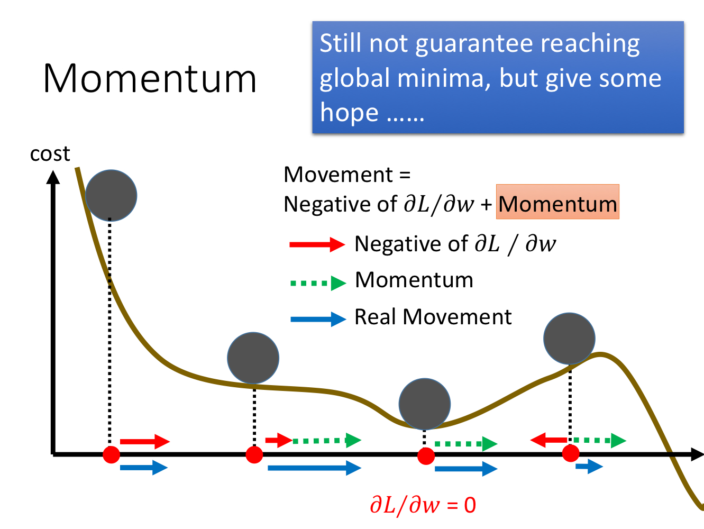

# 寒假 TODO LIST（2021.01.09~2021.02.27）

接近两个月的寒假，是一个难得的自我提升的好机会。

今天已经提交了高级人工智能课程的报告的 PPT，算是正式结课了。接下来只需要每两周阅读一篇论文，并进行汇报，这是所里布置的学习任务。

但我也有一个自己的学习清单，分为如下几个大部分。

> PS：过一遍，做好笔记，就可以去掉 “❌”。看看自己一个月后能去掉去掉多少个。
>
> - 💢：正在做
> - ❌：未开始
> - ✅：已完成
> - ⚠️：中断

## 机器学习与深度学习

- **吴恩达**的深度学习课程 💢

  - （1）问题一：逻辑回归究竟在拟合些什么东西？
  - （2）深度神经网络维度：$Z^{[1]} = W^{[1]}X + b^{[1]}$
    - 隐藏层 1：$\mathbb{R}^{(n^{[1]} \times m)} = \mathbb{R}^{(n^{[1]} \times n^{[0]})} \cdot \mathbb{R}^{(n^{[0]} \times m)} + \mathbb{R}^{(n^{[1]} \times m)}$
    - $m$ 为样本数。
  - （3）问题：平常编程一般只使用训练集和测试集，可以尝试在代码中加入验证集。
  - （4）SGD 的 Cost 为什么会出现震荡的现象？细节原因是什么？
  - （5）局部最优问题：吴恩达老师说在一个很高维（如 2 万维）的空间中，想要得到局部最优，需要所有的 2 万个方向的梯度都是 0，这发生的几率非常小，实践中更容易碰到的是鞍点。我的疑问是：只要存在局部最优点，优化过程也就有可能会遇到，算法也就有可能陷入局部最优。我的理解是 Momentum 等优化算法因为存在动量，因此在大部分情况下可以逃离局部最优（李宏毅 PPT）。但是如果动量不足以逃离，依然陷入局部最优呢？是采用不同的初始化点重新开始训练来解决这个问题吗？

  

  - （5）

- 过一遍配套的实验。

课程的详细学习笔记需要再详细的看两遍以上。

- **李宏毅**的 ML&DL ❌

看一遍视频课程，并且做好笔记。一定要做笔记。

- 慕课网**刘宇波**老师的「Python3 入门机器学习」💢

  - ✅ [第一、二章]：概述
    - [1-1 什么是机器学习、1-2 课程涵盖内容和理念、1-3 技术栈、2-1 机器学习世界的数据、2-2 机器学习的主要啊任务 2-3 监督、非监督、半监督、强化学习、2-4 批量学习、在线学习、参数、非参数学习、2-5 哲学思考](./20210110-imooc-python3-ml)
  - ✅ [第三章]：Numpy
    - [3-1 Jupyter Notebook、3-2 魔法命令 %run, %time、3-3 numpy.array](./20210110-imooc-python-ml-chapter-3)
    - [3-4 其他创建 numpy.array 的方法](./20210113-imooc-3-4-numpy-array)
    - [ 3-5 Numpy.array 的基本操作：切片、reshape](./20210113-imooc-ml-3-5-numpy)
    - [3-6 numpy 数组的合并与分割：concatenate (vstack/hstack)、split (vsplit/hsplit)](./20210113-imooc-ml-3-6-numpy)
    - [3-7 numpy.array 中的运算: Universal Function](./20210113-imooc-ml-3-7-numpy)
    - [3-8 Numpy 中的聚合操作：min、max](./20210113-imooc-ml-3-8)
    - [3-9 numpy 中的 arg 运算：索引](./20210113-imooc-ml-3-9)
    - [3-10 numpy中的比较运算和 Fancy Indexing](./20210113-imooc-ml-3-10)
    - [3-11 matplotlib 数据可视化基础](./20210113-imooc-ml-3-11)
    - [3-12 数据加载和简单的数据探索：Iris Plants dataset](./20210113-imooc-ml-3-12)
  - ✅ [第四章]：kNN
    - [4-1 K 近邻算法基础](./20210113-imooc-ml-4-1-knn)
    - [4-2 scikit-learn 中机器学习算法封装：封装自己的 kNN 算法](./20210114-imooc-ml-4-2)
    - [4-3 划分训练数据集、测试数据集：编写自己的 train_test_split](./20210114-imooc-ml-4-3)
    - [4-4 分类准确度：封装自己的 accuracy_score 和 score](./20210114-imooc-4-4)
    - [4-5 kNN 中的超参数：k、weights、p](./20210114-imocc-ml-4-5)
    - [4-6 网格搜索与 k 近邻算法中的更多超参数：Grid Search](./20210114-imocc-ml-4-6)
    - [4-7 数据归一化：Normalization、Standardization](./20210114-imooc-ml-4-7)
    - [4-8 sklearn 中的 Scaler：StandardScaler](./20210114-imooc-ml-4-8)
    - [4-9 更多有关 K 近邻算法的思考](./20210114-imooc-ml-4-9)
  - ✅ [第五章]：Linear Regression
    - [5-1 简单线性回归](./20210115-imooc-ml-5-1)
    - [5-2 最小二乘法推导](./20210115-imooc-ml-5-2)
    - [5-3 实现 Simple Linear Regression](./20210115-imooc-ml-5-3)
    - [5-4 向量化加速](./20210115-imooc-ml-5-4)
    - [5-5 衡量线性回归算法的指标 MSE、RMSE、MAE](./20210115-imooc-ml-5-5)
    - [5-6 最好的衡量线性回归算法的指标 R Squared](./20210115-imooc-ml-5-6)
    - [5-7 多元线性回归和正规方程解（解析解）](./20210115-imooc-ml-5-7)
    - [5-8 实现多元线性回归（正规方程解）](./20210115-imooc-ml-5-8)
    - [5-9 使用 sklearn 解决回归问题：LinearRegression、KNeighborsRegressor](./20210115-imooc-ml-5-9)
    - [5-10 更多关于线性回归的问题](./20210115-imooc-ml-5-10)
  - ✅ [第六章]：梯度下降 Gradient Descent
    - [6-1 梯度下降 Gradient Descent](./20210115-imooc-ml-6-1)
    - [6-2 梯度下降法模拟](./20210115-imooc-ml-6-2)
    - [6-3 多元线性回归中的梯度下降法推导](./20210115-imooc-ml-6-3)
    - [6-4 在线性回归模型中使用梯度下降法](./20210115-imooc-ml-6-4)
    - [6-5 梯度下降的向量化和数据标准化](./20210115-imooc-ml-6-5)
    - [6-6 随机梯度下降法](./20210115-imooc-ml-6-6)
    - [6-7 封装我们的 SGD、sklearn 中的随机梯度下降](./20210115-imooc-ml-6-7)
    - [6-8 如何确定梯度计算的准确性：调试梯度下降法](./20210115-imooc-ml-6-8)
    - [6-9 有关梯度下降的更多深入讨论](./20210115-imooc-ml-6-9)
  - ✅ [第七章]：主成分分析（Principal Component Analysis）
    - [7-1 什么是 PCA](./20210115-imooc-ml-7-1)
    - [7-2 梯度上升法求解 PCA 问题：向量化公式](./20210115-imooc-ml-7-2)
    - [7-3 求解数据的主成分 PCA](./20210115-imooc-ml-7-3)
    - [7-4 求数据的前 n 个主成分](./20210115-imooc-ml-7-4)
    - [7-5 高维数据映射为低维数据](./20210125-imooc-ml-7-5)
    - [7-6 scikit-learn 中的 PCA](./20210125-imooc-ml-7-6)
    - [7-7 试手 MNIST 数据集](./20210125-imooc-ml-7-7)
    - [7-8 使用 PCA 降噪](./20210125-imooc-ml-7-8)
    - [7-9 人脸识别与特征脸](20210125-imooc-ml-7-9)
  - ✅ [第八章] 多项式回归和机器学习中的一些重要概念
    - [8-1 什么是多项式回归？](./20210126-imooc-ml-8-1)
    - [8-2 scikit-learn 中的多项式回归与 pipeline ](./20210126-imooc-ml-8-2)
    - [8-3 过拟合和欠拟合](./20210126-imooc-ml-8-3)
    - [8-4 为什么需要训练数据集和测试数据集](./20210126-imooc-ml-8-4)
    - [8-5 学习曲线](./20210126-imooc-ml-8-5)
    - [8-6 验证数据集与交叉验证](./20210223-imooc-python3-ml)
    - [8-7 偏差方差权衡](./20210223-imooc-python3-ml-8-7)
    - [8-8 模型泛化与岭回归：L2 正则化](./20210223-imooc-python3-ml-8-8)
    - [8-9 LASSO 回归：L1 正则化](./20210223-imooc-python3-ml-8-9)
    - [8-10 L1，L2 和 弹性网络](./20210223-imooc-python3-ml-8-10)
  - 💢 [第九章] 逻辑回归 Logistics Regression
    - [9-1 什么是逻辑回归？](./20210224-imooc-python3-ml-9-1)
    - [9-2 逻辑回归的损失函数](./20210224-imooc-python3-ml-9-2)
    - [9-3 逻辑回归损失函数的梯度](./20210224-imooc-python3-ml-9-3)

看一遍视频课程，并且做好相应的课程笔记。

- **《统计学习方法》**❌
- **《机器学习》**🍉 书 ❌
- **《深度学习》**❀ 书 ❌

## 算法与数据结构

- LeetCode 日刷 1~5 题 💢

  - [刷题中...](./2020-11-30-LeetCode-daily)

- > - 慕课网刘宇波老师课程
  >   - （1）「**程序员的内功修炼，学好算法与数据结构 C++**」❌
  >     - 第 1 章 当我们谈论算法的时候，我们在谈论什么？
  >     - 第 2 章 排序基础
  >     - 第 3 章 高级排序算法
  >     - 第 4 章 堆和堆排序
  >     - 第 5 章 二分搜索树
  >     - 第 6 章 并查集
  >     - 第 7 章 图基础
  >     - 第 8 章 最小生成树
  >     - 第 9 章 最短路径
  >     - 第 10 章 结束语
  >   - （2）「**玩转数据结构，从入门到进阶**」❌
  >     - 第 1 章 欢迎学习玩转数据结构
  >     - 第 2 章 不要小瞧数组
  >     - 第 3 章 栈和队列
  >     - 第 4 章 最基础的动态数据结构：链表
  >     - 第 5 章 链表和递归
  >     - 第 6 章 二分搜索树
  >     - 第 7 章 集合和映射
  >     - 第 8 章 优先队列和堆
  >     - 第 9 章 线段树
  >     - 第 10 章 Trie
  >     - 第 11 章 并查集
  >     - 第 12 章 AVL
  >     - 第 13 章 红黑树
  >     - 第 14 章 哈希表
  >     - 第 15 章  结束语
  >   - （3）「玩转算法面试，从真题到思维全面提升算法思维」❌
  >   - （4）「看得见的算法，7 个经典应用诠释算法精髓」❌
  >   - （5）「玩转算法——图论精讲，面试升职必备」❌
  > - 极客时间「算法面试通关 40 讲」❌
  > - 极客时间「数据结构与算法之美」❌

## Python

- 极客时间「Python 核心技术实战」-景霄 💢
- 阅读 Python 源码 ❌
- 《Python Cookbook》第三版中文版
  - 非常好的工具书
