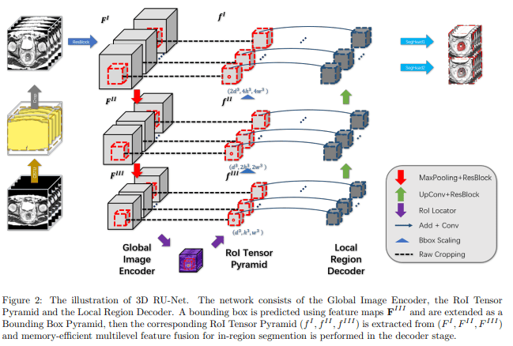
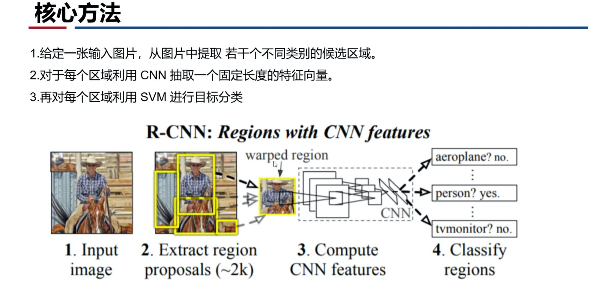

# 2021.01.10 课题组组会

## “Visualizing Data using t-SNE”

> zyy 师兄

- SNE

- Crowding Problem 拥挤问题
- 解决方案：
  - UNI-SNE
  - 均匀分布会导致 COST 函数优化很复杂
- t-SNE 可视化 MNIST
- t 分布
  - 与高斯分布密切相关
  - 不涉及指数
- t-SNE
  - 对称联合概率密度 $q_{ij}$
  - Cost
  - 梯度
  - SNE 梯度

- Olivetti face

- 存在的问题
  - 复杂度高 $O(n^2)$
  - 优化结果是随机的（COST 是非凸的）

Fisher 的思想：类内聚集，类间分开。

## ”3D Rol-aware U-Net for Accurate and Efficient Colorectal Tumor Segment“

> sa 师兄

- 论文概述
- 问题
- 3D-RU-Net
- 3D RU-Ney 构建
  - 1.Rol Pyraamid Layer
  - 2.RoI Locator
  - 3.RoI Pyraamid
  - 4.Local Region Decoder
- 损失函数
  - Dice Loss
  - Dice Loss for Global Localization
  - Dice-based Contour-aware Loss for Local Segmentation
  - 总体损失
- Multiple Reciptive Field Model Ensemble

- 论文总结

## “Rich feature hierarchies for accurate object detection and Semantic segmentation”

> md

- SIFT：尺度不变特征转换
- HOG：方向梯度直方图
- R-CNN 核心方法

- 论文的意义
  - VOC 的 mAP 提升到了 53.3%
  - 高性能的 CNN 应用在自底向上的候选区域
  - 迁移学习
- Selective Search
  - 一种用于目标检测的区域推荐算法。
  - 速度快、Recall 高
  - “自底向上” 的算法

- 特征提取
  - AlexNet
- 训练阶段
  - ImageNet 预训练，AlexNet，最后一层为 21 维
  - SGD，学习率 0.001
  - IoU 重叠阈值
  - 难负例挖掘算法

- 可视化
- 消融研究
- 错误分析
  - Hoiem 的目标检测分析工具。

