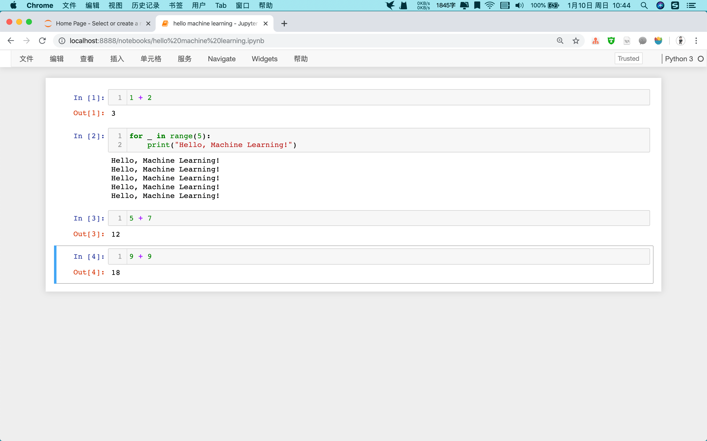

# Python3 入门机器学习

> 慕课网-刘宇波老师的机器学习课程

## 3-1 Jupyter Notebook 基础

> 我创建一个专门的虚拟环境。使用 `--clone` 可以避免再手动下载很多包。
>
> ```shell
> conda create -n imooc-ml --clone ldl-env
> ```

Jupyter Notebook 的快捷键。

- 帮助/快捷键

为了显示更多的代码，隐藏一些 tool bar。

显示代码行号。

安装插件，代码提示功能。



Markdown 编写文档。

### 为什么使用 Notebook？

它能够帮助我们存储之前代码编写的变量，之后以交互的形式完成整个编程过程。

## 3-2 Jupyter Notebook 中的魔法命令

### %run

加载单一脚本

```powershell
hello machine learning.ipynb myscript/
```

在 Notebook 中：

```
%run myscript/hello.py
```

Hello Machine Learning !

```
hello("imooc")
```

Hello imooc !

在 Jupyter Notebook 中加载整个模块？

```
import mymodule.FirstML
```

```
mymodule.FirstML.predict(1)
```

?

```
from mymodule import FirstML

FirstML.predict(2)
```

### %timeit

测试一行程序：

```
%timeit L = [i**2 for i in range(1000)]
```

273 µs ± 11.1 µs per loop (mean ± std. dev. of 7 runs, 1000 loops each)

```
%timeit L = [i**2 for i in range(100000)]
```

27.7 ms ± 755 µs per loop (mean ± std. dev. of 7 runs, 10 loops each)

```
%timeit L = [i**2 for i in range(10)]
```

2.98 µs ± 54.7 ns per loop (mean ± std. dev. of 7 runs, 100000 loops each)

测试一段程序：两个 `%`。

```
%%timeit
L = []

for n in range(1000):
    L.append(n**2)
```

330 µs ± 13.7 µs per loop (mean ± std. dev. of 7 runs, 1000 loops each)

### %time

只执行一次，大概了解一下时间。

```
%time L = [i**2 for i in range(1000)]
```

CPU times: user 313 µs, sys: 0 ns, total: 313 µs
Wall time: 316 µs

获取机器学习算法训练的时间。

```
%%time
L = []

for n in range(1000):
    L.append(n**2)
```

CPU times: user 418 µs, sys: 0 ns, total: 418 µs
Wall time: 422 µs

```
import random
L = [random.random() for i in range(100000)]
%timeit L.sort()
```
1.37 ms ± 92.6 µs per loop (mean ± std. dev. of 7 runs, 1000 loops each)

```
L = [random.random() for i in range(100000)]
%time L.sort()
```

CPU times: user 35.5 ms, sys: 649 µs, total: 36.2 ms
Wall time: 36.6 ms

```
# 排序一个已经有序的数组
%time L.sort()
```
CPU times: user 3.73 ms, sys: 1 µs, total: 3.74 ms
Wall time: 3.74 ms

### 其他魔法命令

```
%lsmagic
```

```
Available line magics:
%alias  %alias_magic  %autoawait  %autocall  %automagic  %autosave  %bookmark  %cat  %cd  %clear  %colors  %conda  %config  %connect_info  %cp  %debug  %dhist  %dirs  %doctest_mode  %ed  %edit  %env  %gui  %hist  %history  %killbgscripts  %ldir  %less  %lf  %lk  %ll  %load  %load_ext  %loadpy  %logoff  %logon  %logstart  %logstate  %logstop  %ls  %lsmagic  %lx  %macro  %magic  %man  %matplotlib  %mkdir  %more  %mv  %notebook  %page  %pastebin  %pdb  %pdef  %pdoc  %pfile  %pinfo  %pinfo2  %pip  %popd  %pprint  %precision  %prun  %psearch  %psource  %pushd  %pwd  %pycat  %pylab  %qtconsole  %quickref  %recall  %rehashx  %reload_ext  %rep  %rerun  %reset  %reset_selective  %rm  %rmdir  %run  %save  %sc  %set_env  %store  %sx  %system  %tb  %time  %timeit  %unalias  %unload_ext  %who  %who_ls  %whos  %xdel  %xmode

Available cell magics:
%%!  %%HTML  %%SVG  %%bash  %%capture  %%debug  %%file  %%html  %%javascript  %%js  %%latex  %%markdown  %%perl  %%prun  %%pypy  %%python  %%python2  %%python3  %%ruby  %%script  %%sh  %%svg  %%sx  %%system  %%time  %%timeit  %%writefile

Automagic is ON, % prefix IS NOT needed for line magics.
```

查看魔法命令文档

```
%run?
```

## 3-3 numpy.array 基础

与 Python 中的 List 和 Array 比较进行学习。
```python
import numpy
```


```python
numpy.__version__
```


    '1.19.2'


```python
import numpy as np
```


```python
np.__version__
```


    '1.19.2'


### Python List 的特点


```python
L = [i for i in range(10)]
L
```

[0, 1, 2, 3, 4, 5, 6, 7, 8, 9]


```python
L[5]
```

5


```python
L[5] = 100
L
```

[0, 1, 2, 3, 4, 100, 6, 7, 8, 9]


```python
L[5] = "Machine Learning"
```


```python
L
```

[0, 1, 2, 3, 4, 'Machine Learning', 6, 7, 8, 9]

**灵活带来的缺点是，效率太低。**


```python
import array
```


```python
arr = array.array('i', [i for i in range(10)])
```


```python
arr
```


    array('i', [0, 1, 2, 3, 4, 5, 6, 7, 8, 9])


```python
arr[5]
```


    5


```python
arr[5] = 100
```


```python
arr
```


    array('i', [0, 1, 2, 3, 4, 100, 6, 7, 8, 9])


```python
arr[5] = "Machine Learning"  # 报错 TypeError: an integer is required (got type str)
```


    ---------------------------------------------------------------------------
    
    TypeError                                 Traceback (most recent call last)
    
    <ipython-input-25-618ae4a54130> in <module>
    ----> 1 arr[5] = "Machine Learning"  # 报错 TypeError: an integer is required (got type str)


    TypeError: an integer is required (got type str)


array 也不方便。numpy.array 应运而生。


```python
nparr = np.array([i for i in range(10)])
nparr
```


    array([0, 1, 2, 3, 4, 5, 6, 7, 8, 9])


```python
nparr[5]
```


    5


```python
nparr[5] = 100
nparr
```


    array([  0,   1,   2,   3,   4, 100,   6,   7,   8,   9])


```python
nparr[5] = "Machine Learning" # invalid literal for int() with base 10: 'Machine Learning'
```


    ---------------------------------------------------------------------------
    
    ValueError                                Traceback (most recent call last)
    
    <ipython-input-24-3538820512ea> in <module>
    ----> 1 nparr[5] = "Machine Learning"


    ValueError: invalid literal for int() with base 10: 'Machine Learning'


```python
nparr.dtype
```


    dtype('int64')


```python
nparr[5] = 5.0
nparr
```


    array([0, 1, 2, 3, 4, 5, 6, 7, 8, 9])


```python
nparr.dtype
```


    dtype('int64')


```python
nparr[3] = 3.14 # 浮点数自动截位
nparr
```


    array([0, 1, 2, 3, 4, 5, 6, 7, 8, 9])


```python
nparr.dtype
```


    dtype('int64')


```python
nparr2 = np.array([1, 2, 3.0])
```


```python
nparr2.dtype
```


    dtype('float64')


