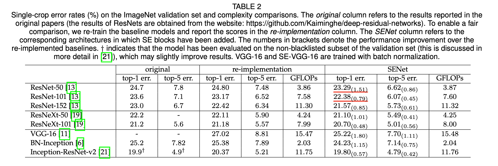

# 论文题目 “Squeeze-and-Excitation Networks”

✅ 论文地址：[https://arxiv.org/abs/1709.01507](<https://arxiv.org/abs/1709.01507>)

✅ 发表时间：2017

## ABSTRACT

卷积是 CNNs 的核心，它使网络能够通过融合每层局部感受野内的空间（spatial）和通道（channel-wise）信息来构建特征。

关于空间关系已经有了广泛的研究。

本篇论文的重点是通道之间的关系，提出了一种称为 “SE block” 的架构单元，它通过明确模拟通道之间的相互依赖关系，自适应地重新校准通道方面的特征响应。

Squeeze-and-Excitation (SE)：挤压和激励。

SENet 在 2017 年的 ILSVRC 分类任务上获得了第一名，Top-5 误差降低到 2.251%。

## 1 INTRODUCTION

Inception 系列架构（Going deeper with convolutions. Batch Normalization: Accelerating deep network training by reducing internal covariate shift），将多尺度过程纳入网络模块，以实现性能的提升。

这篇论文研究的是：

- 通道之间的关系（the relationship between channels）。
- 引入了 “SE 块”。
- 并提出了一种机制，允许网络执行特征重新校准。通过这种机制，网络可以学习使用全局信息，有选择地强调信息性特征，并抑制不太有用的特征。

SE 块如下图 1 所示。

变化 $F_{tr}$ 将输入 $X$ 映射为 $U$，$U \in ℝ^{H \times W \times C}$。

U 首先通过一个叫做 *squeeze* 操作，之后是一个 *excitation* 操作。

excitation（激励）后并产生一个每通道调制权重的集合。这些权重被应用于特征图 U，以产生 SE 块的输出，它可以直接输入到网络的后续层。

通过 SE 块的堆叠可以构建一个 SENets，SE 块在整个网络中不同深度所执行的角色是不同的。

SE 块还可以应用于现有的 CNN 结构，通过使用 SE 块进行替换，可以有效地提高性能。

 SENets 在 ILSVRC 2017 分类竞赛中排名第一。最佳模型在测试集上的 top-5 误差率为 2.251%，比上一年的冠军作品（top-5 误差率 = 2.991%）相比，大约有 25% 的相对改善。

> 2016 年的 ILSVRC，Trimps-Soushen（公安部三所） 以 2.99% 的 Top-5 分类误差率和 7.71% 的定位误差率赢得了 ImageNet 分类任务的胜利。该团队使用了分类模型的集成（即 Inception、Inception-ResNet、ResNet 和宽度残差网络模块的平均结果）和基于标注的定位模型 Faster R-CNN 来完成任务。
>
> ImageNet 历年冠军和相关 CNN 模型
>
> | 年   | 网络 / 队名        | val top-1 | val top-5 | test top-5 | 备注                      |
> | ---- | ------------------ | --------- | --------- | ---------- | ------------------------- |
> | 2012 | AlexNet            | 38.1%     | 16.4%     | 16.42%     | 5 CNNs                    |
> | 2012 | **AlexNet**        | 36.7%     | 15.4%     | 15.32%     | 7CNNs。用了 2011 年的数据 |
> | 2013 | OverFeat           |           |           | 14.18%     | 7 fast models             |
> | 2013 | OverFeat           |           |           | 13.6%      | 赛后。7 big models        |
> | 2013 | ZFNet              |           |           | 13.51%     | ZFNet 论文上的结果是 14.8 |
> | 2013 | Clarifai           |           |           | 11.74%     |                           |
> | 2013 | **Clarifai**       |           |           | 11.20%     | 用了 2011 年的数据        |
> | 2014 | VGG                |           |           | 7.32%      | 7 nets, dense eval        |
> | 2014 | VGG（亚军）        | 23.7%     | 6.8%      | 6.8%       | 赛后。2 nets              |
> | 2014 | **GoogleNet v1**   |           |           | 6.67%      | 7 nets, 144 crops         |
> |      | GoogleNet v2       | 20.1%     | 4.9%      | 4.82%      | 赛后。6 nets, 144 crops   |
> |      | GoogleNet v3       | 17.2%     | 3.58%     |            | 赛后。4 nets, 144 crops   |
> |      | GoogleNet v4       | 16.5%     | 3.1%      | 3.08%      | 赛后。v4+Inception-Res-v2 |
> | 2015 | **ResNet**         |           |           | 3.57%      | 6 models                  |
> | 2016 | **Trimps-Soushen** |           |           | 2.99%      | 公安三所                  |
> | 2016 | ResNeXt（亚军）    |           |           | 3.03%      | 加州大学圣地亚哥分校      |
> | 2017 | **SENet**          |           |           | 2.25%      | Momenta 与牛津大学        |

## 2 RELATED WORK

- 更深的网络架构 **Deeper architectures.**
  - VGG、Inception Models、Batch Normalization (BN)、ResNets、Highway networks.
  - 分组卷积 Grouped convolutions、多分枝卷积 multi-branch convolutions、跨通道的相关性 cross-channel correlations.
- 算法架构搜索 **Algorithmic Architecture Search.**
  - evolutionary methods：用进化方法进行网络拓扑结构搜索
  -  Lamarckian inheritance、differentiable architecture search：减少了计算负担
- 注意力和门控机制 **Attention and gating mechanisms.**
  - 注意力可以被解释为一种将可用计算资源的分配偏向于信号中信息量最大的部分的手段
  - 提出的 SE 块包括一个轻量级的门控机制，该机制专注于通过以一种计算效率高的方式建模通道关系（channel-wise relationships）来增强网络的表示能力。

## 3 SQUEEZE-AND-EXCITATION BLOCKS

Squeeze-and-Excitation 块是建立在输入 $X \in \mathbb{R}^{H' \times W' \times C'}$ 映射到特征图 $U \in \mathbb{R}^{H \times W \times C}$ 的变化 $F_{tr}$ 上的计算单元。

$$u_c = v_c * X = \sum_{s=1}^{C'} v_c^s * X^s \tag{1}$$

- $F_{tr}$ 为卷积算子
- $V = [v_1, v_2, ..., v_C]$ 表示学习到的卷积核的集合
- $U = [u_1, u_2, ..., u_C]$ 为输出
- $X = [x^1, x^2, ..., x^{C'}]$ 为输入
- $*$ 表示卷积
- $v_c = [v_c^1, v_c^2, ..., v_c^{C'}]$，指的是第 c 个卷积核的参数
- $u_c \in \mathbb{R}^{H \times W}$
- $v_c^s$ 是一个二维空间核，代表 $v_c$ 的单通道，作用于 X 的相应通道。

我们期望卷积特征的学习能够通过明确地模拟通道相互依赖关系来增强，这样网络就能够提高其对信息特征的敏感性，而这些信息特征可以被后续的变换所利用。因此，希望为它提供对全局信息的访问，并在挤压 S 和激励 E 两个步骤中重新校准卷积核响应，然后再将它们输入到下一次变换中。

### 3.1 Squeeze: Global Information Embedding

为了解决通道依赖性问题，考虑输出特征中对每个通道的信号。每一个学习的卷积核都是以局部的感受野来操作的，因此，变换输出 U 的每个单元都无法利用感受野之外的上下文信息。

本论文提供通过使用全局平均池来生成通道方面的统计数据，将全局空间信息挤压到通道描述符中，进而缓解了如上问题。

通过挤压 U 的空间维度 $H \times W$ 生成统计量 $z_c$。

$$z_c = F_{sq}(u_c) = \frac{1}{H \times W} \sum_{i=1}^H \sum_{j=1}^W u_c(i, j) \tag{2}$$

- $z \in \mathbb{R}^{C}$

### 3.2 Excitation: Adaptive Recalibration

Excitation 操作的目的是完全捕捉通道方面的依赖性。

这个函数要满足两个要求：

- （1）能够学习通道之间的非线性交互
- （2）ensure that multiple channels are allowed to be emphasised

$$s = F_{ex} (z, W) = \sigma (g(z, W)) = \sigma(W_2 \sigma(W_{1}z)) \tag{3}$$

- $\sigma$ 是 ReLU 激活函数
- $W_1 \in \mathbb{R}^{\frac{C}{r} \times C}$
- $W_2 \in \mathbb{R}^{C \times \frac{C}{r}}$ 
- $r$ 是一个叫做降低比的参数。后面会详细介绍

### 3.3 实例化 Instantiations

通过在每次卷积后的非线性之后插入 SE 块，SE 块可以被集成到标准的架构中。

如下图 2、3，在 Inception 网络和 ResNet 加入 SE 块。

对于 SENet 架构的具体实例，表 1 给出了 SE-ResNet-50 和 SE-ResNeXt-50 的详细描述。

## 4 MODEL AND COMPUTATIONAL COMPLEXITY

对于 SENets 系列网络，需要在提高性能和增加模型复杂度之间进行的权衡。

以 ResNet-50 和 SE-ResNet-50 为例。

每个 SE 块在 *squeeze* 阶段使用一个全局平均池化操作，在 *excitation* 阶段使用两个 FC 层。

将参数  $r$ 设置为 16，对于 224 *224 像素的输入图像。

- ResNet-50 一次前向传播约为 3.86 GFLOPs。
- SE-ResNet-50 需要约 3.87 GFLOPs，相当于比原来的 ResNet-50 相对增加了0.26%。

SE-ResNet-50 的**计算负担**略微增加，但其精度却超过了 ResNet-50。实践证明，要达到与 SE-ResNet-50 相同的精度，需要更深的 ResNet-101 网络。

对 GPU 上**计算时间**的基准测试：

- 对于 224*224 像素的输入图像，ResNet-50 需要 164 毫秒，而 SE-ResNet-50 则为 167 毫秒

 SE 块所引入的额外**参数**只是两个 FC 层的权重参数：

- SE-ResNet-50 在 ResNet-50 所需的约 2500 万个参数之外，又引入了约 250 万个额外参数，相当于增加了约 10%.

## 5 EXPERIMENTS

### 5.1 Image Classification

- 数据集：ImageNet 2012
- 数据增强
- 优化方法：SGD，动量为 0.9，batch size = 1024。初始学习率设置为 0.6，每 30 个EPOCH 降低 10 倍
- 总共训练 100 EPOCH
-  reduction ratio $r=16$ 

**网络深度 Network depth.**

- Table 2 中报告结果可以观察到，SE 块在不同深度的情况下始终如一地提高了性能。

**与现代架构集成 Integration with modern architectures.** 

- 研究将 SE 块与另外两个最先进的架构：Inception-ResNet-v2 和 ResNeXt 整合的效果。即 Inception-ResNet-v2/ResNeXt  **V.S. ** SE-Inception-ResNet-v2/SE-ResNeXt
- 结果如 Table 2 所示。 可以看到在这两种架构中引入 SE 块所引起的显著性能改进。
- SE-ResNeXt-50 的 top-5 误差为 5.49%，优于其直接对应的 ResNeXt-50（5.90% top-5误差）以及更深的 ResNeXt-101（5.57% top-5 误差)
- Table 2 还对 VGG-16 和 BN-Inception 架构进行实验，结果与残差网络进行，SE 块在非残差设置上带来了性能上的改进。

图 4 中描述了 baseline 架构和各自的 SE 对应的运行的训练曲线。可以看到，引入 SE 块的网络在整个优化过程中有了稳定的改进。

**Mobile setting.** 

- 考虑 MobileNet 和 ShuffleNet。
- 
- SE 块在计算成本增加最小的情况下，以较大的幅度提高了精度。

**Additional datasets.**

- CIFAR-10 和 CIFAR-100
- 

### 5.2 Scene Classification

在 Places365-Challenge 数据集上进行了场景分类的实验，实验结果如 TABLE 6.

### 5.3 Object Detection on COCO

### 5.4 ILSVRC 2017 Classification Competition

通过将 SE 块与修改后的 ResNeXt 集成，构建了一个额外的模型 SENet-154。

TABLE 8 中使用标准裁剪将该模型与之前在 ImageNet 验证集上的工作进行比较。

## 6 ABLATION STUDY

### 6.1 Reduction ratio

### 6.2 Squeeze Operator

### 6.3 Excitation Operator

### 6.4 Different stages

### 6.5 Integration strategy

## 7 ROLE OF SE BLOCKS

### 7.1 Effect of Squeeze

### 7.2 Role of Excitation

## 8 CONCLUSION

