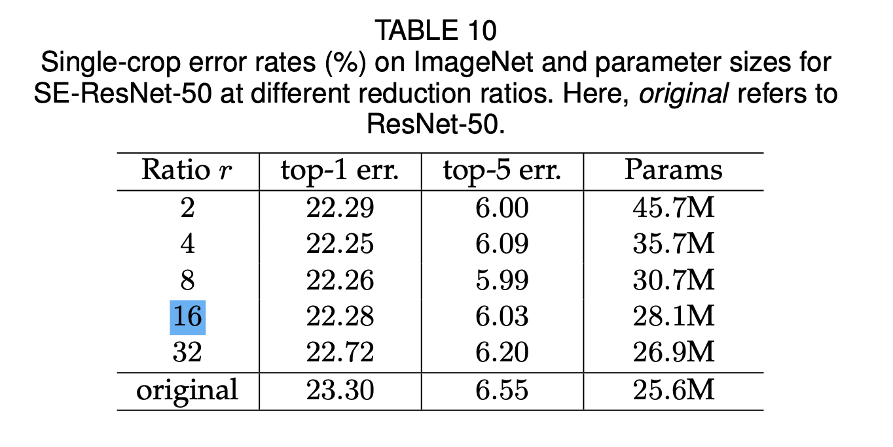
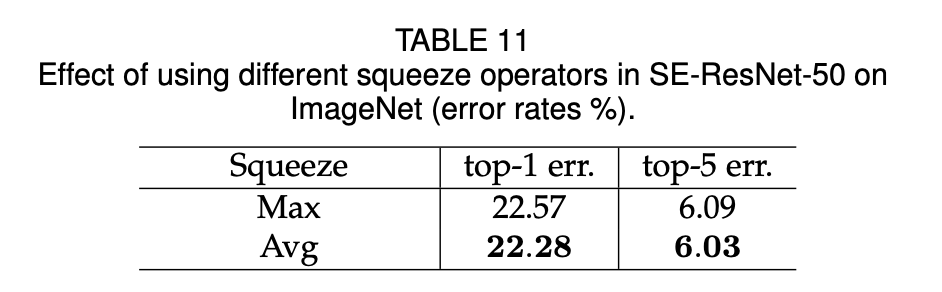
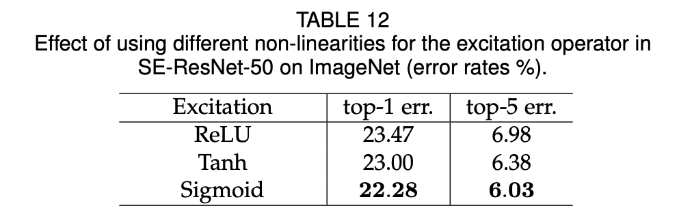
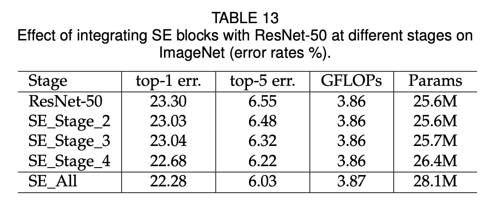
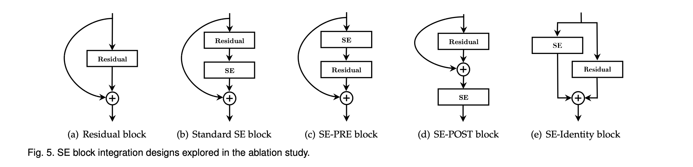
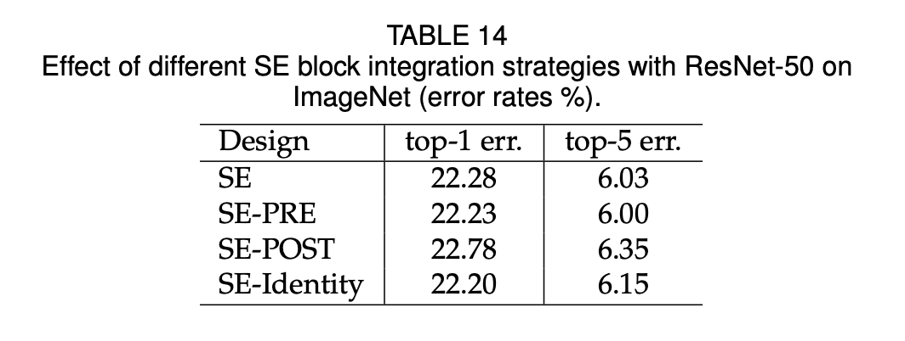
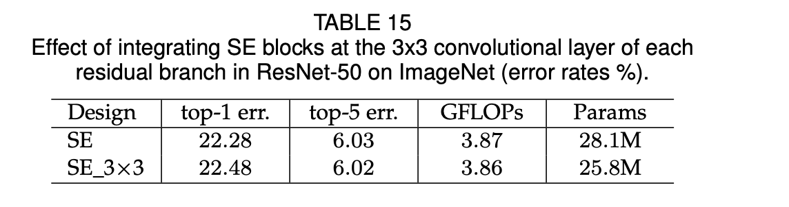
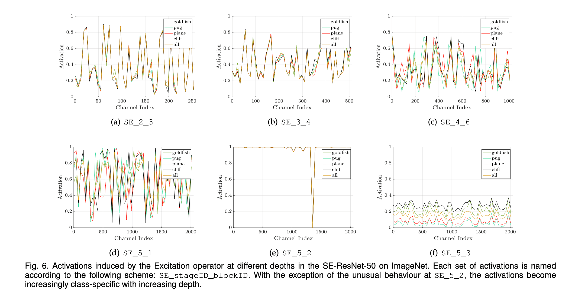
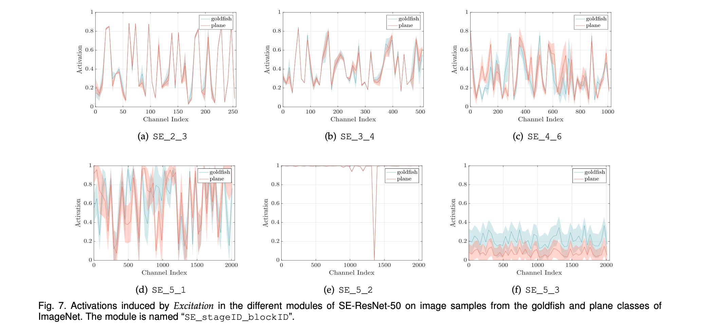

## 6 ABLATION STUDY

进行 ablation experiments，了解使用不同配置对 SE 块的组件的影响。

在 ResNet 架构上，去掉 *excitation* 操作中的 FC 层的偏置有利于通道依赖性的建模。

### 6.1 Reduction ratio

reduction ratio $r$ 是一个超参数，这个超参数可以调节 SE 块的计算机成本。

通过这个超参数，可以研究性能和计算成本之间的权衡。

### 6.2 Squeeze Operator

- global max pooling
- global average pooling

结果显示 gap 的表现要更好。

### 6.3 Excitation Operator

SE-ResNet-50 网络的 *excitation* 操作中，sigmoid 激活函数的表现要更好。

### 6.4 Different stages

将 SE 块整合到 ResNet-50 的不同阶段中，结果显示：SE 块在架构的每个阶段引入时都带来了性能上的提升，SE 块在不同阶段所带来的性能提升是互补的，即将不同阶段的 SE 块结合起来，可以进一步提升网络性能。

### 6.5 Integration strategy

研究将 SE 块整合到现有的网络中时，SE 不同位置的影响。如 Fig 5 所示：

结果表明：SE-POST 是最差的，因此 SE 块需要再分枝聚合之前。

将 SE 块移到残差单元内部，直接放在 3 * 3 卷积层之后。研究表明，通过为特定的架构量身定制 SE 块的使用，将可以实现进一步的性能提升。

## 7 ROLE OF SE BLOCKS

研究 *squeeze* 操作的相对重要性以及 *excitation* 机制在实践中是如何运作的，SE 块究竟扮演者什么角色。

### 7.1 Effect of Squeeze

- NoSqueeze：增加了同等数量的参数，但不执行全局平均池化。（去掉池化、$1 \times 1$ 卷积替换 FC）

结果表明，全局信息的使用对模型性能有很大影响，强调了 *squeeze* 操作的重要性。

### 7.2 Role of Excitation

从验证集中为每个类抽取 50 个样本，并计算每个阶段的最后一个 SE 块（紧接下采样之前）的 50 个均匀采样通道的平均激活量，在 Fig 6 中绘制其分布。

作为参考，all 是所有 1000 个类的平均激活量的分布。

- SE_2_3：不同类的分布非常相似，表明特征通道的重要性很可能在早期阶段由不同类共享。
- SE_4_6、SE_5_1：更大的深度上，由于不同类对特征的判别价值表现出不同的偏好，每个通道的价值变得更加具有类的特异性。

即早期的层特征通常更具有一般性，而后期的层特征则表现出更大的特异性。

> ❓ SE_5_2 和 SE_5_3 的差异为什么这么大？
>
> - SE_5_2 表现出一种饱和状态的趋势，大部分的激活都接近于 1。
> - SE_5_3 在不同的类上出现了类似的模式。
>
> 该结果表明，通过去除最后阶段的 SE 块，可以显著减少额外的参数数，而不会造成性能的大幅降低。

Fig 7 中显示了两个样本类（金鱼和平面）同一类内图像实例的激活的平均值和标准差。

- 在网络的后几层，当一个类内的表征具有可考虑的多样性时，网络学会利用特征重新校准的优势来提高其分辨性能。

## 8 CONCLUSION

- 提出 SE 块
  - 通过使其能够执行动态 channel-wise 特征重新校准来提高网络的表示能力的架构单元

- SENets 在多个数据集上性能最优
- SE 块产生的特征重要性值。