# 3-11 matplotlib 数据可视化基础


```python
# 比较专业的库
import matplotlib as mpl
```


```python
# 一般来说，这个够用了
import matplotlib.pyplot as plt
```


```python
import numpy as np

# [0, 10) 切分 100 片
x = np.linspace(0, 10, 100)
```


```python
y = np.sin(x)
```


```python
plt.plot(x, y)
```


    [<matplotlib.lines.Line2D at 0x7fdf3e066f98>]


​    
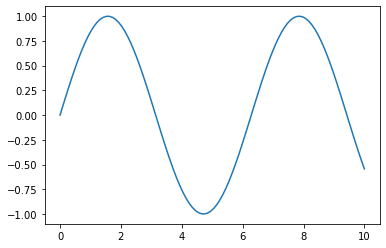
​    


```python
plt.show()
```


```python
cosy = np.cos(x)
cosy.shape
```


    (100,)


```python
siny = np.sin(x)
siny.shape
```


    (100,)


```python
plt.plot(x, siny)
plt.plot(x, cosy)
plt.show()
```


​    
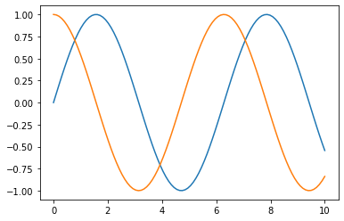
​    


```python
plt.plot(x, siny)
plt.plot(x, cosy, color="red")
plt.show()
```


​    
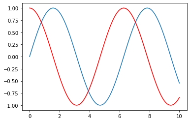
​    


```python
plt.plot(x, siny)
plt.plot(x, cosy, color="red", linestyle=":") ## : -.  --  -
plt.show()
```


​    
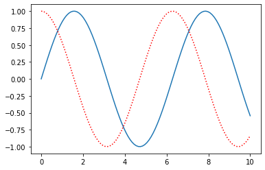
​    


```python
# X 轴
plt.plot(x, siny)
plt.plot(x, cosy, color="red", linestyle=":") ## : -.  --  -
plt.xlim(-5, 15)
plt.show()
```


​    
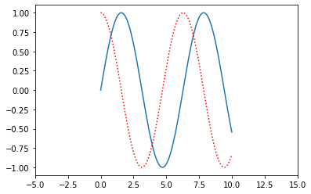
​    


```python
# Y 轴
plt.plot(x, siny)
plt.plot(x, cosy, color="red", linestyle=":") ## : -.  --  -
plt.xlim(-5, 15)
plt.ylim(0, 1.5)
plt.show()
```


​    
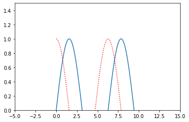
​    


```python
# 同时调整XY轴范围
plt.plot(x, siny)
plt.plot(x, cosy, color="red", linestyle=":") ## : -.  --  -
plt.axis([-1, 11, -2, 2])
plt.show()
```


​    
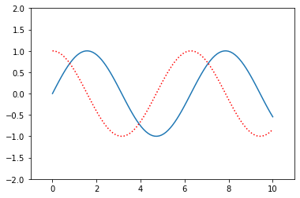
​    


```python
# XY轴的标注
plt.plot(x, siny)
plt.plot(x, cosy, color="red", linestyle=":") ## : -.  --  -
plt.xlabel("x axis")
plt.ylabel("y value")
plt.show()
```


​    

​    


```python
# 图示
plt.plot(x, siny, label="sin(x)")
plt.plot(x, cosy, color="red", linestyle=":", label="cos(x)") ## : -.  --  -
plt.xlabel("x axis")
plt.ylabel("y value")
plt.legend()
plt.show()
```


​    
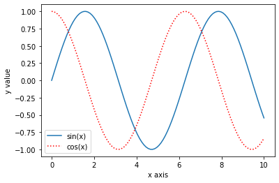
​    


```python
# 标题
plt.plot(x, siny, label="sin(x)")
plt.plot(x, cosy, color="red", linestyle=":", label="cos(x)") ## : -.  --  -
plt.xlabel("x axis")
plt.ylabel("y value")
plt.legend()
plt.title("Welcome to Machine Learning")
plt.show() # 新版本不需要
```


​    
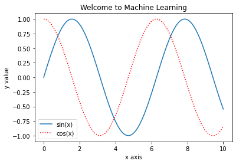
​    


## Scatter Plot
散点图


```python
plt.scatter(x, siny)
plt.show()
```


​    
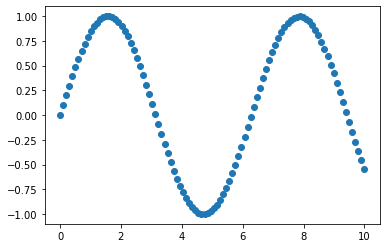
​    


```python
plt.scatter(x, siny)
plt.scatter(x, cosy, color="red")
plt.show()
```


​    
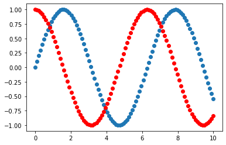
​    


散点图的横轴和纵轴都是特征


```python
x = np.random.normal(0, 1, 100)
y = np.random.normal(0, 1, 100)

plt.scatter(x, y)
plt.show()
```


​    
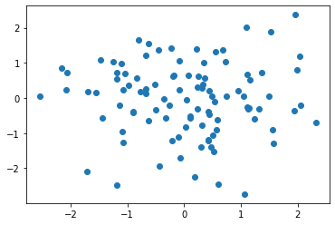
​    


```python
x = np.random.normal(0, 1, 10000)
y = np.random.normal(0, 1, 10000)

plt.scatter(x, y)
plt.show()
```


​    
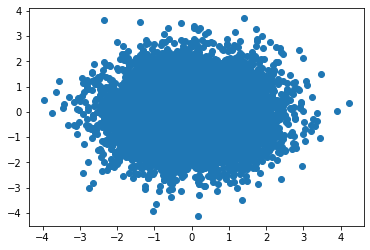
​    


```python
# 参数 alpha 表示透明度
x = np.random.normal(0, 1, 10000)
y = np.random.normal(0, 1, 10000)

plt.scatter(x, y, alpha=0.3)
plt.show()
```


​    
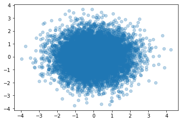
​    


```python

```
