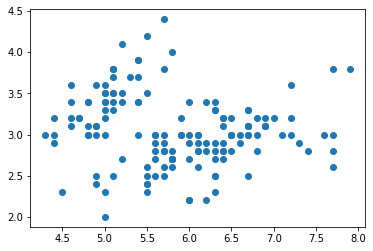
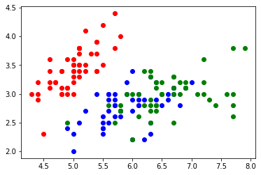
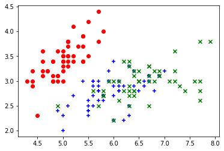
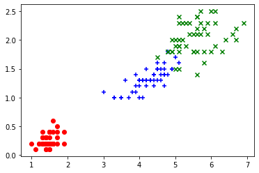

# 3-12 数据加载和简单的数据探索


```python
import numpy as np
import matplotlib.pyplot as plt
from sklearn import datasets
```


```python
# 鸢尾花数据集
iris = datasets.load_iris()
```


```python
iris.keys()

# DESCR 描述
```


    dict_keys(['data', 'target', 'frame', 'target_names', 'DESCR', 'feature_names', 'filename'])


```python
# Iris plants dataset
print(iris.DESCR)
```

    .. _iris_dataset:
    
    Iris plants dataset
    --------------------
    
    **Data Set Characteristics:**
    
        :Number of Instances: 150 (50 in each of three classes)
        :Number of Attributes: 4 numeric, predictive attributes and the class
        :Attribute Information:
            - sepal length in cm
            - sepal width in cm
            - petal length in cm
            - petal width in cm
            - class:
                    - Iris-Setosa
                    - Iris-Versicolour
                    - Iris-Virginica
                    
        :Summary Statistics:
    
        ============== ==== ==== ======= ===== ====================
                        Min  Max   Mean    SD   Class Correlation
        ============== ==== ==== ======= ===== ====================
        sepal length:   4.3  7.9   5.84   0.83    0.7826
        sepal width:    2.0  4.4   3.05   0.43   -0.4194
        petal length:   1.0  6.9   3.76   1.76    0.9490  (high!)
        petal width:    0.1  2.5   1.20   0.76    0.9565  (high!)
        ============== ==== ==== ======= ===== ====================
    
        :Missing Attribute Values: None
        :Class Distribution: 33.3% for each of 3 classes.
        :Creator: R.A. Fisher
        :Donor: Michael Marshall (MARSHALL%PLU@io.arc.nasa.gov)
        :Date: July, 1988
    
    The famous Iris database, first used by Sir R.A. Fisher. The dataset is taken
    from Fisher's paper. Note that it's the same as in R, but not as in the UCI
    Machine Learning Repository, which has two wrong data points.
    
    This is perhaps the best known database to be found in the
    pattern recognition literature.  Fisher's paper is a classic in the field and
    is referenced frequently to this day.  (See Duda & Hart, for example.)  The
    data set contains 3 classes of 50 instances each, where each class refers to a
    type of iris plant.  One class is linearly separable from the other 2; the
    latter are NOT linearly separable from each other.
    
    .. topic:: References
    
       - Fisher, R.A. "The use of multiple measurements in taxonomic problems"
         Annual Eugenics, 7, Part II, 179-188 (1936); also in "Contributions to
         Mathematical Statistics" (John Wiley, NY, 1950).
       - Duda, R.O., & Hart, P.E. (1973) Pattern Classification and Scene Analysis.
         (Q327.D83) John Wiley & Sons.  ISBN 0-471-22361-1.  See page 218.
       - Dasarathy, B.V. (1980) "Nosing Around the Neighborhood: A New System
         Structure and Classification Rule for Recognition in Partially Exposed
         Environments".  IEEE Transactions on Pattern Analysis and Machine
         Intelligence, Vol. PAMI-2, No. 1, 67-71.
       - Gates, G.W. (1972) "The Reduced Nearest Neighbor Rule".  IEEE Transactions
         on Information Theory, May 1972, 431-433.
       - See also: 1988 MLC Proceedings, 54-64.  Cheeseman et al"s AUTOCLASS II
         conceptual clustering system finds 3 classes in the data.
       - Many, many more ...


```python
# 150 个样本，每个样本 4 个特征
iris.data.shape
```


    (150, 4)


```python
iris.feature_names
```


    ['sepal length (cm)',
     'sepal width (cm)',
     'petal length (cm)',
     'petal width (cm)']


```python
# 标签
iris.target.shape
```


    (150,)


```python
iris.target_names
```


    array(['setosa', 'versicolor', 'virginica'], dtype='<U10')


```python
X = iris.data[:, :2] # 获取两个特征
X.shape
```


    (150, 2)


```python
plt.scatter(X[:, 0], X[:, 1])
plt.show()
```

​    

​    


不同类别不同颜色


```python
y = iris.target
```


```python
plt.scatter(X[y == 0, 0], X[y == 0, 1], color="red")
plt.scatter(X[y == 1, 0], X[y == 1, 1], color="blue")
plt.scatter(X[y == 2, 0], X[y == 2, 1], color="green")
plt.show()
```

​    

​    


```python
plt.scatter(X[y == 0, 0], X[y == 0, 1], color="red", marker="o")
plt.scatter(X[y == 1, 0], X[y == 1, 1], color="blue", marker="+")
plt.scatter(X[y == 2, 0], X[y == 2, 1], color="green", marker="x")
plt.show()
```

​    

​    


上图只是选了两个维度的特征进行绘制。使用另外另个维度进行可视化：


```python
X = iris.data[:, 2:]

plt.scatter(X[y == 0, 0], X[y == 0, 1], color="red", marker="o")
plt.scatter(X[y == 1, 0], X[y == 1, 1], color="blue", marker="+")
plt.scatter(X[y == 2, 0], X[y == 2, 1], color="green", marker="x")
plt.show()
```


​    

​    


```python

```
