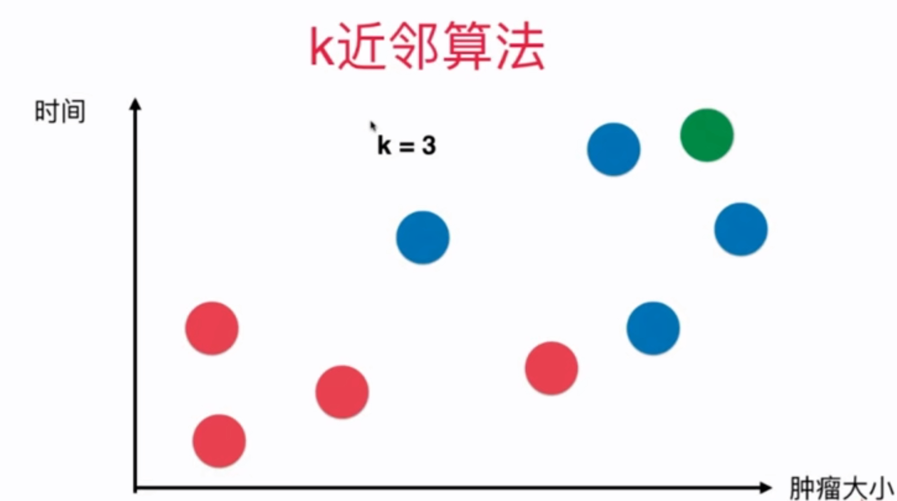
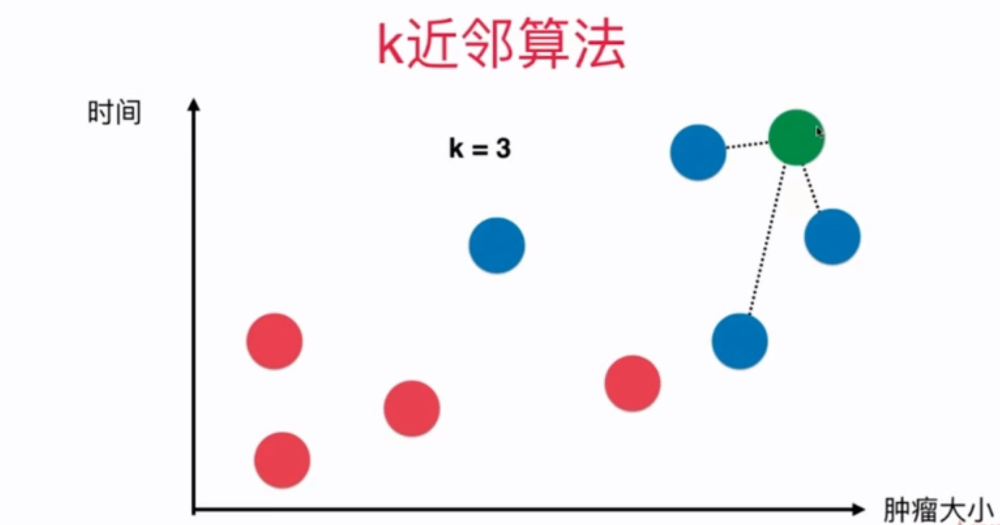
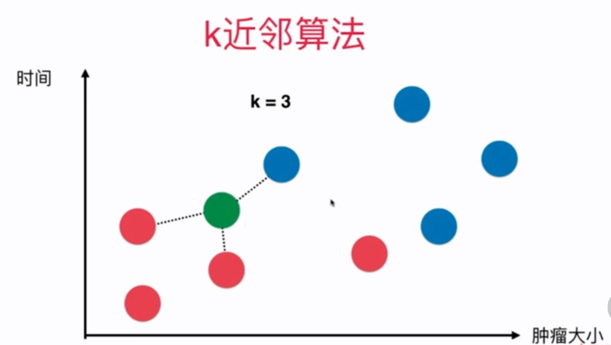
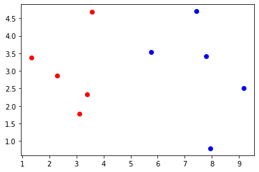
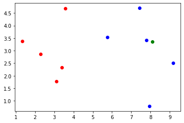

# 4-1 K 近邻算法基础

- 思想极度简单
- 应用数学知识少（近乎为 0）
- 效果好（缺点？）
- 可以解释机器学习算法使用过程中的很多细节问题
- 更完整的刻画机器学习算法应用的流程



取一个 K 值，K = 3。

对于新来的点（绿色），寻找与它最近的 3 个点。



与它最近的三个点，蓝色和红色的比为 3:0，因此，新来的点很可能也是蓝色点。

相似同类，多看几个样本。看 K 个样本。

通过距离衡量相似性。

下面的例子，K 近邻红色和蓝色的比为 2:1。红色胜出，判为红色。




距离使用欧式距离。


## 4-1 KNN 基础


```python
import numpy as np
import matplotlib.pyplot as plt
```


```python
raw_data_X = [[3.393533211, 2.331273381],
              [3.110073483, 1.781539638],
              [1.343808831, 3.368360954],
              [3.582294042, 4.679179110],
              [2.280362439, 2.866990263],
              [7.423436942, 4.696522875],
              [5.745051997, 3.533989803],
              [9.172168622, 2.511101045],
              [7.792783481, 3.424088941],
              [7.939820817, 0.791637231]
             ]
raw_data_y = [0, 0, 0, 0, 0, 1, 1, 1, 1, 1]
```


```python
X_train = np.array(raw_data_X)
y_train = np.array(raw_data_y)
```


```python
X_train.shape
```


    (10, 2)


```python
y_train.shape
```


    (10,)


```python
plt.scatter(X_train[y_train==0,0], X_train[y_train==0,1], color='r')
plt.scatter(X_train[y_train==1,0], X_train[y_train==1,1], color='b')
plt.show()
```

​    

​    


```python
# 新的数据
x = np.array([8.093607318, 3.365731514])
```


```python
plt.scatter(X_train[y_train==0,0], X_train[y_train==0,1], color='r')
plt.scatter(X_train[y_train==1,0], X_train[y_train==1,1], color='b')
plt.scatter(x[0], x[1], color='g') # 新数据使用绿色
plt.show()
```

​    

​    


## KNN 过程

欧拉距离：对应特征差的平方，求和，开根号。

$$\sqrt{\sum_{i=1}^{n} (X_i^{(a)} - X_i^{(b)})^2}$$

- $i$：i 维度的特征
- $a$：样本 a
- $b$：样本 b


```python
from math import sqrt
distances = []
for x_train in X_train:
    d = sqrt(np.sum((x_train - x)**2))
    distances.append(d)
```


```python
distances
```


    [4.812566907609877,
     5.229270827235305,
     6.749798999160064,
     4.6986266144110695,
     5.83460014556857,
     1.4900114024329525,
     2.354574897431513,
     1.3761132675144652,
     0.3064319992975,
     2.5786840957478887]


```python
distances = [sqrt(np.sum((x_train - x)**2)) for x_train in X_train]
```


```python
distances
```


    [4.812566907609877,
     5.229270827235305,
     6.749798999160064,
     4.6986266144110695,
     5.83460014556857,
     1.4900114024329525,
     2.354574897431513,
     1.3761132675144652,
     0.3064319992975,
     2.5786840957478887]


```python
# 排序：最近的点的索引 argsort 非常巧妙
np.argsort(distances)
```


    array([8, 7, 5, 6, 9, 3, 0, 1, 4, 2])


```python
nearest = np.argsort(distances)
```


```python
k = 6
```


```python
topK_y = [y_train[i] for i in nearest[:k]]
```


```python
topK_y
```


    [1, 1, 1, 1, 1, 0]


```python
# Counter 也非常巧妙
from collections import Counter
Counter(topK_y)
```


    Counter({1: 5, 0: 1})


```python
votes = Counter(topK_y)
```


```python
votes.most_common(1) # 找到票数最多的 k 个元素，在这里 k = 1
```


    [(1, 5)]


```python
votes.most_common(1)[0][0] # KNN 的预测结果
```


    1


```python
predict_y = votes.most_common(1)[0][0]
```


```python
predict_y
```


    1


