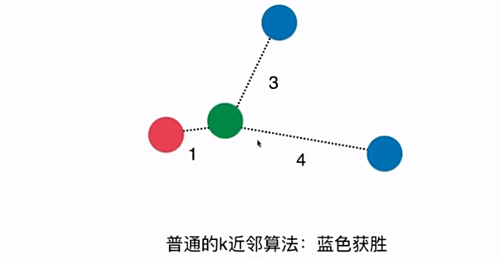

# 4-5 超参数 

- 超参数：在算法运行前需要决定的参数
- 模型参数：算法运行中学习的参数

kNN 算法没有模型参数
kNN 算法中的 k 是典型的超参数。

## 寻找好的参数

- 领域知识
- 经验数值（kNN 中 k=5 就是一个默认值）
- 实验搜索


```python
import numpy as np
from sklearn import datasets
```


```python
digits = datasets.load_digits()
X = digits.data
y = digits.target
```


```python
from sklearn.model_selection import train_test_split

X_train, X_test, y_train, y_test = train_test_split(X, y, test_size=0.2, random_state=666)
```


```python
from sklearn.neighbors import KNeighborsClassifier

knn_clf = KNeighborsClassifier(n_neighbors=3)
knn_clf.fit(X_train, y_train)
knn_clf.score(X_test, y_test)
```


    Out:
    0.9888888888888889


### 寻找最好的 k


```python
best_score = 0.0
best_k = -1
for k in range(1, 11):
    knn_clf = KNeighborsClassifier(n_neighbors=k)
    knn_clf.fit(X_train, y_train)
    score = knn_clf.score(X_test, y_test)
    if score > best_score:
        best_k = k
        best_score = score

print("best_k =", best_k)
print("best_score =", best_score)
```

    Out:
    best_k = 4
    best_score = 0.9916666666666667


## KNN 中其他超参数

[https://scikit-learn.org/stable/modules/generated/sklearn.neighbors.KNeighborsClassifier.html](https://scikit-learn.org/stable/modules/generated/sklearn.neighbors.KNeighborsClassifier.html)



考虑距离的权重。

可取距离的倒数为权重

解决平票问题。

KNeighborsClassifier 中的 weights，当 weights='uniform' 时，是不考虑权重的。
- 'distance' 就考虑权重。

### 超参数：考虑距离？不考虑？（uniform or distance）


```python
best_method = ""
best_score = 0.0
best_k = -1

for method in ["uniform", "distance"]:
    for k in range(1, 11):
        knn_clf = KNeighborsClassifier(n_neighbors=k, weights=method)
        knn_clf.fit(X_train, y_train)
        score = knn_clf.score(X_test, y_test)
        if score > best_score:
            best_k = k
            best_score = score
            best_method = method

print("best_method =", best_method)
print("best_k =", best_k)
print("best_score =", best_score)
```

    Out:
    best_method = uniform
    best_k = 4
    best_score = 0.9916666666666667


## 距离

- 欧式距离
- 曼哈顿距离
- 明可夫斯基距离

$$(\sum_{i=1}^{n} \left\vert X_i^{(a)} - X_i^{(b)} \right\vert ^{p} )^{\frac{1}{p}}$$

超参数 p。
- p = 1：曼哈顿距离
- p = 2：欧式距离

sklearn 中 p 默认为 2.


```python
%%time
best_p = -1
best_score = 0.0
best_k = -1

for k in range(1, 11):
    for p in range(1, 6):
        knn_clf = KNeighborsClassifier(n_neighbors=k, weights="distance", p=p)
        knn_clf.fit(X_train, y_train)
        score = knn_clf.score(X_test, y_test)
        if score > best_score:
            best_k = k
            best_score = score
            best_p = p

print("best_p =", best_p)
print("best_k =", best_k)
print("best_score =", best_score)
```

    Out:
    best_p = 2
    best_k = 3
    best_score = 0.9888888888888889
    CPU times: user 13.6 s, sys: 21.2 ms, total: 13.6 s
    Wall time: 13.8 s


sklearn 网格搜索封装了一个函数用于超参数调试。
