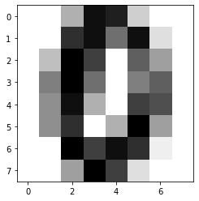

# 4-4 分类准确度

- 分类的准确度 accuracy

在一个更大的数据集上进行测试，封装 accuracy。

机器学习中一个非常重要的概念：超参数。


```python
import numpy as np
import matplotlib
import matplotlib.pyplot as plt
from sklearn import datasets
```


```python
# 手写数字数据集
digits = datasets.load_digits()
```


```python
digits.keys()
```


    Out:
    dict_keys(['data', 'target', 'frame', 'feature_names', 'target_names', 'images', 'DESCR'])


```python
print(digits.DESCR)
```

    Out:
    .. _digits_dataset:
    
    Optical recognition of handwritten digits dataset
    --------------------------------------------------
    
    **Data Set Characteristics:**
    
        :Number of Instances: 5620
        :Number of Attributes: 64
        :Attribute Information: 8x8 image of integer pixels in the range 0..16.
        :Missing Attribute Values: None
        :Creator: E. Alpaydin (alpaydin '@' boun.edu.tr)
        :Date: July; 1998
    
    This is a copy of the test set of the UCI ML hand-written digits datasets
    https://archive.ics.uci.edu/ml/datasets/Optical+Recognition+of+Handwritten+Digits
    
    The data set contains images of hand-written digits: 10 classes where
    each class refers to a digit.
    
    Preprocessing programs made available by NIST were used to extract
    normalized bitmaps of handwritten digits from a preprinted form. From a
    total of 43 people, 30 contributed to the training set and different 13
    to the test set. 32x32 bitmaps are divided into nonoverlapping blocks of
    4x4 and the number of on pixels are counted in each block. This generates
    an input matrix of 8x8 where each element is an integer in the range
    0..16. This reduces dimensionality and gives invariance to small
    distortions.
    
    For info on NIST preprocessing routines, see M. D. Garris, J. L. Blue, G.
    T. Candela, D. L. Dimmick, J. Geist, P. J. Grother, S. A. Janet, and C.
    L. Wilson, NIST Form-Based Handprint Recognition System, NISTIR 5469,
    1994.
    
    .. topic:: References
    
      - C. Kaynak (1995) Methods of Combining Multiple Classifiers and Their
        Applications to Handwritten Digit Recognition, MSc Thesis, Institute of
        Graduate Studies in Science and Engineering, Bogazici University.
      - E. Alpaydin, C. Kaynak (1998) Cascading Classifiers, Kybernetika.
      - Ken Tang and Ponnuthurai N. Suganthan and Xi Yao and A. Kai Qin.
        Linear dimensionalityreduction using relevance weighted LDA. School of
        Electrical and Electronic Engineering Nanyang Technological University.
        2005.
      - Claudio Gentile. A New Approximate Maximal Margin Classification
        Algorithm. NIPS. 2000.


```python
X = digits.data
# 1797 个样本，每个样本有 64 个特征
X.shape
```


    Out:
    (1797, 64)


```python
# 标签
y = digits.target

y.shape
```


    Out:
    (1797,)


```python
# 标签
digits.target_names
```


    Out:
    array([0, 1, 2, 3, 4, 5, 6, 7, 8, 9])


```python
# 前一百个数据
y[:100]
```


    Out:
    array([0, 1, 2, 3, 4, 5, 6, 7, 8, 9, 0, 1, 2, 3, 4, 5, 6, 7, 8, 9, 0, 1,
           2, 3, 4, 5, 6, 7, 8, 9, 0, 9, 5, 5, 6, 5, 0, 9, 8, 9, 8, 4, 1, 7,
           7, 3, 5, 1, 0, 0, 2, 2, 7, 8, 2, 0, 1, 2, 6, 3, 3, 7, 3, 3, 4, 6,
           6, 6, 4, 9, 1, 5, 0, 9, 5, 2, 8, 2, 0, 0, 1, 7, 6, 3, 2, 1, 7, 4,
           6, 3, 1, 3, 9, 1, 7, 6, 8, 4, 3, 1])


```python
# X[:10]
```


```python
some_digit = X[666]
```


```python
# 对应数字 0
y[666]
```


    Out:
    0


```python
# 可视化一个样本数字
some_digit_image = some_digit.reshape(8, 8)
plt.imshow(some_digit_image, cmap=matplotlib.cm.binary)
plt.show()
```

​    

​    


```python
from playML.model_selection import train_test_split
```


```python
X_train, X_test, y_train, y_test = train_test_split(X, y, test_ratio=0.2)
```


```python
from playML.kNN import KNNClassifier
```


```python
my_knn_clf = KNNClassifier(k=3)
```


```python
my_knn_clf.fit(X_train, y_train)
```


    KNN(k=3)


```python
y_predict = my_knn_clf.predict(X_test)
```


```python
# 预测准确度
sum(y_predict == y_test) / len(y_test)
```


    Out:
    0.9916434540389972


## 封装预测准确度函数 accuracy_score

```python

import numpy as np


def accuracy_score(y_true, y_predict):
  assert y_true.shape[0] == y_predict.shape[0], \
    "the size of y_true must be equal to the size of y_predit"

  return sum(y_true == y_predict) / len(y_true)
```


```python
from playML.metrics import accuracy_score
```


```python
accuracy_score(y_test, y_predict)
```


    Out:
    0.9916434540389972


封装到 KNNClassifier
```python
    def score(self, X_test, y_test):
        y_predict = self.predict(X_test)
        return accuracy_score(y_test, y_predict)
```

重启环境


```python
my_knn_clf.score(X_test, y_test)
```


    Out:
    0.9916434540389972


得到的结果与 accuracy_score(y_test, y_predict) 保持一致。

## sklearn 中的 accuracy_score


```python
from sklearn.model_selection import train_test_split

X_train, X_test, y_train, y_test = train_test_split(X, y, test_size=0.2, random_state=666)
```


```python
from sklearn.neighbors import KNeighborsClassifier

knn_clf = KNeighborsClassifier(n_neighbors=3)
```


```python
knn_clf.fit(X_train, y_train)
```


    KNeighborsClassifier(n_neighbors=3)


```python
y_predict = knn_clf.predict(X_test)
```


```python
from sklearn.metrics import accuracy_score
```


```python
accuracy_score(y_test, y_predict)
```


    Out:
    0.9888888888888889


```python
knn_clf.score(X_test, y_test)
```


    Out:
    0.9888888888888889