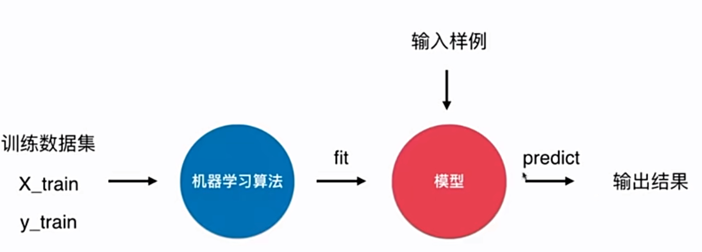
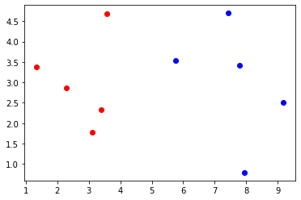
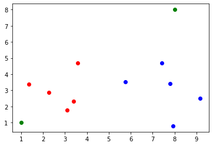

# 4-2 scikit-learn 中机器学习算法封装

机器学习算法的流程：



KNN 没有得到模型。

可以说 kNN 不需要训练过程的算法。

- k 近邻算法是非常特殊的，可以被认为是没有模型的算法。
- 为了和其他算法统一，可以认为训练数据就是模型本身。

## 实验

当前路径下的函数封装

`./kNN_functions/kNN.py`

```python
import numpy as np
from math import sqrt
from collections import Counter

def kNN_classify(k, X_train, y_train, x):
    assert 1 <= k <= X_train.shape[0], "k must be valid"
    assert X_train.shape[0] == y_train.shape[0], \
        "the size of X_train must equal to the size of y_train"
    assert X_train.shape[1] == x.shape[0], \
        "the feature number of x must be equal to X_train"
    
    distances = [sqrt(np.sum((x_train - x)**2)) for x_train in X_train]
    nearest = np.argsort(distances)
    
    topK_y = [y_train[i] for i in nearest [:k]]
    votes = Counter(topK_y)
    
    return votes.most_common(1)[0][0]
```


```python
import numpy as np
import matplotlib.pyplot as plt

raw_data_X = [[3.393533211, 2.331273381],
              [3.110073483, 1.781539638],
              [1.343808831, 3.368360954],
              [3.582294042, 4.679179110],
              [2.280362439, 2.866990263],
              [7.423436942, 4.696522875],
              [5.745051997, 3.533989803],
              [9.172168622, 2.511101045],
              [7.792783481, 3.424088941],
              [7.939820817, 0.791637231]
             ]
raw_data_y = [0, 0, 0, 0, 0, 1, 1, 1, 1, 1]

X_train = np.array(raw_data_X)
y_train = np.array(raw_data_y)

# 新的数据
x = np.array([8.093607318, 3.365731514])
```


```python
%run kNN_function/kNN.py
```


```python
predict_y = kNN_classify(6, X_train, y_train, x)
```


```python
predict_y
```


    1


## 使用 scikit-learn 中的 kNN


```python
from sklearn.neighbors import KNeighborsClassifier
```


```python
# 创建实例
kNN_classify = KNeighborsClassifier(n_neighbors=6)
```


```python
# 拟合训练数据集
kNN_classify.fit(X_train, y_train)
```


    KNeighborsClassifier(n_neighbors=6)


```python
# 输入需要是矩阵
kNN_classify.predict(x)
"""
    array=[8.09360732 3.36573151].
    Reshape your data either using array.reshape(-1, 1) 
    if your data has a single feature or array.reshape(1, -1) if it contains a single sample.
"""
```


    '\n    array=[8.09360732 3.36573151].\n    Reshape your data either using array.reshape(-1, 1) \n    if your data has a single feature or array.reshape(1, -1) if it contains a single sample.\n'


```python
X_predict = x.reshape(1, -1)
```


```python
X_predict.shape
```


    (1, 2)


```python
# 进行预测
y_predict = kNN_classify.predict(X_predict)
```


```python
y_predict[0]
```


    1


## 重新整理我们的 kNN 算法

```python
import numpy as np
from math import sqrt
from collections import Counter


class KNNClassifier:
    
    def __init__(self, k):
        """初始化kNN分类器"""
        assert k >= 1, "k must be valid"
        self.k = k
        self._X_train = None
        self._y_train = None
        
    def fit(self, X_train, y_train):
        """根据训练数据集X_train和y_train训练kNN分类器"""
        assert X_train.shape[0] == y_train.shape[0], \
            "the size of X_train must be equal to the size of y_train"
        assert self.k <= X_train.shape[0], \
            "the size of X_train must be at least k"
        
        self._X_train = X_train
        self._y_train = y_train
        return self
    
    def predict(self, X_predict):
        """给定待预测数据集 X+predict，返回表示X_predict的结果向量"""
        assert self._X_train is not None and self._y_train is not None, \
            "must fit before predict!"
        assert X_predict.shape[1] == self._X_train.shape[1], \
            "the feature number of X_predict musst be equal to X_train"
        
        y_predict = [self._predict(x) for x in X_predict]
        return np.array(y_predict)
    
    def _predict(self, x):
        """给定单个待预测数据x，返回x的预测结果"""
        assert x.shape[0] == self._X_train.shape[1], \
            "the feature number of x must be equal to X_train"
        
        distances = [sqrt(np.sum((x_train - x)**2)) for x_train in self._X_train]
        nearest = np.argsort(distances)
    
        topK_y = [self._y_train[i] for i in nearest [:self.k]]
        votes = Counter(topK_y)
    
        return votes.most_common(1)[0][0]
        
```


```python
%run kNN_function/kNN.py
```


```python
knn_clf = KNNClassifier(k=6)
```


```python
knn_clf.fit(X_train, y_train)
```


    <__main__.KNNClassifier at 0x7fe12d722da0>


```python
y_predict = knn_clf.predict(X_predict)
```


```python
y_predict
```


    array([1])


```python
X_predict = np.array([[1, 2], [8, 3]])
X_predict.shape
```


    (2, 2)


```python
y_predict = knn_clf.predict(X_predict)
```


```python
y_predict
```


    array([0, 1])


```python
plt.scatter(X_train[y_train==0,0], X_train[y_train==0,1], color='r')
plt.scatter(X_train[y_train==1,0], X_train[y_train==1,1], color='b')
plt.show()
```

​    

​    


```python
X_predict[0,0]
```


    1


```python
plt.scatter(X_train[y_train==0,0], X_train[y_train==0,1], color='r')
plt.scatter(X_train[y_train==1,0], X_train[y_train==1,1], color='b')
plt.scatter(X_predict[0, 0], X_predict[0, 0], color='g') # 新数据使用绿色
plt.scatter(X_predict[1, 0], X_predict[1, 0], color='g') # 新数据使用绿色
plt.show()
```

​    

​    