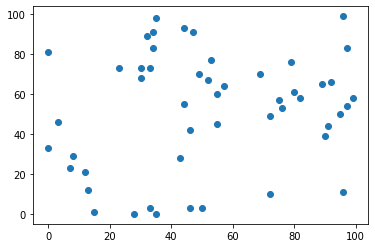
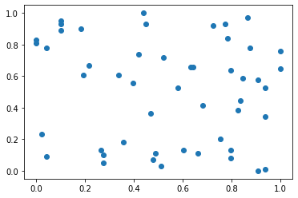
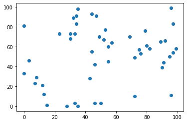
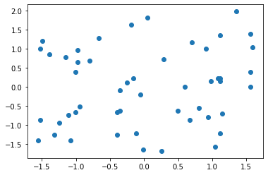

# 4-7 数据归一化

- 将所有的数据都映射到同一尺度

**最值归一化 Normalization：** 把所有数据映射到 0-1 之间。

$$x_{scale} = \frac{x - x_{min}}{x_{max} - x_{min}}$$

适用于分布有明显边界的情况；受 outlier 影响较大。

**均值方差归一化 Standardization：** 把所有数据归一到均值为 0，方差为 1 的分布中。

$$x_{scale} = \frac{x - x_{mean}}{s}$$

适用于数据分布没有明显边界；有可能存在极端数据值。


## 最值归一化 Normalization


```python
import numpy as np
import matplotlib.pyplot as plt
```


```python
# 向量
x = np.random.randint(0, 100, size=100)
```


```python
x
```


    Out:
    array([32, 40, 34, 53, 45, 54, 83, 92, 56, 13,  9, 50, 92, 80, 63, 43, 90,
           71, 17, 24, 17, 88, 34, 74,  8, 91, 28, 85, 89, 42, 93, 96, 75, 64,
           66, 42, 36, 36, 18, 78, 73, 10, 41, 70, 94, 32, 23, 72, 72, 63, 59,
           72, 81, 60, 12, 42, 16, 54, 90, 43, 33, 30, 44, 18, 12,  1, 74, 69,
           47, 53, 18, 28, 67, 28, 46, 63, 41,  5, 12, 40, 65, 74, 59, 56, 76,
           97, 93, 83, 56, 80, 12,  8, 67,  8,  0, 64, 91, 96,  4, 61])


```python
[x - np.min(x)] / (np.max(x) - np.min(x))
```


    Out:
    array([[0.32989691, 0.41237113, 0.35051546, 0.54639175, 0.46391753,
            0.55670103, 0.8556701 , 0.94845361, 0.57731959, 0.13402062,
            0.09278351, 0.51546392, 0.94845361, 0.82474227, 0.64948454,
            0.44329897, 0.92783505, 0.73195876, 0.17525773, 0.24742268,
            0.17525773, 0.90721649, 0.35051546, 0.7628866 , 0.08247423,
            0.93814433, 0.28865979, 0.87628866, 0.91752577, 0.43298969,
            0.95876289, 0.98969072, 0.77319588, 0.65979381, 0.68041237,
            0.43298969, 0.37113402, 0.37113402, 0.18556701, 0.80412371,
            0.75257732, 0.10309278, 0.42268041, 0.72164948, 0.96907216,
            0.32989691, 0.2371134 , 0.74226804, 0.74226804, 0.64948454,
            0.60824742, 0.74226804, 0.83505155, 0.6185567 , 0.12371134,
            0.43298969, 0.16494845, 0.55670103, 0.92783505, 0.44329897,
            0.34020619, 0.30927835, 0.45360825, 0.18556701, 0.12371134,
            0.01030928, 0.7628866 , 0.71134021, 0.48453608, 0.54639175,
            0.18556701, 0.28865979, 0.69072165, 0.28865979, 0.4742268 ,
            0.64948454, 0.42268041, 0.05154639, 0.12371134, 0.41237113,
            0.67010309, 0.7628866 , 0.60824742, 0.57731959, 0.78350515,
            1.        , 0.95876289, 0.8556701 , 0.57731959, 0.82474227,
            0.12371134, 0.08247423, 0.69072165, 0.08247423, 0.        ,
            0.65979381, 0.93814433, 0.98969072, 0.04123711, 0.62886598]])


```python
# 矩阵
X = np.random.randint(0, 100, (50, 2))
```


```python
# 浮点数
X = np.array(X, dtype=float)
```


```python
plt.scatter(X[:, 0], X[:, 1])
plt.show()
```

​    

​    


```python
# 归一化第一列特征
X[:, 0] = (X[:, 0] - np.min(X[:, 0])) / (np.max(X[:, 0] - np.min(X[:, 0])))
```


```python
# 归一化第二列特征
X[:, 1] = (X[:, 1] - np.min(X[:, 1])) / (np.max(X[:, 1] - np.min(X[:, 1])))
```


```python
plt.scatter(X[:, 0], X[:, 1])
plt.show()
```

​    

​    


```python
# 第 0 列对应的均值
np.mean(X[:, 0])
```


    Out: 
    0.5361224489795918


```python
np.std(X[:, 0])
```


    Out:
    0.3080633031545962


## 均值方差归一化 Standardization


```python
X2 = np.random.randint(0, 100, (50, 2))
```


```python
plt.scatter(X[:, 0], X[:, 1])
plt.show()
```

​    

​    


```python
X2 = np.array(X2, dtype=float)
```


```python
X2[:,0] = (X2[:,0] - np.mean(X2[:,0])) / np.std(X2[:,0])

X2[:,1] = (X2[:,1] - np.mean(X2[:,1])) / np.std(X2[:,1])

```


```python
plt.scatter(X2[:, 0], X2[:, 1])
plt.show()
```

​    

​    


其范围并不是在 0-1 之间的。


```python
np.mean(X2[:, 0]) # 非常接近 0
```


    Out:
    1.2434497875801754e-16


```python
np.std(X2[:, 0]) # 非常接近 1
```


    Out:
    0.9999999999999999


