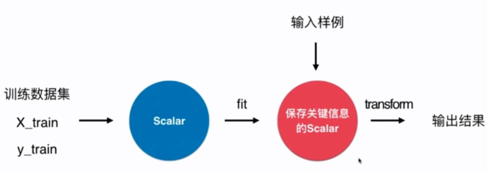

# 4-8 sklearn 中的 Scaler

## 如何对测试集进行归一化？

$$\frac{X_{test} - mean_{train}}{std_{train}}$$

测试数据是模拟真实环境。

- 真实环境很有可能无法得到所有测试数据的均值和方差。
- 对数据的归一化也是算法的一部分。

包保存训练数据得到的均值和方差。

scikit-learn 中使用 Scaler 这个类。



## Scikit-learn 中的 Scaler


```python
import numpy as np
from sklearn import datasets
```


```python
iris = datasets.load_iris()
```


```python
X = iris.data
y = iris.target
```


```python
# 查看前 10 行
X[:10,:]
```


    # Out
    array([[5.1, 3.5, 1.4, 0.2],
           [4.9, 3. , 1.4, 0.2],
           [4.7, 3.2, 1.3, 0.2],
           [4.6, 3.1, 1.5, 0.2],
           [5. , 3.6, 1.4, 0.2],
           [5.4, 3.9, 1.7, 0.4],
           [4.6, 3.4, 1.4, 0.3],
           [5. , 3.4, 1.5, 0.2],
           [4.4, 2.9, 1.4, 0.2],
           [4.9, 3.1, 1.5, 0.1]])


```python
from sklearn.model_selection import train_test_split

X_train, X_test, y_train, y_test = train_test_split(X, y, test_size=0.2, random_state=666)
```

### scikit-learn 中的 StandardScaler


```python
from sklearn.preprocessing import StandardScaler
```


```python
standardScaler = StandardScaler()
```


```python
standardScaler.fit(X_train)
```


    StandardScaler()


```python
# 均值
standardScaler.mean_
```


    # Out
    array([5.83416667, 3.08666667, 3.70833333, 1.17      ])


```python
# 方差
standardScaler.scale_
```


    # Out
    array([0.81019502, 0.44327067, 1.76401924, 0.75317107])


```python
# 归一化
X_train = standardScaler.transform(X_train)
```


```python
# 归一化测试集
X_test_standard = standardScaler.transform(X_test)
```


```python
from sklearn.neighbors import KNeighborsClassifier
```


```python
knn_clf = KNeighborsClassifier(n_neighbors=3)
```


```python
knn_clf.fit(X_train, y_train)
```


    KNeighborsClassifier(n_neighbors=3)


```python
# 100% 准确
knn_clf.score(X_test_standard, y_test)
```


    # Out
    1.0


```python
# 未归一化处理
knn_clf.score(X_test, y_test)
```


    # Out
    0.3333333333333333


## 实现自己的均值归一化

```python
import numpy as np

class StandardScaler:

    def __init__(self):
        self.mean_ = None
        self.scale_ = None

    def fit(self, X):
        """根据训练数据集X获得数据的均值和方差"""
        assert X.ndim == 2, "The dimension of X must be 2" # 只处理2维的矩阵

        self.mean_ = np.array([np.mean(X[:, i]) for i in range(X.shape[1])])
        self.scale_ = np.array([np.std(X[:, i]) for i in range(X.shape[1])])

        return self

    def transform(self, X):
        """将 X 根据这个 StandardScaler 进行均值方差归一化处理"""
        assert X.ndim == 2, "The dimension of X must be 2"
        assert self.mean_ is not None and self.scale_ is not None, \
            "must fit before transform"
        assert X.shape[1] == len(self.mean_), \
            "the feature number of X must be equal to mean_ and std_"
        
        resX = np.empty(shape=X.shape, dtype=float)
        for col in range(X.shape[1]):
            resX[:, col] = (X[:, col] - self.mean_[col]) / self.scale_[col]

        return resX
        
```
