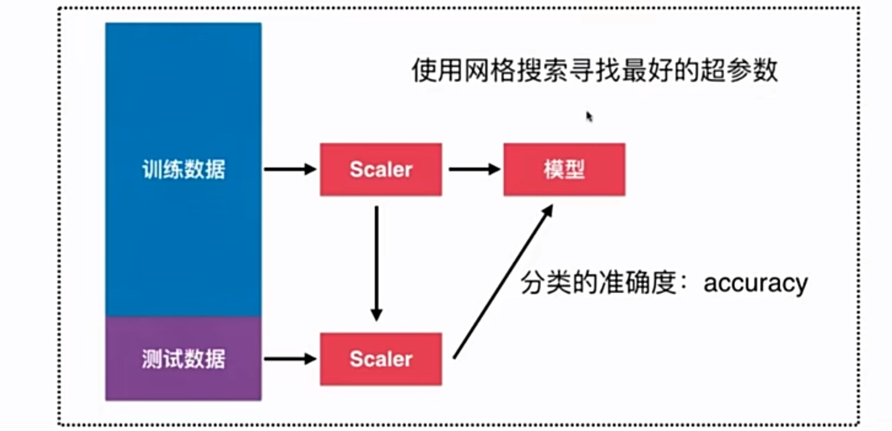

# 4- 9 更多有关 K 近邻算法的思考

## 优点

- 解决分类问题
- 天然可以解决多分类问题
- 思想简单，效果强大
- 使用 k 近邻算法可以解决回归问题。KNeighborsRegressor
  - 取最近的 k 个点的平均值。
  - 加权平均的方法。

## 缺点

最大的缺点：效率低下。

- 如果训练集有 m 个样本，n 个特征，则预测每一个新的数据，需要 O(mn)。
- 优化：使用树结构：KD-Tree，Ball-Tree。

缺点 2：数据高度相关。

- 对 ourlier 更加敏感。

缺点 3：预测的结果不具有可解释性。

- 只是找了最近的 k 个点。

缺点 4：维度灾难。

- 随着维度的增加，”看似相近“ 的两个点之间的距离越来越大。
- PCA 降维

## 机器学习流程回顾

- 训练数据和测试数据
- Scaler
- 网格搜索

