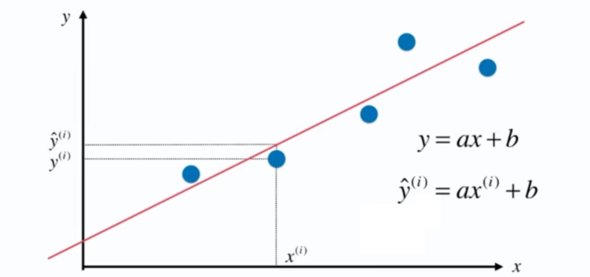

# 5-1 简单线性回归

## 线性回归算法

- 解决回归问题
- 思想简单，实现容易
- 许多强大的非线性模型的基础
- 结果具有很好的可解释性
- 蕴涵机器学习中的很多重要思想

线性回归：寻找一条直线，最大程度的 “拟合” 样本特征和样本输出标签之间的关系。

样本特征只有一个，称为：简单线性回归。

简单线性回归可以推广到多元线性回归。

- $y = ax + b$
- $\check{y} = a x^{(i)} + b$

假设我们找到了最佳拟合的直线方程：$$y = ax + b$$

则对于每一个样本点 $x^{(i)}$，根据我们的直线方程，预测值为：$\check{y} = a x^{(i)} + b$。真值为 $\check{y}$。

我们希望 $y^{(i)}$ 和 $\check{y}^{(i)}$ 的差距尽量小。

表达  $y^{(i)}$ 和 $\check{y}^{(i)}$ 的差距：

- $y^{(i)} - \check{y}^{(i)}$：不可取，有正有负会相互抵消。
- $\left\vert y^{(i)} - \check{y}^{(i)}  \right\vert  $：非处处可导。
- $(y^{(i)} - \check{y}^{(i)})^2$：✅

考虑所有的样本：$\sum_{i = 0}^{m} (y^{(i)} - \check{y}^{(i)})^2$

目标：使得 $\sum_{i = 0}^{m} (y^{(i)} - \check{y}^{(i)})^2$ 尽可能的小，即找到 a 和 b，使得 $\sum_{i = 0}^{m} (y^{(i)} - a x^{(i)} - b)^2$ 尽可能的小。

## 一类机器学习算法的基本思想

目标：找到 a 和 b，使得 $\sum_{i = 0}^{m} (y^{(i)} - a x^{(i)} - b)^2$ 尽可能的小。

- 损失函数（Loss Function）
- 效用函数（Utility Function）

通过分析问题，确定问题的损失函数或者效用函数；

通过最优化损失函数或效用函数，获得机器学习的模型。

通常目标是损失函数尽可能的小，效用函数尽可能的大。

近乎所有参数学习算法都是这样的套路。

- 线性回归
- 多项式回归
- 逻辑回归
- SVM
- 神经网络
- ...

专门的学科：最优化原理、凸优化

## 简单线性回归问题

目标：找到 a 和 b，使得 $\sum_{i = 0}^{m} (y^{(i)} - a x^{(i)} - b)^2$ 尽可能的小。

典型的最小二乘法问题：最小化误差的平方。

> 最小二乘法的简单计算？

$$a = \frac{\sum_{i = 1}^{m} (x^{(i)} - \bar{x}) (y^{(i)} - \bar{y})}{\sum_{i = 1}^m (x^{(i)} - \bar{x})^2}$$

$$b = \bar{y} - a\bar{x}$$

