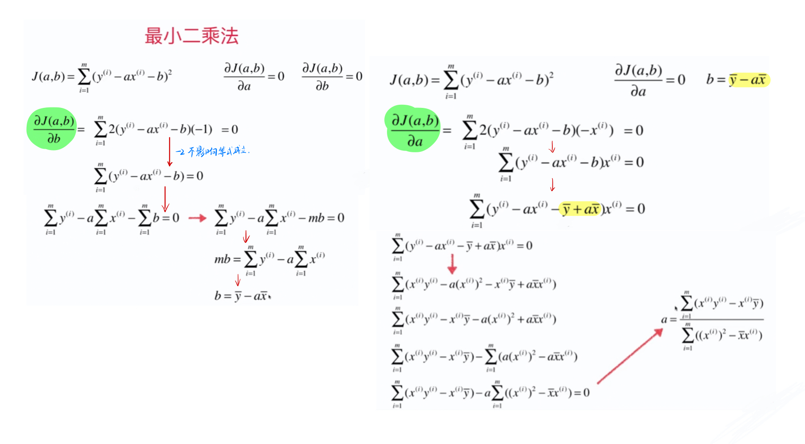
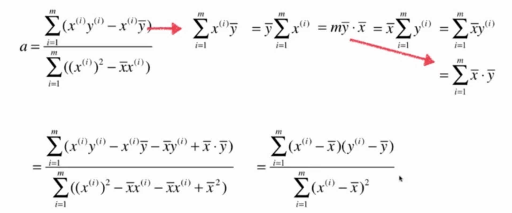

# 5-2 最小二乘法推导

目标：找到 a 和 b，使得 $\sum_{i = 0}^{m} (y^{(i)} - a x^{(i)} - b)^2$ 尽可能的小。

$J(a, b) = \sum_{i = 0}^{m} (y^{(i)} - a x^{(i)} - b)^2$

- 损失函数 or 代价函数 or Cost

要求损失函数 $J(a, b)$ 的最小值，就是求一个函数的极值。

最基本的方法就是对函数的各个未知量求导，导数为 0 的地方，就是极值点。

- $\frac{\partial{J(a, b)}}{\partial{a}} = 0$
- $\frac{\partial{J(a, b)}}{\partial{b}} = 0$

链式法则求导。

a 的表达式可以继续变形简化。

最小二乘法推导完毕。

$$a = \frac{\sum_{i = 1}^{m} (x^{(i)} - \bar{x}) (y^{(i)} - \bar{y})}{\sum_{i = 1}^m (x^{(i)} - \bar{x})^2}$$

$$b = \bar{y} - a\bar{x}$$

