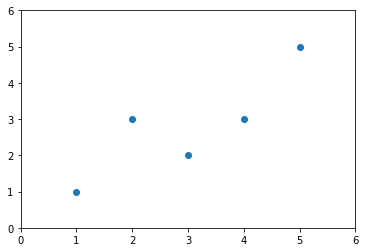
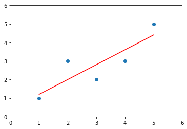

# 5-3 实现 Simple Linear Regression


```python
import numpy as np
import matplotlib.pyplot as plt
```


```python
# 测试数据
x = np.array([1., 2., 3., 4., 5.]) # 每个样本只有一个特征
y = np.array([1., 3., 2., 3., 5.])
```


```python
plt.scatter(x, y)
plt.axis([0, 6, 0, 6])
plt.show()
```

​    

​    


$$a = \frac{\sum_{i = 1}^{m} (x^{(i)} - \bar{x}) (y^{(i)} - \bar{y})}{\sum_{i = 1}^m (x^{(i)} - \bar{x})^2}$$

$$b = \bar{y} - a\bar{x}$$


```python
x_mean = np.mean(x)
y_mean = np.mean(y)
```


```python
num = 0.0 # 分母
d = 0.0   # 分子
for x_i, y_i in zip(x, y):
    num += (x_i - x_mean) * (y_i - y_mean)
    d += (x_i - x_mean)**2
```


```python
a = num / d
b = y_mean - a * x_mean
```


```python
a
```


    Out:
    0.8


```python
b
```


    Out:
    0.39999999999999947


```python
# y = ax + b
y_hat = a * x + b
```


```python
plt.scatter(x, y)
plt.plot(x, y_hat, color="red")
plt.axis([0, 6, 0, 6])
plt.show()
```

​    

​    


```python
# 预测新数据
x_predict = 6
y_predict = a * x_predict + b
```


```python
y_predict
```


    Out:
    5.2


## 封装自己的简单线性回归


```python
from playML.SimpleLinearRegression import SimpleLinearRegression1

reg1 = SimpleLinearRegression1()
reg1.fit(x, y)
```


    Out:
    SimpleLinearRegression1


```python
reg1.predict(np.array([x_predict]))
```


    array([5.2])


```python
reg1.a_
```


    Out:
    0.8


```python
reg1.b_
```


    Out:
    0.39999999999999947


```python
y_hat1 = reg1.predict(x)
```


```python
plt.scatter(x, y)
plt.plot(x, y_hat1, color="red")
plt.axis([0, 6, 0, 6])
plt.show()
```

​    

​    


