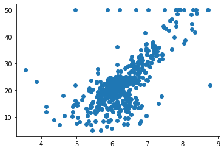
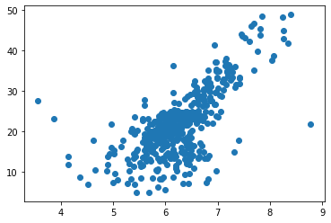
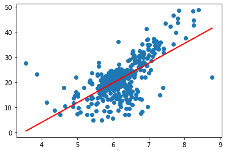

# 5-5 衡量线性回归算法的指标 MSE、RMSE、MAE

分类的准确度：Accuracy

以简单线性回归为例：

-  目标：找到 a 和 b，使得 $\sum_{i = 0}^{m} (y^{(i)} - a x^{(i)} - b)^2$ 尽可能的小（训练数据集）。

（1）衡量标准：$\sum_{i = 1}^{m} (y_{test}^{(i)} - \check{y}_{test}^{(i)})^2$

存在问题：与 m 有关。

（2）改进，**均方误差 MSE（Mean Squared Error）**

$$ \frac{1}{m} \sum_{i = 1}^{m} (y_{test}^{(i)} - \check{y}_{test}^{(i)})^2$$

存在问题：量纲的影响。

（3）改进：**均方根误差 RMSE（Root Mean Squared Error）**

$$\sqrt{MSE_{test}}$$

（4）**平均绝对误差 MAE（Mean Absolute Error）**

$$ \frac{1}{m} \sum_{i = 1}^{m}\left\vert y_{test}^{(i)} - \check{y}_{test}^{(i)} \right\vert $$

- MAE 可以用来评价算法。

## 实验

```python
import numpy as np
import matplotlib.pyplot as plt
from sklearn import datasets
```

## 波士顿房价数据


```python
boston = datasets.load_boston()
```


```python
print(boston.DESCR)
```

    .. _boston_dataset:
    
    Boston house prices dataset
    ---------------------------
    
    **Data Set Characteristics:**  
    
        :Number of Instances: 506 
    
        :Number of Attributes: 13 numeric/categorical predictive. Median Value (attribute 14) is usually the target.
    
        :Attribute Information (in order):
            - CRIM     per capita crime rate by town
            - ZN       proportion of residential land zoned for lots over 25,000 sq.ft.
            - INDUS    proportion of non-retail business acres per town
            - CHAS     Charles River dummy variable (= 1 if tract bounds river; 0 otherwise)
            - NOX      nitric oxides concentration (parts per 10 million)
            - RM       average number of rooms per dwelling
            - AGE      proportion of owner-occupied units built prior to 1940
            - DIS      weighted distances to five Boston employment centres
            - RAD      index of accessibility to radial highways
            - TAX      full-value property-tax rate per $10,000
            - PTRATIO  pupil-teacher ratio by town
            - B        1000(Bk - 0.63)^2 where Bk is the proportion of blacks by town
            - LSTAT    % lower status of the population
            - MEDV     Median value of owner-occupied homes in $1000's
    
        :Missing Attribute Values: None
    
        :Creator: Harrison, D. and Rubinfeld, D.L.
    
    This is a copy of UCI ML housing dataset.
    https://archive.ics.uci.edu/ml/machine-learning-databases/housing/


​    
    This dataset was taken from the StatLib library which is maintained at Carnegie Mellon University.
    
    The Boston house-price data of Harrison, D. and Rubinfeld, D.L. 'Hedonic
    prices and the demand for clean air', J. Environ. Economics & Management,
    vol.5, 81-102, 1978.   Used in Belsley, Kuh & Welsch, 'Regression diagnostics
    ...', Wiley, 1980.   N.B. Various transformations are used in the table on
    pages 244-261 of the latter.
    
    The Boston house-price data has been used in many machine learning papers that address regression
    problems.   
         
    .. topic:: References
    
       - Belsley, Kuh & Welsch, 'Regression diagnostics: Identifying Influential Data and Sources of Collinearity', Wiley, 1980. 244-261.
       - Quinlan,R. (1993). Combining Instance-Based and Model-Based Learning. In Proceedings on the Tenth International Conference of Machine Learning, 236-243, University of Massachusetts, Amherst. Morgan Kaufmann.


```python
boston.feature_names
```


    array(['CRIM', 'ZN', 'INDUS', 'CHAS', 'NOX', 'RM', 'AGE', 'DIS', 'RAD',
           'TAX', 'PTRATIO', 'B', 'LSTAT'], dtype='<U7')


```python
# 只取一个特征
x = boston.data[:, 5] # 只使用房间的数量 RM 特征
```


```python
x.shape
```


    (506,)


```python
y = boston.target
```


```python
y.shape
```


    (506,)


```python
plt.scatter(x, y)
plt.show()
```

​    

​    


```python
# 删除一些点
np.max(y)
```


    50.0


```python
x = x[y < 50.0]
y = y[y < 50.0]
```


```python
plt.scatter(x, y)
plt.show()
```

​    

​    


## 使用简单线性回归法


```python
from playML.model_selection import train_test_split

x_train, x_test, y_train, y_test = train_test_split(x, y, seed=666)
```


```python
x_train.shape
```


    (392,)


```python
x_train.ndim
```


    1


```python
x_test.shape
```


    (98,)


```python
from playML.SimpleLinearRegression import SimpleLinearRegression

reg = SimpleLinearRegression()

reg.fit(x_train, y_train)
```


    SimpleLinearRegression


```python
# 斜率
reg.a_
```


    7.8608543562689555


```python
# 截距
reg.b_
```


    -27.459342806705543


```python
plt.scatter(x_train, y_train)
plt.plot(x_train, reg.predict(x_train), color="red")
plt.show()
```

​    

​    


```python
y_predict = reg.predict(x_test)
```

## MSE


```python
mse_test = np.sum((y_predict - y_test)**2) / len(y_test)

mse_test
```


    24.156602134387438


```python

```

## RMSE


```python
from math import sqrt


rmse_test = sqrt(mse_test)
rmse_test
```


    4.914936635846635


```python
## MSE

mae_test = np.sum(np.absolute(y_predict - y_test)) / len(y_test)

mae_test
```


    3.5430974409463873


```python
# playML.matrics.py

def mean_squared_error(y_true, y_predict):
    """计算 y_true 和 y_predict 之间的 MSE"""
    assert len(y_true) == len*y_predict, \
        "the size of y_true must be equal to the size of y_predict"
    
    return np.sum((y_predict - y_true)**2) / len(y_true)

def root_mean_squared_error(y_true, y_predict):

    return sqrt(mean_squared_error(y_true, y_predict))

def mean_absolute_error(y_true, y_predict):
    """计算 y_true 和 y_predict 之间的 RMSE"""
    assert len(y_true) == len(y_predict), \
        "the size of y_true must be equal to the size of y_predict"
    
    return np.sum(np.absolute(y_predict - y_true)) / len(y_true)

```


```python
from playML.metrics import mean_squared_error
from playML.metrics import root_mean_squared_error
from playML.metrics import mean_absolute_error
```


```python
mean_squared_error(y_test, y_predict)
```


    24.156602134387438


```python
root_mean_squared_error(y_test, y_predict)
```


    4.914936635846635


```python
mean_absolute_error(y_test, y_predict)
```


    3.5430974409463873


## sklearn 中的 MSE 和 MAE


```python
from sklearn.metrics import mean_squared_error
from sklearn.metrics import mean_absolute_error
```


```python
mean_squared_error(y_test, y_predict)
```


    24.156602134387438


```python
mean_absolute_error(y_test, y_predict)
```


    3.5430974409463873

## RMSE vs MAE

- RMSE : $$\sqrt{ \frac{1}{m} \sum_{i = 1}^{m} (y_{test}^{(i)} - \check{y}_{test}^{(i)})^2}$$
- MAE: $$ \frac{1}{m} \sum_{i = 1}^{m}\left\vert y_{test}^{(i)} - \check{y}_{test}^{(i)} \right\vert $$


目标函数选择 RMSE 更好。