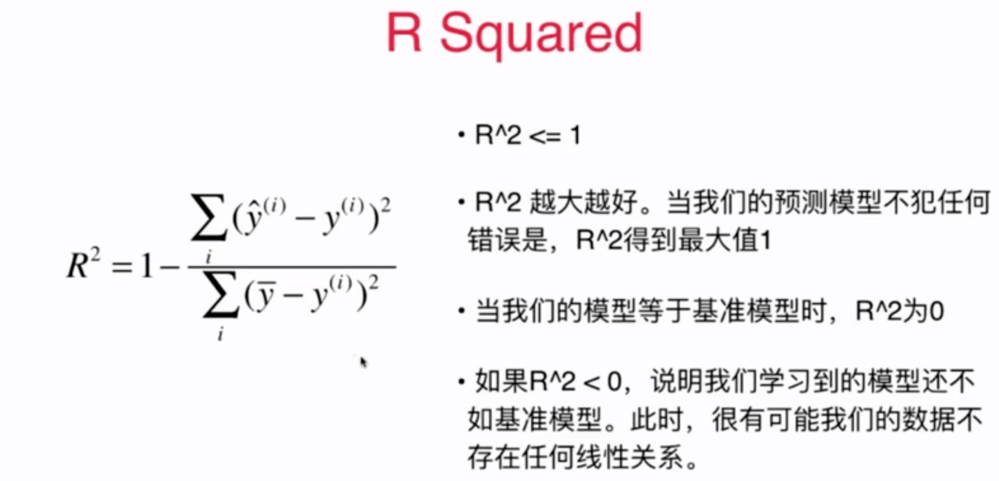

# 5-6 最好的衡量线性回归算法的指标 R Squared

 ## R Squard

$$R^2 = 1 - \frac{SS_{residual}}{SS_{total}}$$

- Residual Sum of Squares
- Total Sum of Squares

$$R^2 = 1 - \frac{\sum_i (\check{y}^{(i)} - y^{(i)})^2}{\sum_i (\bar{y} - y^{(i)})^2}$$

这个指标为什么好？

- 分子：使用我们的训练的模型预测产生的错误
- 分母：使用  $y = \bar{y}$ 预测产生的错误（baseline model）



- $R^2$ 是小于等于 1 的，因为减数是一个大于等于 0 的数。
- 模型没有任何误差，分子为 0，$R^2 = 1$ 取得最大值。
- 分子分母除以 m，则 $R^2 = 1 - \frac{MSE(\check{y}, y)}{Var(y)}$

## 编程实验

## R Square

```python
1 - mean_squared_error(y_test, y_predict) / np.var(y_test)
```


```
0.6129316803937322
```


```python
# playML.metrics.py
def r2_score(y_true, y_predict):

    return 1 - mean_squared_error(y_true, y_predict) / np.var(y_true)

```

```python
from playML.metrics import r2_score
```

```python
r2_score(y_test, y_predict)
```


```
0.6129316803937322
```


```python
## sklearn 中的 R Squrare
from sklearn.metrics import r2_score
```

```python
r2_score(y_test, y_predict)
```


```
0.6129316803937324
```


## 封装到 SimpleLinearRegression

```python
    def score(self, x_test, y_test):

        y_predict = self.predict(x_test)
        return r2_score(y_test, y_predict)
```

```python
reg.score(x_test, y_test)
```


```
0.6129316803937322
```


