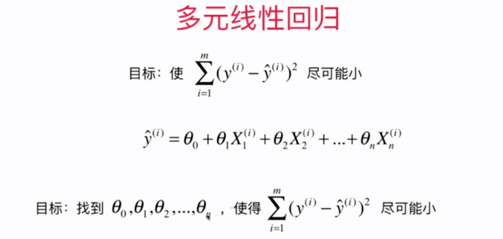
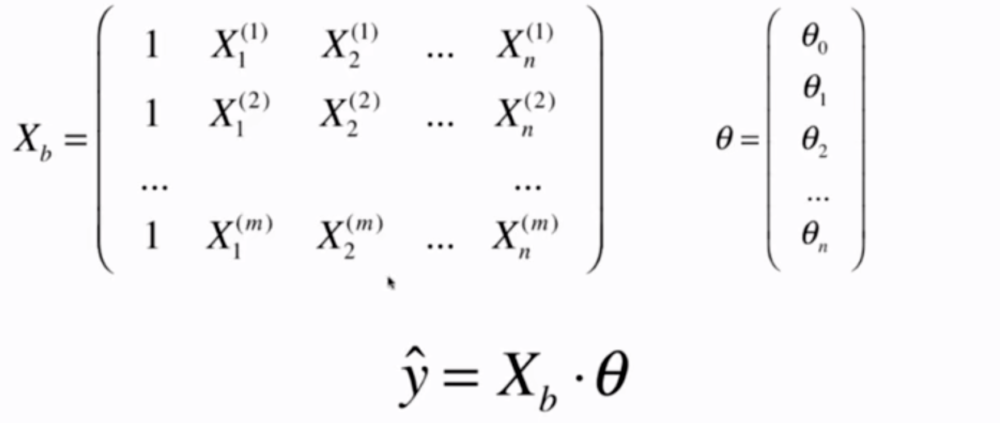

# 5-7 多元线性回归和正规方程解（解析解）

n 个特征，则需要 (n + 1) 个参数。

从简单线性回归推广到多元线性回归。

- 参数： $\theta = (\theta_0, \theta_1, \theta_2, ..., \theta_n)^T$
- 第 0 个特征 $X_0^{(i)} = 1$。
- 特征：$X^{(i)} = (X_0^{(i)}, X_1^{(i)}, X_2^{(i)}, ..., X_n^{(i)})$

向量化表示为：$\check{y}^{(i)} = X^{(i)} \cdot  \theta$

- $\check{y}$ 是一个向量。

**多元线性回归的目标：估计参数 $\theta$ 使得 $(y - X_b \cdot \theta)^T (y - X_b \cdot \theta)$ 尽可能的小。**

代价函数：$J(\theta) = (y - X_b \cdot \theta)^T (y - X_b \cdot \theta)$

 推导得：$\theta = (X_b^T X_b)^{-1} X_b^T y$。这个式子称为多元线性回归的正规方程解（Normal Equation）

- 缺点：时间复杂度高（矩阵求逆）：$O(n^3)$ ，可以优化为 $O(n^{2.4})$ 。复杂度依然很高。

- 优点：不需要对数据做归一化处理

