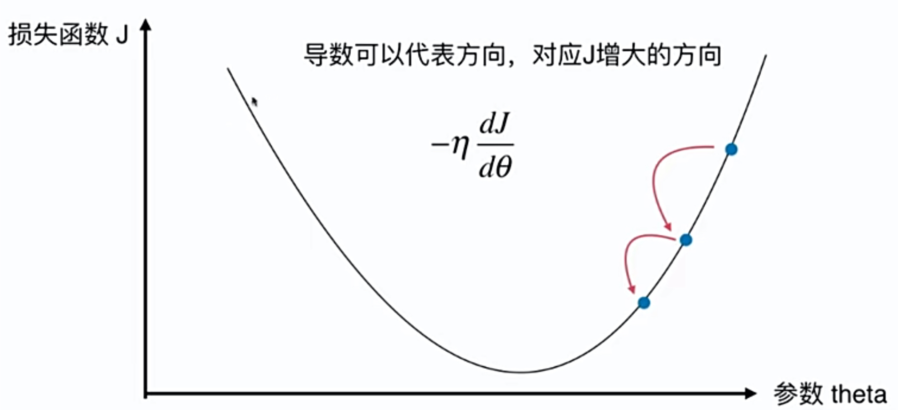
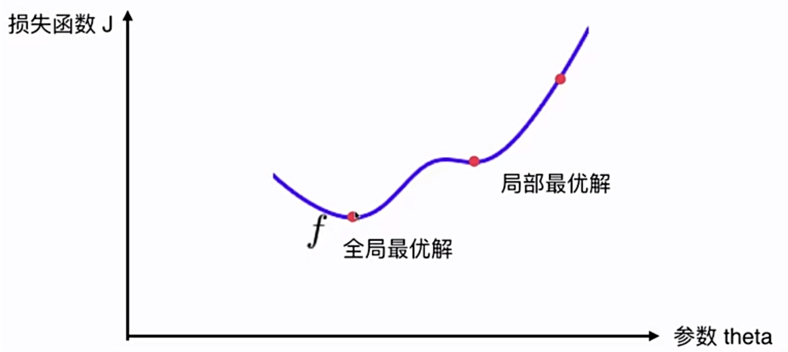

# 6-1 梯度下降 Gradient Descent

梯度下降法

- 不是一个机器学习算法
- 是一种基于**搜索**的最优化方法
- 作用：最小化一个损失函数
- 梯度上升法：最大化一个效用函数

## 理解梯度下降

- 在曲线方程中导数代表切线斜率。
- 导数代表 theta 单位变化是，J 相应的变化。
- 二维：**导数**可以代表方向，对应 J 增大的方向。希望最小化 J，因此需要向负梯度方向移动（$-\eta \frac{\partial J}{\partial{\theta}}$）。
- 多维：**梯度**可以代表方向，...

在二维空间理解梯度下降。

- $\eta$ 称为学习率（Learning rete）
- $\eta$ 太小，减慢收敛学习速度；$\eta$ 太大，甚至导致不收敛。
- 并不是所有函数都有唯一的极值点。（非凸的，陷入局部极值点）

解决方案：

- 多次运行，随机化初始点
- 梯度下降法的初始点也是一个超参数

线性回归中使用梯度下降，线性回归的损失函数具有唯一的最优解，即代价函数是凸函数。