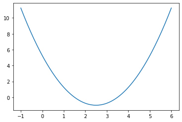
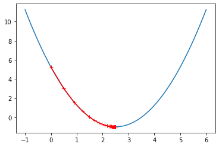
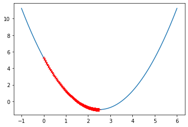
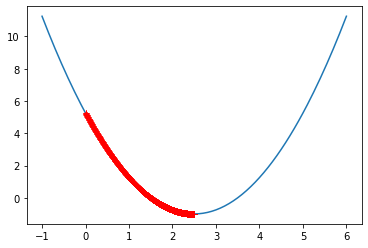
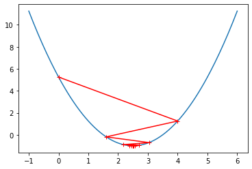
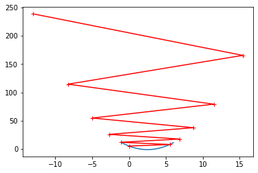

# 6-2 梯度下降法模拟


```python
import numpy as np
import matplotlib.pyplot as plt
```


```python
# 140 个点
plot_x = np.linspace(-1, 6, 141)
plot_x
```


    array([-1.  , -0.95, -0.9 , -0.85, -0.8 , -0.75, -0.7 , -0.65, -0.6 ,
           -0.55, -0.5 , -0.45, -0.4 , -0.35, -0.3 , -0.25, -0.2 , -0.15,
           -0.1 , -0.05,  0.  ,  0.05,  0.1 ,  0.15,  0.2 ,  0.25,  0.3 ,
            0.35,  0.4 ,  0.45,  0.5 ,  0.55,  0.6 ,  0.65,  0.7 ,  0.75,
            0.8 ,  0.85,  0.9 ,  0.95,  1.  ,  1.05,  1.1 ,  1.15,  1.2 ,
            1.25,  1.3 ,  1.35,  1.4 ,  1.45,  1.5 ,  1.55,  1.6 ,  1.65,
            1.7 ,  1.75,  1.8 ,  1.85,  1.9 ,  1.95,  2.  ,  2.05,  2.1 ,
            2.15,  2.2 ,  2.25,  2.3 ,  2.35,  2.4 ,  2.45,  2.5 ,  2.55,
            2.6 ,  2.65,  2.7 ,  2.75,  2.8 ,  2.85,  2.9 ,  2.95,  3.  ,
            3.05,  3.1 ,  3.15,  3.2 ,  3.25,  3.3 ,  3.35,  3.4 ,  3.45,
            3.5 ,  3.55,  3.6 ,  3.65,  3.7 ,  3.75,  3.8 ,  3.85,  3.9 ,
            3.95,  4.  ,  4.05,  4.1 ,  4.15,  4.2 ,  4.25,  4.3 ,  4.35,
            4.4 ,  4.45,  4.5 ,  4.55,  4.6 ,  4.65,  4.7 ,  4.75,  4.8 ,
            4.85,  4.9 ,  4.95,  5.  ,  5.05,  5.1 ,  5.15,  5.2 ,  5.25,
            5.3 ,  5.35,  5.4 ,  5.45,  5.5 ,  5.55,  5.6 ,  5.65,  5.7 ,
            5.75,  5.8 ,  5.85,  5.9 ,  5.95,  6.  ])


```python
plot_y = (plot_x - 2.5)**2 - 1
```


```python
plt.plot(plot_x, plot_y)
plt.show()
```

​    

​    


```python
def dJ(theta):
    return 2*(theta - 2.5)
```


```python
# 损失函数
def J(theta):
    return (theta - 2.5)**2 - 1
```


```python
theta = 0 # 初始化
epsilon = 1e-8
eta = 0.1
while True:
    gradient = dJ(theta)
    last_theta = theta
    theta = theta - eta * gradient
    
    if (abs(J(theta) - J(last_theta)) < epsilon):
        break

print(theta)
print(last_theta)
```

    2.499891109642585
    2.4998638870532313


```python
theta = 0 # 初始化
epsilon = 1e-8
theta_history = [theta]
eta = 0.1
while True:
    gradient = dJ(theta)
    last_theta = theta
    theta = theta - eta * gradient
    theta_history.append(theta)
    
    if (abs(J(theta) - J(last_theta)) < epsilon):
        break

plt.plot(plot_x, J(plot_x))
plt.plot(np.array(theta_history), J(np.array(theta_history)), color="red", marker="+")
```


    [<matplotlib.lines.Line2D at 0x7fe15414f240>]


​    

​    


```python
# 封装
def gradient_descent(initial_theta, eta, epsilon=1e-8):
    
    theta = initial_theta
    theta_history.append(theta)
    
    while True:
        gradient = dJ(theta)
        last_theta = theta
        theta = theta - eta * gradient
        theta_history.append(theta)
        
        if (abs(J(theta) - J(last_theta)) < epsilon):
            break

def plot_theta_history():
    plt.plot(plot_x, J(plot_x))
    plt.plot(np.array(theta_history), J(np.array(theta_history)), color="red", marker="+")
    plt.show()
```


```python
eta = 0.01
theta_history = []
gradient_descent(0., eta)
plot_theta_history()
```

​    

​    


```python
eta = 0.001
theta_history = []
gradient_descent(0., eta)
plot_theta_history()
```

​    

​    


```python
len(theta_history)
```


    3682


```python
eta = 0.8
theta_history = []
gradient_descent(0., eta)
plot_theta_history()
```

​    

​    


```python
eta = 1.1 # 无法收敛
theta_history = []
gradient_descent(0., eta)
plot_theta_history()
```


    ---------------------------------------------------------------------------
    
    OverflowError                             Traceback (most recent call last)
    
    <ipython-input-27-32ceaf1ff4bb> in <module>
          1 eta = 1.1
          2 theta_history = []
    ----> 3 gradient_descent(0., eta)
          4 plot_theta_history()


    <ipython-input-19-635df6bbc137> in gradient_descent(initial_theta, eta, epsilon)
         11         theta_history.append(theta)
         12 
    ---> 13         if (abs(J(theta) - J(last_theta)) < epsilon):
         14             break
         15 


    <ipython-input-7-5adc88bec3cf> in J(theta)
          1 # 损失函数
          2 def J(theta):
    ----> 3     return (theta - 2.5)**2 - 1


    OverflowError: (34, 'Result too large')


```python
def J(theta):
    try:
        return (theta - 2.5)**2 - 1
    except:
        return float('inf')

```


```python
# 避免死循环
def gradient_descent(initial_theta, eta, n_iters = 1e4,  epsilon=1e-8):
    
    theta = initial_theta
    theta_history.append(theta)
    i_iter = 0
    
    while i_iter < n_iters:
        gradient = dJ(theta)
        last_theta = theta
        theta = theta - eta * gradient
        theta_history.append(theta)
        
        if (abs(J(theta) - J(last_theta)) < epsilon):
            break
        i_iter += 1
```


```python
eta = 1.1 # 无法收敛
theta_history = []
gradient_descent(0., eta)
```


```python
len(theta_history)
```


    10001


```python
# nan 表示值太大了
theta_history[-1]
```


    nan


```python
eta = 1.1 # 无法收敛
theta_history = []
gradient_descent(0., eta, n_iters=10)
plot_theta_history()
```

​    

​    


```python
theta_history
```


    [0.0,
     5.5,
     -1.1000000000000005,
     6.820000000000001,
     -2.684000000000002,
     8.720800000000004,
     -4.964960000000007,
     11.457952000000008,
     -8.249542400000012,
     15.399450880000016,
     -12.979341056000022]


