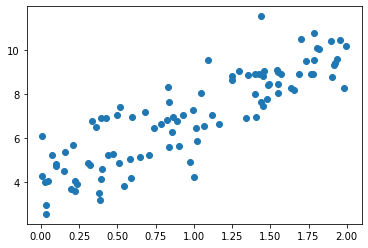
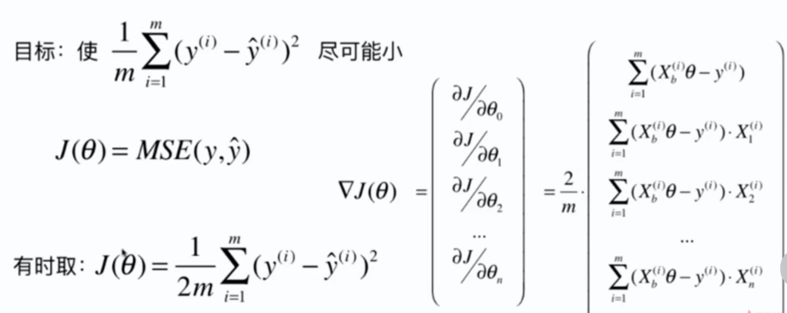

# 6-4 在线性回归模型中使用梯度下降法


```python
import numpy as np
import matplotlib.pyplot as plt
```


```python
np.random.seed(666)
x = 2 * np.random.random(size=100)
y = x * 3. + 4. + np.random.normal(size=100)
```


```python
X = x.reshape(-1, 1)
X.shape
```


    (100, 1)


```python
y.shape
```


    (100,)


```python
plt.scatter(x, y)
plt.show()
```

​    

​    


## 使用梯度下降训练

参考公式：




```python
def J(theta, X_b, y):
    try:
        return np.sum((y - X_b.dot(theta))**2) / len(X_b)
    except:
        return float('inf')
```


```python
def dJ(theta, X_b, y):
    res = np.empty(len(theta))
    res[0] = np.sum((X_b.dot(theta) - y))
    for i in range(1, len(theta)):
        res[i] = (X_b.dot(theta) - y).dot(X_b[:,i])
    
    return res * 2 / len(X_b)
```


```python
def gradient_descent(X_b, y, initial_theta, eta, n_iters = 1e4,  epsilon=1e-8):
    
    theta = initial_theta
    i_iter = 0
    
    while i_iter < n_iters:
        gradient = dJ(theta, X_b, y)
        last_theta = theta
        theta = theta - eta * gradient
        
        if (abs(J(theta, X_b, y) - J(last_theta, X_b, y)) < epsilon):
            break
        i_iter += 1
    
    return theta
```


```python
X_b = np.hstack([np.ones((len(X), 1)) , X])

initial_theta = np.zeros(X_b.shape[1])
eta = 0.01

theta = gradient_descent(X_b, y, initial_theta, eta)
```


```python
theta
```


    array([4.02145786, 3.00706277])


## 封装我们的线性回归算法

```python
    def fit_gd(self, X_train, y_train, eta=0.01, n_iters=1e4):
        """根据训练数据集 X_train, y_train，使用梯度下降法训练 Linear Regression 模型"""
        assert X_train.shape[0] == y_train.shape[0], \
            "the size of X_train must be equal to the size of y_train"
        
        def J(theta, X_b, y_train):
            try:
                return np.sum((y_train - X_b.dot(theta))**2) / len(X_b)
            except:
                return float('inf')

        def dJ(theta, X_b, y):
            res = np.empty(len(theta))
            res[0] = np.sum((X_b.dot(theta) - y_train))
            for i in range(1, len(theta)):
                res[i] = (X_b.dot(theta) - y_train).dot(X_b[:,i])
            
            return res * 2 / len(X_b)
        
        def gradient_descent(X_b, y_train, initial_theta, eta, n_iters = 1e4,  epsilon=1e-8):
        
            theta = initial_theta
            i_iter = 0
            
            while i_iter < n_iters:
                gradient = dJ(theta, X_b, y_train)
                last_theta = theta
                theta = theta - eta * gradient
                
                if (abs(J(theta, X_b, y_train) - J(last_theta, X_b, y_train)) < epsilon):
                    break
                i_iter += 1
            
            return theta

        X_b = np.hstack([np.ones((len(X_train), 1)) , X_train])

        initial_theta = np.zeros(X_b.shape[1])
        self._theta = gradient_descent(X_b, y_train, initial_theta, eta, n_iters)
        self.interception_ = self._theta[0]
        self.coef_ = self._theta[1:]

        return self
```


```python
from playML.LinearRegression import LinearRegression

lin_reg = LinearRegression()
lin_reg.fit_gd(X, y)
```


    LinearRegression


```python
lin_reg.coef_
```


    array([3.00706277])


```python
lin_reg.interception_
```


    4.021457858204859


