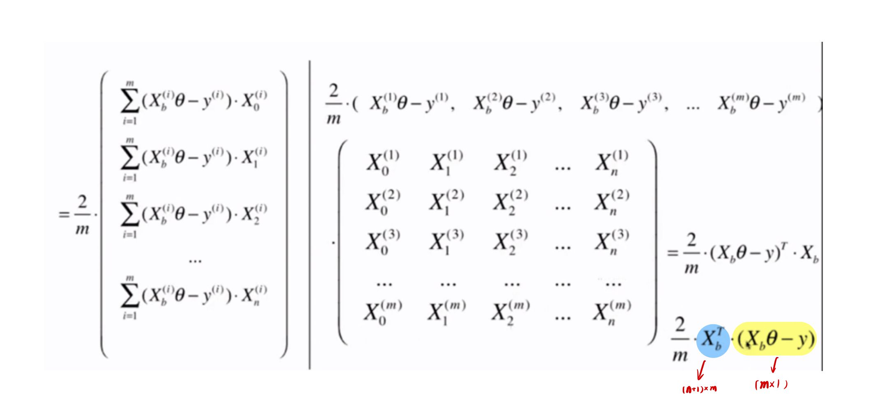

# 6-5 梯度下降的向量化和数据标准化

求梯度转换为两个矩阵的乘法运算。

$\mathbb{R}^{1 \times m} \times \mathbb{R}^{m \times (n+1)}$

- 梯度是一个 $\mathbb{R}^{(n + 1) \times 1}​$ 的列向量，$n​$ 表示特征的数量。
- $m$ 为样本数
- 向量一般来说都是列向量，很少有行向量的。



最后得到的**梯度**为 $\mathbb{R}^{(n + 1) \times 1}$ 的列向量。

梯度：

$$\triangledown J(\theta) = \frac{2}{m} X_b^T \cdot (X_b \theta - y)$$

# 6-5 梯度下降的向量化和数据标准化

```python
import numpy as np
from sklearn import datasets
```

```python
boston = datasets.load_boston()

X = boston.data
y = boston.target

X = X[y < 50.0]
y = y[y < 50.0]
```

```python
from playML.model_selection import train_test_split

X_train, X_test, y_train, y_test = train_test_split(X, y, seed=666)
```

```python
from playML.LinearRegression import LinearRegression

lin_reg1 = LinearRegression()
%time lin_reg1.fit_normal(X_train, y_train) # 正规方程 fit
lin_reg1.score(X_test, y_test)
```

```
CPU times: user 1.92 ms, sys: 247 µs, total: 2.16 ms
Wall time: 1.42 ms
```


```
0.8129794056212832
```


## 使用梯度下降法

```python
lin_reg2 = LinearRegression()
lin_reg2.fit_gd(X_train, y_train)
```

```
/Users/landonglei/anaconda3/envs/imooc-ml/lib/python3.6/site-packages/numpy/core/fromnumeric.py:87: RuntimeWarning: overflow encountered in reduce
  return ufunc.reduce(obj, axis, dtype, out, **passkwargs)
/Users/landonglei/anaconda3/envs/workspace/imooc-python3-ml/mymodule/playML/LinearRegression.py:32: RuntimeWarning: overflow encountered in square
  return np.sum((y - X_b.dot(theta)) ** 2) / len(y)
/Users/landonglei/anaconda3/envs/workspace/imooc-python3-ml/mymodule/playML/LinearRegression.py:48: RuntimeWarning: invalid value encountered in double_scalars
  if (abs(J(theta, X_b, y) - J(last_theta, X_b, y)) < epsilon):
```


```
LinearRegression()
```


```python
# 'nan' 梯度值 Overflow 了
lin_reg2.coef_
```


```
array([nan, nan, nan, nan, nan, nan, nan, nan, nan, nan, nan, nan, nan])
```


```python
# 查看前 10 个数据
X[:10, :]
```


```
array([[6.3200e-03, 1.8000e+01, 2.3100e+00, 0.0000e+00, 5.3800e-01,
        6.5750e+00, 6.5200e+01, 4.0900e+00, 1.0000e+00, 2.9600e+02,
        1.5300e+01, 3.9690e+02, 4.9800e+00],
       [2.7310e-02, 0.0000e+00, 7.0700e+00, 0.0000e+00, 4.6900e-01,
        6.4210e+00, 7.8900e+01, 4.9671e+00, 2.0000e+00, 2.4200e+02,
        1.7800e+01, 3.9690e+02, 9.1400e+00],
       [2.7290e-02, 0.0000e+00, 7.0700e+00, 0.0000e+00, 4.6900e-01,
        7.1850e+00, 6.1100e+01, 4.9671e+00, 2.0000e+00, 2.4200e+02,
        1.7800e+01, 3.9283e+02, 4.0300e+00],
       [3.2370e-02, 0.0000e+00, 2.1800e+00, 0.0000e+00, 4.5800e-01,
        6.9980e+00, 4.5800e+01, 6.0622e+00, 3.0000e+00, 2.2200e+02,
        1.8700e+01, 3.9463e+02, 2.9400e+00],
       [6.9050e-02, 0.0000e+00, 2.1800e+00, 0.0000e+00, 4.5800e-01,
        7.1470e+00, 5.4200e+01, 6.0622e+00, 3.0000e+00, 2.2200e+02,
        1.8700e+01, 3.9690e+02, 5.3300e+00],
       [2.9850e-02, 0.0000e+00, 2.1800e+00, 0.0000e+00, 4.5800e-01,
        6.4300e+00, 5.8700e+01, 6.0622e+00, 3.0000e+00, 2.2200e+02,
        1.8700e+01, 3.9412e+02, 5.2100e+00],
       [8.8290e-02, 1.2500e+01, 7.8700e+00, 0.0000e+00, 5.2400e-01,
        6.0120e+00, 6.6600e+01, 5.5605e+00, 5.0000e+00, 3.1100e+02,
        1.5200e+01, 3.9560e+02, 1.2430e+01],
       [1.4455e-01, 1.2500e+01, 7.8700e+00, 0.0000e+00, 5.2400e-01,
        6.1720e+00, 9.6100e+01, 5.9505e+00, 5.0000e+00, 3.1100e+02,
        1.5200e+01, 3.9690e+02, 1.9150e+01],
       [2.1124e-01, 1.2500e+01, 7.8700e+00, 0.0000e+00, 5.2400e-01,
        5.6310e+00, 1.0000e+02, 6.0821e+00, 5.0000e+00, 3.1100e+02,
        1.5200e+01, 3.8663e+02, 2.9930e+01],
       [1.7004e-01, 1.2500e+01, 7.8700e+00, 0.0000e+00, 5.2400e-01,
        6.0040e+00, 8.5900e+01, 6.5921e+00, 5.0000e+00, 3.1100e+02,
        1.5200e+01, 3.8671e+02, 1.7100e+01]])
```


每个特征对应的数据规模是不一样的。如 0.0000e+00 和 3.9690e+02 相差数百倍。面对这样的数据，最后求得的梯度可能会是非常大。步长可能还是太大，导致梯度下降过程仍然是不收敛的。

为了验证假设，减小学习率。

```python
# 此时就不报错了
lin_reg2 = LinearRegression()
lin_reg2.fit_gd(X_train, y_train, eta=0.00000001)
```


```
LinearRegression()
```


```python
# 查看此时的 score
lin_reg2.score(X_test, y_test)
```


```
0.01471323455680762
```


很显然，梯度下降法找到的 theta 还没有达到损失函数的最小值。很有可能是学习率太小了，需要增加迭代的次数。

```python
# 100,000 次迭代
%time lin_reg2.fit_gd(X_train, y_train, eta=0.00000001, n_iters=1000000)
```

```
CPU times: user 1min 20s, sys: 484 ms, total: 1min 21s
Wall time: 43.4 s
```


```
LinearRegression()
```


```python
lin_reg2.score(X_test, y_test)
```


```
0.2758660499965925
```


## 数据归一化

使用梯度下降法前，最好进行数据归一化。


```python
from sklearn.preprocessing import StandardScaler
```

```python
standardScaler = StandardScaler()
standardScaler.fit(X_train)
```


```
StandardScaler()
```


```python
X_train_standard = standardScaler.transform(X_train)
```

```python
lin_reg3 = LinearRegression()
%time lin_reg3.fit_gd(X_train_standard, y_train)
```

```
CPU times: user 485 ms, sys: 8.62 ms, total: 494 ms
Wall time: 281 ms
```


```
LinearRegression()
```


```python
X_test_standard = standardScaler.transform(X_test)
```

```python
lin_reg3.score(X_test_standard, y_test)
```


```
0.8129873310487505
```


已经找到了损失函数的最小值，并且归一化后的收敛速度是非常快的。

而对于正规化方程，正规化方程需要的时间是 2.16 ms，而梯度下降需要的时间为：494 ms。

## 梯度下降算法的优势

```python
# 设计一个测试用例
m = 1000 # 样本量
n = 5000 # 特征量

big_x = np.random.normal(size=(m, n))
true_theta = np.random.uniform(0.0, 100.0, size=n+1)
big_y = big_x.dot(true_theta[1:]) + true_theta[0] + np.random.normal(0.0, 10.0, size=m)
```

```python
big_reg1 = LinearRegression()
%time big_reg1.fit_normal(big_x, big_y)
```

```
CPU times: user 10.2 s, sys: 414 ms, total: 10.6 s
Wall time: 5.57 s
```


```
LinearRegression()
```


```python
big_reg2 = LinearRegression()
%time big_reg2.fit_gd(big_x, big_y)
```

```
CPU times: user 3.53 s, sys: 31.7 ms, total: 3.56 s
Wall time: 1.97 s
```


```
LinearRegression()
```


当(m*n) 的矩阵非常大的时候，正规方程的求解就会非常慢。此时梯度下降的优势就体现出来了。

值得注意的是，这个测试用例的样本量是小于特征量的。在计算梯度时，要让每一个样本都来参加计算，这使得当样本量非常大时，计算梯度会非常慢。

改进的方式是随机梯度下降法。


