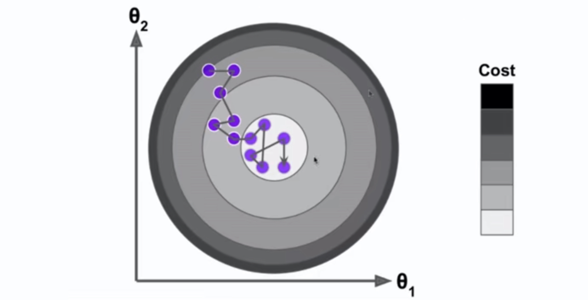

# 6-6 随机梯度下降法

批量梯度下降法（Batch Gradient Descent）

- 求梯度时，对所有的样本进行计算。
- 即：每一次计算梯度时，都要将**所有的样本**进行批量的计算。

当样本量非常大时，计算梯度也是非常耗时的。

随机梯度下降（Stochastic Gradient Descent）

- 每次只对**一个样本**进行计算。
- 梯度计算：$2 \cdot (X_b^{(i)})^T \cdot (X_b^{(i)} \theta - y^{(i)})$
- 维度情况：$(X_b^{(i)})^T \in \mathbb{R}^{(n+1) \times 1}$
  - $ (X_b^{(i)} \theta - y^{(i)}) \in \mathbb{R}^{1 \times 1}$
  - $\theta$ 是一个列向量：$\theta \in \mathbb{R}^{(n+1) \times 1}$

- > $X_b$ 为样本加入 1 后的增广形式。

随机梯度下降得到的结果仍然是一个 $\mathbb{R}^{(n+1) \times 1}$ 的列向量。



- SGD 的学习率的取值非常重要。采用学习率衰减。
- 最简单形式：$\eta = \frac{1}{i\_iters}$
- $\eta = \frac{1}{i\_iters + b}$：b 能缓解初始情况下迭代过快的问题。
- $\eta = \frac{a}{i\_iters + b}$：更灵活的形式。a 和 b 是两个超参数，经验取值 a = 5， b= 50。

模拟退火的思想：$\eta = \frac{t_0}{i\_iters + t_1}$

## 随机梯度下降

```python
import numpy as np
import matplotlib.pyplot as plt
```

```python
m = 100000

x = np.random.normal(size=m)
X = x.reshape(-1, 1)
y = 4.*x + 3. + np.random.normal(0, 3, size=m)

```

```python
# 批梯度下降
def J(theta, X_b, y):
    try:
        return np.sum((y - X_b.dot(theta)) ** 2) / len(y)
    except:
        return float('inf')

def dJ(theta, X_b, y):
    return X_b.T.dot(X_b.dot(theta) - y) * 2. / len(y)

def gradient_descent(X_b, y, initial_theta, eta, n_iters=1e4, epsilon=1e-8):

    theta = initial_theta
    cur_iter = 0

    while cur_iter < n_iters:
        gradient = dJ(theta, X_b, y)
        last_theta = theta
        theta = theta - eta * gradient
        if (abs(J(theta, X_b, y) - J(last_theta, X_b, y)) < epsilon):
            break

        cur_iter += 1

    return theta
```

```python
%%time
X_b = np.hstack([np.ones((len(X), 1)), X])
initial_theta = np.zeros(X_b.shape[1])
eta = 0.01
theta = gradient_descent(X_b, y, initial_theta, eta)
```

```
CPU times: user 1.3 s, sys: 15.9 ms, total: 1.32 s
Wall time: 734 ms
```


```python
theta
```


```
array([2.99902819, 3.99928445])
```


## 随机梯度下降

```python
# SGD 求梯度
def dJ_sgd(theta, X_b_i, y_i):
    return X_b_i.T.dot(X_b_i.dot(theta) - y_i) * 2.
```

```python
def sgd(X_b, y, initial_theta, n_iters):
    
    t0 = 5;
    t1 = 50;
    
    def learning_rate(t):
        return t0 / (t + t0)
    
    theta = initial_theta
    
    for cur_iter in range(n_iters):
        rand_i = np.random.randint(len(X_b))
        gradient = dJ_sgd(theta, X_b[rand_i], y[rand_i])
        theta = theta - learning_rate(cur_iter) * gradient
        
    return theta
```

测试随机梯度下降法

```python
%%time
X_b = np.hstack([np.ones((len(x), 1)), X]) # 增广形式
initial_theta = np.zeros(X_b.shape[1])
theta = sgd(X_b, y, initial_theta, n_iters=len(X_b)//3) # 检查 1/3 的样本
```

```
CPU times: user 335 ms, sys: 4.48 ms, total: 340 ms
Wall time: 355 ms
```


```python
theta
```


```
array([2.95289397, 3.9569807 ])
```

得到的结果与上面的批量梯度下降非常接近。而且 SGD 只使用了 1/3 的样本，这体现了 SGD 的优势。