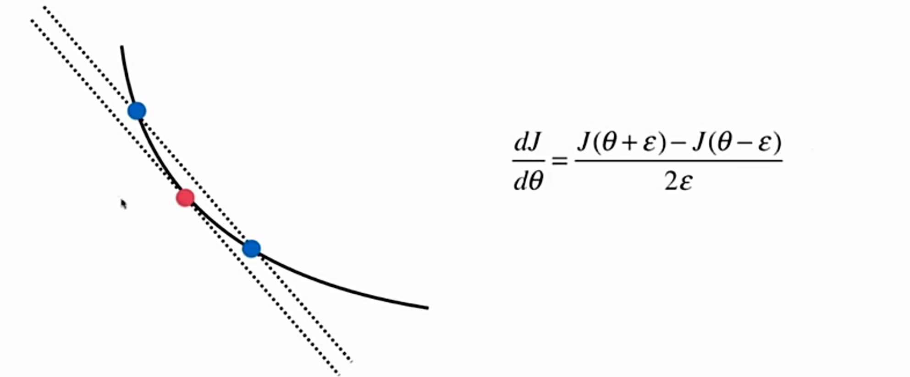
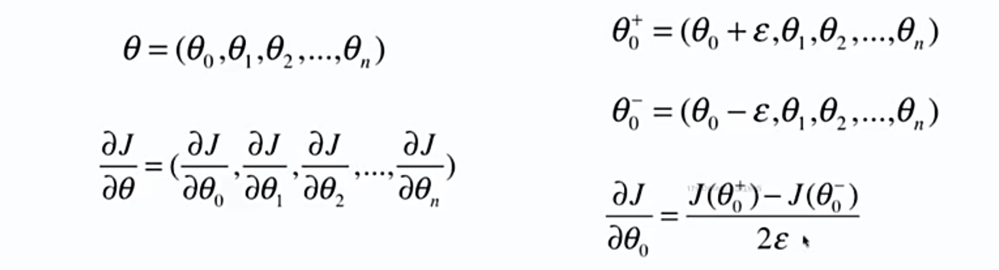

# 6-8 如何确定梯度计算的准确性：调试梯度下降法

## 关于梯度得调试

程序正常运行，但是梯度求解错误。

使用导数的定义进行检验。

参数只有一个的情况：



推广到高维的情况，同样适用。



- 同理求 $\frac{\partial{J}}{\partial{\theta_1}}, \frac{\partial{J}}{\partial{\theta_2}},...,\frac{\partial{J}}{\partial{\theta_n}}$

## 调试梯度实验

```python
import numpy as np
import matplotlib.pyplot as plt
```

```python
np.random.seed(666)
X = np.random.random(size=(1000, 10))
```

```python
true_theta = np.arange(1, 12, dtype=float)
```

```python
X_b = np.hstack([np.ones((len(X), 1)) , X])
y = X_b.dot(true_theta) + np.random.normal(size=1000)
```

```python
X.shape
```


```
(1000, 10)
```


```python
y.shape
```


```
(1000,)
```


```python
true_theta
```


```
array([ 1.,  2.,  3.,  4.,  5.,  6.,  7.,  8.,  9., 10., 11.])
```


```python
def J(theta, X_b, y):
    try:
        return np.sum((y - X_b.dot(theta)) ** 2) / len(X_b)
    except:
        return float('inf')
```

```python
def dJ_math(theta, X_b, y):
    return X_b.T.dot(X_b.dot(theta) - y) * 2. / len(y)
```

```python
def dJ_debug(theta, X_b, y, epsilon=0.01):
    res = np.empty(len(theta))
    for i in range(len(theta)):
        theta_1 = theta.copy()
        theta_1[i] += epsilon
        theta_2 = theta.copy()
        theta_2[i] -= epsilon
        
        res[i] = (J(theta_1, X_b, y) - J(theta_2, X_b, y)) / (2*epsilon)
    
    return res
```

```python
 def gradient_descent(dJ, X_b, y, initial_theta, eta, n_iters=1e4, epsilon=1e-8):

    theta = initial_theta
    cur_iter = 0

    while cur_iter < n_iters:
        gradient = dJ(theta, X_b, y)
        last_theta = theta
        theta = theta - eta * gradient
        if (abs(J(theta, X_b, y) - J(last_theta, X_b, y)) < epsilon):
            break

        cur_iter += 1

    return theta
```

```python
X_b = np.hstack([np.ones((len(X), 1)) , X])
initial_theta = np.zeros(X_b.shape[1])
eta = 0.01

%time theta = gradient_descent(dJ_debug, X_b, y, initial_theta, eta)
theta
```

```
CPU times: user 7.88 s, sys: 24 ms, total: 7.91 s
Wall time: 4.05 s
```


```
array([ 1.1251597 ,  2.05312521,  2.91522497,  4.11895968,  5.05002117,
        5.90494046,  6.97383745,  8.00088367,  8.86213468,  9.98608331,
       10.90529198])
```


```python
# 使用数学推导的梯度求导
%time theta = gradient_descent(dJ_math, X_b, y, initial_theta, eta)
theta
```

```
CPU times: user 1.08 s, sys: 5.92 ms, total: 1.09 s
Wall time: 562 ms
```


```
array([ 1.1251597 ,  2.05312521,  2.91522497,  4.11895968,  5.05002117,
        5.90494046,  6.97383745,  8.00088367,  8.86213468,  9.98608331,
       10.90529198])
```


dJ_debug 和 dJ_math 求解结果相同。

- dJ_debug （导数的定义）求解速度很慢，可以用来检验 dJ_math 计算的正确性。