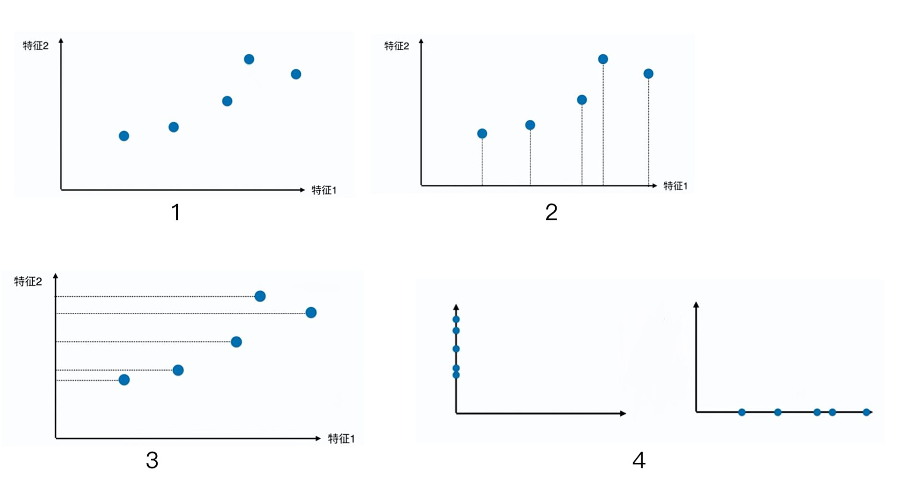
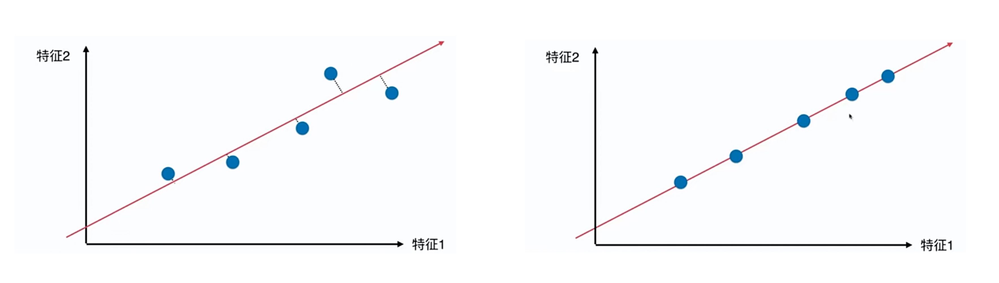
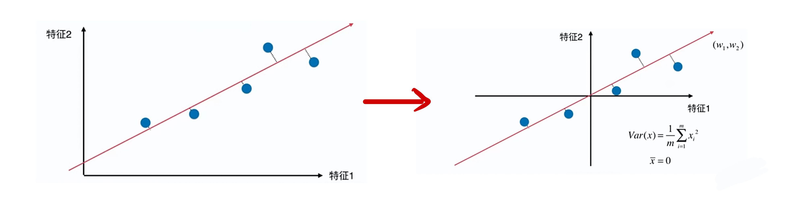

# 7-1 什么是 PCA

主成分分析 Principal Component Analysis

- 一个非监督的机器学习算法
- 主要用于数据降维
- 通过降维，可以发现更便于人类理解的特征
- 其他应用：可视化；去噪。

图 1 是一个有两个个特征的数据集。

图 2 为把特征 2 丢掉。

图 3 把特征 1 丢掉。

图 4 为两种降维方案结果。

由图 4 可知，保留特征 1 是一个更好的降维方案。点和点之间的距离相对大，更好的保留了原来的点和点之间距离，但并不是最好的降维方案。

最好的降维方案是讲数据映射到一条斜线上。降维后的数据与原数据分布情况相似。

如何找到这个样本间间距最大的轴？

如何定义样本间间距？

- 使用方差（Variance）来描述样本之间的疏密程度。
- $Var (x) = \frac{1}{m} \sum_{i=1}^{m} (x_i - \bar{x})^2$

现在问题就变成了：**找到一个轴，使得样本空间的所有点映射到这个轴之后，方差最大。**

第一步：将样本的均值归为 0。（化简方差的式子）

主成分分析：

- 对所有的样本进行 **demean 处理**
- 我们想要求一个**轴的方向 w = (w1, w2)**（有两个维度，因此可以用 (w1,w1) 表示，轴仍在一个二维平面中），使得我们的所有样本，映射到 w 后，方差最大。
- 最大化 $Var(X_{project})=\frac{1}{m} \sum_{i=1}^m \left\Vert X_{project} \right\Vert^2 $ 
- $X_{project}$ 为映射后的样本。demean 后 $X_{project}$ 的均值为 0。

---

PCA 优化目标函数推导过程：

- PCA 就化简成了一个求目标函数的最优化问题，使用梯度上升法解决。

