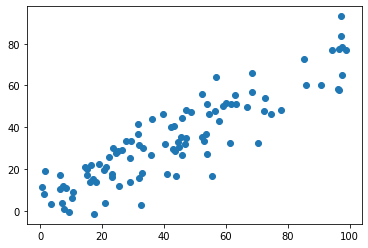
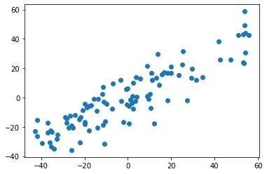
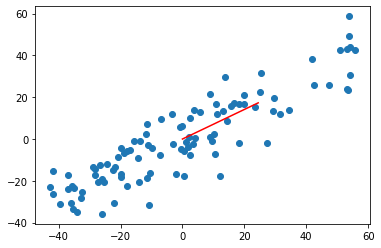
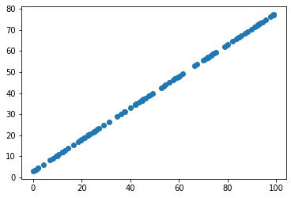
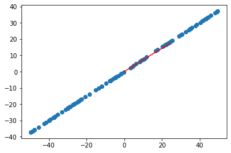

# 7-3 求解数据的主成分 PCA


```python
import numpy as np
import matplotlib.pyplot as plt
```


```python
# 虚拟的测试用例
X = np.empty((100, 2))
X[:, 0] = np.random.uniform(0., 100., size=100)
X[:, 1] = 0.75 * X[:,0] + 3. + np.random.normal(0, 10, size=100) # 特征 2 与特征 1 存在线性关系
```


```python
plt.scatter(X[:,0], X[:,1])
plt.show()
```

​    

​    


## demean 


```python
def demean(X):
    return X - np.mean(X, axis=0) # 每个特征向量减去其均值

# np.mean(X, axis=0) 求解列均值
```


```python
X_demean = demean(X)
```


```python
plt.scatter(X_demean[:, 0], X_demean[:, 1])
plt.show()
```

​    

​    


```python
np.mean(X_demean[:, 0])
```


    7.247535904753022e-15


```python
# 均值已经归零
np.mean(X_demean[:, 1])
```


    -4.6895820560166614e-15


## 梯度上升法


```python
def f(w, X):
    return np.sum((X.dot(w)**2)) / len(X)
```


```python
def df_math(w, X):
    return X.T.dot(X.dot(w)) * 2. / len(X)
```


```python
def df_debug(w, X, epsilon=0.00001):
    res = np.empty(len(w))
    for i in range(len(w)):
        w_1 = w.copy()
        w_1[i] += epsilon
        w_2 = w.copy()
        w_2[i] -= epsilon
        
        res[i] = (f(w_1, X) - f(w_2, X)) / (2 * epsilon)
    
    return res
```


```python
# 单位向量：让 w 只代表方向
def direction(w):
    return w / np.linalg.norm(w)

def gradient_ascent(df, X, initial_w, eta, n_iters=1e4, epsilon=1e-8):

    cur_iter = 0
    w = direction(initial_w)

    while cur_iter < n_iters:
        gradient = df(w, X)
        last_w = w
        w = w + eta * gradient
        w = direction(w) # 注意1：每次求一个单位向量
        if (abs(f(w, X) - f(w, X)) < epsilon):
            break

        cur_iter += 1

    return w
```


```python
# w等于特征个数
initial_w = np.random.random(X.shape[1]) # 注意2：不能初始化为全 0
initial_w
```


    array([0.97885963, 0.6121238 ])


```python
eta = 0.001
```


```python
# 注意3：不能使用 StandardScaler 标准化数据
```


```python
gradient_ascent(df_debug, X_demean, initial_w, eta)
```


    array([0.8164579 , 0.57740497])


```python
gradient_ascent(df_math, X_demean, initial_w, eta)
```


    array([0.8164579 , 0.57740497])


```python
w = gradient_ascent(df_math, X_demean, initial_w, eta)

plt.scatter(X_demean[:,0], X_demean[:,1])
# 绘制轴对应的方向 *30 放大
plt.plot([0, w[0]*30], [0, w[1]*30], color="red")
plt.show()
```

​    

​    


```python
# 没有噪声的数据，极端
X2 = np.empty((100, 2))
X2[:, 0] = np.random.uniform(0., 100., size=100)
X2[:, 1] = 0.75 * X2[:,0] + 3.
```


```python
plt.scatter(X2[:, 0], X2[:, 1])
plt.show()
```

​    

​    


```python
X2_demean = demean(X2)
```


```python
gradient_ascent(df_math, X2_demean, initial_w, eta)
```


    array([0.81309332, 0.58213336])


```python
w2 = gradient_ascent(df_math, X2_demean, initial_w, eta)
```


```python
plt.scatter(X2_demean[:,0], X2_demean[:,1])
# 绘制轴对应的方向 *30 放大
plt.plot([0, w2[0]*30], [0, w2[1]*30], color="red")
plt.show()
```


​    

​    


这就证明了梯度上升算法求解第一主成分的正确。
