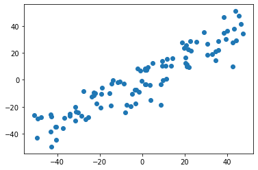
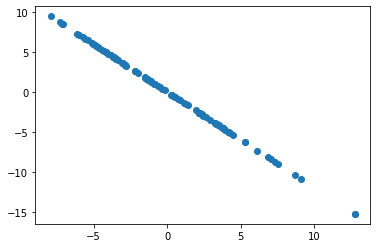

# 7-4 求数据的前 n 个主成分

几个特征就有几个轴。

求出第一个主成分后，如何求出下一个主成分？

- 做法：数据进行改变，将数据的第一主成分上的分量去掉。

相减得到的向量与主成分的相垂直。


## 实验获得前 n 个主成分

```python
import numpy as np
import matplotlib.pyplot as plt
```

```python
# 虚拟的测试用例
X = np.empty((100, 2))
X[:,0] = np.random.uniform(0., 100., size=100)
X[:,1] = 0.75 * X[:,0] + 3. + np.random.normal(0, 10., size=100)
```

```python
def demean(X):
    return X - np.mean(X, axis=0) # 每个特征向量减去其均值

X = demean(X)
```

```python
plt.scatter(X[:,0], X[:,1])
plt.show()
```

​    

​    


```python
def f(w, X):
    return np.sum((X.dot(w)**2)) / len(X)

def df(w, X):
    return X.T.dot(X.dot(w)) * 2. / len(X)

def direction(w):
    return w / np.linalg.norm(w)

def first_component(X, initial_w, eta, n_iters = 1e4, epsilon=1e-8):
    
    w = direction(initial_w) 
    cur_iter = 0

    while cur_iter < n_iters:
        gradient = df(w, X)
        last_w = w
        w = w + eta * gradient
        w = direction(w) 
        if(abs(f(w, X) - f(last_w, X)) < epsilon):
            break
            
        cur_iter += 1

    return w
```

```python
initial_w = np.random.random(X.shape[1])
eta = 0.01
w = first_component(X, initial_w, eta)
w
```


```
array([0.76696994, 0.64168303])
```


```python
# 法1
X2 = np.empty(X.shape)
for i in range(len(X)):
   X2[i] = X[i] - X[i].dot(w) * w

# 法2：向量化
X2 = X - X.dot(w).reshape(-1, 1) * w
```

```python
plt.scatter(X2[:,0], X2[:,1])
plt.show()
```

​    

​    


```python
w2 = first_component(X2, initial_w, eta)
w2
```


```
array([-0.64167614,  0.7669757 ])
```


```python
# w 和 w2 相互垂直 
w.dot(w2)
```


```
8.98555876321927e-06
```


## 整合

```python
def first_n_components(n, X, eta=0.01, n_iters=1e4, epsilon=1e-8):
    X_pca = X.copy()
    X_pca = demean(X_pca)
    res = []
    for i in range(n):
        initial_w = np.random.random(X_pca.shape[1])
        w = first_component(X_pca, initial_w, eta)
        res.append(w)
        X_pca = X_pca - X_pca.dot(w).reshape(-1, 1) * w
    
    return res
```

```python
first_n_components(2, X)
```


```
[array([0.76696991, 0.64168306]), array([ 0.641687  , -0.76696662])]
```


```python
w = first_n_components(2, X)
```

```python
w[0].dot(w[1])
```


```
7.085667396988793e-06
```

